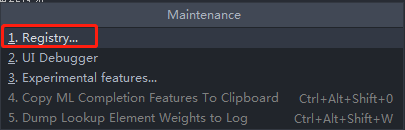
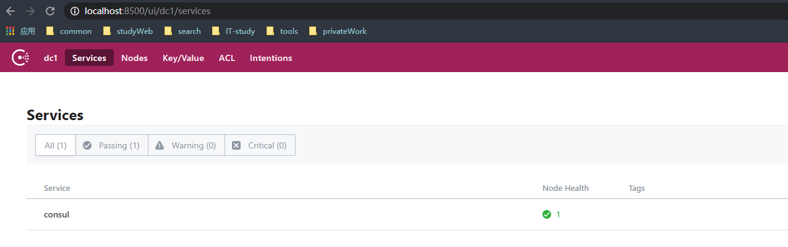

## 1、热部署开启
 1、添加jar包
 ```java
<dependency>
    <groupId>org.springframework.boot</groupId>
    <artifactId>spring-boot-devtools</artifactId>
    <scope>runtime</scope>
    <optional>true</optional>
</dependency>
```
2、添加热部署的插件
```java
<plugin>
    <groupId>org.springframework.boot</groupId>
    <artifactId>spring-boot-maven-plugin</artifactId>
    <configuration>
        <fork>true</fork>
        <addResources>true</addResources>
    </configuration>
</plugin>
```
3、勾选自动编译  
   
4、使用快捷键开启热注册  
+ ctrl+shift+alt+/   


5、弹出框选择以下两个选项点击对勾选项  
+ actionSystem.assertFocusAccessFromEdt
+ compiler.automake.allow.when.app.running

   

6、设置好后close，然后重启idea即可
## 2、服务和服务之间的调用之RestTemplate
```java
@Configuration
public class ApplicationContextConfig {
    @Bean
    public RestTemplate getRestTemplate() {
        return new RestTemplate();
    }
}

@Resource
private RestTemplate restTemplate;

post请求为例
restTemplate.getForObject("http://ip:port/payment/get/" + id, T.class);
```
## 3、出现窗口RunDashboard 
>在项目的.deal下的workspace.xml找到RunDashboard,如果没有则将一下内容复制进去
```xml
<component name="RunDashboard">
    <option name="configurationTypes">
      <set>
        <option value="SpringBootApplicationConfigurationType" />
      </set>
    </option>
</component>
```
## 4、打包jar文件
1、很多时候需要将项目分成好几个模块,例如api模块，在用的时候切记打包方式为jar
```xml
<!-- 使用jar打包，其他模块依赖引入即可， -->
<packaging>jar</packaging>
```
2、然后对项目进行install操作，使其生成一个jar包在本地配置的maven仓库中  
3、其他子项目的引用
```xml
<!-- 引入api 公共包 -->
<dependency>
    <groupId>org.xwb.springcloud</groupId>
    <artifactId>cloud-api-commons</artifactId>
    <version>1.0-SNAPSHOT</version>
</dependency>
```
> 在线流程图制作工具 processOn
## 5、springCloud集成zookeeper
+ 本地安装zookeeper
```
|-desc-file
   |— — — zookeeper
            |— — — zookeeper-3.4.9.tar.gz
```
#### 8004服务端
+ 新建cloud-provider-payment8004
##### 1、pom
```xml
<!-- springboot整合zookeeper 客户端 -->
<dependency>
    <groupId>org.springframework.cloud</groupId>
    <artifactId>spring-cloud-starter-zookeeper-discovery</artifactId>
    <exclusions>
        <exclusion>
            <groupId>org.apache.zookeeper</groupId>
            <artifactId>zookeeper</artifactId>
        </exclusion>
    </exclusions>
</dependency>
<!-- 引入和本地zookeeper一样的jar包 -->
<dependency>
    <groupId>org.apache.zookeeper</groupId>
    <artifactId>zookeeper</artifactId>
    <version>3.4.9</version>
</dependency>
```
##### 2、yml
```properties
# 8004是zookeeper服务器的支付服务提供者端口号
server:
  port: 8004
spring:
  application:
    name: cloud-provider-payment
  cloud:
    zookeeper:
      connect-string: 192.168.1.10:2181 # zookeeper注册中心地址
```
##### 3、主启动类
```java
@SpringBootApplication
@EnableDiscoveryClient //该注解用于向consul或者zookeeper作为注册中心时注册服务
public class PaymentMain8004 {
    public static void main(String[] args) {
        SpringApplication.run(PaymentMain8004.class, args);
    }
}
```
##### zookeeper验证效果图
zookeeper启动后client查看到的节点信息

#### 客户端80注册进zookeeper中
> 新建cloud-consumerzk-order80模块
##### 1、pom
```xml
<!-- springboot整合zookeeper 客户端 -->
<dependency>
    <groupId>org.springframework.cloud</groupId>
    <artifactId>spring-cloud-starter-zookeeper-discovery</artifactId>
    <exclusions>
        <exclusion>
            <groupId>org.apache.zookeeper</groupId>
            <artifactId>zookeeper</artifactId>
        </exclusion>
    </exclusions>
</dependency>
<!-- 引入和本地zookeeper一样的jar包 -->
<dependency>
    <groupId>org.apache.zookeeper</groupId>
    <artifactId>zookeeper</artifactId>
    <version>3.4.9</version>
    <exclusions>
        <exclusion>
            <artifactId>slf4j-log4j12</artifactId>
            <groupId>org.slf4j</groupId>
        </exclusion>
    </exclusions>
</dependency>
```
##### 2、yml
```properties
server:
  port: 80
spring:
  application:
    name: cloud-consumer-order
  cloud:
    zookeeper:
      connect-string: 192.168.1.10:2181
```
##### 3、主启动类
```java
@SpringBootApplication
@EnableDiscoveryClient
public class OrderZkOrder80 {
    public static void main(String[] args) {
        SpringApplication.run(OrderZkOrder80.class, args);
    }
}
```
##### 4、注册调用工具restTemplate
```java
@Configuration
public class ApplicationContextConfig {
    @Bean
    @LoadBalanced
    public RestTemplate getRestTemplate() {
        return new RestTemplate();
    }
}
```
##### 注册后的结果

##  6、consul
consul能干什么

| 功能 | 简介 |
| :----: | :----: |
| 服务发现 | 提供http和DNS两种发现方式 |
| 健康管理 | 支持多种方式，http,tcp，Docker,shell脚本定制化 |
| KV存储 | key,value的存储方式 |
| 多数据中心 | Consul支持多数据中心 |
| web可视化界面 |  |
>下载地址
https://consul.io/download.html
+ 项目下可下载，地址： desc-file/consul/consul_1.9.0_windows_amd64.zip
+ 中文官方帮助文档(https://springcloud.cc/spring-cloud-consul.html)
>consul的启动
```shell script
consul agent -dev
```
+ 访问主界面(localhost:8500)

### 将服务提供者cloud-providerconsul-paymen8006注册进consul
##### pom.xml
```xml
 <dependency>
    <groupId>org.springframework.cloud</groupId>
    <artifactId>spring-cloud-starter-consul-discovery</artifactId>
</dependency>
```
##### application.yml
```properties
## consul 服务端口号
server:
  port: 8006
spring:
  application:
    name: consul-provider-payment
  # consul 注册中心地址
  cloud:
    consul:
      host: localhost
      port: 8500
      discovery:
        service-name:  ${spring.application.name}
        # hostname: 127.0.0.1
```
##### 主启动类
```java
@SpringBootApplication
@EnableDiscoveryClient //该注解用于向consul或者zookeeper作为注册中心时注册服务
public class PaymentMain8006 {
    public static void main(String[] args) {
        SpringApplication.run(PaymentMain8006.class, args);
    }
}

```
### 将服务消费者cloud-consumerconsul-order80注册进consul
##### pom.xml
```xml
 <dependency>
    <groupId>org.springframework.cloud</groupId>
    <artifactId>spring-cloud-starter-consul-discovery</artifactId>
</dependency>
```
##### application.yml
```properties
## consul 服务端口号
server:
  port: 80
spring:
  application:
    name: consul-consumer-payment
  # consul 注册中心地址
  cloud:
    consul:
      host: localhost
      port: 8500
      discovery:
        service-name:  ${spring.application.name}
        # hostname: 127.0.0.1
```
##### 主启动类
```java
@SpringBootApplication
@EnableDiscoveryClient
public class OrderConsulOrder80 {
    public static void main(String[] args) {
        SpringApplication.run(OrderConsulOrder80.class, args);
    }
}
```
##### 调用工具
```java
@Configuration
public class ApplicationContextConfig {
    @Bean
    @LoadBalanced
    public RestTemplate getRestTemplate() {
        return new RestTemplate();
    }
}
```
> 注册信息

>测试
```html
http://localhost/consumer/payment/consul
```
## banner 
banner(https://www.bootschool.net/ascii)(3d)
