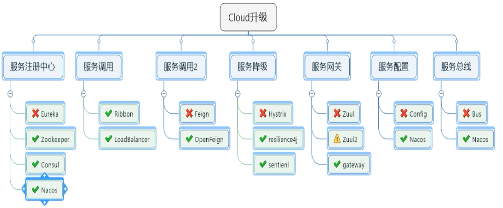
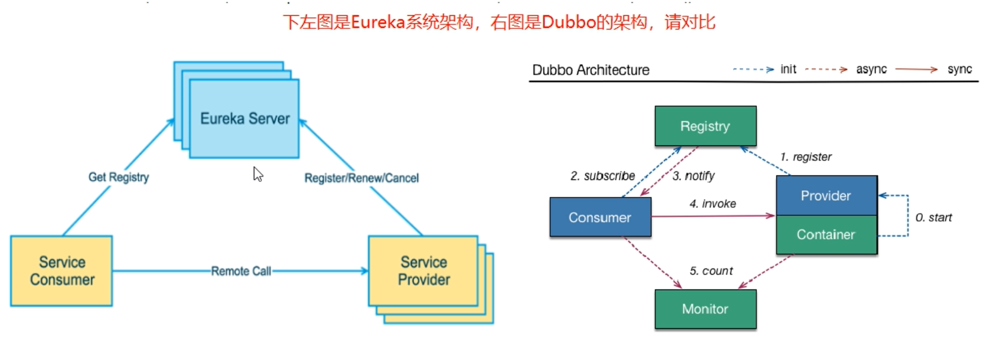
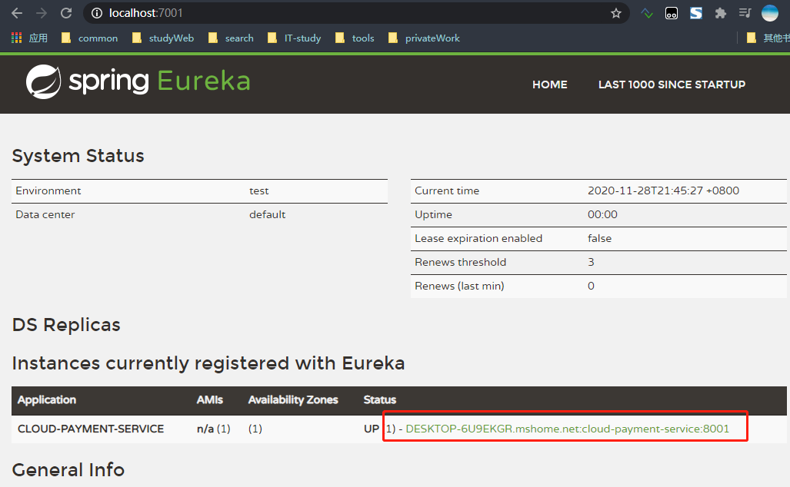
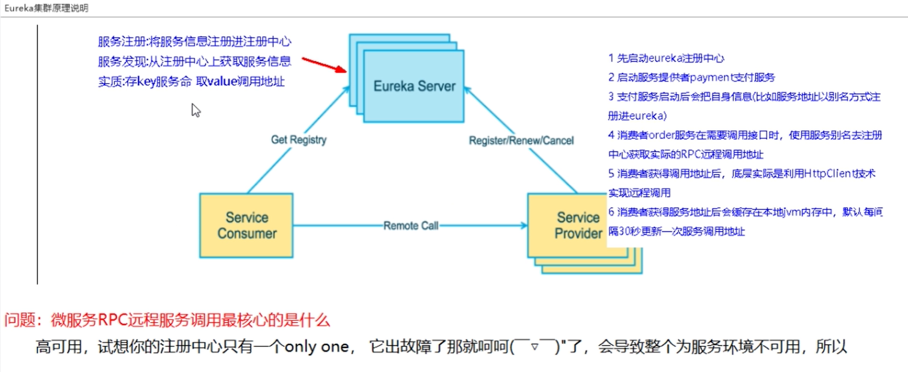
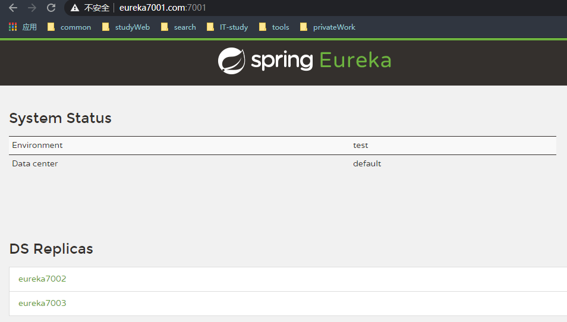
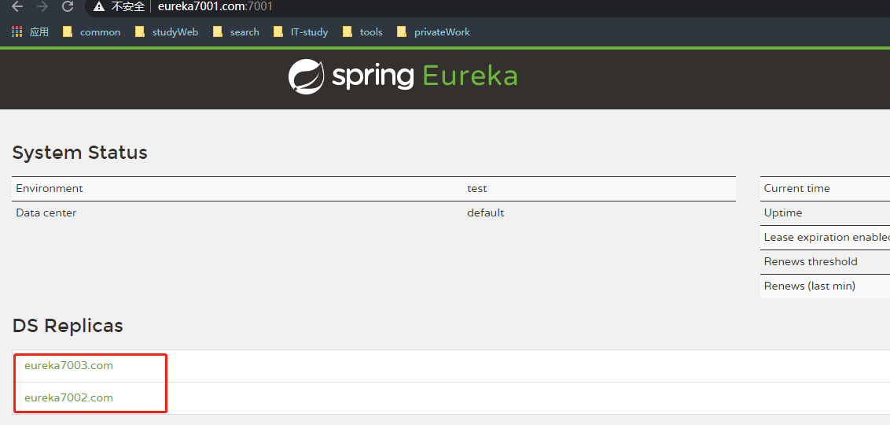
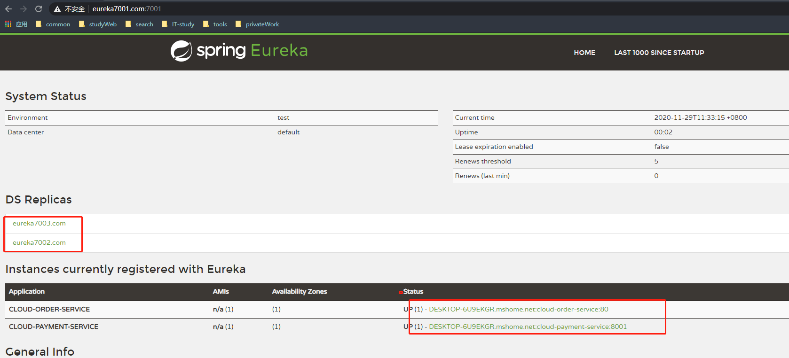
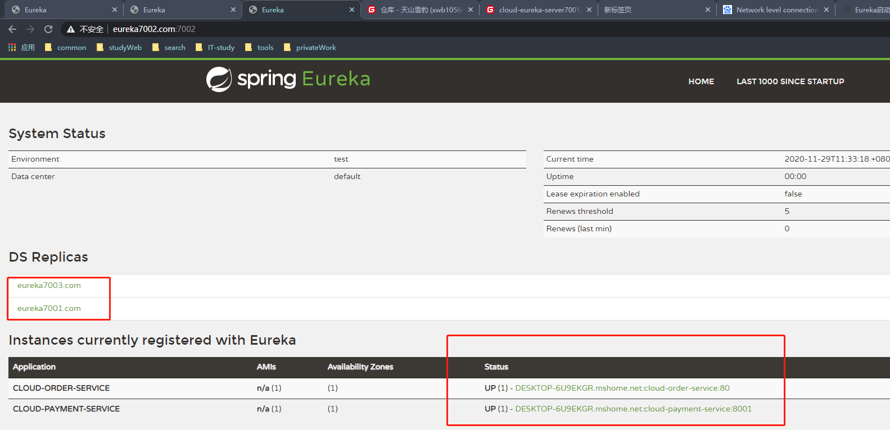
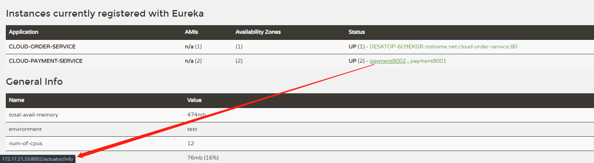
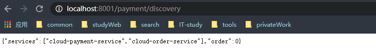

# spring-cloud全家桶
``` lua
spring-cloud
├── cloud-api-commons                       -- 公共模块(实体类...)
├── cloud-config-center-3344                -- config配置Server中心(config,bus,rabbitmq)
├── cloud-config-client-3355                -- config配置Client中心(config,bus,rabbitmq)
├── cloud-config-client-3366                -- config配置Client中心(config,bus,rabbitmq)
├── cloud-consumer-feign-hystrix-order80    -- 支付模块消费者(eureka,hystrix,openFeign...)
├── cloud-consumer-feign-order80            -- 支付模块消费者(OpenFeign...)
├── cloud-consumer-hystrix-dashboard9001    -- hystrixDashBoard监控平台
├── cloud-consumer-order80                  -- 支付模块消费者(eureka,zipkin,sleuth)
├── cloud-consumerconsul-order80            -- 支付模块消费者(consul)
├── cloud-consumerzk-order80                -- 支付模块消费者(zookeeper)
├── cloud-eureka-server7001                 -- eureka集群注册中心7001
├── cloud-eureka-server7002                 -- eureka集群注册中心7002
├── cloud-eureka-server7003                 -- eureka集群注册中心7003
├── cloud-gateway-gateway9527               -- gateway服务网关(在所有微服务的最前面)
├── cloud-provider-hystrix-payment8001      --  支付模块提供者(eureka,hystrix熔断)
├── cloud-provider-payment8001              --  支付模块提供者(eureka,zipkin,sleuth)
├── cloud-provider-payment8002              --  支付模块提供者(eureka)
├── cloud-provider-payment8004              --  支付模块提供者(zookeeper)
├── cloud-providerconsul-paymen8006         --  支付模块提供者(consul)
├── cloud-stream-rabbitmq-consumer8802      --  stream 消息发送模块(stream,rabbitmq)
├── cloud-stream-rabbitmq-consumer8803      --  stream 消息接收模块(stream,rabbitmq)
├── cloud-stream-rabbitmq-provider8801      --  stream 消息接收模块(stream,rabbitmq)
├── cloudalibaba-config-nacos-client3377    --  nacos客户端,config
├── cloudalibaba-consumer-nacos-order83     --  消费者(调用方)nacos客户端
├── cloudalibaba-consumer-nacos-order84     --  消费者(调用方)nacos,sentinel,ribbon,fallback
├── cloudalibaba-provider-payment9001       --  提供者nacos-provider)
├── cloudalibaba-provider-payment9002       --  提供者nacos-provider)
├── cloudalibaba-provider-payment9003       --  提供者 nacos,sentinel,fallback
├── cloudalibaba-provider-payment9004       --  提供者nacos,sentinel,fallback
├── cloudalibaba-sentinel-service8401       --  nacos sentinel,持久化
├── seata-account-service2003               --  (account账户)nacos seata
├── seata-order-service2001                 --  (order订单)nacos seata
├── seata-storage-service2002               --  (storage库存)nacos seata
|   └──  xxx xxx xxx

```
#### 介绍
    第二季由最新的SpringCloud H版+SpringCloud alibaba构成，双剑合并威力大增，内容涵盖了目前火热的分布式微服务架构的全部技术栈，
    是尚硅谷高阶班微服务课程的最新升级版。重点讲解了SpringCloud各种组件停止更新进入维护阶段后，后续技术组件的升级和替换策略及方案选型，
    既有传统Eureka、Ribbon、OpenFeign、Hystrix、Config等技术的升级讲解,又有Consul、Gateway、Bus、Stream、Sleuth、zipkin
    和阿里巴巴最新的Nacos、Sentinel、Seata等最新技术，分享了服务降级、服务熔断、服务限流、hotkey控制、分布式统一配置管理、
    分布式全局事务控制、RabbitMQ与Stream整合、Nacos和Nginx配置高可用集群等技术，干货满满。祝各位同学粉丝，学习顺利，加油O(∩_∩)O哈哈~。
#### springCloud的升级

#### Maven中的dependencyManagement
 * maven使用dependencyManagement元素来提供了一种管理依赖版本号的方式  
 * 通常会有一个租住或者项目的最顶层的父POM中看到dependencyManagement元素
 + dependencyManagement里只是申明依赖,并不实现引入，因此在子项目中需要显示的申明需要用的依赖。 
 + 如果不在子项目中声明依赖，是不会从父项目中继承下来的，只有在子项目中写了该依赖项，并且没有指定提版本，
 才会父项目中继承该项，并且version和scope都是读取子父pom
 > 创建子模块规则
   
    约定>配置>编码
    1、创建model
    2、修改pom
    3、修改yml
    4、创建主启动类
    5、业务
### 服务注册Eureka
  
+ eureka包含两个组件：Eureka Server和Eureka Client  
+ Eureka Server提供服务注册服务
>各个微服务节点通过配置启动后，会在EurekaServer中进行注册,这样EurekaServer中服务注册表中会存储所有服务可用节点的信息，
服务节点的信息可以在界面中直观的看到

 + Eureka Client通过注册中心进行访问
>是一个java客户端，用于简化Eureka Server的交互，客户端同时也具备一个内置的，使用轮询（round-robin）负载均衡器，在应用启动
后，将会向Eureka Server发送心跳(默认周期是30秒)，如果Eureka Server在多个心跳周期内没有接收到某个节点的心跳，
EurekaServer将会从服务注册表中把这个节点移除(默认是90秒)
#### Eureka Server 服务端
1、导入java包
```xml
<dependency>
    <groupId>org.springframework.cloud</groupId>
    <artifactId>spring-cloud-starter-netflix-eureka-server</artifactId>
</dependency>
```
2、yml的配置
```properties
server:
  port: 7001
eureka:
  instance:
    hostname: localhost #eureka服务器的实例名称
  client:
    register-with-eureka: false #是否注册自己进入eureka
    fetch-registry: false #false表示我就是注册中心，我的之策就是维护服务实力，并不需要去检索服务
    service-url:
      # 设置与Eureka server交互德 地址查询服务和注册服务都需要依赖这个地址
      defaultZone: http://${eureka.instance.hostname}:${server.port}/eureka/
```
3、主启动类
```java
@EnableEurekaServer
@SpringBootApplication
public class EurekaMain7001 {
    public static void main(String[] args) {
        SpringApplication.run(EurekaMain7001.class, args);
    }
}
```
#### Eureka client客户端
1、xml配置
```xml
<dependency>
    <groupId>org.springframework.cloud</groupId>
    <artifactId>spring-cloud-starter-netflix-eureka-client</artifactId>
</dependency>
```
2、yml的配置
```properties
# eureka client配置
eureka:
  client:
    register-with-eureka: true #是否注册自己进入eureka
    fetch-registry: true #false表示我就是注册中心，我的之策就是维护服务实力，并不需要去检索服务
    service-url:
      defaultZone: http://localhost:7001/eureka/
```
3、主启动类
```java
@SpringBootApplication
@EnableEurekaClient
public class PaymentMain8001 {
    public static void main(String[] args) {
        SpringApplication.run(PaymentMain8001.class, args);
    }
}
```
>实际展示效果图

### eureka集群的搭建
+ eureka原理说明

#### 集群环境的搭建
1、修改hosts文件做域名映射
> C:\Windows\System32\drivers\etc hosts新增加以下内容追加到文件中
```properties
127.0.0.1 eureka7001.com
127.0.0.1 eureka7002.com
127.0.0.1 eureka7003.com
```
+ 单机版的eureka的配置
  ```properties
  server:
    port: 7001
  eureka:
    instance:
      hostname: localhost #eureka服务器的实例名称
    client:
      register-with-eureka: false #是否注册自己进入eureka
      fetch-registry: false #false表示我就是注册中心，我的之策就是维护服务实力，并不需要去检索服务
      service-url:
        # 设置与Eureka server交互德 地址查询服务和注册服务都需要依赖这个地址
        defaultZone: http://${eureka.instance.hostname}:${server.port}/eureka/
  ```
+ 集群版配置  
 >其他配置都不变，参照Eureka Server 服务端的创建创建7002,7003项目。以下是需要变动的内容 
  ```properties
  server:
    port: 7001
  eureka:
    instance:
      hostname: eureka7001.com  #eureka服务器的实例名称
    client:
      register-with-eureka: false #是否注册自己进入eureka
      fetch-registry: false #false表示我就是注册中心，我的之策就是维护服务实力，并不需要去检索服务
      service-url:
        # 设置与Eureka server交互德 地址查询服务和注册服务都需要依赖这个地址
        defaultZone: http://eureka7002.com:7002/eureka/,http://eureka7003.com:7003/eureka/
  ```
 + 特别注意:7001为集群的服务，注册的时候是相互注册  
>1、服务名需要修改，eureka.instance.hostname:eureka7001.com  
 2、需要修改集群的地址 eureka.client.service-url.defaultZone: http://eureka7002.com:7002/eureka/,http://eureka7003.com:7003/eureka/
#### 访问后的效果

#### 将微服务注册进eureka集群中
```properties
server:
  port: 7003
eureka:
  instance:
    hostname: eureka7003.com #eureka服务器的实例名称
  client:
    register-with-eureka: false #是否注册自己进入eureka
    fetch-registry: false #false表示我就是注册中心，我的之策就是维护服务实力，并不需要去检索服务
    service-url:
      defaultZone: http://eureka7001.com:7001/eureka/,http://eureka7002.com:7002/eureka/ #互相注册,自己不用写
```
##### 实际展示效果

#### 将微服务注册进入eureka注册中心
* eg:8001服务
```properties
server:
  port: 8001
spring:
  application:
    name: cloud-payment-service #服务名称
# eureka client配置
eureka:
  client:
    register-with-eureka: true #是否注册自己进入eureka
    fetch-registry: true #false表示我就是注册中心，我的之策就是维护服务实力，并不需要去检索服务
    service-url:
      #defaultZone: http://eureka7001.com:7001/eureka #单机版配置
      defaultZone: http://eureka7001.com:7001/eureka,http://eureka7002.com:7002/eureka,http://eureka7003.com:7003/eureka  #集群配置
```
+ 实际展示效果


### 微服务提供者的集群
1、同8001创建model-8002  
+ 特别注意：各自的端口号8002和主启动类PaymentMain8002  

2、完成之后需要修改调用者cloud-consumer-order80的调用方式
```java
//public static final String PAYMENT_PATH = "http://localhost:8001";
public static final String PAYMENT_PATH = "http://CLOUD-PAYMENT-SERVICE";
```
说明：直接使用<b>CLOUD-PAYMENT-SERVICE</b>是因为此服务名在eureka中注册了，所以我们调用的时候直接使用服务名即可  
3、调用的算法
```java
@Bean
@LoadBalanced
public RestTemplate getRestTemplate() {
    return new RestTemplate();
}
```
+ 说明:由于我们使用了服务的集群，<strong>当我们使用restTemplate调用的时候不知道调用的是哪个,所以我们需要对调用的工具进行负载均衡加入注解@LoadBalance即可</strong>
#### actuator的配置
```properties
instance:
    instance-id: payment8002
    prefer-ip-address: true #访问路径可以显示ip地址
```
>实际展示效果

#### Discover
<strong>主启动类添加@EnableDiscoveryClient</strong>
```java
@SpringBootApplication
@EnableEurekaClient
@EnableDiscoveryClient
public class PaymentMain8001 {
    public static void main(String[] args) {
        SpringApplication.run(PaymentMain8001.class, args);
    }
}
```
```java
import org.springframework.cloud.client.discovery.DiscoveryClient;
@Resource
private DiscoveryClient discoveryClient;

@GetMapping(value = "/payment/discovery")
public Object discovery() {
    List<String> services = discoveryClient.getServices();
    for (String element : services) {
        log.info("****element: " + element);
    }
    List<ServiceInstance> instances = discoveryClient.getInstances("CLOUD-PAYMENT-SERVICE");
    for (ServiceInstance instance : instances) {
        log.info(instance.getServiceId() + "\t" + instance.getHost() + "\t" + instance.getPort() + "\t" + instance.getUri());
    }
    return this.discoveryClient;
}
```

#### eureka关闭自我保护机制
<strong><b>Eureka服务端自我保护机制配置</b> eg:7001服务器</strong>
```properties
  server:
    # 关闭自我保护机制，保证不可用服务被及时剔除
    rate-limiter-enabled: false
    eviction-interval-timer-in-ms:  2000
```
<strong><b>注册进Eureka的提供者的配置信息</b> eg:8001支付模块提供者</strong>
```properties
  #actuator的配置
  instance:
    instance-id: payment8001
    prefer-ip-address: true #访问路径可以显示ip地址
    #Eureka客户端向服务器发送心跳的间隔时间，单位为秒(默认为30秒)
    lease-renewal-interval-in-seconds:  10
    #Eureka服务器在收到最后一次心跳后等待时间上线，单位为秒(默认为90秒)超市奖杯剔除服务
    lease-expiration-duration-in-seconds:  30
```
