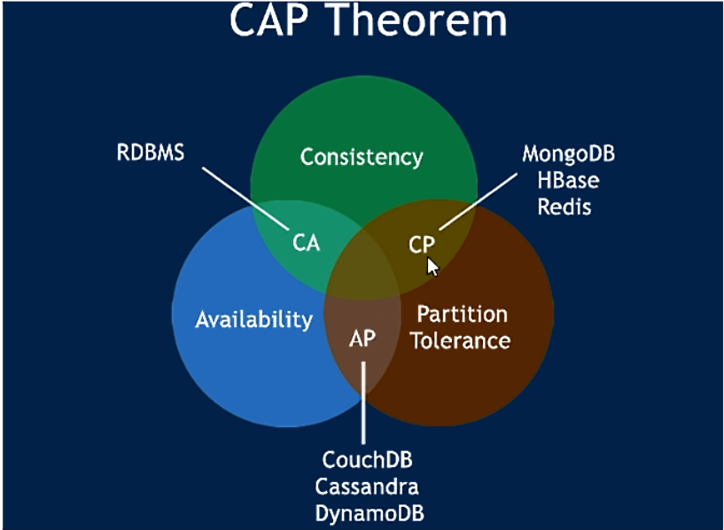

> 服务注册与发现Eureka、Zookeeper、Consul 三个注册中心的异同点（CAP理论）
## CAP理论简介：
CAP理论作为分布式系统的基础理论,它描述的是一个分布式系统在以下三个特性中：

+ 一致性（Consistency）
+ 可用性（Availability）
+ 分区容错性（Partition tolerance）

>一致性（Consistency）：
在分布式系统完成某写操作后任何读操作，都应该获取到该写操作写入的那个最新的值。相当于要求分布式系统中的各节点时时刻刻保持数据的一致性。

>可用性（Availability）：
一直可以正常的做读写操作。简单而言就是客户端一直可以正常访问并得到系统的正常响应。用户角度来看就是不会出现系统操作失败或者访问超时等问题。

>分区容错性（Partition tolerance）：
指的分布式系统中的某个节点或者网络分区出现了故障的时候，整个系统仍然能对外提供满足一致性和可用性的服务。也就是说部分故障不影响整体使用。
事实上我们在设计分布式系统是都会考虑到bug,硬件，网络等各种原因造成的故障，所以即使部分节点或者网络出现故障，我们要求整个系统还是要继续使用的
(不继续使用,相当于只有一个分区,那么也就没有后续的一致性和可用性了)

 

而最多同时较好地满足两个条件（原因请参考：https://www.cnblogs.com/zhuyeshen/p/11720655.html）。

CAP理论的核心是：<b>一个分布式系统不可能同时很好的满足一致性、可用性和分区容错性这三个需求，因此，根据CAP原理将NoSQL数据库分成了满足CA、CP、AP 原则 三大类：</b>

### CA
>单点集群，满足一致性，可用性的系统，通常在可扩展性上不太强大。
### CP
>满足一致性，分区容错的系统，通常性能不是特别高。
### AP
>满足可用性，分区容错性的系统，通常可能对一致性要求低一些。

|组件名|语言|CAP|服务监控检查|对外暴露接口|SpringCloud集成|
|:----:|:----:|:----:|:----:|:----:|:----:|
|eureka|java|AP|可配支持|http|已集成|
|consul|go|CP|支持|http:DNS|已集成|
|zookeeper|java|CP|支持|客户端|已集成|
