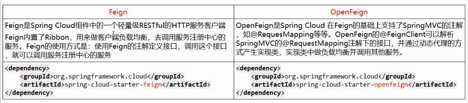

### ribbon
```xml
<dependency>
    <groupId>org.springframework.cloud</groupId>
    <artifactId>spring-cloud-starter-netflix-ribbon</artifactId>
</dependency>
```
ribbon新版本为何没有引入ribbon(原因是最新的eureka中自动带了ribbon)  

##### restTemplate
+ restTemplate.getForObject();
> 返回对象为响应体中数据转化成的对象，基本上可以理解为Json
+ restTemplate.getForEntity();
>返回对象为ResponseEntity<T>对象，包含了乡音中的一些重要信息，比如响应头，响应状态吗，响应体等。

ribbon的更多介绍请看此博客https://blog.csdn.net/www1056481167/article/details/81151064
### 自定义LoadBalance(客户端的负载均衡)
+ 修改cloud-consumer-order80项目
> 自定义负载均衡loadBalance
```java
// 1、定义接口
public interface LoadBalance {
    ServiceInstance instances(List<ServiceInstance> serviceInstances);
}
// 2、实现类
@Component
public class MyLB implements LoadBalance {
    private AtomicInteger atomicInteger = new AtomicInteger(0);
    public final int getAndIncrement() {
        int current;
        int next;
        do {
            current = this.atomicInteger.get();
            //2147483647=Integer.MAX_VAlUE
            next = current >= 2147483647 ? 0 : current + 1;
            //current期望值，next操作值,如果不满足，当前对象atomicInteger自旋取反，知道满足期望值
        } while (!this.atomicInteger.compareAndSet(current, next));
        System.out.println("****第几次访问，次数 next:" + next);
        return next;
    }
    @Override
    public ServiceInstance instances(List<ServiceInstance> serviceInstances) {
        int index = getAndIncrement() % serviceInstances.size();
        return serviceInstances.get(index);
    }
}
// 3、controller注入自定义的loadBanance
@Autowired
    private MyLB myLB;
// 4、调用
@GetMapping("/consumer/payment/lb")
    public String getPaymentLB() {
        List<ServiceInstance> instances = discoverClient.getInstances("CLOUD-PAYMENT-SERVICE");
        if (instances == null || instances.size() <= 0) {
            return null;
        }
        ServiceInstance instances1 = myLB.instances(instances);
        URI uri = instances1.getUri();
        return restTemplate.getForObject(uri + "/payment/lb", String.class);
    }
```

### openFeign
+ Feign
>Feign是一个声明式的Web服务客户端，让编写Web服务客户端变得非常容易，只需创建一个接口并在接口上添加注解即可


+ 新建模块cloud-consumer-feign-order80
#### 1、pom.xml
```xml
<!-- feign client -->
<dependency>
    <groupId>org.springframework.cloud</groupId>
    <artifactId>spring-cloud-starter-openfeign</artifactId>
</dependency>
``` 
#### 2、application.yml配置
```properties
server:
  port: 80
eureka:
  client:
    fetch-registry: true #将自己注册进入eureka注册中心
    register-with-eureka: true
    service-url:
      #defaultZone: http://eureka7001.com:7001/eureka #单机版配置
      defaultZone: http://eureka7001.com:7001/eureka,http://eureka7002.com:7002/eureka,http://eureka7003.com:7003/eureka #集群配置
```
#### 3、主启动类
```java
@SpringBootApplication
@EnableDiscoveryClient
@EnableFeignClients //激活并开启Feign
public class OrderFeignMain80 {
    public static void main(String[] args) {
        SpringApplication.run(OrderFeignMain80.class, args);
    }
}
```
+ 注意 <strong>@EnableFeignClients</strong>和<strong>@FeignClient("xxx")</strong>一定是同时使用的
#### 4、提供Feign的调用接口
```java
@Component
@FeignClient("CLOUD-PAYMENT-SERVICE") //使用FeignClient注解，调用CLOUD-PAYMENT-SERVICE服务
public interface PaymentFeignService {
    @GetMapping("/payment/get/{id}")
    public CommonResult<Payment> getPaymentById(@PathVariable("id") Long id);
}
```
+ 1、@FeignClient("CLOUD-PAYMENT-SERVICE") 是通过Feign去eureka注册中心找服务名为<strong>CLOUD-PAYMENT-SERVICE</strong>的服务提供者
+ 2、<strong>@GetMapping("/payment/get/{id}")
    public CommonResult<Payment> getPaymentById(@PathVariable("id") Long id);</strong>
> 去注册中心找服务名为CLOUD-PAYMENT-SERVICE下Controller提供者找请求地址为/payment/get/{id}的方法
+ <strong>调用者定义的接口的请求参数、地址、返回值、必须和提供者controller里面定义的请求参数、地址、返回值、必须都相同。</strong>
#### 5、消费者的controller调用提供者的接口
```java
@Resource
private PaymentFeignService paymentFeignService;
@GetMapping("/consumer/payment/get/{id}")
public CommonResult<Payment> getPaymentById(@PathVariable("id") Long id) {
    return paymentFeignService.getPaymentById(id);
}
```
>测试启动7001,7002,7003,然后启动服务提供者8001,8002，最后启动服务调用者80,通过访问80的http://localhost:80/consumer/payment/get/xx
>即可查看OpenFeign调用的轮询8001,和8002，以及返回的数据
#### openFeign如何处理调用超时的异常
+ 特别说明：为何配置的是ribbon，因为openFeign底层是ribbon实现，整合了ribbon,自己支持负载均衡，所以他的超时空之也由ribbon控制  

```properties
ribbon:
  #指的是建立连接后从服务器读取可用资源所用的时间
  ReadTimeout: 5000
  #指的是建立连接所用的时间，适用于网络状况正常的情况下，两端连接所用的时间
  ConnectionTimeout: 5000
```    
#### openFeign日志增强
|日志级别|说明|
|:----:|:----:|
|NONE| 默认的，不显示任何日志|
|BASIC|仅记录请求方法，URL,响应状态码及执行时间|
|HEADERS|除了BASIC中定义的信息之外，还有请求和响应的头信息|
|FULL|除了HEADERS中定义的信息之外，还有请求和相应的正文及元数据|
> 如何使用
```java
import feign.Logger;
import org.springframework.context.annotation.Bean;
import org.springframework.context.annotation.Configuration;
@Configuration
public class FeignConfig {
    @Bean
    public Logger.Level feignLoggerLevel() {
        return Logger.Level.FULL;
    }
}
```
> 开启日志
```properties
logging:
  level:
    # feign日志以什么级别监控那个接口（#规则 接口的全路径： 日志级别）
    org.xwb.springcloud.service.PaymentFeignService: debug
```
>  可以定义多个接口，然后是改接口对应的日志级别  
    org.xwb.springcloud.service.PaymentFeignService: debug  
    org.xwb.springcloud.service.XXXX1: info  
    org.xwb.springcloud.service.XXXX2: debug

+ 测试启动7001,7002,7003,然后启动服务提供者8001,8002，最后启动服务调用者80,通过访问80的http://localhost:80/consumer/payment/get/xx  
* 得到以下效果
