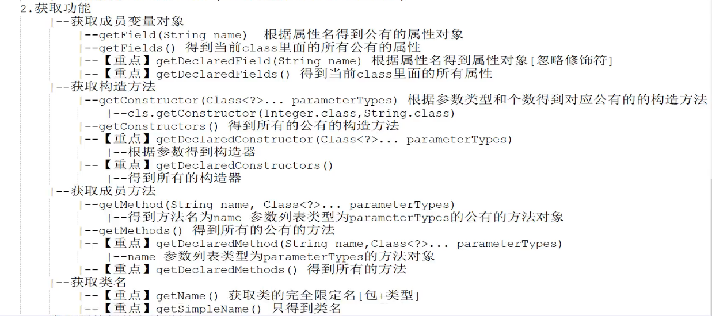
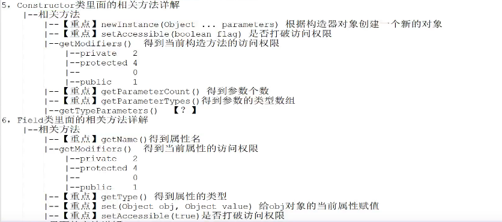
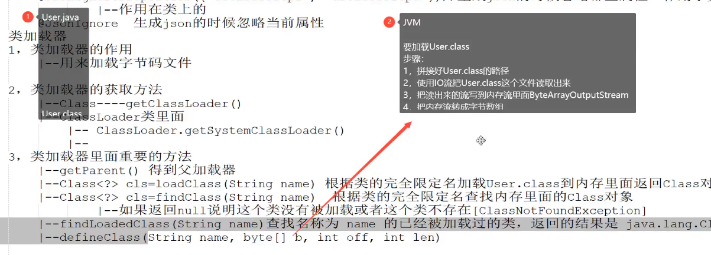

# 1、反射
## 1.1反射
概念

    class
    Method
    Field
    Constructor
    
反射核心类

    java.lang.Class;     类
    java.lang.reflect.Constructor;    构造器方法
    java.lang.reflect.Field;    属性
    java.lang.reflect.Method;    方法
    java.lang.reflect.Modifier;    修饰符

类加载三个阶段

    1、源代码(source)
        原代码不是指java文件，是class字节码文件
    2、类加载(class)
        class字节码文件经类加载器classloader加载到虚拟机内存中，类加载器解析class文件生成Class类型的对象
    3、运行时(runtime)
        newInstance()根据java类型生成对象

获取class类对象三种方法

    1、Class class=Class.forName("com.xx.xx.xx.Person");
    2、Class<Person> class=Person.class;
    3、Person p=new Person();
       Class class=p.getClass();

class 的功能  
    1、加载功能[把字节码文件加载到内存里面来]
        
    Class    class=Class.forName("xxx.xxx.xxx.xxx");
    
   2、获取class成员变量功能
        
        
# 2、注解
    java注解用于为java代码提供元数据
    简单理解： 注解就是对应用程序的某一个部分的特殊说明，这个说明只针对关注这个说明的程序，如果其他程序不关注，那么这个注解对其他程序无效
    注解=标签

注解语法

    1、类
    2、接口
    3、枚举
    4、注解
## 1、元注解
###    Target目标
1、@Target(作用目标)

    标注注解作用的范围

| 类型 | 说明 |
|----|----|
| ElementType.TYPE | 类，接口（包括注解类型）或enum声明  |
| ElementType.FIELD | 字段，枚举常量  |
| ElementType.METHOD | 方法声明  |
| ElementType.PARAMETER | 参数声明  |
| ElementType.CONSTRUCTOR | 构造器声明  |
| ElementType.LOCAL_VARIABLE | 局部变量声明  |
| ElementType.PACKAGE | 包声明  |
| ElementType.LOCAL_VARIABLE | 局部变量  |
| ElementType.ANNOTATION_TYPE | 注解  |

2、@Retention(保留策略)

    表示在什么级别保存该注解信息
    
| 类型 | 说明 |
| ---- | ---- |
| RetentionPolicy.SOURCE | 注解仅存在于源码中，在class字节码文件中不包含 |
| RetentionPolicy.CLASS | 默认的保留策略，注解会在class字节码文件中存在，但运行时无法获得  |
| RetentionPolicy.RUNTIME | 注解会在class字节码文件中存在，在运行时可以通过反射获取到首 先要明确生命周期长度 SOURCE < CLASS < RUNTIME ，所以前者能作用的地方后者一定也能作用。一般如果需要在运行时去动态获取注解信息，那只能用 RUNTIME 注解；如果要在编译时进行一些预处理操作，比如生成一些辅助代码（如 ButterKnife），就用 CLASS注解；如果只是做一些检查性的操作，比如 @Override 和 @SuppressWarnings，则可选用 SOURCE 注解。 |

3、@Documented

    将此注解包含在 javadoc 中 ，它代表着此注解会被javadoc工具提取成文档。在doc文档中的内容会因为此注解的信息内容不同而不同。相当与@see,@param 等。

4、@Inherited

    Inherited 是继承的意思，但是他并不是说直接本省可以继承，而是说一个超类被@Inheritedh注解，xxxxx
     
13、注解的属性
    
    +注解的属性也叫做成员变量。注解只有成员变量，没有方法。
    注解的成员变量在注解的定义中以"无形参的方法"形式来声明，其方法名定义了该成员变量的名字，其返回
    //属性类型。只能是基础数据类型+String 或者注解类型
    //语法 类型 属性名()   [default 默认值]
    //如果不加default 那么在使用这个注解的时候，bixugeiid msg给值
    //如果属性中名为value()的属性，那么在使用时可以不用value-aaa 可以直接写属性值

14、预置的注解

| 类型 | 说明 |
| ---- | ---- |
| @Deprecated | 标记当前类，方法，属性已不再推荐使用 |
| @Override | 提示子类要复写父类中北@Override修饰的方法 |
| @SuppressWarnings | 去除编辑相关的警告 |
| @FunctionalInterface | 主要是标记这个类或接口，可以使用Lambda  并不是说不适用这个注解就不能使用Lambda |

15、java注解的提取(离不开反射)

    public <A extends Annotation> A getAnnotation(Class<A> annotationClass){}
    public <A extends Annotation> A getDeclareAnnotation(Class<A> annotationClass){}
        得到类 属性  方法  参数  等上面是annotationClass这个注解返回的注解对象  
    public <A extends Annotation> A getDeclareAnnotation(Class<A> annotationClass){}
        得到类 属性  方法  参数  等上面是否有annotationClass这个注解
    public <A extends Annotation> A getDeclareAnnotation(Class<A> annotationClass){}
        得到类 属性  方法  参数  等上面的所有注解


# 3、类加载器
1、类加载器的作用
    
    用来加载字节码文件

2、类加载器的获取方法
    |--Class----getClassLoader()
    |--ClassLoader类里面
        |-- ClassLoader.getSystemClassLoader();
        |--
3、类加载器里面的重要方法
```java
    |-- getParent() 得到父加载器
    |-- Class<?> cls=loadClass(String name) 根据类的完全限定名加载User.class 到内存里面
    |-- Class<?> cls=findClass(String name) 根据类的完全限定名查找内存中的class对象
        |-- 如果返回null,则说明这个类没有被加载或者是这个类不存在（ClassNotFoundException）
    |--findLoadClass(String name) 查找名称为name的已经被加载过得类，返回结果是java.lang.
    |--defineClass(String name,byte[] b,int off,int len)
    |-- resolveClass(Class<?> c)链接指定的java类
```


4、类的加载步骤

    1、装载（load）使用流把class文件读取出来
        查找并加载类的二进制数据
    2、链接（link）
        1、准备：确保被加载类信息符合JVM规范，没有安全方面的问题
        2、验证：为类的静态变量分配内存，病将其初始化为默认值。
        3、解析：把虚拟机常量池中的符号引用转换为直接引用
    3、和初始化(initialize)
        为类的静态变量赋予正确的初始化值。
5、JVM中类加载器的树状层次结构
    
    1、引导类加载器（bootstrap class loader）
        他用来加载Java的核心库(jre/lib/rt.jar),是原生c代码来实现的，并不继承自java.lang.ClassLoader.家在扩展类和程序类加载器，并制定他们的父类加载器，在java中获取不到
    2、扩展类加载起（extensions class loader）
        他用来加载Java的扩展库（jre/lib/ext/*.jar）.Java虚拟机的实现会提供一个扩展库目录，该类加载器再次目录里面查找并加载java类
    3、系统类加载器（system class loader）
        系统类就是我们自己写的就是系统类，一般来说java引用的类都是由他来完成加载的，可以通过ClassLoader.getSysetmClassLoader()来获取他
    4、自定义加载器（customer class loader）
        创建类继承ClassLoader重写里面的相关方法
双亲委派
