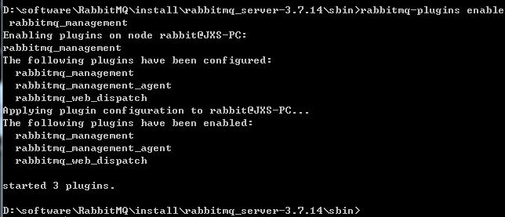

+ 消息总线：

>在微服务架构的系统中，通常会使用轻量级的消息代理来构建一个公用的消息主题，并让系统中其他微服务实例都连接上来，
改主题中产生的消息会被所有实例监听和消费，在总线上的各个实例，都可以方便地广播一些需要让其他链接在改主题上的势力都知道的消息。
+ 基本原理
> ConfigClient实例都监听MQ中的同一个topic默认是springCloudBus，当一个服务刷新数据的时候，她会吧这个消息放到Topic中，这样其它
监听同一个Topic的服务就能得到通知，然后去更新自身的配置。

bus目前只支持RabbitMQ和Kafka
### 安装RabbitMQ
#### 首先安装erlang
下载地址：http://erlang.org/download/otp_win64_21.3.exe  
### 下载RabbitMQ&安装
1、下载并安装  
安装版:https://github.com/rabbitmq/rabbitmq-server/releases/download/v3.7.14/rabbitmq-server-3.7.14.exe  
解压版:https://github.com/rabbitmq/rabbitmq-server/releases/download/v3.7.14/rabbitmq-server-windows-3.7.14.zip  
2、进入sbin目录，然后cmd执行 rabbitmq-plugins enable rabbitmq_management  
```shell
rabbitmq-plugins enable rabbitmq_management
```
出现以下信息安装完成  
  
windows下出现以下安装信息  

检查是否安装成功  
```html
http://localhost:15672/ 
```
默认密码guest:guest  


## 广播通知两种架构思想
两种消息通知  
第一种：(利用消息总线触发一个客户端/bus/refresh，而不刷新所有别的客户端的配置)  
  
第二种：(利用消息总线触发一个configServer的/bus/refresh)断点，而刷新所有客户端的配置  
  
### SpringCloud Bus动态刷新全局广播
> 服务端为3344,两个客户端3355、3366,修改了github后，只需要通知3344，然后3355、3366自动通过rabbitMQ订阅的springCloudBus
消息获取最新的内容。
#### ①消息总控cloud-config-center-3344的配置
1、在总控消息中心集成rabbitMQ
```xml
<!-- 添加消息总线RabbitMQ的支持(包含了bus和rabbitMQ) -->
<dependency>
    <groupId>org.springframework.cloud</groupId>
    <artifactId>spring-cloud-starter-bus-amqp</artifactId>
</dependency>
```
2、yml配置rabbitMQ的配置
```properties
spring:
  #RabbitMQ的配置
  rabbitmq:
    host: localhost
    port: 5672
    username: guest
    password: guest
# rabbitmq相关配置，暴露bus刷新配置的断点
management:
  endpoints: #暴露bus刷新配置的断点
    web:
      exposure:
        include:  'bus-refresh'
```
#### ②给客户端3355,3366配置
##### 配置cloud-config-client-3355
1、pom添加rabbitMQ的支持
```xml
<!-- 添加rabbitmq的支持 -->
<dependency>
    <groupId>org.springframework.cloud</groupId>
    <artifactId>spring-cloud-starter-bus-amqp</artifactId>
</dependency>
```
<strong>spring-cloud-starter-bus-amqp集成了bus和RabbitMQ</strong>  
2、yml的配置
```properties
spring:
  #rabbitmq的配置
  rabbitmq:
    host: localhost
    port: 5672
    username: guest
    password: guest
#暴露监控断点
management:
  endpoints:
    web:
      exposure:
        include: "*" #*表示健康等其他参数，统一用*代替了

```
<strong>3366的配置和3355一样。此处省略</strong>  

测试启动顺序7001、3344、3355、3366
<strong>执行总控的bus-refresh刷新</strong>    
如果没有curl命令则需要下载https://curl.haxx.se/download/curl-7.73.0.zip  
> url -X POST "http://localhost:3344/actuator/bus-refresh"

  
<strong>效果：修改了github的文件,3344及时访问最新的,手动执行3344总控命令后，3355,3366均完成都是最新配置文件</strong>
## SpringCloud Bus动态刷新定点通知
>说明：同时2个config(3355、3366)客户端，只想通知3355，不想通知3366
+ 执行以下命令即可
> curl -X POST "http://localhost:3344/actuator/bus-refresh/{destination}"

说明：/bus/refresh请求不在发送到具体的服务器实例上，而是发送给config server并通过destination参数类指定需要更新配置的服务或实例。  
destination里面为 ，<strong>服务名:端口号</strong>也即：spring.application.name:server.port  
eg: curl -X POST "http://localhost:3344/actuator/bus-refresh/config-client:3355"  