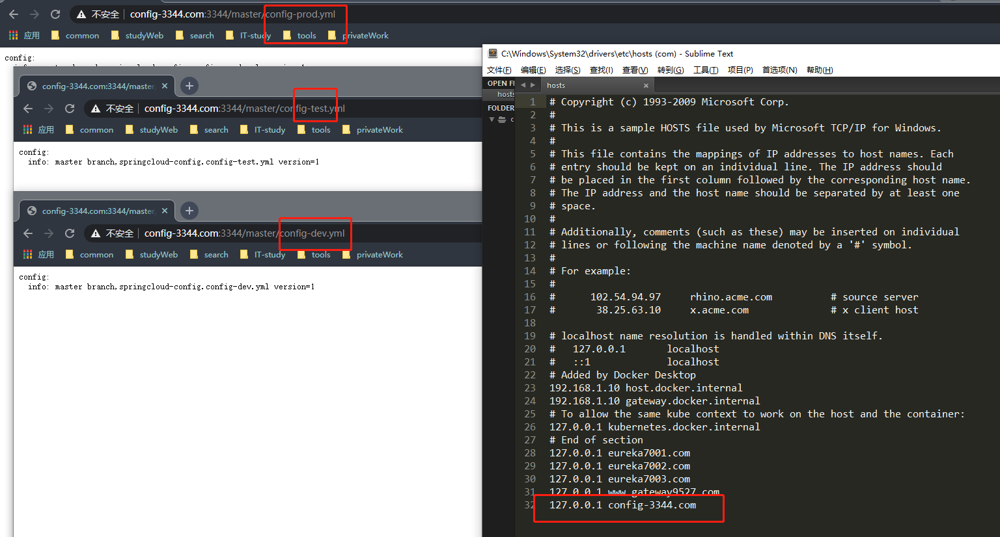
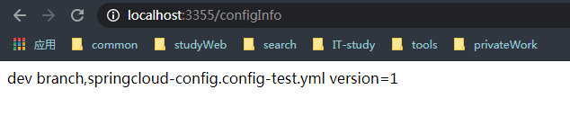
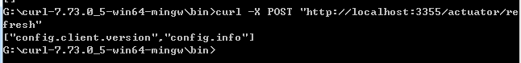

# Config
### 新建项目cloud-config-center-3344
1、pom.xml
```xml
<!-- config配置中心 -->
<dependency>
    <groupId>org.springframework.cloud</groupId>
    <artifactId>spring-cloud-config-server</artifactId>
</dependency>
```
2、yml的配置
```properties
spring:
  application:
    name: cloud-config-center # 注册进eureka服务器的微服务名
  cloud:
    config:
      server:
        git:
          # git@github.com:为固定写法，后面为用户名/项目/文件信息
          uri: https://github.com/xxx/springcloud-config.git #github上面的git层库名字
          #搜索目录
          search-paths:
            - springcloud-config
      #读取分支
      label: master
```
访问结果：

### 客户端的搭建cloud-config-client-3355
1、pom.xml
```xml
<dependency>
    <groupId>org.springframework.cloud</groupId>
    <artifactId>spring-cloud-starter-config</artifactId>
</dependency>
```
2、application.yml
```properties
spring:
  application:
    name: config-client
  cloud:
    config:
      # 注意：在访问label里面的分支的时候,对应的文件必须都得有。不然会报错属性找不到
      label: dev #分支名称
      name: config #配置文件名
      profile: test #读取后缀名称，上述三个综合：master分之上config-dev.yml的配置文件被读取http://config-3344.com:3344/master/config-dev.yml
      uri: http://localhost:3344 #配置中心地址
```
3、主启动类
```java
@SpringBootApplication
@EnableDiscoveryClient
public class ConfigClientMain3355 {
    public static void main(String[] args) {
        SpringApplication.run(ConfigClientMain3355.class, args);
    }
}
/*
以rest的方式请求配置文件
 */
@RestController
public class ConfigClientController {

    @Value("${config.info}")
    private String configInfo;

    @GetMapping("configInfo")
    public String getConfigInfo() {
        return configInfo;
    }
}
```
访问结果：  
启动7001,3344,3355  

### 动态刷新
cmd执行 curl -X POST "http://localhost:3355/actuator/refresh"

作用是通知3355服务，已经修改了配置文件，需要读取最新的。