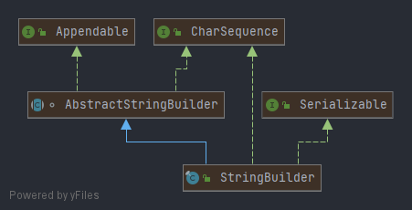
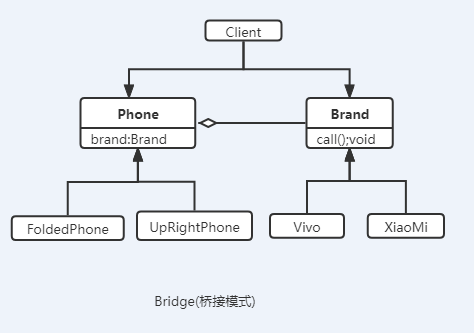

## 设计模式

| 范围 | 类模式 | 对象模式 |
| :-----: | :----: | :----: |
| 创建型模式 | 工厂 | 单例、原型、抽象工厂、建造者 |
| 结构型模式 | (类)适配器 | 代理、(对象）适配器、桥接<br>装饰、外观、享元、组合 |
| 行为型模式 | 模板方法、解释器 | 策略、命令、职责链、状态、备忘录<br>观察者、中介者、迭代器、访问者 |


## 七大设计原则核心思想
### <font color='green'>一、单一职责原则</font>
 单一职责原则（SRP：Single Responsibility principle）又称为单一功能原则
><font color='green'>核心</font>：解耦和增强内聚性（高内聚，低耦合）  
<font color='green'>描述</font> ：类被修改的几率很大，因此应该专注于单一的功能。如果你把多个功能放在同一个类中，功能之间就形成了关联，改变其中一个功能，有可能中止另一个功能，这时就需要新一轮的测试来避免可能出现的问题。
### <font color='green'>二、接口隔离原则</font>
接口隔离原则（ISP：Interface Segregation Principle）
> <font color='green'>核心</font>：客户端不应该依赖它不需要的接口；一个类对另一个类的依赖应该建立在最小的接口上。  
<font color='green'>描述</font>：提供给每个模块的都应该是单一接口，提供给几个模块就应该有几个接口，而不是建立一个庞大的臃肿的接口，容纳所有的客户端访问。接口是我们设计时对外提供的契约，通过分散定义多个接口，可以预防未来变更的扩散，提高系统的灵活性和可维护性。

### <font color='green'>三、依赖倒置原则</font>
依赖倒置原则（DIP：Dependency Inversion Principle）

><font color='green'>核心</font>：高层模块不应该依赖低层模块，二者都应该依赖其抽象；抽象不应该依赖细节，细节应该依赖抽象    
<font color='green'>描述</font>：依赖倒置的中心思想是面向接口编程；依赖倒置原则是基于这样的设计理念：相对于细节的多变性，抽象的东西要稳定的多。以抽象为基础搭建的架构比以细节为基础的架构要稳定的多。
在 java 中，抽象指的是接口或抽象类，细节就是具体的实现类。使用接口或抽象类的目的是制定好规范，而不涉及任何具体的操作，把展现细节的任务交给他们的实现类去完成。

### <font color='green'>四、开闭原则</font>
开闭原则（OCP：Open Closed Principle）

><font color='green'>核心</font>：软件实体应当对扩展开放，对修改关闭    
<font color='green'>描述</font>：开闭原则（Open Closed Principle）是编程中最基础、最重要的设计原则；
一个软件实体（如类、模块和方法），应该对扩展开放（对提供方），对修改关闭（对使用方）。用抽象构建框架，用实现扩展细节。
当软件需要变化时，尽量通过扩展软件实体的行为来实现变化，而不是通过修改已有的代码来实现。
编程中遵循其它原则，以及设计模式的目的就是遵循开闭原则。
### <font color='green'>五、里式替换原则</font>
里氏替换原则（LSP：Liskov Substitution Principle）

><font color='green'>核心</font> ：派生类（子类）对象可以在程式中代替其基类（超类）对象  
<font color='green'>描述</font>：在使用继承时，遵循里氏替换原则，在子类中尽量不要重写父类的方法
里氏替换原则告诉我们，继承实际上让两个类耦合性增强了，在适当的情况下，可以通过聚合，组合，依赖 来解决问题。
### <font color='green'>六、迪米特法则</font>

迪米特法则（LOD：Law of Demeter）又称为最少知道原则（The Least Knowledge Principle）

><font color='green'>核心</font>：一个对象应该对其他对象保持最少的了解  
<font color='green'>描述</font>：类与类关系越密切，耦合度越大
一个类对自己依赖的类知道的越少越好。也就是说，对于被依赖的类不管多么复杂，都尽量将逻辑封装在类的内部。对外除了提供的 public 方法，不对外泄露任何信息。
只与直接的朋友通信
直接朋友： 每个对象都会与其他对象有耦合关系，只要两个对象之间有耦合关系，我们就说这两个对象之间是朋友关系。耦合的方式很多，依赖，关联，组合，聚合等。其中，我们称出现成员变量，方法参数，方法返回值中的类为直接的朋友，而出现在局部变量中的类不是直接的朋友。也就是说，陌生的类最好不要以局部变量的形式出现在类的内部。
### <font color='green'>七、合成复用原则</font>
合成复用原则（CRP：Composite Reuse Principle）

><font color='green'>核心</font>：合成复用原则，要求在软件复用时，要先尽量使用组合或者聚合等关联关系实现，其次才考虑使用继承。  
<font color='green'>描述</font>：如果要使用继承关系，则必须严格遵循里氏替换原则。合成复用原则同里氏替换原则相辅相成的，两者都是开闭原则的具体实现规范。
通常类的复用分为继承复用和合成复用两种

继承复用的<font color='green'>缺点</font>：  
>1、继承复用破坏了类的封装性。因为继承会将父类的实现细节暴露给子类，父类对子类是透明的，所以这种复用又称为“白箱”复用。  
2、子类与父类的耦合度高。父类的实现的任何改变都会导致子类的实现发生变化，这不利于类的扩展与维护。  
3、它限制了复用的灵活性。从父类继承而来的实现是静态的，在编译时已经定义，所以在运行时不可能发生变化。  

合成复用的<font color='green'>优点</font>：  

>1、它维持了类的封装性。因为成分对象的内部细节是新对象看不见的，所以这种复用又称为“黑箱”复用。  
2、新旧类之间的耦合度低。这种复用所需的依赖较少，新对象存取成分对象的唯一方法是通过成分对象的接口。  
3、复用的灵活性高。这种复用可以在运行时动态进行，新对象可以动态地引用与成分对象类型相同的对象。  
## 单例模式
#### 1、<font color='red'>饿汉式(静态常量)</font>
```java
@Slf4j
public class SingletonTest01 {
    public static void main(String[] args) {
        Singleton singleton = Singleton.getInstance();
        Singleton singleton2 = Singleton.getInstance();
        log.info("比对结果：{}",singleton==singleton2); //true
    }
}
/**
 * 饿汉式，(静态变量)
 */
class Singleton {
    //1、构造器私有化，外部new
    private Singleton() {
    }
    //本部内部类创建对象实例
    private final static Singleton instance = new Singleton();
    public static Singleton getInstance() {
        return instance;
    }
}
```

#### 2、<font color='red'>饿汉式(静态代码块)</font>
也可以使用，但是稍微有点内存的浪费(并且线程是安全的)
```java
@SuppressWarnings("All")
@Slf4j
public class SingletonTestStatic {
    public static void main(String[] args) {
        SingletonStatic singleton = SingletonStatic.getInstance();
        SingletonStatic singleton2 = SingletonStatic.getInstance();
        log.info("比对结果：{}",singleton == singleton2);
    }
}
/**
 * 饿汉式，(静态代码块)
 */
class SingletonStatic {
    /**
     * 1、构造器私有化，外部new
     */
    private SingletonStatic() {
        instance = new SingletonStatic();
    }
    //本部内部类创建对象实例
    private static SingletonStatic instance;
    public static SingletonStatic getInstance() {
        return instance;
    }
}
```
#### 3、 <font color='green'>~~懒汉式(<font color='red'>线程不安全</font>)~~</font>
<font color='red'>~~不推荐使用~~</font>
```java
@SuppressWarnings("All")
@Slf4j
public class SingletonHungryMan {
    public static void main(String[] args) {
        SingletonHungry singleton=SingletonHungry.getInstance();
        SingletonHungry singleton1=SingletonHungry.getInstance();
        log.info("比对结果：{}",singleton==singleton1);
        log.info("singleton:hasCode:{}",singleton.hashCode());
        log.info("singleton1:hasCode:{}",singleton1.hashCode());
    }
}
/**
 * 饿汉式，(静态代码块)
 */
class SingletonHungry {
    private static SingletonHungry instance;
    private SingletonHungry() {
    }
    //提供一个静态公有方法，当使用到该方法时候，才去创建instance
    //即懒汉式
    public static SingletonHungry getInstance() {
        if(null==instance){
            instance=new SingletonHungry();
        }
        return instance;
    }
}
```
#### 4、<font color='green'>懒汉式(线程安全，同步方法)</font>
```java
@SuppressWarnings("All")
@Slf4j
public class SingletonHungryManSync {
    public static void main(String[] args) {
        SingletonHungryManSync singleton= SingletonHungrySync.getInstance();
        SingletonHungryManSync singleton1= SingletonHungrySync.getInstance();
        log.info("比对结果：{}",singleton==singleton1);
        log.info("singleton:hasCode:{}",singleton.hashCode());
        log.info("singleton1:hasCode:{}",singleton1.hashCode());
    }
}
/**
 * 懒汉式，(静态代码块)
 */

class SingletonHungrySync {
    private static SingletonHungryManSync instance;
    private SingletonHungrySync() {
    }
    //提供一个静态的公有方法，同时加入同步处理代码synchronized， 解决线程安全问题
    public static synchronized SingletonHungryManSync getInstance() {
        if(null==instance){
            instance=new SingletonHungryManSync();
        }
        return instance;
    }
}
```
#### 5、<font color='green'>懒汉式(线程安全，<font color='red'>同步代码块(线程不安全)</font></font>
<font color='red'>~~不推荐使用~~</font>
```java
@Slf4j
public class SingletonHungryManSyncCode {
    public static void main(String[] args) {
        SingletonHungrySyncCode singleton = SingletonHungrySyncCode.getInstance();
        SingletonHungrySyncCode singleton1 = SingletonHungrySyncCode.getInstance();
        log.info("比对结果：{}", singleton == singleton1);
        log.info("singleton :hasCode:{}", singleton.hashCode());
        log.info("singleton1:hasCode:{}", singleton1.hashCode());
    }
}
class SingletonHungrySyncCode {
    private static SingletonHungrySyncCode instance;
    private SingletonHungrySyncCode() {
    }
    public static  SingletonHungrySyncCode getInstance() {
        if (null == instance) {
            //进入if再加锁，创建多个实例，不安全(不推荐使用)
            synchronized (SingletonHungrySyncCode.class) {
                instance = new SingletonHungrySyncCode();
            }
        }
        return instance;
    }
}

```
#### 6、<font color='red'>双重检查</font>  
<font color='red'>推荐使用</font>
```java
@Slf4j
public class SingletonDoubleCheckMain {
    public static void main(String[] args) {
        SingletonDoubleCheck singleton = SingletonDoubleCheck.getSingleton();
        SingletonDoubleCheck singleton2 = SingletonDoubleCheck.getSingleton();
        log.info("比对结果：{}", singleton == singleton2);
        log.info("singleton :hashCode：{}", singleton.hashCode());
        log.info("singleton2:hashCode：{}", singleton.hashCode());
    }
}
class SingletonDoubleCheck {
    private static volatile SingletonDoubleCheck singleton;
    private SingletonDoubleCheck() {
    }
    /**
     *  提供一个静态的公有方法，加入双重检查代码，解决线程安全问题，同时解决懒加载问题
     */
    public static synchronized SingletonDoubleCheck getSingleton() {
        if (null == singleton) {
            synchronized (SingletonDoubleCheck.class) {
                if (null == singleton) {
                    singleton = new SingletonDoubleCheck();
                }
            }
        }
        return singleton;
    }
}
```
#### 7、<font color='red'>静态内部类</font> 
<font color='red'>推荐使用</font>
```java
@SuppressWarnings("All")
@Slf4j
public class SingletonStaticInnerMain {
    public static void main(String[] args) {
        SingletonStaticInner singleton = SingletonStaticInner.getInstance();
        SingletonStaticInner singleton2 = SingletonStaticInner.getInstance();
        log.info("静态内部类完成单例模式");
        log.info("比对结果：{}", singleton == singleton2);
        log.info("singleton :hashCode：{}", singleton.hashCode());
        log.info("singleton2:hashCode：{}", singleton.hashCode());
    }
}
class SingletonStaticInner {
    private SingletonStaticInner() {
    }
    /**
     * 写一个静态内部类，该类中有一个静态属性SingletonStaticInner
     */
    private static class SingletonInstance {
        private static final SingletonStaticInner INSTANCE = new SingletonStaticInner();
    }
    /**
     * 提供一个静态的公有方法，直接返回SingletonInstance.INSTANCE;
     */
    public static SingletonStaticInner getInstance() {
        return SingletonInstance.INSTANCE;
    }
}
```
#### 8、<font color='red'>枚举</font>  
```java
@Slf4j
public class SingletonEnumMain {
    public static void main(String[] args) {
        SingletonEnum singleton = SingletonEnum.INSTANCE;
        SingletonEnum singleton2 = SingletonEnum.INSTANCE;

        log.info("比对结果：{}", singleton == singleton2);
        log.info("singleton :hashCode：{}", singleton.hashCode());
        log.info("singleton2:hashCode：{}", singleton.hashCode());
    }
}
enum SingletonEnum {
    //属性
    INSTANCE;
}
```

总结、以上推荐使用的是：
<font color='red' size='4'>饿汉式，静态内部类，双重检查，枚举</font>
单例使用注意事项：
>   1、单例模式保证了系统内存中该类只存在一个对象，节省了系统资源，对于一些需要平凡创建校会的对象，使用单例模式可以提高系统性能  
    2、想实例化一个单例类的时候，必须要记住使用相应的获取对象的方法，而不是使用new  
    3、单例模式适用的场景：需要频繁的进行创建和销毁对象，创建对象时消耗过多或者耗费资源过多(即：重量级对象)，
> 但又经常用到的对象、工具类对象、频繁访问数据库或文件的对象(比如数据源、session工厂等)
## 工厂模式
### 简单工厂模式


+ 请看类： org.xwb.springcloud.factory.simple.PizzaStore

> 1、简单工厂模式是属于创建型模式，是工厂模式的一种，<font color='red'>简单工厂模式是由一个工厂对象决定创建出哪一种产品类的实力</font>。简单来工厂模式就是工厂模式家族中最简单最实用的模式  
2、简单工厂模式：定义了一个创建对象的类，有这个类来封装实例化对象的行为(代码)  
3、在软件开发中，当我们回用到大量的创建某种。某类或者谋批次对象时，就会使用工厂模式。  


```java
//简单工厂类
@Slf4j
public class SimplePizzaFactory {
    //根据orderType返回对应的pizza对象
    public Pizza createPizza(String orderType) {
        Pizza pizza = null;
        log.info("\n使用简单工厂模式");
        if ("greek".equals(orderType)) {
            pizza = new GreekPizza();
            pizza.setName("希腊披萨");
        } else if ("chess".equals(orderType)) {
            pizza = new ChessPizza();
            pizza.setName("奶酪披萨");
        } else if ("pepper".equals(orderType)) {
            pizza = new ChessPizza();
            pizza.setName("胡椒披萨");
        }
        return pizza;
    }
}
//=====================================
@Slf4j
public class OrderPizzaSimpleFactory {
    public OrderPizzaSimpleFactory(SimplePizzaFactory simpleFactory){
        setSimpleFactory(simpleFactory);
    }
     // 定义一个简单工厂对象
    SimplePizzaFactory simpleFactory;
    Pizza pizza = null;
    public void setSimpleFactory(SimplePizzaFactory simpleFactory) {
        //用户输入的
        String orderType = "";
        this.simpleFactory = simpleFactory;
        do {
            orderType = getType();
            pizza = simpleFactory.createPizza(orderType);
            //订购成功
            if (null != pizza) {
                pizza.prepare();
                pizza.bake();
                pizza.cut();
                pizza.box();
            } else {
                //订购失败
                log.info("订购披萨失败！");
            }
        } while (true);
    }
    private String getType() {
        try {
            BufferedReader input = new BufferedReader(new InputStreamReader(System.in));
            log.info(" input pizza 种类{}", input);
            return input.readLine();
        } catch (Exception e) {
            e.printStackTrace();
            return "";
        }
    }
}
//使用简单工厂
public class PizzaStore {
    public static void main(String[] args) {
        //简单工厂模式
        new OrderPizzaSimpleFactory(new SimplePizzaFactory());
    }
}
```

### 工厂方法模式

> 具体调用方法 org.xwb.springcloud.factory.method.PizzaStore
```java
@Slf4j
public abstract class Pizza {
    //名称
    protected String name;
    //准备原材料，不同的披萨不一样，因此。做成抽象类
    public abstract void prepare();

    public void bake() {
        log.info(name + " baking;");
    }
    public void cut() {
        log.info(name + " cutting;");
    }
    public void box() {
        log.info(name + " boxing;");
    }
    public void setName(String name) {
        this.name = name;
    }
}
@Slf4j
public class BJcheesePizza extends Pizza{
    @Override
    public void prepare() {
        setName("北京奶酪pizza");
        log.info("北京奶酪pizza 准备原材料");
    }
}
@Slf4j
public class BJPepperPizza extends Pizza{
    @Override
    public void prepare() {
        setName("北京胡椒pizza");
        log.info("北京胡椒pizza 准备原材料");
    }
}
@Slf4j
public class LDcheesePizza extends Pizza{
    @Override
    public void prepare() {
        setName("伦敦奶酪pizza");
        log.info("伦敦奶酪pizza 准备原材料");
    }
}
@Slf4j
public class LDPepperPizza extends Pizza{
    @Override
    public void prepare() {
        setName("伦敦胡椒pizza");
        log.info("伦敦胡椒pizza 准备原材料");
    }
}
//=================================================
//具体的订单工厂
public abstract class OrderPizza {

    //定义一个抽象方法，createPizza，让各个工厂子类自己实现
    abstract Pizza createPizza(String orderType);

    public OrderPizza(){
        Pizza pizza=null;
        String orderType;
        do {
            orderType= CommonUtils.getType();
            //抽象方法，有工厂子类完成
            pizza=createPizza(orderType);
            pizza.prepare();
            pizza.bake();
            pizza.cut();
            pizza.box();
        }while (true);
    }
}
public class BJOrderPizza extends  OrderPizza{
    @Override
    Pizza createPizza(String orderType) {
        Pizza pizza =null;
        if(orderType.equals("cheese")){
            pizza=new BJcheesePizza();
        }else if(orderType.equals("pepper")){
            pizza=new BJPepperPizza();
        }
        return pizza;
    }
}
public class LDOrderPizza extends OrderPizza {
    @Override
    Pizza createPizza(String orderType) {
        Pizza pizza = null;
        if (orderType.equals("cheese")) {
            pizza = new LDcheesePizza();
        } else if (orderType.equals("pepper")) {
            pizza = new LDPepperPizza();
        }
        return pizza;
    }
}
//下单
public class PizzaStore {
    public static void main(String[] args) {
        //new BJOrderPizza();
        new LDOrderPizza();
    }
}
```
### 抽象工厂模式


> 1、抽象工厂模式，定义一个inferface用于创建相关或有依赖关系的对象簇，而无需指明具体的类  
> 2、抽象工厂模式可以将<font color='green'>简单工厂模式</font>和<font color='green'>工厂方法模式</font>进行整合  
> 3、从涉及层面看，抽象工厂模式就是对简单工厂模式的该进(或者成为进一步的抽象)  
> 4、将工厂抽象为2层，abstractFactory(抽象工厂)和具体实现的工厂子类。程序员可以根据创建对象类型使用对应的工厂子类，这样将简单的工厂类会变成工厂簇，更利于代码的维护和扩展


```java
//==============pizza============================
@Slf4j
public abstract class Pizza {
    //名称
    protected String name;
    //准备原材料，不同的披萨不一样，因此。做成抽象类
    public abstract void prepare();
    public void bake() {
        log.info(name + " baking;");
    }
    public void cut() {
        log.info(name + " cutting;");
    }
    public void box() {
        log.info(name + " boxing;");
    }
    public void setName(String name) {
        this.name = name;
    }
}
@Slf4j
public class BJcheesePizza extends Pizza {
    @Override
    public void prepare() {
        setName("北京奶酪pizza");
        log.info("北京奶酪pizza 准备原材料");
    }
}
@Slf4j
public class BJPepperPizza extends Pizza {
    @Override
    public void prepare() {
        setName("北京胡椒pizza");
        log.info("北京胡椒pizza 准备原材料");
    }
}
@Slf4j
public class LDcheesePizza extends Pizza {
    @Override
    public void prepare() {
        setName("伦敦奶酪pizza");
        log.info("伦敦奶酪pizza 准备原材料");
    }
}
@Slf4j
public class LDPepperPizza extends Pizza {
    @Override
    public void prepare() {
        setName("伦敦胡椒pizza");
        log.info("伦敦胡椒pizza 准备原材料");
    }
}
//=================order============================
public interface AbstractFactory {
    //创建工厂类，子类实现
    public Pizza createPizza(String orderType);
}
@Slf4j
public class BJFactory implements AbstractFactory {
    @Override
    public Pizza createPizza(String orderType) {
        log.info("使用的是抽象工厂模式");
        Pizza pizza = null;
        if (CommonField.CHEESE.equals(orderType)) {
            pizza = new BJcheesePizza();
        } else if (CommonField.PEPPER.equals(orderType)) {
            pizza = new BJPepperPizza();
        }
        return pizza;
    }
}
@Slf4j
public class LDFactory implements AbstractFactory {
    @Override
    public Pizza createPizza(String orderType) {
        log.info("使用的是抽象工厂模式");
        Pizza pizza = null;
        if (CommonField.CHEESE.equals(orderType)) {
            pizza = new LDcheesePizza();
        } else if (CommonField.PEPPER.equals(orderType)) {
            pizza = new LDPepperPizza();
        }
        return pizza;
    }
}
//订单设置工厂实用类
@Slf4j
public class OrderPizza {
    AbstractFactory factory;

    public OrderPizza(AbstractFactory factory){
        setAbstractFactory(factory);
    }
    private void setAbstractFactory(AbstractFactory factory) {
        Pizza pizza = null;
        //用户输入
        String orderType = "";
        this.factory = factory;
        do {
            orderType = CommonUtils.getType();
            //factory 可能是北京的工厂子类，也有可能是伦敦的工厂子类
            pizza = factory.createPizza(orderType);
            //订购成功
            if (null != pizza) {
                pizza.prepare();
                pizza.bake();
                pizza.cut();
                pizza.box();
            }
        } while (true);
    }
}
//使用
public class PizzaStore {
    public static void main(String[] args) {
        //new OrderPizza(new BJFactory());
        new OrderPizza(new LDFactory());
    }
}
```
## 原型模式
>1、原型模式(Prototype模式)是指：用原型实例指定创建对象的种类，并通过拷贝这些原型，创建新的对象  
2、原型模式是一种创见性设计模式，允许一个对象再创建另一个可定制的对象，无需知道如何创建的细节。  
3、工作原理是：通过将一个原型对象传给那个要发动创建的对象，这个要发动创建的对象通过请求原型对象拷贝他们自己来实时创建,即 对象.clone()  

```java

package org.xwb.springcloud.prototype;

import lombok.Data;
import lombok.extern.slf4j.Slf4j;

/**
 * 羊
 *
 * @author Administrator
 * @description
 */
@Data
@Slf4j
public class Sheep implements Cloneable {
    private String name;
    private int age;
    private String color;

    public Sheep() {
    }
    public Sheep(String name, int age, String color) {
        this.name = name;
        this.age = age;
        this.color = color;
    }
    @Override
    public String toString() {
        return "Sheep [name=" + name + "],age=[" + age + "],color=[" + color + "]";
    }
    @Override
    protected Object clone() {
        Sheep sheep = null;
        try {
            sheep = (Sheep) super.clone();
        } catch (CloneNotSupportedException e) {
            log.info("克隆失败!{}", e.getMessage());
            e.printStackTrace();
        }
        return sheep;
    }
}
@Slf4j
public class Client {
    public static void main(String[] args) {
        log.info("用原型模式完成对象的创建");
        Sheep sheep=new Sheep("tom",1,"白色");
        Sheep sheep1=(Sheep)sheep.clone();
        Sheep sheep2=(Sheep)sheep.clone();
        Sheep sheep3=(Sheep)sheep.clone();
        log.info("克隆羊1：{}",sheep1);
        log.info("克隆羊2：{}",sheep2);
        log.info("克隆羊3：{}",sheep3);
    }
}
```
spring源码中圆形模式的应用  
指定：scope="prototype" 表示适用的是原型模式创建的

 + 浅拷贝
>1、对于数据类型是基本数据类型的额成员变量，浅拷贝会直接进行值传递，也就是将概述性质复制一份给新的对象  
2、对于数据类型为引用数据类型的成员变量，比如说成员变量是某个数组。某个类的对象等，那么浅拷贝会进行引用传递，也就是只是将该成员变量的引用值(内存地址)
复制一份给新的对象。因为实际上两个对象的该成员变量都指向同一个实力，在这种情况下，在一个对象中修改该成员变量会影响到另一个对象的该成员变量值。  
3、前面我们克隆羊就是浅拷贝。  
4、浅拷贝是这样适用的clone()方法来实现。  
sheep=(Sheep)super.clone();
 + 深拷贝
>1、复制对象的所有基本数据类型的成员变量值  
2、为所有引用数据类型的成员变量申请存储空间，并复制每个引用数据类型以成员变量所引用的对象，知道该对象可达的所有对象，也就是说，对象进行深拷贝要对整个对象进行拷贝。  
3、深拷贝实现方式<font color='red'>1、重写clone方法来实现深拷贝</font>  
4、深拷贝实现方式<font color='red'>2、通过序列化实现深拷贝（推荐使用）</font>  

> org.xwb.springcloud.prototype.deep.DeepCloneableTarget
```java
public class DeepCloneableTarget implements Serializable, Cloneable {
    private static final long serialVersionUID = 1L;
    private String cloneName;
    private String cloneClass;
    //构造器
    public DeepCloneableTarget(String cloneName, String cloneClass) {
        this.cloneName = cloneName;
        this.cloneClass = cloneClass;
    }
    //因为该类的属性，都是String,因此我们这里是用的是默认的clone方法完成即可。
    @Override
    protected Object clone() throws CloneNotSupportedException {
        return super.clone();
    }
}
public class DeepProtoType implements Serializable, Cloneable {
    //String 属性
    public String name;
    //引用类型
    public DeepCloneableTarget deepCloneableTarget;

    public DeepProtoType() {
        super();
    }
    //完成深拷贝【方式1】使用clone方法
    @Override
    protected Object clone() throws CloneNotSupportedException {
        Object deep = null;
        //这里完成对基本数据类型(属性)的克隆
        deep = super.clone();
        //对引用类型的属性进行单独处理
        DeepProtoType deepProtoType = (DeepProtoType) deep;
        //引用类型单独克隆
        deepProtoType.deepCloneableTarget = (DeepCloneableTarget) deepCloneableTarget.clone();

        return deepProtoType;
    }
    //完成深拷贝【方式二】 通过对象的序列化实现(推荐)
    public Object deepClone() {
        //输出流
        ByteArrayOutputStream bos = null;
        ObjectOutputStream oos = null;
        //输入流
        ByteArrayInputStream bis = null;
        ObjectInputStream ois = null;
        try {
            //序列化
            bos = new ByteArrayOutputStream();
            oos = new ObjectOutputStream(bos);
            //当前这个对象以对象流的方式输出
            oos.writeObject(this);

            //反序列化
            bis = new ByteArrayInputStream(bos.toByteArray());
            ois = new ObjectInputStream(bis);
            DeepProtoType copyObj = (DeepProtoType) ois.readObject();
            return copyObj;
        } catch (Exception e) {
            e.printStackTrace();
            return null;
        }finally {
            try {
                //关闭流
                bos.close();
                oos.close();
                bis.close();
                ois.close();
            }catch (Exception e){

            }
        }
    }
}

@Slf4j
public class ClientMain {
    public static void main(String[] args) throws CloneNotSupportedException {
        DeepProtoType p = new DeepProtoType();
        p.name = "张三";
        p.deepCloneableTarget = new DeepCloneableTarget("大牛", "大牛的类");
        //方式1 完成深拷贝
        DeepProtoType p2=(DeepProtoType) p.clone();
        log.info("深拷贝1================");
        log.info("p.name={},p.deepCloneableTarget={}",p.name,p.deepCloneableTarget.hashCode());
        log.info("p2.name={},p2.deepCloneableTarget={}",p2.name,p2.deepCloneableTarget.hashCode());
        //方式2、深拷贝

        DeepProtoType p3 = (DeepProtoType)p.deepClone();
        log.info("深拷贝2================");
        log.info("p.name={},p.deepCloneableTarget={}",p.name,p.deepCloneableTarget.hashCode());
        log.info("p3.name={},p3.deepCloneableTarget={}",p3.name,p3.deepCloneableTarget.hashCode());
    }
}
```
原型模式
  

+ 原理结构图说明： 
>   <font color='red'>Prototype</font>: 原型类，申明一个克隆自己的接口  
    <font color='red'>ConcretePrototype</font>:具体的原型类，实现一个克隆自己的操作  
    <font color='red'>Client</font>: 让一个原型对象克隆自己，从而创建一个新的对象(属性一样)

spring的bean就是原型模式(scope=prototype)
## 建造者模式(build)
  

**建造者模式的四个角色**
>1、<font color='red'>Product(产品角色)</font>： 一个具体的产品对象。  
2、<font color='red'>Builder(抽象建造者)</font>： 创建一个Product对象的各个部件指定的 <font color='green'>接口或者抽象类。</font>  
3、<font color='red'>ConcreteBuild(具体建造者)</font>：实现接口，构建和装配各个部件。  
4、<font color='red'>Director(指挥者)</font>：构建一个使用Builder接口的对象，他主要适用于创建一个复杂的对象。他主要有两个作用 <font color='green'>1.
隔离了客户与对象的生产过程2.负责控制产品对象的生产过程</font>

```java
//房子
@Data
public class House {
    private String baise;
    private String wall;
    private String roofed;
}
//抽象建造者
public abstract class HouseBuilder {
    protected House house = new House();
    //将建造的流程写好，抽象的方法
    public abstract void buildBaise();
    public abstract void buildWalls();
    public abstract void buildRoofed();
    //建房 (将房子返回)
    public House buildHouse() {
        return house;
    }
}
//普通房子
@Slf4j
public class CommonHouseBuilder extends HouseBuilder{
    @Override
    public void buildBaise() {
        log.info("给普通房子打地基5m");
    }
    @Override
    public void buildWalls() {
        log.info("给普通房子砌墙10m");
    }
    @Override
    public void buildRoofed() {
        log.info("给普通房子封顶");
    }
}
//高层房子
@Slf4j
public class HighHouseBuilder extends HouseBuilder {
    @Override
    public void buildBaise() {
        log.info("给高层房子打地基50m");
    }
    @Override
    public void buildWalls() {
        log.info("给高层房子砌墙20cm");
    }
    @Override
    public void buildRoofed() {
        log.info("给高层房子透明封顶");
    }
}

//指挥者，这里去指定流程，返回铲平
public class HouseDirector {
    HouseBuilder houseBuilder = null;
    //构造器方式传入houseBuilder
    public HouseDirector(HouseBuilder houseBuilder) {
        this.houseBuilder = houseBuilder;
    }
    //通过setter 方式传入houseBuilder
    public void setHouseBuilder(HouseBuilder houseBuilder) {
        this.houseBuilder = houseBuilder;
    }
    //如何处理建造房子的流程，交给指挥者
    public House constructHouse() {
        houseBuilder.buildBaise();
        houseBuilder.buildWalls();
        houseBuilder.buildRoofed();
        return houseBuilder.buildHouse();
    }
}

@Slf4j
public class Client {
    public static void main(String[] args) {
        //建普通房子
        CommonHouseBuilder commonHouse = new CommonHouseBuilder();
        //准备创建房子的指挥者
        HouseDirector houseDirector = new HouseDirector(commonHouse);
        House house = houseDirector.constructHouse();
        log.info("普通房子：{}", house.toString());
        log.info("==========================================");
        //建高层房子
        HighHouseBuilder highHouse = new HighHouseBuilder();
        HouseDirector houseDirector1 = new HouseDirector(highHouse);
        House house1 = houseDirector1.constructHouse();
        log.info("高层房子：{}", house1.toString());
    }
}
```

+ 建造者模式的注意事项和细节

>**1**、客户端使用 <font color='green'>程序不必知道产品内部组成的细节,将产品本身与产品的创建过程解耦，使得相同的创建过程可以创建不同的产品对象</font>  
**2**、每一个具体建造者都相对独立，而与其他的具体建造者无关，因此可以很方便地替换具体建造者或增加新的具体建造者,<font color='green'>用户使用不同的具体建造者即可得到不同的产品对象</font>  
**3**、<font color='green'>可以更加精细地控制产品的创建过程。</font>将复杂产品的创建步骤分解在不同的方法中，使得创建过程更加清晰，也更方便使用程序来控制创建过程  
**4**、<font color='green'>增加新的具体建造者无须修改原有类库的代码</font>,指挥者类针对抽象建造者类编程系统扩展方便，符合 <font color='green'>"开闭原则"</font>  
**5**、建造者模式所创建的产品一般具有较多的共同点，其组成部分相似,<font color='red'>如果产品之间的差异性很大，则不适合使用建造者模式</font>,因此其使用范围受到一定的限制 。  
**6**,如果产品的内部变化复杂，可能会导致需要定义很多具体建造者类来实现这种变化,导致系统变得很庞大,因此在这种情况下，要考虑是否选择建造者模式  
**7**、<font color='red'> 抽象工厂模式和建造者模式的区别</font>
> + 抽象工厂模式实现对产品家族的创建，一个产品家族 <font color='red'>具有不同分类维度的产品组合，采用抽象工厂模式不需要关心构建过程，只关心什么产品。由什么工厂生产即可</font>
> + 建造者模式则是要求按照指定的蓝图建造产品，他的主要目的是通过组装零配件而产生一个新产品

jdk源码中的使用(<font color='red'>StringBuilder</font>)
  

## 适配器模式
三种模式：<font color='red'>类适配器、接口适配器、对象适配器</font>  

### 1、类适配器
`定义`  
1、java是单继承机制，所以类适配器需要继承src类这一点算是一个缺点，因为这要求dst必须是接口，有一定局限性。  
2、src类的方法在Adapter中会暴露出来，也增加了使用成本。  
3、由于其继承了src类，所以他可以更具需求重写src类的方法，使得Adapter的灵活性增强了。  
```java
@Slf4j
public class Voltage220V {
    public int output220(){
        int src=220;
        log.info("输出{}伏电压",src);
        return src;
    }
}
public interface Voltage5V {
    public int output5V();
}
public class VoltageAdapter extends  Voltage220V implements Voltage5V {
    @Override
    public int output5V() {
        //获取220v电压
        int srcV = output220();
        //转为5v(降压处理)
        return srcV/44;
    }
}
@Slf4j
public class Phone {
    //充电方法
    public void charging(Voltage5V voltage5V) {
        if (voltage5V.output5V() == 5) {
            log.info("可以充电");
        } else if (voltage5V.output5V() > 5) {
            log.info("电压大于5V,无法充电");
        }
    }
}
@Slf4j
public class Client {
    public static void main(String[] args) {
        log.info("\n类适配器模式==============");
        Phone phone=new Phone();
        phone.charging(new VoltageAdapter());
    }
}
```
### 2、对象适配器

>1、对象适配器和类适配器其实算是一种思想，只不过实现方式不同。根据合成复用原则， 使用组合替代继承，所以他解决了类适配器必须继承src的局限性问题，也不再要求dst必须是接口。  
>2、使用成本更低，更灵活
```java
@Slf4j
public class Voltage220V {
    public int output220(){
        int src=220;
        log.info("输出{}伏电压",src);
        return src;
    }
}
public interface Voltage5V {
    public int output5V();
}
@Slf4j
public class VoltageAdapter implements Voltage5V {
    private Voltage220V voltage220V;
    public VoltageAdapter(Voltage220V voltage220V) {
        this.voltage220V = voltage220V;
    }
    @Override
    public int output5V() {
        int dst = 0;
        if (null != voltage220V) {
            //获取220v电压
            int srcV = voltage220V.output220();
            log.info("适用对象适配器,进行适配...");
            //转为5v(降压处理)
            dst = srcV / 44;
            log.info("适配完成,输出电压为：{}伏", dst);
        }
        return dst;
    }
}
@Slf4j
public class Phone {
    //充电方法
    public void charging(Voltage5V voltage5V) {
        if (voltage5V.output5V() == 5) {
            log.info("可以充电");
        } else if (voltage5V.output5V() > 5) {
            log.info("电压大于5V,无法充电");
        }
    }
}
@Slf4j
public class Client {
    public static void main(String[] args) {
        log.info("\n对象适配器模式==============");
        Phone phone=new Phone();
        phone.charging(new VoltageAdapter(new Voltage220V()));
    }
}
```
### 3、接口适配器

>1、一些书籍称为：适配器模式(Default Adapter Pattern)或缺省适配器模式(因为很多方法空实现)  
2、当不需要全部实现接口提供的方法时，可先设计一个抽象类实现接口，并为该接口中的每一个方法提供<font color='red'>默认实现(空方法)</font>，那么抽象类的子类可有选择地覆盖弗雷德某些方法实现需求。  
3、适用于一个接口不想使用其所有的方法的情况。  

```java
public interface InterfaceAdapter {
    public void method1();
    public void method2();
    public void method3();
    public void method4();
}
//在AbstractAdapter我们将InterfaceAdapter的方法进行默认实现
public class AbstractAdapter implements InterfaceAdapter {
    //默认实现
    @Override
    public void method1() {
    }
    @Override
    public void method2() {
    }
    @Override
    public void method3() {
    }
    @Override
    public void method4() {
    }
}
@Slf4j
public class Client {
    public static void main(String[] args) {
        AbstractAdapter adapter= new AbstractAdapter(){
            @Override
            public void method1() {
                log.info("使用了method1方法");
            }
        };
        adapter.method1();
    }
}
```
SpringMVC的HandlerAdapter使用了适配器模式

**适配器模式的注意事项和细节**  
> 1、三种命名方式，都是根据src是以怎样的形式给Adapter(在Adapter里的形式)来命名的。  
> 2、<font color='red'>类适配器：以类给到，在Adapter里，就是将src当做类,继承。    
>&nbsp;&nbsp;&nbsp;&nbsp;&nbsp;对象适配器：以对象给到，在Adapter里,将src作为一个对象,持有。  
>&nbsp;&nbsp;&nbsp;&nbsp;&nbsp;接口适配器：以接口给到，在Adapter里,将src作为接口,实现。</font>  
> 3、Adapter模式最大的作用还是将原本不兼容的接口融合在一起工作。  
> 4、实际开发中，实际用起来不拘泥于我们讲的三种经典形式。
## 桥接模式(Bridge)

基本介绍
>1、桥接模式(Bridge)是指：将实现与抽象放在两个不同的类层次中，是两个层次可以独立改变。  
>2、是一种结构设计模  
>3、Bridge模式给予类的<font color='green'>最小单元设计原则</font>，通过使用封装，聚合及继承等行为让不同的类承担不同的之策，他的主要特点是把抽象与行为实现风力开来，从而可以保持各部分的独立性以及应对他们的功能扩展。

**`桥接模式的注意事项`**

>1、实现了 <font color='red'>抽象和实现部分的分离</font>，从而极大地提供了系统的灵活。让抽象部分和实现部分独立开来，有助于系统进行分层设计，从而产生更好的结构化系统。  
2、对于系统的高层部分，只需要知道抽象部分和实现部分的接口就可以了，其他的部分由具体业务来完成。  
3、桥接模式代替多层继承方案，可以减少子类的个数，降低系统的管理和维护成本。  
4、桥接模式的引入增加了系统的理解和设计难度，由于聚合关联关系建立在抽象层，要求开发者针对抽象进行设计和编程。  
5、桥接模式要求正确的识别出系统中两个独立变化的维度，因此其适用范围有一定的局限性，既需要有这样的应用场景。  

```java
//品牌
public interface Brand {
    public void open();
    public void close();
    public void call();
}
public abstract class Phone {
    //组合品牌
    private Brand brand;
    //构造器
    public Phone(Brand brand) {
        super();
        this.brand = brand;
    }
    protected void open() {
        this.brand.open();
    }
    protected void close() {
        this.brand.close();
    }
    protected void call() {
        this.brand.call();
    }
}
/** 折叠手机类继承phone(抽象)类
 * @author Administrator
 * @description
 */
@Slf4j
public class FoldedPhone extends Phone {
    public FoldedPhone(Brand brand) {
        super(brand);
    }
    @Override
    protected void open() {
        super.open();
        log.info("折叠样式手机");
    }
    @Override
    protected void close() {
        super.close();
        log.info("折叠样式手机");
    }
    @Override
    protected void call() {
        super.call();
        log.info("折叠样式手机");
    }
}
/**
 * @author Administrator
 * @description
 */
@Slf4j
public class UpRightPhone extends Phone {
    public UpRightPhone(Brand brand) {
        super(brand);
    }
    @Override
    protected void open() {
        super.open();
        log.info("直立样式手机开机");
    }
    @Override
    protected void close() {
        super.close();
        log.info("直立样式手机关机");
    }
    @Override
    protected void call() {
        super.call();
        log.info("直立样式手机打电话");
    }
}
@Slf4j
public class XiaoMi implements Brand {
    @Override
    public void open() {
        log.info("小米手机开机了");
    }
    @Override
    public void close() {
        log.info("小米手机关机了");
    }
    @Override
    public void call() {
        log.info("小米手机打电话了");
    }
}
@Slf4j
public class ViVo implements  Brand{
    @Override
    public void open() {
        log.info("ViVo手机开机了");
    }
    @Override
    public void close() {
        log.info("ViVo手机关机了");
    }
    @Override
    public void call() {
        log.info("ViVo手机打电话了");
    }
}
@Slf4j
public class Client {
    public static void main(String[] args) {
        //折叠手机（样式+品牌）
        Phone phone =new FoldedPhone(new XiaoMi());
        phone.open();
        phone.call();
        phone.close();
        log.info("=====================");
        Phone phone1=new FoldedPhone(new ViVo());
        phone1.open();
        phone1.call();
        phone1.close();
        log.info("=====================");
        //直立手机（样式+品牌）
        Phone phone2 =new UpRightPhone(new XiaoMi());
        phone2.open();
        phone2.call();
        phone2.close();
        log.info("=====================");
        Phone phone3=new UpRightPhone(new ViVo());
        phone3.open();
        phone3.call();
        phone3.close();
    }
}
```
示例：源码中使用到的桥接模式(Connection)
  
<font color='red'>中间2个红框是省略了桥接模式实现类。(稍微有一些不同)</font>  
常见的应用场景：
-JDBC驱动程序、银行转账系统  
转账分类：(网上转账，柜台转账。ATM转账)  
转账用户类型：普通用户。银卡用户，金卡用户  
- 消息管理
 消息类型： 及时消息，延时消息 
 消息分类：手机短信，邮件消息，qq消息
## 装饰者模式(Decorator)
  
`定义`  
1、<font color='red'>动态的将新功能附加到对象上</font>，在对象功能扩展方面，他比继承更有弹性，<font color='red'>也体现了开闭原则(OCP)</font>    
2、这里提到的动态的将新功能附加到对象和OCP原则，在后面应用实际上会以代码的形式体现。  
```java
//=====================饮料========================
// 饮料
@Data
public abstract class Drink {
    //描述
    public  String description;
    //价格
    private float price=0.0f;
    //计算费用的抽象方法
    //子类去实现
    public abstract float cost();
}
public class Coffee extends Drink {
    @Override
    public float cost() {
        return super.getPrice();
    }
}
public class EspressoCoffer extends Coffee {
    public EspressoCoffer() {
        setDescription("意大利咖啡");
        setPrice(6.0f);
    }
}
public class LongBlackCoffer extends Coffee {
    public LongBlackCoffer() {
        setDescription("美式咖啡");
        setPrice(5.0f);
    }
}
public class DecafCoffee extends Coffee {
    public DecafCoffee() {
        setDescription(" 无因咖啡 ");
        setPrice(1.0f);
    }
}
public class ShortBlackCoffer extends Coffee {
    public ShortBlackCoffer() {
        setDescription(" short Black coffer");
        setPrice(5.6f);
    }
}
//===================装饰者类==========================

/**
 * 装饰者
 *
 * @author Administrator
 * @description
 */
public class Decorator extends Drink {
    private Drink obj;
    //组合
    public Decorator(Drink obj) {
        this.obj = obj;
    }
    @Override
    public float cost() {
        //自己的价格 + drink的价格
        return super.getPrice() + obj.cost();
    }
    @Override
    public String getDescription() {
        //输出了被装饰者的信息
        return super.description + "" + super.getPrice() + " && " + obj.getDescription();
    }
}
//巧克力
public class ChocolateDecorator extends Decorator {
    public ChocolateDecorator(Drink obj) {
        super(obj);
        setDescription(" 巧克力 ");
        //调味品的价格
        setPrice(3.0f);
    }
}
//牛奶调味品
public class MilkDecorator extends Decorator {
    public MilkDecorator(Drink obj) {
        super(obj);
        setDescription(" 牛奶 ");
        setPrice(2.0f);
    }
}
//豆浆
public class SoyDecorator extends Decorator {
    public SoyDecorator(Drink obj) {
        super(obj);
        setDescription(" 豆浆 ");
        setPrice(1.5f);
    }
}
//====================调用=============================
@Slf4j
public class CofferBarClient {
    public static void main(String[] args) {
        //装饰者模式下的订单：2份巧克力+一份牛奶的LongBlack

        //1、点一份LongBlack
        Drink order=new LongBlackCoffer();
        log.info("费用1：{}",order.cost());
        log.info("描述1：{}",order.getDescription());

        //order加一分牛奶
        order=new MilkDecorator(order);
        log.info("费用1：{}",order.cost());
        log.info("描述1：{}",order.getDescription());
        //order 加一分巧克力
        order=new ChocolateDecorator(order);
        log.info("费用1：{}",order.cost());
        log.info("描述1：{}",order.getDescription());
        //order 加一分巧克力
        order=new ChocolateDecorator(order);
        log.info("费用1：{}",order.cost());
        log.info("描述1：{}",order.getDescription());

        log.info("=======================================");

        Drink order2=new DecafCoffee();
        log.info("费用2：{}",order2.cost());
        log.info("描述2：{}",order2.getDescription());

        order2=new ChocolateDecorator(order2);
        log.info("费用2：加入一份巧克力{}",order2.cost());
        log.info("描述2：加入一份巧克力{}",order2.getDescription());
    }
}
```
+ 输出信息
```text
描述1：美式咖啡
费用1：7.0
描述1： 牛奶 2.0 && 美式咖啡
费用1：10.0
描述1： 巧克力 3.0 &&  牛奶 2.0 && 美式咖啡
费用1：13.0
描述1： 巧克力 3.0 &&  巧克力 3.0 &&  牛奶 2.0 && 美式咖啡
=======================================
费用2：1.0
描述2： 无因咖啡 
费用2：加入一份巧克力4.0
描述2：加入一份巧克力 巧克力 3.0 &&  无因咖啡 
```
源码中的使用(<font color='red'>InputStream</font>)  
  
```java
public abstract class InputStream implements Closeable{}//是一个抽象类，即Component
public class FilterInputStream extends InputStream{//是一个装饰者类Decorator
    protected volatile InputStream in //被装饰的对象 }
class DataInputStream extends FilterInputStream implements DataInput{//FilterInputStream子类,
```
## 组合模式  
1、组合模式解决这样的问题，当我们的要处理的对象可以生成一颗树形结构，而我们要对树上的节点和叶子进行操作时，它能够提供一致的方式，而不用考虑它是节点还是叶子。  
示意图如下  
2、  


原理结构图

```java
@Data
public abstract  class OrganizationComponent {
    //名字
    private String name;
    //说明
    private String description;

    protected void add(OrganizationComponent organizationComponent) {
        //默认实现
        throw new UnsupportedOperationException();
    }
    protected void remove(OrganizationComponent organizationComponent) {
        //默认实现
        throw new UnsupportedOperationException();
    }
    //构造器
    public OrganizationComponent(String name, String description) {
        this.name = name;
        this.description = description;
    }
    //方法打印 做成抽象的
    protected abstract void print();
}
@Slf4j
public class University extends OrganizationComponent {

    List<OrganizationComponent> organizationComponents = new ArrayList<OrganizationComponent>();

    public University(String name, String description) {
        super(name, description);
    }
    //重写
    @Override
    protected void add(OrganizationComponent organizationComponent) {
        organizationComponents.add(organizationComponent);
    }
    //重写
    @Override
    protected void remove(OrganizationComponent organizationComponent) {
        organizationComponents.remove(organizationComponent);
    }
    //重写
    @Override
    protected void print() {
        log.info("================大学【{}】================", getName());
        for (OrganizationComponent organizationComponent : organizationComponents) {
            organizationComponent.print();
        }
    }
    @Override
    public String getName() {
        return super.getName();
    }

    @Override
    public String getDescription() {
        return super.getDescription();
    }
}
@Slf4j
public class College extends OrganizationComponent {
    //List中存放的是department
    List<OrganizationComponent> organizationComponents = new ArrayList<OrganizationComponent>();
    public College(String name, String description) {
        super(name, description);
    }
    //重写
    @Override
    protected void add(OrganizationComponent organizationComponent) {
        //将来实际业务中，College的add方法和University的add方法不一定完全相同
        organizationComponents.add(organizationComponent);
    }
    //重写
    @Override
    protected void remove(OrganizationComponent organizationComponent) {
        organizationComponents.remove(organizationComponent);
    }
    //重写
    @Override
    protected void print() {
        log.info("============学院：{}=============", getName());
        for (OrganizationComponent organizationComponent : organizationComponents) {
            organizationComponent.print();
        }
    }
    @Override
    public String getName() {
        return super.getName();
    }
    @Override
    public String getDescription() {
        return super.getDescription();
    }
}
@Slf4j
public class Department extends OrganizationComponent {
    public Department(String name, String description) {
        super(name, description);
    }
    //重写【add,remove都不用再写了，因为他是叶子结点】
    @Override
    protected void print() {
        log.info("专业：{}", getName());
    }
    @Override
    public String getName() {
        return super.getName();
    }
    @Override
    public String getDescription() {
        return super.getDescription();
    }
}
//============================
@Slf4j
public class Client {
    public static void main(String[] args) {
        //从大到小创建对象 学校
        OrganizationComponent university = new University("清华大学", "中国顶级大学");

        //创建学院
        College computerCollege = new College("计算机学院", "计算机学院");
        College infoEngineerCollege = new College("信息工程学院", "信息工程学院");

        //创建各个学院下的专业
        computerCollege.add(new Department("软件工程", "软件工程不错"));
        computerCollege.add(new Department("网络工程", "网络工程不错"));
        computerCollege.add(new Department("计算机科学与技术", "计算机科学与技术是一个老牌的专业"));

        infoEngineerCollege.add(new Department("通信工程", "通信工程不好学"));
        infoEngineerCollege.add(new Department("信息工程", "信息工程很好学"));

        university.add(computerCollege);
        university.add(infoEngineerCollege);
        university.print();
    }
}
```
+ 打印
> ================大学【清华大学】================  
============学院：计算机学院=============  
==专业：软件工程  
==专业：网络工程  
==专业：计算机科学与技术  
============学院：信息工程学院=============  
==专业：通信工程  
==专业：信息工程  

**`总结`**

1、简化客户端操作。客户端只需要面对一致的对象而不用考虑整体部分或者节点叶子的问题。  
2、具有较强的扩展性。当我们要更改组合对象时，我们只需要调整内部的层次关系，客户端不用做出任何改动。  
3、方便创建出复杂的层次结构，客户端不用理会组合里面的组成细节，容易添加剂诶单或者叶子从而创建出复杂的树形结构。  
4、需要遍历组织机构，或者处理的对象具有树形结构时，非常适合使用组合模式。  
5、要求较高的抽象性，<font color='red'>如果节点和叶子有很大的差异性的话</font>，比如很多方法和树形都不一样，不适用于组合模式。


<font color='red'>jdk的HashMap使用到了组合模式</font>
```java

public interface Map<K,V> {
 //add  remove
}
static class Node<K,V> implements Map.Entry<K,V> {
    final int hash;
    final K key;
    V value;
    Node<K, V> next;
}

public class HashMap<K,V> extends AbstractMap<K,V>
        implements Map<K,V>, Cloneable, Serializable {
        }
```
## 外观模式(facade)
`基本介绍`  
>1、外观模式也叫<font color='red'>过程模式</font>,外观模式为子系统中的一组接口提供一个一致的界面，次模式定义一个高层接口，这个接口是的这一子系统更加容易使用。  
2、<font color='red'>外观模式通过定义一个一直的接口，用以屏蔽内部子系统的细节，使得调用端只需要跟这个接口发生调用，而无需关心这个子系统的内部细节。</font>  

  

`原理图`  
>1、外观类(Facade)：为调用端提供统一的调用接口，外观类知道那些子类系统负责。  
2、调用者(Client):外观接口的调用者    
3、子系统的几盒：之模块或者子系统，处理Facade对象指派的任务。他是功能的实际提供者。    
```java
@Slf4j
public class DVDPlayer {
    //使用饿汉式单例模式
    private static DVDPlayer instance = new DVDPlayer();
    public static DVDPlayer getInstance() {
        return instance;
    }
    public void on() {
        log.info(" dvd on ");
    }
    public void off() {
        log.info(" dvd off ");
    }
    public void play() {
        log.info(" dvd is play");
    }
    public void pause() {
        log.info(" dvd is pause");
    }
}
@Slf4j
public class Popcorn {
    //饿汉式
    private static Popcorn popcorn = new Popcorn();
    public static Popcorn getInstance() {
        return popcorn;
    }
    public void on() {
        log.info(" popcorn on ");
    }
    public void off() {
        log.info(" popcorn off ");
    }
    public void pop() {
        log.info(" popcorn is poping");
    }
}
@Slf4j
public class Projector {
    //饿汉式
    private static Projector projector = new Projector();

    public static Projector getInstance() {
        return projector;
    }
    public void on() {
        log.info(" projector on ");
    }
    public void off() {
        log.info(" projector off ");
    }
    public void focus() {
        log.info(" projector is focus");
    }
}
@Slf4j
public class Screen {
    //使用饿汉式单例模式
    private static Screen instance = new Screen();
    public static Screen getInstance() {
        return instance;
    }
    public void up() {
        log.info(" Screen up ");
    }
    public void on() {
        log.info(" Screen on ");
    }
    public void down() {
        log.info(" Screen down ");
    }
}
@Slf4j
public class Stereo {
    //饿汉式
    private static Stereo projector = new Stereo();
    public static Stereo getInstance() {
        return projector;
    }
    public void on() {
        log.info(" Stereo on ");
    }
    public void off() {
        log.info(" Stereo off ");
    }
    public void up() {
        log.info(" Stereo is up");
    }
}
@Slf4j
public class TheaterLight {
    //使用饿汉式单例模式
    private static TheaterLight instance = new TheaterLight();
    public static TheaterLight getInstance() {
        return instance;
    }
    public void on() {
        log.info(" TheaterLight up ");
    }
    public void dim() {
        log.info(" TheaterLight dim ");
    }
    public void bright() {
        log.info(" TheaterLight bright ");
    }
}
//=================外观模式类=======================
public class HomeTheaterFacade {
    private TheaterLight theaterLight;
    private Popcorn popcorn;
    private Projector projector;
    private Stereo stereo;
    private Screen screen;
    private DVDPlayer dvdPlayer;
    //构造器
    public HomeTheaterFacade() {
        this.theaterLight = TheaterLight.getInstance();
        this.popcorn = Popcorn.getInstance();
        this.stereo = Stereo.getInstance();
        this.screen = Screen.getInstance();
        this.dvdPlayer = DVDPlayer.getInstance();
        this.projector = Projector.getInstance();
    }
    //分成四个步骤
    public void ready(){
        popcorn.on();
        popcorn.pop();
        screen.down();
        projector.on();
        stereo.on();
        dvdPlayer.on();
        theaterLight.dim();
    }
    public void play(){
        dvdPlayer.play();
    }
    public void pause(){
        dvdPlayer.pause();
    }
    public void end(){
        popcorn.off();
        theaterLight.bright();
        screen.up();
        projector.off();
        stereo.off();
        dvdPlayer.off();
    }
}
public class Client {
    public static void main(String[] args) {

        HomeTheaterFacade facade=new HomeTheaterFacade();
        facade.ready();
        facade.play();
        facade.pause();
        facade.end();
    }
}
```
源码中的使用(MyBatis的Configuration去创建MetaObject)对象使用到外观模式  

```java
public class Configuration {
    public MetaObject newMetaObject(Object object) {
            return MetaObject.forObject(object, this.objectFactory, this.objectWrapperFactory, this.reflectorFactory);
        }
}
public class MetaObject {
    private final Object originalObject;
    private final ObjectWrapper objectWrapper;
    private final ObjectFactory objectFactory;
    private final ObjectWrapperFactory objectWrapperFactory;
    private final ReflectorFactory reflectorFactory;

    private MetaObject(Object object, ObjectFactory objectFactory, ObjectWrapperFactory objectWrapperFactory, ReflectorFactory reflectorFactory) {
        this.originalObject = object;
        this.objectFactory = objectFactory;
        this.objectWrapperFactory = objectWrapperFactory;
        this.reflectorFactory = reflectorFactory;
        if (object instanceof ObjectWrapper) {
            this.objectWrapper = (ObjectWrapper)object;
        } else if (objectWrapperFactory.hasWrapperFor(object)) {
            this.objectWrapper = objectWrapperFactory.getWrapperFor(this, object);
        } else if (object instanceof Map) {
            this.objectWrapper = new MapWrapper(this, (Map)object);
        } else if (object instanceof Collection) {
            this.objectWrapper = new CollectionWrapper(this, (Collection)object);
        } else {
            this.objectWrapper = new BeanWrapper(this, object);
        }

    }

    public static MetaObject forObject(Object object, ObjectFactory objectFactory, ObjectWrapperFactory objectWrapperFactory, ReflectorFactory reflectorFactory) {
        return object == null ? SystemMetaObject.NULL_META_OBJECT : new MetaObject(object, objectFactory, objectWrapperFactory, reflectorFactory);
    }
```
`外观模式注意事项`  
>1、外观模式 <font color='red'>对外屏蔽了子系统的细节</font>，因此外观模式降低了客户端对子系统适用的复杂性。  
>2、外观模式对客户端子系统的耦合关系-解耦，让子系统内部的模块更易维护和扩展。  
>3、通过合理的使用外观模式，<font color='red'>可以帮我们更好的划分访问的层次</font>。  
>4、当系统需要进行分层设计时，可以考虑使用facade模式。  
>5、<font color='red'>在维护一个遗留的大型系统时，可能这个系统已经变得非常难以维护和扩展，此时可以考虑为新系统开发一个Facade类，来提供遗留系统的比较清晰简单的接口。
让新系统与Facade类交互，提高复用性。</font>  
>6、不能过多的或者不合理的使用外观模式，使用外国模式好，还是直接调用模块好，要以让系统有层次，利于维护为目的。
## 享元模式
`基本介绍`
>1、享元模式(flyweight Pattern)，也叫作蝇量模式：运用在共享技术有效的支持大量细粒度的对象。  
>2、常用语系统底层开发，解决系统的性能问题。像 <font color='red'>数据库连接</font>，里面都是创建好的连接对象，在这些连接对象中有我们需要的则直接拿来用，
避免重新创建，入股偶没有我们需要的，则创建一个。  
>3、享元模式能够解决<font color='red'>重复对象的内存浪费的问题，</font>当系统中有大量相似对象，需要缓冲池时，不需要总是创建新对象，可以从缓冲池里面那拿，
这样可以降低系统内存，同时提高效率。  
>4、享元模式经典的应用常见就是池技术,String常量池，数据库连接池，缓冲池等等都是享元模式的应用，享元模式是池技术的重要实现方式。  

`原理图`

  

1、FlyWeight是抽象的享元校色，他是产品的抽象类，同时定义出对象的<font color='red'>外部状态</font>和<font color='red'>内部状态</font>。  
2、ConcreteFlyWeight具体的享元模式角色，是具体的产品类，实现抽象校色定义相关业务。  
3、UnsharedConcreteFlyWeight是不可共享的角色。  一般不会出现在向原工厂。  
4、FlyWeightFactory 向原工厂类，用于构建一个容器池(集合)，同事提供从池中获取对象方法。

**<font color='red'>内部状态和外部状态</font>**
>比如围棋、五子棋、跳棋，它们都有大量的棋子对象，围棋和五子棋只有黑白两色，跳棋颜 色多 一
点 ，所以棋子颜色就是棋子的内部状态；而各个棋子之间的差别就是位置的不同 ，当我们落子后
落子颜色是定的，但位置是变化的，所以棋子坐标就是棋子的外部状态

> 举个例子：围棋理 论上有 361 个空位可以放棋子 ，每盘棋都有可能有两三百个棋子对象产生，因为内存空间有限，
> 一台服务器很难支持更多的玩家玩围棋游戏，如果用享元模式来处理棋子，那么棋子对象就可以减少到只有两个实例，
> 这样就很好的解决了对象的开销问题

1、享元模式提出两个要求：<font color='red'>细粒度</font>和<font color='red'>共享对象</font>。这里就涉及到内部状态和外部状态了，即将对象的信息分为两个部分：内部状态和外部状态。  
2、<font color='red'>内部状态</font>指对象共享出来的信息，存储在向原对象内部切不会随环境的改变而改变。  
3、<font color='red'>外部状态</font>指对象的意义来的一个标记，是随环境改变而改变，不可共享的状态。


```java
public abstract class WebSite {
    //抽象方法
    public abstract  void use(User user);
}
@Data
public class User {
    private String name;
    public User(String name) {
        this.name = name;
    }
}
@Slf4j
public class ConcreteWebSite extends WebSite {
    //共享的部分，内部状态
    //网站发布的形式(类型)
    private String type = "";
    public ConcreteWebSite(String type) {
        this.type = type;
    }
    @Override
    public void use(User user) {
        log.info("正在使用的网站:{},使用者是：{}",type,user.getName());
    }
}
public class WebSiteFactory {
    //集合，充电池的作用
    private HashMap<String, ConcreteWebSite> pool = new HashMap<>();
    //根据网站类型，返回一个网站，如果没有就创建一个，放入池中，并返回
    public WebSite getWebSiteCategory(String type) {
        if (!pool.containsKey(type)) {
            //没有就创建一个网站，并放入到池中。
            pool.put(type, new ConcreteWebSite(type));
        }
        return pool.get(type);
    }
    //获取网站分类的总数(池中有多少个世纪网站类型)
    public int getWebSiteCount(){
        return pool.size();
    }
}
@Slf4j
public class Client {
    public static void main(String[] args) {
        //创建一个工厂类
        WebSiteFactory factory=new WebSiteFactory();
        //创建一个以新闻形式发布的网站
        WebSite webSite=factory.getWebSiteCategory("新闻");
        webSite.use(new User("张三"));
        WebSite webSite1=factory.getWebSiteCategory("博客");
        webSite1.use(new User("张三1"));
        WebSite webSite2=factory.getWebSiteCategory("博客");
        webSite2.use(new User("张三2"));
        WebSite webSite3=factory.getWebSiteCategory("博客");
        webSite3.use(new User("张三3"));
        WebSite webSite4=factory.getWebSiteCategory("博客");
        webSite4.use(new User("张三4"));
        int webSiteCount = factory.getWebSiteCount();
        log.info("当前池中有{}个网站分类",webSiteCount);
    }
}
```
打印结果：
```properties
正在使用的网站:新闻,使用者是：张三  
正在使用的网站:博客,使用者是：张三1  
正在使用的网站:博客,使用者是：张三2  
正在使用的网站:博客,使用者是：张三3  
正在使用的网站:博客,使用者是：张三4  
当前池中有2个网站分类

```
**享元模式在jdk源码中的使用（<font color='red'>Integer</font>）**
```java
public class IntegerTest {
    public static void main(String[] args) {
        //如果Integer.valueOf(x) x在 -128 --- 127之间，使用的是享元模式
        // 如果不在范围内，则仍然new一个新对象

        //小结：
        //1、在valueOf方法中，先判断值是否在IntegerCache中存在，如果不在，则新创建新的对象，否则直接从cache缓存池中取出返回，
        //2、valueOf方法， 就使用到了享元模式
        //3、如果使用到了valueOf方法得到一个Integer实例，范围在-128 - 127，直行速度比new快
        Integer x = Integer.valueOf(127);
        Integer y = new Integer(127);
        Integer z = Integer.valueOf(127);
        Integer w = new Integer(127);
        System.out.println(x.equals(y));  //true
        System.out.println(x == y);//false
        System.out.println(x == z);//true
        System.out.println(w == x);//false
        System.out.println(w == y);//false
        System.out.println("=============================");
        Integer x1 = Integer.valueOf(200);
        Integer y1 = Integer.valueOf(200);
        System.out.println(x1==y1);//false
    }
}

```
`源码分析`
```java
public static Integer valueOf(int i) {
        if (i >= IntegerCache.low && i <= IntegerCache.high)
            return IntegerCache.cache[i + (-IntegerCache.low)];
        return new Integer(i);
    }

//源码继续分析
private static class IntegerCache {
    static final int low = -128;
    static final int high;
    static final Integer cache[];
    static {
        // high value may be configured by property
        int h = 127;
        String integerCacheHighPropValue =
                sun.misc.VM.getSavedProperty("java.lang.Integer.IntegerCache.high");
        if (integerCacheHighPropValue != null) {
            try {
                int i = parseInt(integerCacheHighPropValue);
                i = Math.max(i, 127);
                // Maximum array size is Integer.MAX_VALUE
                h = Math.min(i, Integer.MAX_VALUE - (-low) -1);
            } catch( NumberFormatException nfe) {
                // If the property cannot be parsed into an int, ignore it.
            }
        }
        high = h;
        cache = new Integer[(high - low) + 1];
        int j = low;
        for(int k = 0; k < cache.length; k++)
            cache[k] = new Integer(j++);
        // range [-128, 127] must be interned (JLS7 5.1.7)
        assert IntegerCache.high >= 127;
    }
    private IntegerCache() {}
}
```
`使用注意事项`  

>1、在享元模式这样理解，“享”就表示的共享，“元”表示对象。  
2、系统中有大量对象，这些对象小号大量内存，并且对象的状态大部分可以外部化时，我们就可以考虑选用享元模式。  
3、<font color='red'>用唯一标识符判断，如果在内存中有，则返回这个唯一标识码所表示的对象。用HashMap/HashTable存储。</font>  
4、享元模式大大<font color='red'>减少了对象的创建，降低了程序没存的占用，提高效率</font>。  
5、享元模式提高了系统的复杂度。需要分离出内部状态和外部状态，而外部状态具有固化特性，不应该随着内部状态二改变，这是我们 <font color='red'>使用享元模式需要注意的地方</font>。  
6、使用享元模式时，注意划分内部状态和外部状态，并且需要有一个工厂类加以控制。   
7、享元模式进店的应用场景就是 <font color='red'>需要缓冲池的场景</font>，比如String常量池，数据里连接池。  

## 代理模式(proxy)
`基本介绍`

>1、代理模式：为一个对象提供一个替身，一控制对这个对象的访问。即通过代理对象访问目标对象。这样做的好处是：可以在目标对象实现的基础上，增强额外的功能操作，及扩展目标对象的功能。  
>2、被代理的对象可以是<font color='red'>远程对象、创建开销大的对象或者需要安全控制的对象</font>.  
>3、代理模式有不同的形式，主要三种<font color='red'>静态代理</font>、<font color='red'>动态代理</font>(JDK代理，接口代理)和<font color='red'>Cglib代理</font>(可以再内存中动态的创建对象，而不需要实现接口,他是属于动态代理的范畴)</font>  
>4、原理图
### 1、静态代理
  
+ Client  
>1、创建TeacherDaoProxy代理对象  
2、创建TeacherDao对象  
3、将TeacherDao对象，交给TeacherDaoProxy对象，执行方法  
```java
public interface ITeacherDao {
    //授课方法
    void teacher();
}
@Slf4j
public class TeacherDao implements ITeacherDao {
    @Override
    public void teacher() {
        log.info("老师授课中...");
    }
}
@Slf4j
public class TeacherDaoProxy implements  ITeacherDao{
    //目标对象 通过接口来聚合
    private ITeacherDao target;

    public TeacherDaoProxy(ITeacherDao target) {
        this.target = target;
    }
    @Override
    public void teacher() {
        log.info("开始代理 完成某些操作......");
        target.teacher();
        log.info("提交......");
    }
}
public class Client {
    public static void main(String[] args) {
        //创建目标对象
        TeacherDao teacherDao = new TeacherDao();
        //创建代理对象,同时将被代理对象传递给代理对象
        TeacherDaoProxy teacherDaoProxy = new TeacherDaoProxy(teacherDao);
        //通过代理对象，调用到被代理对象的方法
        //即：执行的是代理对象的方法，代理对象再去调用目标对象的方法
        teacherDaoProxy.teacher();
    }
}
```
`静态代理优缺点`
>1、优点：在不修改目标对象的的功能前提下，能通过代理对象对目标对象扩展。  
2、缺点：因为代理对象需要和目标对象一样的接口，所以回有很多代理类。  
3、一旦接口增加了方法，目标对象与代理对象都要维护。  
### 2、动态代理
`动态代理简介`  
>1、代理对象，不许哟啊海鲜接口，但是目标对象要实现接口，否则不能用动态代理。  
2、代理对象的额生成，是利用JDK的API,动态的在内存中构建代理对象。  
3、动态代理也叫作：JDK代理，接口代理。 


**`JDK中生成代理对象的API`**

1、代理类所在包：<font color='red'>java.lang.reflect.Proxy</font>  
2、JDK实现代理只需要使用newProxyInstance方法，但是该方法需要接受三个参数，完整的写法是：
> <font color='red'>static Object newProxyInstance(ClassLoader loader,Class<?>[] interfaces,InvocationHandler h)
> </font>

```java
public interface ITeacherDao {
    //授课方法
    public void teacher();
    public void sayHello(String name);
}
@Slf4j
public class TeacherDao implements ITeacherDao {
    @Override
    public void teacher() {
        log.info("老师授课中...");
    }
    @Override
    public void sayHello(String name) {
        log.info("hello :{}",name);
    }
}
//代理类
@Slf4j
public class ProxyFactory {
    //维护一个目标对象，Object
    private Object target;

    //构造器，对target进行初始化
    public ProxyFactory(Object target) {
        this.target = target;
    }
    public Object getProxyInstance() {
        /**
         *     public static Object newProxyInstance(ClassLoader loader,
         *                                           Class<?>[] interfaces,
         *                                           InvocationHandler h)
         */
        //1、ClassLoader loader:指定当前目标对象中适用的类加载器
        //2、Class<?>[]  interfaces:目标对象实现的接口类型，使用泛型方法确认类型。
        //3、InvocationHandler 事件处理，直行目标对象的方法，会触发事件处理器的方法。

        ClassLoader classLoader = target.getClass().getClassLoader();
        Class<?>[] interfaces = target.getClass().getInterfaces();
        InvocationHandler invocationHandler = (proxy, method, args) -> {
            log.info("jdk代理开始...");
            return method.invoke(target, args);
        };
        return Proxy.newProxyInstance(classLoader, interfaces, invocationHandler);
    }
}
@Slf4j
public class Client {
    public static void main(String[] args) {
        //创建目标对象
        ITeacherDao target=new TeacherDao();
        //给目标对象，创建代理对象，可以转成ITeacherDao
        ITeacherDao proxyInstance = (ITeacherDao)new ProxyFactory(target).getProxyInstance();
        // proxyInstance=class com.sun.proxy.$Proxy0 内存中动态生成了代理对象
        log.info("proxyInstance={}",proxyInstance.getClass());
        //通过代理对象调用目标对象的方法。
        proxyInstance.teacher();
        proxyInstance.sayHello(" 张三 ");
    }
}
```
### 3、CGlib代理
`基本介绍`  
>1、<font color='green'>静态代理和jdk代理模式都要求目标对象时实现一个接口</font>,<font color='red'>但是有时候目标对象只是一个单独的对象，并没有实现任何的接口，这个时候使用目标对象子类来实现代理也就是-CGlib代理。</font>  
2、CGlib代理也叫作子类代理，他是在内存中构建一个子类对象从而实现对目标对象功能扩展，<font color='red'>有些书也将Cglib代理归属到动态代理中。</font>    
3、Cglib是一个强大的高性能的二代码生成宝，他可以再运行期扩展java类与实现java接口，他管饭的额被许多AOP的框架使用例如Spring AOP，实现方法拦截。  
4、在AOP编程中如何使用代理模式  
&nbsp;&nbsp;&nbsp;1、<font color='green'>目标对象需要实现接口，用JDK代理</font>  
&nbsp;&nbsp;&nbsp;2、<font color='green'>目标对象不需要实现接口，使用Cglib代理</font>  
5、Cglib包的底层是通过使用字节码处理框架ASM来转换字节码并生成新的类。  


Cglib代理实现步骤
1、需要的jar包：asm.jar,asm-commons.jar,asm-tree.jar,cglib-2.2.jar  
2、在内存中动态构建子类，注意代理的类不能为final，否则报错java.lang.IllegalArgumentException;  
3、目标对象的方法如果为final/static,阿么就不会被拦截,即不会执行目标对象外的业务方法，
```java
public class Client {
    public static void main(String[] args) {
        //创建目标对象
        TeacherDao teacherDao=new TeacherDao();
        //获取到代理对象，并且将目标对象传递给代理对象
        TeacherDao proxyInstance = (TeacherDao)new ProxyFactory(teacherDao).getProxyInstance();
        //执行代理对象的方法，intercept，从而实现对目标对象的调用。
        proxyInstance.teacher();
    }
}
@Slf4j
public class ProxyFactory implements MethodInterceptor {
    //维护一个目标对象
    private Object target;
    //构造器，传入一个被代理的对象
    public ProxyFactory(Object target) {
        this.target = target;
    }
    // 返回一个代理对象： 是target对象的代理对象
    public Object getProxyInstance(){
        //1、创建一个工具类
        Enhancer enhancer=new Enhancer();
        //2、设置父类
        enhancer.setSuperclass(target.getClass());
        //3、设置回调函数（就是他自己）
        enhancer.setCallback(this);
        //4、创建自雷对象，即代理对象
        return enhancer.create();
    }

    @Override
    public Object intercept(Object arg0, Method method, Object[] args, MethodProxy methodProxy) throws Throwable {
        log.info("Cglib代理模式 ~ 开始");
        Object invoke = method.invoke(target, args);
        log.info("Cglib代理模式 ~ 提交");
        return  invoke;
    }
}
@Slf4j
public class TeacherDao {
    public void teacher(){
        log.info(" 老师授课中， 我是cglib代理，不需要实现接口 ");
    }
}
```
## 模板方法模式   
+ 编写制作豆浆的程序，说明如下    
1)制作豆浆的流程选材添加配料浸泡放到豆浆机打碎   
2)通过添加不同的配料，可以制作出不同口味的豆浆    
3)选材、浸泡和放到豆浆机打碎这几个步骤对于制作每种口味的豆浆都是一样的    
4)请使用模板方法模式完成 说明： 因为模板方法模式，比较简单， 很容易就想到这个方案 ，因此就直接使用，不再使用传统的方案来引出模板方法模式

`原理图`   
   
>1、AbstractClass抽象类，类中实现了模板方法（template），定义了算法的骨架，具体子类需要去实现，其他的抽象类方法operation2,3,4   
2、ConcreteClass实现抽象方法operation2,3,4已完成算法中特定子类的步骤
```java
@Slf4j
public abstract class SoyaMilk {
    //模板方法 make 模板方法可以做成final，不让子类去覆盖
    final void make() {
        select();
        addCondiments();
        soak();
        beat();
    }
    //选择材料
    void select() {
        log.info("第一步：选择好的新鲜黄豆");
    }
    //添加不同的配料，抽象方法，子类具体实现。
    abstract void addCondiments();
    //浸泡
    void soak() {
        log.info("第三步：黄豆和配料开始浸泡,需要3小时");
    }
    //打浆
    void beat() {
        log.info("第四步：黄豆和配料放到豆浆机中去打碎。");
    }
}
@Slf4j
public class PeanutSoyaMilk extends  SoyaMilk{
    @Override
    void addCondiments() {
        log.info("第二步：加入花生");
    }
}
@Slf4j
public class RedBeanSoyaMilk extends  SoyaMilk{
    @Override
    void addCondiments() {
        log.info("第二步：加入红豆");
    }
}
@Slf4j
public class Client {
    public static void main(String[] args) {
        log.info("------制作红豆豆浆------");
        RedBeanSoyaMilk redBeanSoyaMilk = new RedBeanSoyaMilk();
        redBeanSoyaMilk.make();
        log.info("=====================================");
        log.info("------制作花生豆浆------");
        PeanutSoyaMilk peanutSoyaMilk = new PeanutSoyaMilk();
        peanutSoyaMilk.make();

    }
}
```
```console
------制作红豆豆浆------
- 第一步：选择好的新鲜黄豆
- 第二步：加入红豆
- 第三步：黄豆和配料开始浸泡,需要3小时
- 第四步：黄豆和配料放到豆浆机中去打碎。
=====================================
------制作花生豆浆------
- 第一步：选择好的新鲜黄豆
- 第二步：加入花生
- 第三步：黄豆和配料开始浸泡,需要3小时
- 第四步：黄豆和配料放到豆浆机中去打碎。
```
`钩子方法` 
>在模板方法模式的父类中，我们可以定义一个方法，不做任何事，子类可以去视为情况要不要覆盖它，称之为钩子程序。
```java
@Slf4j
public abstract class SoyaMilk {
    //模板方法 make 模板方法可以做成final，不让子类去覆盖
    final void make() {
        select();
        if (customerWantCondiments()) {
            addCondiments();
        }
        soak();
        beat();
    }
    //......
    //钩子方法，决定是否需要添加配料
    boolean customerWantCondiments() {
        return true;
    }
}
@Slf4j
public class PureSoyaMilk extends SoyaMilk {
    @Override
    void addCondiments() {
        //空实现
    }
    @Override
    boolean customerWantCondiments() {
        return false;
    }
}
@Slf4j
public class Client {
    public static void main(String[] args) {
        log.info("=====================================");
        log.info("------制作纯豆浆------");
        SoyaMilk pureSoyaMilk = new PureSoyaMilk();
        pureSoyaMilk.make();

    }
}
```
```console
=====================================
------制作纯豆浆------
- 第一步：选择好的新鲜黄豆
- 第三步：黄豆和配料开始浸泡,需要3小时
- 第四步：黄豆和配料放到豆浆机中去打碎。
```
+ 模板方法在源码中的应用(spring IOC源码分析)
  


模板方法的注意事项和细节
>1、基本的思想是：<font color='green'>算法只存在于一个地方，也就是在父类中容易修改。</font>,  
需要修改算法时，只要修改父类的模板方法或者已经实现的某些步骤，子类就会继承这些修改。  
2、<font color='red'>实现了最大化代码复用，</font>父类的模板方法和已经实现的某些步骤被直接的继承而直接使用。  
3、即同意了算法，也提供了很大的灵活性。</font>父类的模板方法确保了算法的结构保持不变，同时有子类提供部分步骤的实现。  
4、该模式的不足之处：每一个不同的实现都需要一个子类实现，刀之类的个数增加，是的系统更加庞大。  
5、一般末班方法都加上final关键字。发囊之子类重写模板方法。  
6、模板方法模式使用场景。<font color='green'>当要完成某个过程，该过程要执行一系列步骤，这一系列的步骤基本相同</font>，
> 但是<font  color='red'>个别步骤</font>在实现时有可能不同，通常考虑用模板方法模式来处理。
