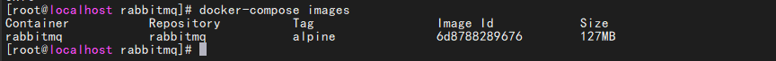

# docker-compose
compose项目是docker官方的开源项目,负责实现对Docker容器的快速编排
+ 定位
定位是定义与运行多个docker容器的应用,同时可以对多个容器进行编排
+ Compose 中有两个重要的概念：
<font color='red'>服务 (service)</font>：一个应用的容器，实际上可以包括若干运行相同镜像的容器实例。
<font color='red'>项目 (project)</font>：由一组关联的应用容器组成的一个完整业务单元，在 docker-compose.yml 文件中定义。
## 一、安装、卸载
### 1、官网地址
官方各个版本地址 [docker-compose](https://github.com/docker/compose/releases)
>https://github.com/docker/compose/releases
+ 下载并修改权限
 ```shell
#wget https://github.com/docker/compose/releases/download/v2.11.1/docker-compose-darwin-x86_64
#下载该文件到 /usr/local/bin目录下(在任意目录下执行该命令)
sudo curl -L https://github.com/docker/compose/releases/download/1.25.5/docker-compose-`uname -s`-`uname -m` > /usr/local/bin/docker-compose
#修改权限
$ sudo chmod +x /usr/local/bin/docker-compose 
```
### 2、下载的docker-compose并修改名称为docker-compose
```shell
#进入自己创建的目录下【用于备份原始文件】
mkdir -vp /usr/local/software/docker-compose/
cd /usr/local/software/docker-compose/
wget https://github.com/docker/compose/releases/download/v2.11.1/docker-compose-darwin-x86_64
```
#### <font color='red'>百度网盘下载</font> 
> 由于github网络不稳定，下载下载比较困难，本人已经下载了2个版本的放到百度网盘可供下载
```shell
https://pan.baidu.com/s/1N1inKdfl-InE7_EQNm43Tg 提取码: docm
```

### 3、安装
```shell
#1、修改脚本文件名称为docker-compose
cp docker-compose-linux-x86_64 docker-compose
#2、将文件复制到/usr/bin下[该目录下自动配置了环境变量，移动到该目录下即可完成环境变量配置]
\cp -R docker-compose /usr/bin/
#3、赋予权限
chmod 777 /usr/bin/docker-compose
```
### 4、检测是否compose安装成功
```shell
docker-compose -v
```

## 2、卸载
```shell
sudo rm /usr/bin/docker-compose
```
# 二、使用
## 1、简单的基本使用
### 1、编写docker-compose.yml

+  任意目录下编写docker-compose.yml文件

version: 4.0以下都正确【第一行必须有指定该配置】
eg:
```shell
version: "3.0"
services:
  tomcat8080: #服务名称
    container_name: tomcat01 #相当于run  --name
    image: tomcat:8.0.15-jre7 #镜像版本(没有的话会自动拉取) 相当于run image
    ports: #完成host与容器的端口映射 相当于run p
      - "8080:8080" #(防止出错，官方建议用""包起来)
    volumes: #完成宿主机与容器中目录数据卷的映射(可以挂在多个) 相当于run -v
      #- /usr/local/software/tomcat/webapps:/usr/local/tomcat/webapps #使用自定义路径映射
      - tomcatWebapps:/usr/local/tomcat/webapps
    networks: #代表当前服务使用那个网络桥 相当于run network
      - hello
  tomcat8082:
    container_name: tomcat02
    image: tomcat:8.0.15-jre7 #镜像版本
    ports:
      - "8082:8080"
    networks: #代表当前服务使用那个网络桥
      - hello
#声明数据卷
volumes: #声明上面服务所使用的自动的卷名
  tomcatWebapps: #声明指定的卷名 compose会自动创建改卷明，但是会在之前加入项目名
    external: #使用自定义的卷名
      false #true确定使用自定义卷名 注意，一旦使用外部自定义卷名，启动服务之前必须手动创建
networks: #定义服务使用到的网桥
  hello: #定义上面的服务用到的网桥名称， 默认创建的就是bridge
    
```
### 2、 运行
<font color='red'>启动这个项目所有的服务，必须保证运行改名林的目录下存在docker-compose.yml</font>
```shell
#启动
docker-compose up -d
#停止
docker-compose stop
```

## 2、docker-compose模板文件
>1、模板文件是使用 Compose 的核心，这里面大部分指令跟 docker run 相关参数的含义都是类似的。
>2、默认的模板文件名称为docker-compose.yml格式为<font color='red'>yml</font>格式
>3、每个指令都必须通过image指令指定镜像或者build(需要Dockerfile)指令来自动构建生成镜像
### 1、build
+ <font color='red'>指定 Dockerfile 所在文件夹的路径（可以是绝对路径，或者相对 docker-compose.yml 文件的路径）。 Compose 将会利用它自动构建这个镜像，然后使用这个镜像。</font>
```shell
version: "3.0"
services:
  demo: #项目id
    build: #启动服务时，先将build中指定的dockerfile打包成镜像，再运行该镜像
      context: jenkins-demo #指定上下文目录dockerfile所在目录[相对、绝对路径都可以]
      dockerfile:  Dockerfile #文件名称
      args: #指定构建镜像时候的变量
        buildno: 1 
    container_name: jenkins-demo
    ports:
      - "8881:8881"
```
### 2、command
+ <font color='red'>覆盖容器启动后的默认执行命令</font>
```shell
version: "3.0"
services:
  redis:
    container_name: redis
    image: redis:7.0.5-alpine
    ports:
      - "6379:6379"
    command: "redis-server --appendonly yes" #run镜像之后，appendonly覆盖容器内的默认命令
```
### 3、container_name
+ <font color='green'>指定容器名称。默认将会使用 <font color='red'>项目名称_服务名称_序号</font> 这样的格式。</font>
```shell
version: "3.0"
services:
  redis:
    #container_name: redis
    container_name: docker-web-container
```
<font color='red'>注意: 指定容器名称后，该服务将无法进行扩展（scale），因为 Docker 不允许多个容器具有相同的名称。</font>
### 4、depends_on
+ <font color='red'>解决容器的依赖、启动先后的问题。以下例子中会先启动 redis db 再启动 web</font>
```shell
version: '3'
services:
  web:
    image:  ruoyi
    depends_on:
      - db
      - redis
  redis:
    image: redis
  db:
    image: postgres
```
<font color='red'>注意：web 服务不会等待 redis db 「完全启动」之后才启动。</font>
### 5、env_file
+ <font color='red'>从文件中获取环境变量，可以为单独的文件路径或列表</font>
```shell
version: "3.0"
services:
  mysql:
    container_name: mysql8
    image: mysql:8.0.29
    ports:
      - "3306:3306"
    #- MYSQL_ROOT_PASSWORD=root #指定值
    env_file: #替换environment的配置[直接给该文件、不会泄露密码等信息]
      - mysql.env #此处为相对路径，也可以写绝对路径[里面的格式key=value，并且支持#的注释]
      - ./common.env
      - ./apps/web.env
      - /opt/secrets.env
```
+ mysql.env文件[支持#开头的注释行]
```shell
#root的密码
MYSQL_ROOT_PASSWORD=root
```
### 6、environment
+ <font color='red'>设置环境变量。你可以使用数组或字典两种格式。</font>
```shell
version: "3.0"
services:
  mysql:
    container_name: mysql8
    image: mysql:8.0.29
    ports:
      - "3306:3306"
    environment: #环境变量[此处写得太过敏感，给文件容易被别人知道]
      - MYSQL_ROOT_PASSWORD=root #指定值
      - MYSQL_ROOT_PASSWORD: password
      - TZ: Asia/Shanghai
```
如果变量名称或者值中用到 true|false，yes|no 等表达 布尔 含义的词汇，最好放到引号里，避免 YAML 自动解析某些内容为对应的布尔语义。这些特定词汇，包括
```shell
y|Y|yes|Yes|YES|n|N|no|No|NO|true|True|TRUE|false|False|FALSE|on|On|ON|off|Off|OFF
```
### 7、healthcheck
+ <font color='red'>通过命令检查容器是否健康运行。</font>
```shell
version: "3.0"
services:
  tomcat8082:
    container_name: tomcat02
    image: tomcat:8.0.15-jre7 #镜像版本
    ports:
      - "8082:8080"
    healthcheck:
      test: [ "CMD", "curl", "-f", "http://localhost" ]
      interval: 1m30s
      timeout: 10s
      retries: 3
```
### 8、image
+ <font color='red'>指定为镜像名称或镜像 ID。如果镜像在本地不存在，Compose 将会尝试拉取这个镜像。</font>
```shell
version: "3.0"
services:
  tomcat8082:
    container_name: tomcat02
    image: ubuntu 
    #image: orchardup/postgresql
    #image: a4bc65fd
```
### 9、networks
+ <font color='red'>配置容器连接的网络。</font>
```shell
version: "3.0"
services:
  tomcat8082:
    container_name: tomcat02
    image: tomcat:8.0.15-jre7 #镜像版本
    ports:
      - "8082:8080"
    networks: #代表当前服务使用那个网络桥
      - hello
networks: #定义服务使用到的网桥
  hello: #定义上面的服务用到的网桥名称， 默认创建的就是bridge
    external:
      true #使用外部指定网桥，注意，网桥必须存在[docker network create -d bridge hello]
```
### 10、ports
+ <font color='red'>暴露端口信息。使用宿主端口：容器端口 (HOST:CONTAINER) 格式，或者仅仅指定容器的端口（宿主将会随机选择端口）都可以。</font>
```shell
version: "3.0"
services:
  tomcat8082:
    container_name: tomcat02
    image: tomcat:8.0.15-jre7 #镜像版本
    ports:
      - "8082:8080"
```
<font color='red'>注意：当使用 HOST:CONTAINER 格式来映射端口时，如果你使用的容器端口小于 60 并且没放到引号里，可能会得到错误结果，因为 YAML 会自动解析 xx:yy 这种数字格式为 60 进制。为避免出现这种问题，建议数字串都采用引号包括起来的字符串格式。</font>
### 11、sysctls
+ <font color='red'>配置容器内核参数</font>
```shell
version: "3.0"
services:
  tomcat8080: #服务id
    container_name: tomcat01 #相当于run  --name
    image: tomcat:8.0.15-jre7 #镜像版本(没有的话会自动拉取) 相当于run image
    ports: #完成host与容器的端口映射 相当于run p
      - "8080:8080" #(防止出错，官方建议用""包起来)
    volumes: #完成宿主机与容器中目录数据卷的映射(可以挂在多个) 相当于run -v
      #- /usr/local/software/tomcat/webapps:/usr/local/tomcat/webapps #使用自定义路径映射
      - tomcatWebapps:/usr/local/tomcat/webapps
    networks: #代表当前服务使用那个网络桥 相当于run network
      - hello
    sysctls:
      net.core.somaxconn: 1024
      net.ipv4.tcp_syncookies: 0
    #sysctls:
      #- net.core.somaxconn=1024
      #- net.ipv4.tcp_syncookies=0
```
### 12、ulimits
+ <font color='red'>指定容器的 ulimits 限制值。</font>
> 例如，指定最大进程数为 65535，指定文件句柄数为 20000（软限制，应用可以随时修改，不能超过硬限制） 和 40000（系统硬限制，只能 root 用户提高）。
```shell
version: "3.0"
services:
  tomcat8080: #服务id
    container_name: tomcat01 #相当于run  --name
    image: tomcat:8.0.15-jre7 #镜像版本(没有的话会自动拉取) 相当于run image
    ports: #完成host与容器的端口映射 相当于run p
      - "8080:8080" #(防止出错，官方建议用""包起来)
    ulimits:
      nproc: 65535
      nofile:
        soft: 20000
        hard: 40000
```
### 13、volumes
+ <font color='red'>数据卷所挂载路径设置。可以设置为宿主机路径(HOST:CONTAINER)或者数据卷名称(VOLUME:CONTAINER)，并且可以设置访问模式 （HOST:CONTAINER:ro）。</font>
```shell
version: "3.0"
services:
  tomcat8080: #服务id
    container_name: tomcat01 #相当于run  --name
    image: tomcat:8.0.15-jre7 #镜像版本(没有的话会自动拉取) 相当于run image
    ports: #完成host与容器的端口映射 相当于run p
      - "8080:8080" #(防止出错，官方建议用""包起来)
    volumes: #完成宿主机与容器中目录数据卷的映射(可以挂在多个) 相当于run -v
      #- /usr/local/software/tomcat/webapps:/usr/local/tomcat/webapps #使用自定义路径映射
      - tomcatWebapps:/usr/local/tomcat/webapps
#声明数据卷
volumes: #声明上面服务所使用的自动的卷名
  tomcatWebapps: #声明指定的卷名 compose会自动创建改卷明，但是会在之前加入项目名
    external: #使用自定义的卷名
      false #true确定使用自定义卷名 注意，一旦使用外部自定义卷名，启动服务之前必须手动创建      
```
## 3、docker-compose的命令

### 1、up(启动)

+ 格式为 docker-compose up [options] [SERVICE...]
>该命令十分强大，它将尝试自动完成包括构建镜像，（重新）创建服务，启动服务，并关联服务相关容器的一系列操作。
链接的服务都将会被自动启动，除非已经处于运行状态。
可以说，大部分时候都可以直接通过该命令来启动一个项目。
默认情况，docker-compose up 启动的容器都在前台，控制台将会同时打印所有容器的输出信息，可以很方便进行调试。
当通过 Ctrl-C 停止命令时，所有容器将会停止。
如果使用 docker-compose up -d，将会在后台启动并运行所有的容器。一般推荐生产环境下使用该选项。
默认情况，如果服务容器已经存在，docker-compose up 将会尝试停止容器，然后重新创建（保持使用 volumes-from 挂载的卷），以保证新启动的服务匹配 docker-compose.yml 文件的最新内容
```shell
docker-compose up -d # -d是后台启动
```

### 2、down(停止)
<font color='red'>此命令将会停止 up 命令所启动的容器，并移除网络</font>
```shell
#必须执行该命令的相同路径下有docker-compose.yml文件
docker-compose down
```

### 3、exec(进入容器)
<font color='red'>进入指定的容器。</font>
```shell
docker-compose exec rabbitmq bash
```

### 4、ps(列出项目中目前的所有容器。)
<font color='red'>格式为 docker-compose ps [options] [SERVICE...]。</font>
列出项目中目前的所有容器。
选项：-q 只打印容器的 ID 信息。
```shell
docker-compose ps
```

### 5、restart(重启项目中的服务)
<font color='red'>格式为 docker-compose restart [options] [SERVICE...]。</font>
选项：
-t, --timeout TIMEOUT 指定重启前停止容器的超时（默认为 10 秒）。
```shell
```

### 6、rm(删除所有（停止状态的）服务容器)
<font color='red'>格式为 docker-compose rm [options] [SERVICE...]。</font>
推荐先执行 docker-compose stop 命令来停止容器。
选项：
<font color='red'>-f</font>: --force 强制直接删除，包括非停止状态的容器。一般尽量不要使用该选项。
<font color='red'>-v</font>: 删除容器所挂载的数据卷。
```shell
docker-compose rm -f
```

### 7、start(启动已经存在的服务容器)
<font color='red'>格式为 docker-compose start [SERVICE...]。</font>
```shell
docker-compose start 
```

### 8、stop(停止已经处于运行状态的容器，但不删除它)
<font color='red'>格式为 docker-compose stop [options] [SERVICE...]。</font>
选项：
<font color='red'>-t</font>: --timeout TIMEOUT 停止容器时候的超时（默认为 10 秒）。
```shell
docker-compose stop -t1000
```

### 9、top(查看各个服务容器内运行的进程)
```shell
docker-compose top
```

### 10、images(所有镜像)
```shell
docker-compose images
```

## 4、docker-compose的build指令
> 用来指定Dockerfile所在的目录,先根据build中的dockerfile构建镜像,然后运行该镜像对应的容器
### 1、docker-compose.yml文件详情
```shell
version: "3.0"
services:
  demo: #项目id
    build: #启动服务时，先将build中指定的dockerfile打包成镜像，再运行该镜像
      context: jenkins-demo #指定上下文目录dockerfile所在目录[相对、绝对路径都可以]
      dockerfile: Dockerfile #文件名称[在指定的context的目录下指定那个Dockerfile文件名称]
    container_name: jenkins-demo
    ports:
      - "8881:8881"
```
### 2、Dockerfile文件详情
>该文件所对应的项目[jenkins-demo](https://gitee.com/xwb1056481167/jenkins-demo.git)
> 下载下来直接打包即可然后上传到服务器做测试
```shell
FROM java:8
MAINTAINER xwb
RUN ln -sf /usr/share/zoneinfo/Asia/Shanghai /etc/locatime
#暴露的端口
EXPOSE 8881
#用来指定当前工作目录（或者称为当前目录） 当使用相对目录的情况下，采用上一个WORKDIR指定的目录作为基准
#相当与cd 命令，但不同的是指定了WORKDIR后，容器启动时执行的命令会在该目录下执行
WORKDIR /usr/local/software/dockerImg/jenkins-demo
#RUN ls -a
#将targer目录下的jar包复制到docker容器/目录下面
ADD jenkins-demo-1.1.0.jar /jenkins-demo.jar

CMD ["java","-Djava.security.egd=file:/dev/./urandom","-jar","/jenkins-demo.jar","&"]
```
### 3、项目情况

### 4、部署访问效果

