# docker安装elasticsearch、IK、kibana
## 一、安装elasticsearch
### 1、创建本地挂在目录
```shell
sudo mkdir -p /usr/local/docker/elasticsearch/config
# 指定该挂载目录用于持久化es保存的数据
sudo mkdir -p /usr/local/docker/elasticsearch/data
sudo mkdir -p /usr/local/docker/elasticsearch/plugins
sudo mkdir -p /usr/local/docker/elasticsearch/logs
#赋予权限
chmod -R 777 /usr/local/docker/elasticsearch
```
[添加ik分词器](#ik)
### 2、设置VM_MAX_MAP大小
如果启动出现以下错误则需要执行以下操作
<font color='red'>出现max virtual memory areas vm.max_map_count [65530] is too low,increase to at least [262144]</font>
```shell
# 查看配置大小
cat /proc/sys/vm/max_map_count
# 如果是65535则执行该命令
sysctl -w vm.max_map_count=262144
#1、 在centos虚拟机中，修改配置sysctl.conf
#vim /etc/sysctl.conf
#2、加入如下配置
#vm.max_map_count=262144
#3、启用配置
sysctl -p
```
### 3、创建elasticsearch.yml文件
<font color='red'>原始的文件内容</font>(用方式一启动进入到里面查看的elasticsearch.yml)
```shell
cluster.name: "docker-cluster"
network.host: 0.0.0.0

#----------------------- BEGIN SECURITY AUTO CONFIGURATION -----------------------
#
# The following settings, TLS certificates, and keys have been automatically
# generated to configure Elasticsearch security features on 10-11-2022 05:50:27
#
# --------------------------------------------------------------------------------
# Enable security features
xpack.security.enabled: true
xpack.security.enrollment.enabled: true
# Enable encryption for HTTP API client connections, such as Kibana, Logstash, and Agents
xpack.security.http.ssl:
  enabled: true
  keystore.path: certs/http.p12
# Enable encryption and mutual authentication between cluster nodes
xpack.security.transport.ssl:
  enabled: true
  verification_mode: certificate
  keystore.path: certs/transport.p12
  truststore.path: certs/transport.p12
#----------------------- END SECURITY AUTO CONFIGURATION -------------------------
```
+ 复制以下内容到elasticsearch.yml
```shell
#编辑里面的内容
vim /usr/local/docker/elasticsearch/config/elasticsearch.yml
#方式一
#echo "http.host: 0.0.0.0" >> /usr/local/docker/elasticsearch/config/elasticsearch.yml
cluster.name: "docker-cluster"
network.host: 0.0.0.0
xpack.license.self_generated.type: basic
#关闭安全校验
xpack.security.enabled: false
xpack.security.enrollment.enabled: true
xpack.security.http.ssl.enabled: false
#xpack.security.http.ssl.keystore.path: certs/http.p12
#xpack.security.transport.ssl.enabled: false
#xpack.security.transport.ssl.verification_mode: certificate
#xpack.security.transport.ssl.keystore.path: certs/transport.p12
#xpack.security.transport.ssl.truststore.path: certs/transport.p12
#----------------------- END SECURITY AUTO CONFIGURATION -------------------------
```
### 4、下载es
```shell
docker pull elasticsearch:8.4.3
```
### 5、启动
```shell
# 启动方式1(普通启动，用于启动后复制es里面的配置文件插件等文件用于挂载数据卷)
docker run -d --name es -p 9200:9200 -p 9300:9300 -e ES_JAVA_OPTS="-Xms256m -Xmx512m" -e "discovery.type=single-node" elasticsearch:8.4.3
# 启动方式2(指定数据卷目录和配置文件等信息)
sudo docker run --name es -p 9200:9200  -p 9300:9300 \
-e "discovery.type=single-node" \
-e ES_JAVA_OPTS="-Xms256m -Xmx512m" \
-v /usr/local/docker/elasticsearch/config/elasticsearch.yml:/usr/share/elasticsearch/config/elasticsearch.yml \
-v /usr/local/docker/elasticsearch/data:/usr/share/elasticsearch/data \
-v /usr/local/docker/elasticsearch/plugins:/usr/share/elasticsearch/plugins \
-v /usr/local/docker/elasticsearch/logs:/usr/share/elasticsearch/logs \
-d elasticsearch:8.4.3
```
+ 地址栏访问

```shell
http://192.168.11.143:9200
```

+ 展示效果图

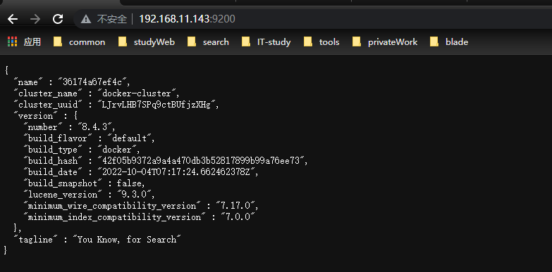
### 6、es启动设置密码模式
> 开启密码模式将elasticsearch.yml的<font color='red'>xpack.security.enabled: true</font>
> 当开启次配置的时候，地址栏访问http://ip:9200的时候会弹出密码校验框。次吃需要执行一下操作

```shell
docker  exec -it containerId bash
cd /usr/share/elasticsearch/bin
./elasticsearch-setup-passwords interactvie
```
然后进入容器内部，设置密码
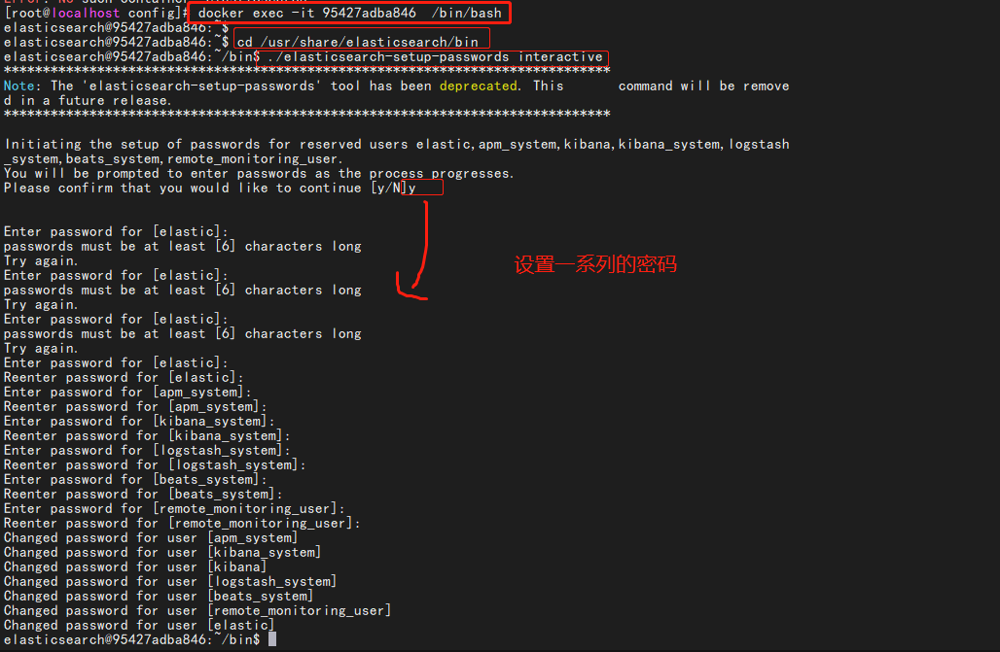
## 二、安装IK分词器
### 1、下载ik分词器 
  
```shell
# 官网Ik分词器地址
https://github.com/medcl/elasticsearch-analysis-ik/releases
#下载对应版本的ik分词器 
wget https://github.com/medcl/elasticsearch-analysis-ik/releases/download/v8.4.3/elasticsearch-analysis-ik-8.4.3.zip  
```
### <a id="ik">2、放到挂载的容器数据卷中</a>
```shell
# 进入到es的插件容器卷目录下
cd /usr/local/docker/elasticsearch/plugins
# 创建文件夹
mkdir -vp ik
cd ik
# 下载ik插件
wget https://github.com/medcl/elasticsearch-analysis-ik/releases/download/v8.4.3/elasticsearch-analysis-ik-8.4.3.zip
# 解压缩ik分词器
unzip elasticsearch-analysis-ik-8.4.3.zip
# mv elasticsearch-analysis-ik-8.4.3.zip ../
#删除原始包
rm -rf elasticsearch-analysis-ik-8.4.3.zip
```
### 3、添加自定义分词器
```shell
#进入到分词器插件所在的目录下
cd /usr/local/docker/elasticsearch/plugins/ik/config
```
### 4、创建分词【<font color='red'>一定要使用utf-8编码格式编写</font>】
```shell
vim food.dic #添加分词
vim main.dic #添加分词
```
+ 编辑分词文件
```shell
vim IKAnalyzer.cfg.xml
#编辑以下内容
<entry key="food_dic">food.dic</entry>
<entry key="main_dic">main.dic</entry>
```
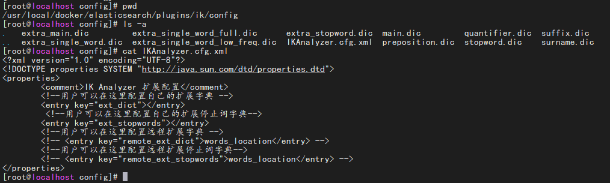

+ 修改后的配置

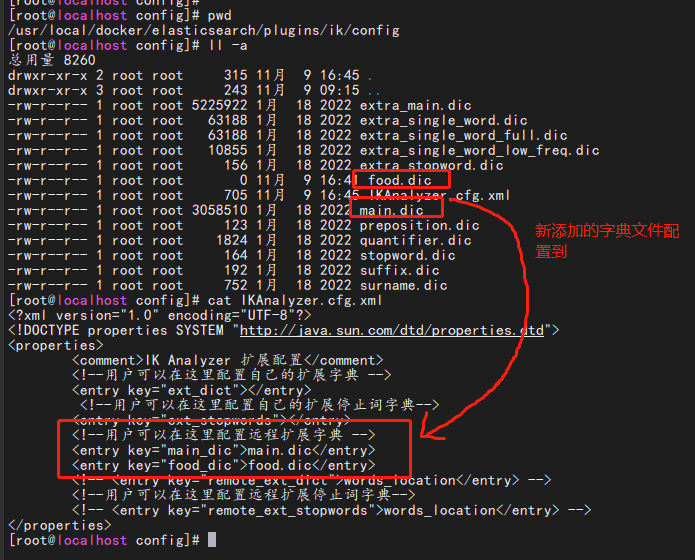
+ 配置完成之后重启es
```shell
docker restart es
```
+ 搜索效果图
 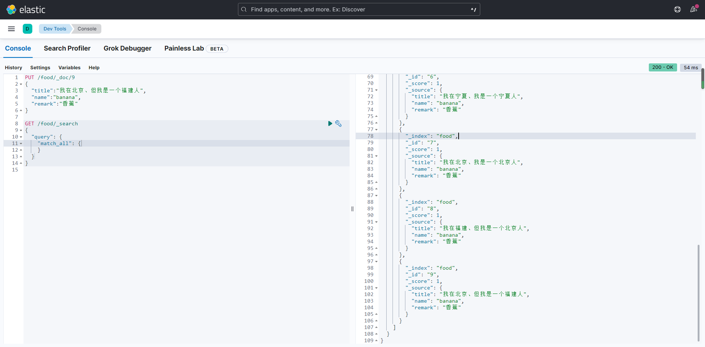
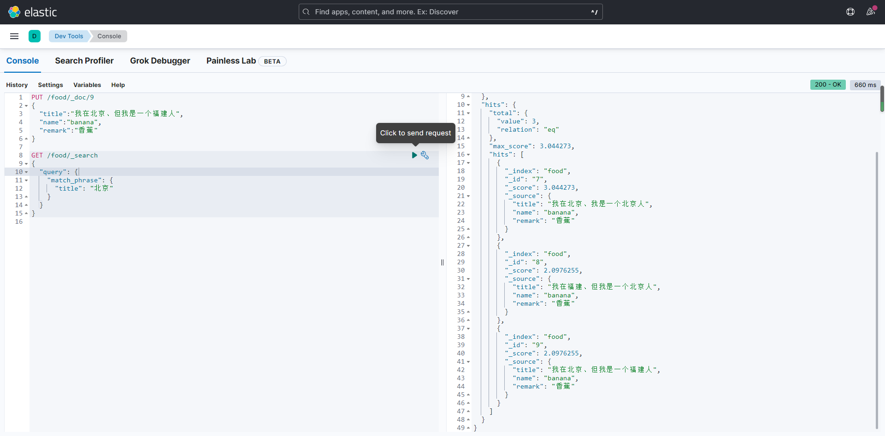

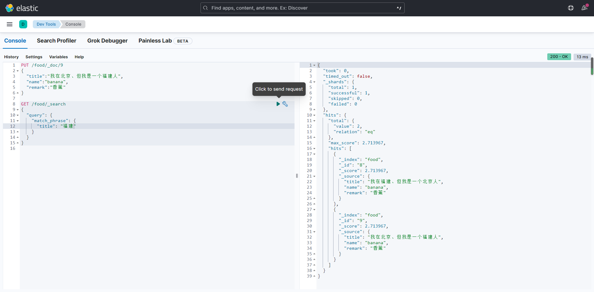
## 三、安装kibana
+ 拉取镜像
```shell
#下载对应版本的kibana
docker pull kibana:8.4.3
```
### 1、启动脚本命令(web端免密码)
```shell
# 启动命令
docker run -d --name kibana \
-p 5601:5601 \
-e ELASTICSEARCH_URL=http://192.168.11.143:9200 \
kibana:8.4.3
```
<font color='red'> ELASTICSEARCH_UR 指定他要连接的es的路径</font>
### 2、设置密码方式启动(web端需要密码)
#### 1、创建配置kibana.yml文件
```shell
mkdir -vp /usr/local/docker/kibana/config
cd /usr/local/docker/kibana/config
vim kibana.yml
```
#### 2、启动kibana容器
+ 查看es的内部服务ip[会返回es的内部服务器地址]
<font color='red'>docker inspect -f '{{range .NetworkSettings.Networks}}{{.IPAddress}}{{end}}' es的容器id或者是name</font>
```shell
server.host: "0.0.0.0"
server.shutdownTimeout: "5s"
elasticsearch.hosts: ["http://172.17.0.2:9200"]
monitoring.ui.container.elasticsearch.enabled: true
elasticsearch.username: "kibana_system"
elasticsearch.password: "123456"
```
+ 启动命令
```shell
docker run --name kibana \
-v /usr/local/docker/kibana/config/kibana.yml:/usr/share/kibana/config/kibana.yml \
-p 5601:5601 \
-d kibana:8.4.3
```
## 启动效果图
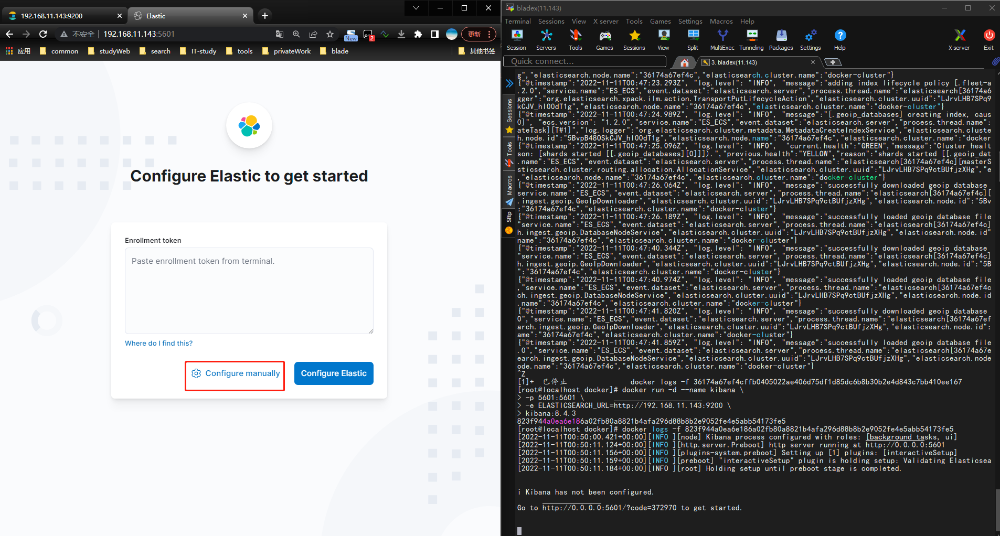
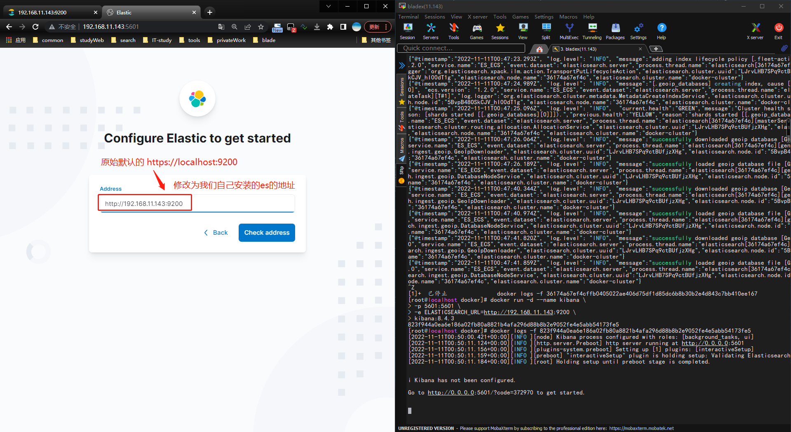
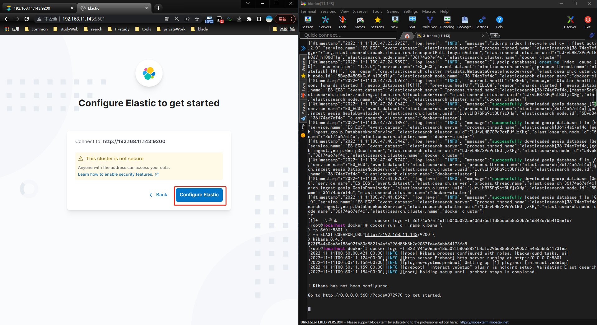
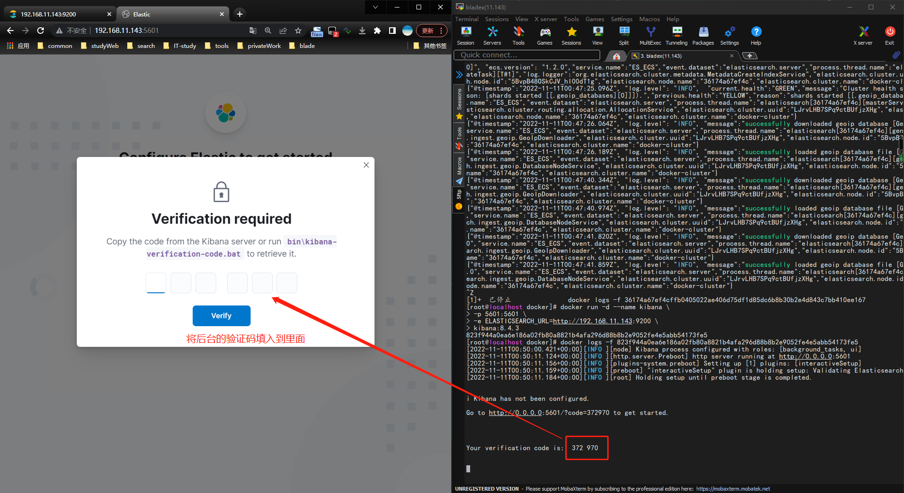
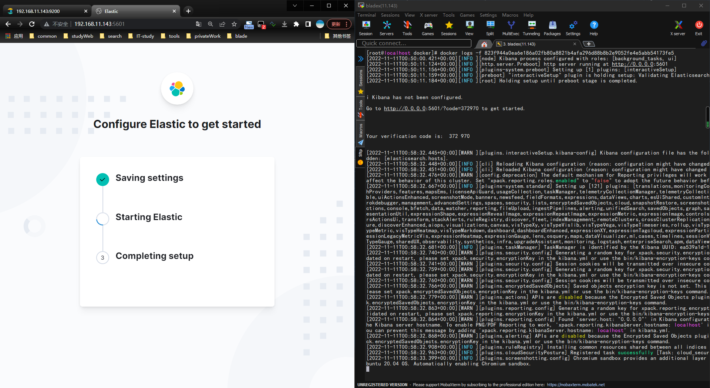
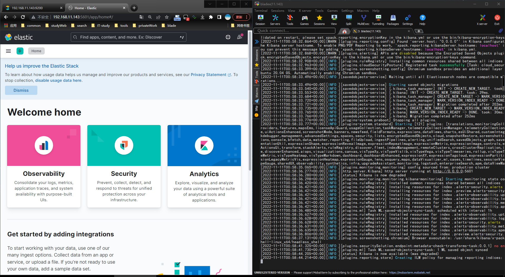
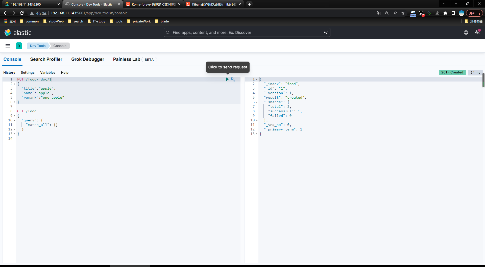
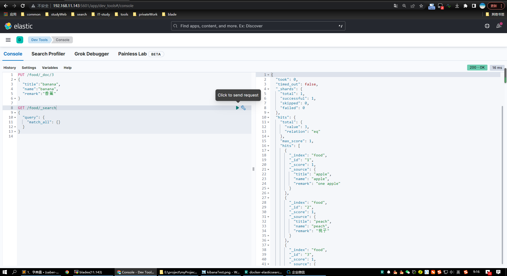

# 四、logstash的搭建
## 1、下载
官方地址 [logstash](https://github.com/elastic/logstash/releases)
https://github.com/elastic/logstash/releases
+ 创建映射文件
```shell
mkdir -vp /usr/local/docker/logstash/config
mkdir -vp /usr/local/docker/logstash/log
mkdir -vp /usr/local/docker/logstash/config
#赋予权限
chmod 777 /usr/local/docker/logstash
```
### 1、编辑信息<font color='red'>logstash.yml</font>
> vim  /usr/local/docker/logstash/config/logstash.yml
```shell
http.host: "0.0.0.0"
xpack.monitoring.elasticsearch.hosts: [ "http://192.168.11.143:9200" ]
path.config: /usr/local/docker/logstash/config/*.conf
path.logs: /usr/local/docker/logstash/log
```
### 2、编辑日志配置信息<font color='red'>syslog.conf</font>
> vim /usr/local/docker/logstash/config/syslog.conf
 ```shell
input {
     file {
        #标签
        type => "systemlog-localhost"
        #采集点
        path => "/var/log/messages"
        #开始收集点
        start_position => "beginning"
        #扫描间隔时间，默认是1s，建议5s
        stat_interval => "5"
     }
}
output {
     elasticsearch {
        hosts => ["192.168.11.143:9200"]
        index => "logstash-system-localhost-%{+YYYY.MM.dd}"
     }
}
```
### 3、拉取镜像
```shell
docker pull logstash:8.4.3
```
### 4、启动容器
```shell
docker run -d \
     --name=logstash \
     --restart=always \
     -p 5044:5044 \
     -v /usr/local/docker/logstash:/usr/share/logstash \
     -v /var/log/messages:/var/log/messages \
     logstash:8.4.3
```
