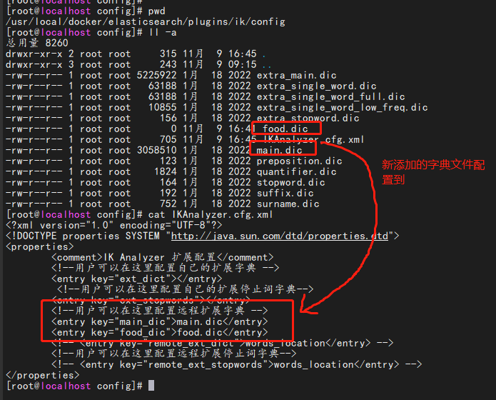
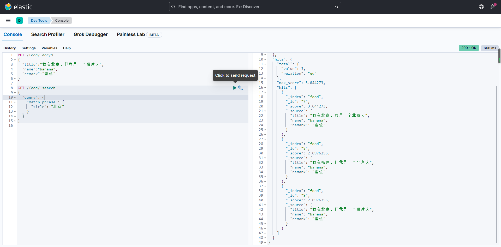
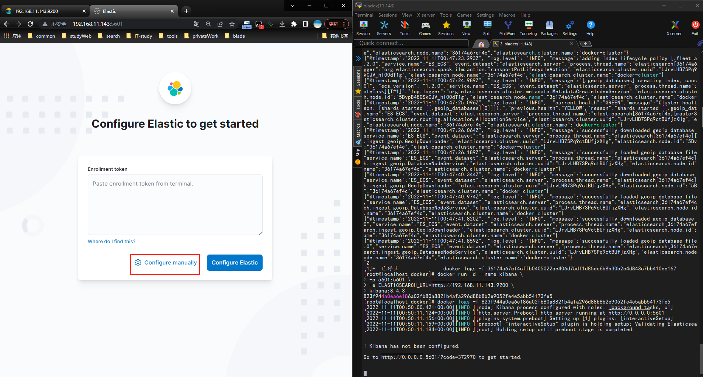
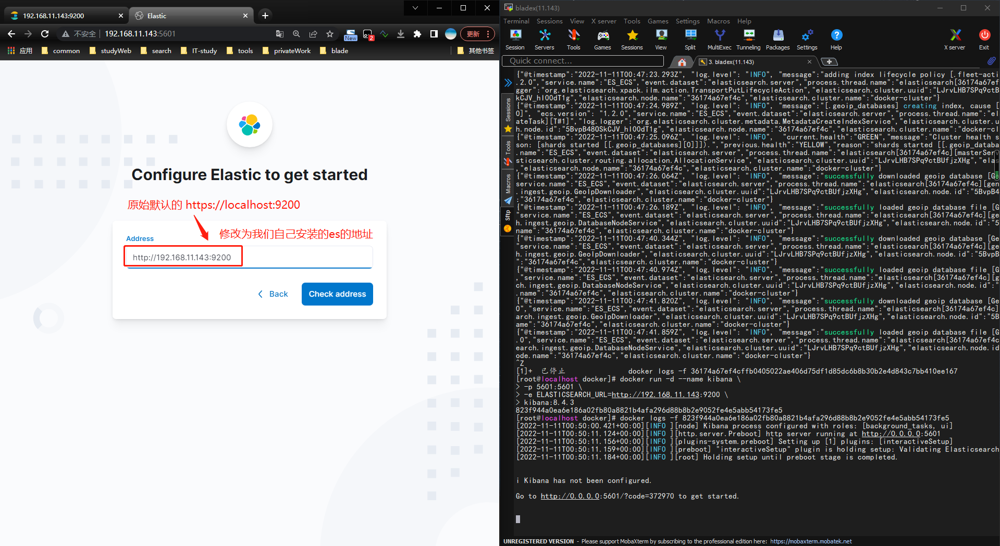
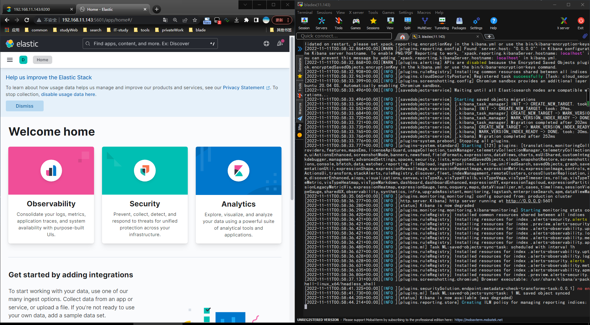
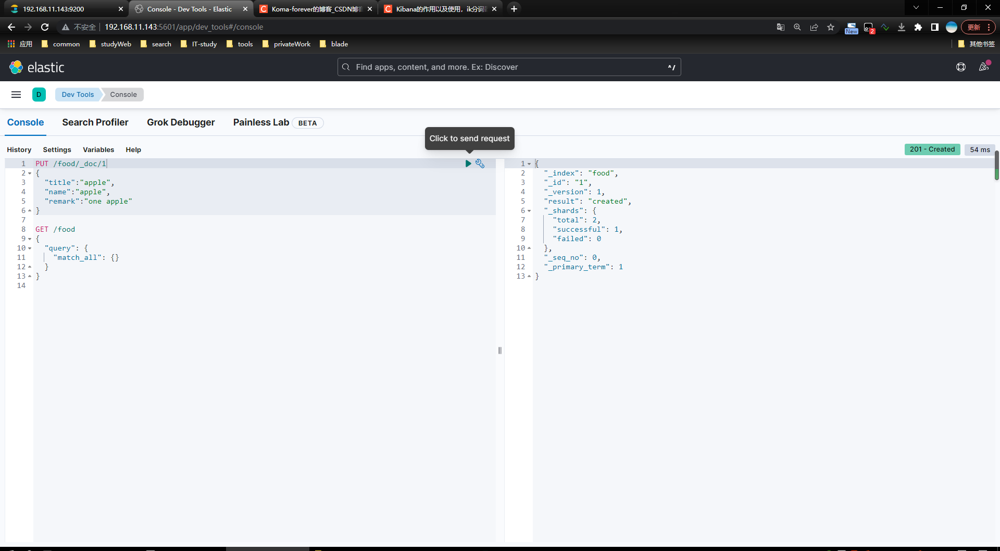

# docker安装elasticsearch、IK、kibana
## 一、安装elasticsearch
### 1、创建本地挂在目录
```shell
sudo mkdir -p /usr/local/docker/elasticsearch/config
# 指定该挂载目录用于持久化es保存的数据
sudo mkdir -p /usr/local/docker/elasticsearch/data
sudo mkdir -p /usr/local/docker/elasticsearch/plugins
sudo mkdir -p /usr/local/docker/elasticsearch/logs
chmod -R 777 /usr/local/docker/elasticsearch
```
[添加ik分词器](#ik)
### 2、设置VM_MAX_MAP大小
如果启动出现以下错误则需要执行以下操作
<font color='red'>出现max virtual memory areas vm.max_map_count [65530] is too low,increase to at least [262144]</font>
```shell
# 查看配置大小
cat /proc/sys/vm/max_map_count
# 如果是65535则执行该命令
sysctl -w vm.max_map_count=262144
#1、 在centos虚拟机中，修改配置sysctl.conf
#vim /etc/sysctl.conf
#2、加入如下配置
#vm.max_map_count=262144
#3、启用配置
sysctl -p
```
### 3、创建elasticsearch.yml文件
<font color='red'>原始的文件内容</font>(用方式一启动进入到里面查看的elasticsearch.yml)
```shell
cluster.name: "docker-cluster"
network.host: 0.0.0.0

#----------------------- BEGIN SECURITY AUTO CONFIGURATION -----------------------
#
# The following settings, TLS certificates, and keys have been automatically
# generated to configure Elasticsearch security features on 10-11-2022 05:50:27
#
# --------------------------------------------------------------------------------
# Enable security features
xpack.security.enabled: true
xpack.security.enrollment.enabled: true
# Enable encryption for HTTP API client connections, such as Kibana, Logstash, and Agents
xpack.security.http.ssl:
  enabled: true
  keystore.path: certs/http.p12
# Enable encryption and mutual authentication between cluster nodes
xpack.security.transport.ssl:
  enabled: true
  verification_mode: certificate
  keystore.path: certs/transport.p12
  truststore.path: certs/transport.p12
#----------------------- END SECURITY AUTO CONFIGURATION -------------------------
```
+ 复制以下内容到elasticsearch.yml
```shell
#编辑里面的内容
vim /usr/local/docker/elasticsearch/config/elasticsearch.yml
#方式一
#echo "http.host: 0.0.0.0" >> /usr/local/docker/elasticsearch/config/elasticsearch.yml
cluster.name: "docker-cluster"
network.host: 0.0.0.0
xpack.license.self_generated.type: basic
#关闭安全校验
xpack.security.enabled: false
xpack.security.enrollment.enabled: true
xpack.security.http.ssl.enabled: false
#xpack.security.http.ssl.keystore.path: certs/http.p12
#xpack.security.transport.ssl.enabled: false
#xpack.security.transport.ssl.verification_mode: certificate
#xpack.security.transport.ssl.keystore.path: certs/transport.p12
#xpack.security.transport.ssl.truststore.path: certs/transport.p12
#----------------------- END SECURITY AUTO CONFIGURATION -------------------------
```
#### 启动报错<font color='red'>出现not all primary shards of </font>
> vim /usr/local/docker/elasticsearch/config/elasticsearch.yml 
```shell
ingest.geoip.downloader.enabled: false
```
### 4、下载es
```shell
#1、下载es
docker pull elasticsearch:8.4.3
```
### 5、启动
```shell
# 启动方式1
docker run -d --name es -p 9200:9200 -p 9300:9300 -e ES_JAVA_OPTS="-Xms256m -Xmx512m" -e "discovery.type=single-node" elasticsearch:8.4.3
# 启动方式2(指定数据卷目录和配置文件等信息)
sudo docker run --name es -p 9200:9200  -p 9300:9300 \
-e "discovery.type=single-node" \
-e ES_JAVA_OPTS="-Xms256m -Xmx512m" \
-v /usr/local/docker/elasticsearch/config/elasticsearch.yml:/usr/share/elasticsearch/config/elasticsearch.yml \
-v /usr/local/docker/elasticsearch/data:/usr/share/elasticsearch/data \
-v /usr/local/docker/elasticsearch/plugins:/usr/share/elasticsearch/plugins \
-v /usr/local/docker/elasticsearch/logs:/usr/share/elasticsearch/logs \
-d elasticsearch:8.4.3
```
+ 地址栏访问

```shell
http://192.168.11.143:9200
```

+ 展示效果图


### 6、es启动设置密码模式
> 开启密码模式将elasticsearch.yml的<font color='red'>xpack.security.enabled: true</font>
> 当开启次配置的时候，地址栏访问http://ip:9200的时候会弹出密码校验框。次吃需要执行一下操作

```shell
docker  exec -it containerId bash
cd /usr/share/elasticsearch/bin
./elasticsearch-setup-passwords interactvie
```
然后进入容器内部，设置密码

## 二、安装IK分词器
### 1、下载ik分词器 
  
```shell
# 官网Ik分词器地址
https://github.com/medcl/elasticsearch-analysis-ik/releases
#下载对应版本的ik分词器 
wget https://github.com/medcl/elasticsearch-analysis-ik/releases/download/v8.4.3/elasticsearch-analysis-ik-8.4.3.zip  
```
### <a id="ik">2、放到挂载的容器数据卷中</a>
```shell
# 进入到es的插件容器卷目录下
cd /usr/local/docker/elasticsearch/plugins
# 创建文件夹
mkdir -vp ik
cd ik
# 下载ik插件
wget https://github.com/medcl/elasticsearch-analysis-ik/releases/download/v8.4.3/elasticsearch-analysis-ik-8.4.3.zip
# 解压缩ik分词器
unzip elasticsearch-analysis-ik-8.4.3.zip
# mv elasticsearch-analysis-ik-8.4.3.zip ../
#删除原始包
rm -rf elasticsearch-analysis-ik-8.4.3.zip
```
### 3、添加自定义分词器
```shell
#进入到分词器插件所在的目录下
cd /usr/local/docker/elasticsearch/plugins/ik/config
```
### 4、创建分词【<font color='red'>一定要使用utf-8编码格式编写</font>】
```shell
vim food.dic #添加分词
vim main.dic #添加分词
```
+ 编辑分词文件
```shell
vim IKAnalyzer.cfg.xml
#编辑以下内容
<entry key="food_dic">food.dic</entry>
<entry key="main_dic">main.dic</entry>
```


+ 修改后的配置


+ 配置完成之后重启es
```shell
docker restart es
```
+ 搜索效果图
 



## 三、安装kibana
+ 拉取镜像
```shell
#下载对应版本的kibana
docker pull kibana:8.4.3
```
### 1、启动脚本命令(web端免密码)
```shell
# 启动命令
docker run -d --name kibana \
-p 5601:5601 \
-e ELASTICSEARCH_URL=http://192.168.11.143:9200 \
kibana:8.4.3
```
<font color='red'> ELASTICSEARCH_UR 指定他要连接的es的路径</font>

### 2、设置密码方式启动(web端需要密码)
#### 1、创建配置kibana.yml文件
```shell
mkdir -vp /usr/local/docker/kibana/config
cd /usr/local/docker/kibana/config
vim kibana.yml
```
#### 2、启动kibana容器
+ 查看es的内部服务ip[会返回es的内部服务器地址]
<font color='red'>docker inspect -f '{{range .NetworkSettings.Networks}}{{.IPAddress}}{{end}}' es的容器id或者是name</font>
```shell
docker inspect -f '{{range .NetworkSettings.Networks}}{{.IPAddress}}{{end}}' es #返回内网ip
```
```shell
server.host: "0.0.0.0"
server.shutdownTimeout: "5s"
elasticsearch.hosts: ["http://172.17.0.2:9200"]
monitoring.ui.container.elasticsearch.enabled: true
elasticsearch.username: "kibana_system"
elasticsearch.password: "123456"
```
+ 启动命令
```shell
docker run --name kibana \
-v /usr/local/docker/kibana/config/kibana.yml:/usr/share/kibana/config/kibana.yml \
-p 5601:5601 \
-d kibana:8.4.3
```
### 3、启动效果图








## 四、安装logstash
官方地址 [logstash](https://github.com/elastic/logstash/releases)
https://github.com/elastic/logstash/releases
### 1、拉取镜像
 ```shell
docker pull elastic/logstash:8.4.3 
```
###  2、启动容器
```shell
docker run -it -d \
	--name logstash \
	-p 9600:9600 \
	-p 5044:5044 \
	logstash:8.4.3
```
### 3、创建挂载目录、复制数据卷
```shell
mkdir -vp /usr/local/docker/logstash
#赋于权限
sudo chown -R 1000:1000 /usr/local/docker/logstash
#复制数据卷
docker cp logstash:/usr/share/logstash/config /usr/local/docker/logstash/
docker cp logstash:/usr/share/logstash/pipeline /usr/local/docker/logstash/
```
### 4、编辑信息<font color='red'>logstash.yml</font>
> vim  /usr/local/docker/logstash/config/logstash.yml
```shell
http.host: "0.0.0.0"
xpack.monitoring.enabled: true
xpack.monitoring.elasticsearch.hosts: [ "http://192.168.11.143:9200" ]
#xpack.monitoring.elasticsearch.username: "elastic"  #es xpack账号
#xpack.monitoring.elasticsearch.password: "xxxx"     #es xpack账号
#path.config: /usr/local/docker/logstash/config/conf.d/*.conf
#path.logs: /usr/local/docker/logstash/logs
```
### 5、编辑日志配置信息<font color='red'>logstash.conf</font>
> vim /usr/local/docker/logstash/pipeline/logstash.conf
 ```shell
input {
  tcp {
    port => 5044
    codec => json_lines
  }
}
output {
  elasticsearch {
    hosts => ["http://192.168.11.144:9200"]
    index => "my-log-%{+YYYY.MM.dd}"
  }
  stdout {
    codec => rubydebug
  }
}

```
### 6、删除容器
```shell
docker stop logstash
docker rm -f logstash
```
### 4、启动容器
```shell
docker run -it -d \
  --name logstash \
  --restart=always --privileged=true \
  -e ES_JAVA_OPTS="-Xms1g -Xmx1g" \
  -p 9600:9600 -p 5044:5044 \
  -v /usr/local/docker/logstash/config:/usr/share/logstash/config \
  -v /usr/local/docker/logstash/pipeline:/usr/share/logstash/pipeline \
  logstash:8.4.3
```
## 五、logstash的文件介绍
+ 主要由三部分组成：<font color='red'>input、filter、output</font>。而filter就是过滤器插件，<font color='green'>这个组件可以不要，但是这样子就不能体现出logtash的强大过滤功能了。</font>
+ 编码插件（<font color='red'>codec</font>）可以在logstash输入或输出时处理不同类型的数据，同时，还可以更好更方便的与其他自定义格式的数据产品共存，比如：fluent、netflow、collectd等通用数据格式的其他产品。因此，logstash不只是一个input-->filter-->output的数据流，而且是一个<font color='red'>input-->decode-->filter-->encode-->output</font>的数据流。
### 1、input(输入)
input输入插件主要用来接受数据，Logstash支持多种数据源、常见的有读取文件、标准输入、读取syslog日志、读取网络数据等。
```shell
file{
    path => ["/var/log/messages"]
    type => "system"
    start_position => "timestamp"
}
```
#### stdin标准输入
```shell
input {
    stdin {
        add_field => {"key"=>"apple"}
        tags => ["add1"]
        type => "test1"
    }
}
output {
    stdout {
        codec => rubydebug
    }
}
```
### 2、output(输出)
output模块集成了大量的输出插件,可以输出到指定文件,也可输出到指定的网络端口,当然也可以输出数据到ES.在这里我只介绍如何输出到ES,至于如何输出到端口和指定文件
```shell
elasticsearch{
    hosts=>["172.132.12.3:9200"]  
    action=>"index"  
    index=>"indextemplate-logstash"  
    #document_type=>"%{@type}"  
    document_id=>"ignore"
    template=>"/opt/logstash-conf/es-template.json"  
    template_name=>"es-template.json"  
    template_overwrite=>true       
}
```

| 配置项                                           | 说明 |
| :---------------------------------------------- | :--: |
| hosts=>["172.132.12.3:9200"]                    |      |
| action=>"index"                                 |      |
| index=>"indextemplate-logstash"                 |      |
| #document_type=>"%{@type}"                      |      |
| document_id=>"ignore"                           |      |
| template=>"/opt/logstash-conf/es-template.json" |      |
| template_name=>"es-template.json"               |      |
| template_overwrite=>true                        |      |
### 3、filter

##  六、filebeat
[<font color='red'>filebeat官网</font>](https://www.elastic.co/guide/en/beats/filebeat/8.4/filebeat-overview.html)  
[<font color='red'>docker安装filebeat官网</font>](https://www.elastic.co/guide/en/beats/filebeat/8.4/running-on-docker.html)
### 1、下载镜像
```shell
docker pull elastic/filebeat:8.4.3
```
### 2、启动脚本
```shell
docker run -it \
	-d \
	--name filebeat \
	--network host \
	-e TZ=Asia/Shanghai \
	elastic/filebeat:8.4.3 \
	filebeat -e  -c /usr/share/filebeat/filebeat.yml
```
### 3、创建并复制挂载文件目录
#### 1、从容器中拷贝配置文件
```shell
#创建filebeat挂载目录
mkdir -vp /usr/local/docker/filebeat
#给创建的文件授权
sudo chown -R 1000:1000 /usr/local/docker/filebeat
#复制容器配置文件
docker cp filebeat:/usr/share/filebeat/filebeat.yml /usr/local/docker/filebeat/ 
docker cp filebeat:/usr/share/filebeat/data /usr/local/docker/filebeat/
docker cp filebeat:/usr/share/filebeat/logs /usr/local/docker/filebeat/
```
### 2、从github官网拷贝配置文件
```
curl -L -O https://raw.githubusercontent.com/elastic/beats/8.4.3/deploy/docker/filebeat.docker.yml
```
### 4、修改配置filebeat.yml文件
```shell
vim /usr/local/docker/filebeat/filebeat.yml
```
```shell
filebeat.config:
  modules:
    path: ${path.config}/modules.d/*.yml
    reload.enabled: false

processors:
  - add_cloud_metadata: ~
  - add_docker_metadata: ~

output.logstash:
  enabled: true
  # The Logstash hosts
  hosts: ["1912.168.11.131:5044"]

filebeat.inputs:
- type: log
  enabled: true
  paths:
    #这个路径是需要收集的日志路径，是docker容器中的路径
    - /usr/share/filebeat/target/*/*/*.log. 
  scan_frequency: 10s
  exclude_lines: ['HEAD']
  exclude_lines: ['HTTP/1.1']
  multiline.pattern: '^[[:space:]]+(at|\.{3})\b|Exception|捕获异常'
  multiline.negate: false
  multiline.match: after

```
### 5、停止删除容器
```shell
docker stop filebeat
docker rm -f filebeat
```
### 6、重新启动
```shell
docker run -it -d \
	--name filebeat \
	--network host \
	--user=root \
	-e TZ=Asia/Shanghai \
	-v /usr/local/docker/filebeat/log:/usr/share/filebeat/target \
	-v /usr/local/docker/filebeat/filebeat.yml:/usr/share/filebeat/filebeat.yml \
	-v /usr/local/docker/filebeat/data:/usr/share/filebeat/data \
	-v /usr/local/docker/filebeat/logs:/usr/share/filebeat/logs \
	elastic/filebeat:8.4.3 \
	filebeat -e  -c /usr/share/filebeat/filebeat.yml
```
##  7、springboot集成到ELK中

### 1、添加logstash依赖
```xml
<dependency>
    <groupId>net.logstash.logback</groupId>
    <artifactId>logstash-logback-encoder</artifactId>
    <version>7.0.1</version>
</dependency>
```
### 2、准备logback-spring.xml文件
```xml
<?xml version="1.0" encoding="UTF-8"?>
<configuration>
    <include resource="org/springframework/boot/logging/logback/base.xml" />
    <appender name="LOGSTASH" class="net.logstash.logback.appender.LogstashTcpSocketAppender">
    <!--    此处填写的是logstash采集日志的端口    -->
     <destination>192.168.11.131:5044</destination>
        <encoder charset="UTF-8" class="net.logstash.logback.encoder.LogstashEncoder" />
    </appender>
    <root level="INFO">
        <appender-ref ref="LOGSTASH" />
        <appender-ref ref="CONSOLE" />
    </root>
</configuration>
```
### 3、在yml配置log配置
```yml
logging:
  config: classpath:logback-spring.xml
```  
### 4、日志查看信息


