# centos7 安装jenkins(war)
## 1、准备部署jenkins的tomcat
提前搭建tomcat[centos搭建tomcat][https://blog.csdn.net/www1056481167/article/details/115396974]
```shell
# 然后再tomcat下部署该项目
cd /usr/local/software/tomcat
#保证tomcat目录下有下载的tomcat
\cp -R apache-tomcat-8.5.81 tomcat8080Jenkins
# 复制jenkins启动的tomcat
mkdir -vp /usr/local/software/tomcat/tomcat8Jenkins
```

## 2、准备jenkins.war文件
```shell
#创建jenkins的war包源文件
mkdir -vp /usr/local/software/jenkins
cd /usr/local/software/jenkins
#下载war包(默认下载下来就是jenkins.war包)
wget https://github.com/jenkinsci/jenkins/releases/download/jenkins-2.354/jenkins.war
```
+ <font color='red'>历史版本的war包</font>
> https://github.com/jenkinsci/jenkins/releases
## 3、复制到tomcat中
```shell
#jenkins.war包放到tomcat的webapps目录下
\cp -R jenkins-2.354.war /usr/local/software/tomcat/tomcat8080Jenkins/webapps/
# 此处的jenkins-2.354.war是本人备份一个版本，下载下来是不带版本号的
mv jenkins-2.354.war jenkins.war
cd /usr/local/software/tomcat/tomcat8080Jenkins/bin
````
## 4、启动jenkins
#### 1、启动tomcat(推荐)
```shell
# 接着上面地三步所在的目录下执行命令
nohup sh ./startup.sh &
```
#### 2、java -jar启动方式
```shell
# 直接进入jenkins.war所在的目录执行该命令即可
nohup java -jar jenkins.war --httpPort=8099 >>log 2>&1 &
```
## 5、访问地址栏
> http://ip:port/jenkins
## 6、查看jenkins的默认登录密码
```shell
cat /root/.jenkins/secrets/initialAdminPassword
```
+ <font color='red'>war包部署后默认的jenkins的路径信息</font>

>1、jenkins的默认根路径<font color='red'>/data/jenkins_home</font>  
>2、<font color='red'>/root/.jenkins</font>

# 【jenkins】docker安装jenkins
## 一、jenkins的安装
### 1、创建挂在的目录
```shell
# jenkins工作目录
mkdir -vp /usr/local/docker/jenkins/jenkins_home
# 让容器使用和服务器同样的时间设置(文件。不是文件夹)(进入后:wq保存即可)
vi  /usr/local/docker/jenkins/localtime
chmod 777 /usr/local/docker/jenkins/jenkins_home
chmod 777 /usr/local/docker/jenkins/localtime
```

### 2、安装
```shell
#启动jenkins
docker run -d \
-p 8090:8080 \
-p 50000:50000 \
-v /usr/local/docker/jenkins/jenkins_home:/var/jenkins_home \
-v /usr/local/apache-maven-3.6.3:/usr/local/maven \
-v /usr/local/docker/jenkins/localtime:/etc/localtime \
-e JAVA_OPTS=-Duser.timezone=Asia/Shanghai \
--name jenkins jenkins/jenkins
```
<font color='red'>小问题(未指定jdk，maven,安装后配置找不到)</font>

-v /usr/java/jdk1.8.0_211/bin/java:/usr/local/jdk1.8/bin/java \
-v /usr/java/jdk1.8.0_211:/usr/local/jdk1.8 \
-v /usr/local/maven/apache-maven-3.6.3:/usr/local/maven \
### 3、进入界面后登录
http://ip:8090
+ 安装中文插件
> 系统管理->插件管理->搜索local进行安装
### 4、进入容器查看密码修改密码
```shell
# 进入容器
docker exec -it 容器id bash
#查看密码
cat /var/jenkins_home/secrets/initialAdminPassword
```
## 二、配置的jenkins
### 全局配置[jdk,maven,git,ant...]
#### 1、jdk配置
+ jdk的安装(安装的路径可能稍稍有一些不同)
  https://blog.csdn.net/www1056481167/article/details/115358717
#### 2、maven
+ maven的安装
  https://blog.csdn.net/www1056481167/article/details/126027146
#### 3、git配置
+ git的安装
#### 4、ant配置
#### 5、NodeJs配置
+ NodeJs的安装
  https://blog.csdn.net/www1056481167/article/details/125997256
### 系统配置


## 安装nodeJs

```shell
#1、准备环境
yum install libtool automake autoconf gcc-c++ openssl-devel
#2、下载nodejs(https://nodejs.org/en/download/)
mkdir -vp /usr/local/software/nodeJs
cd /usr/local/software/nodeJs
#下载
wget https://nodejs.org/dist/v13.9.0/node-v13.9.0-linux-x64.tar.gz
wget https://nodejs.org/dist/v16.6.0/node-v16.6.0-linux-x64.tar.gz
#解压
tar zxvf node-v16.6.0-linux-x64.tar.gz
# 改名
mv node-v16.6.0-linux-x64 node16
#赋权
chmod 777 node16
```

+ NodeJs官网下载路(其他版本)
> https://nodejs.org/dist

+ 添加环境变量
```shell
# 打开环境变量
vim /etc/profile
#set nodejs env(路径一定要配置对)
export NODE_HOME=/usr/local/software/nodeJs/node16
export PATH=$NODE_HOME/bin:$PATH
# 重新加载环境变量
source /etc/profile
```
+ 然后查看node是否安装成功
```shell
node -v
npm -v
```
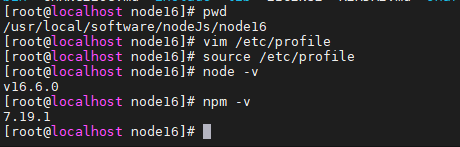
+ 安装cnpm(加速镜像下载)
```shell  
npm install -g cnpm --registry=https://registry.npm.taobao.org
#校验是否成功
cnpm -v
```
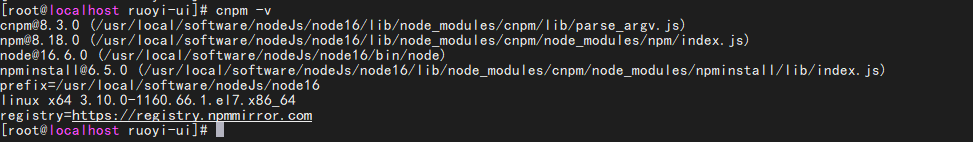


[https://blog.csdn.net/www1056481167/article/details/115396974]: https://blog.csdn.net/www1056481167/article/details/115396974

# jenkins其他操作
## 1、构建命令
### 方式一、地址栏触发构建命令
>Use the following URL to trigger build remotely: JENKINS_URL/job/jenkins-demo/build?token=TOKEN_NAME 或者 /buildWithParameters?token=TOKEN_NAME
Optionally append &cause=Cause+Text to provide text that will be included in the recorded build cause.
+ 触发器token的值
  格式：  JENKINS_URL/job/jenkins-demo/build?token=TOKEN_NAME
```shell
1、url:  http://192.168.11.131:8080/jenkins 是部署jenkins对应的url地址后面的jenkins是部署的jenkins的项目名
2、/job/jenkins-demo/build : 中间的jenkins-demo是当前配置的项目名都是固定的
3、token=TOKEN_NAME: token值是需要自定在上面的输入框自己定义的
```
最终的token值为

>http://192.168.11.131:8080/jenkins/job/jenkins-demo/build?token=jenkins-demo-token

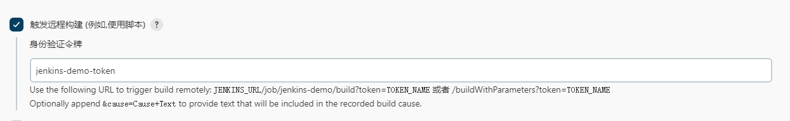

### 方式二、centos中使用命令触发构建命令
+ linux的curl命令发送http请求
  -x参数：指定请求方式
  -v参数：显示响应时间
  -u参数：携带用户名/密码
  -H参数: 携带请求头参数

格式
```
curl -X post -v -u [jenkins用户名]:[jenkins密码] -H "请求头信息" http://[服务器ip地址]:[服务器端口号]/jenkins/job/[jenkins项目名称]/build?token=[身份验证令牌]
```
eg：
> curl -X post -v -u admin:admin  http://192.168.11.131:8080/jenkins/job/jenkins-demo/build?token=jenkins-demo-token

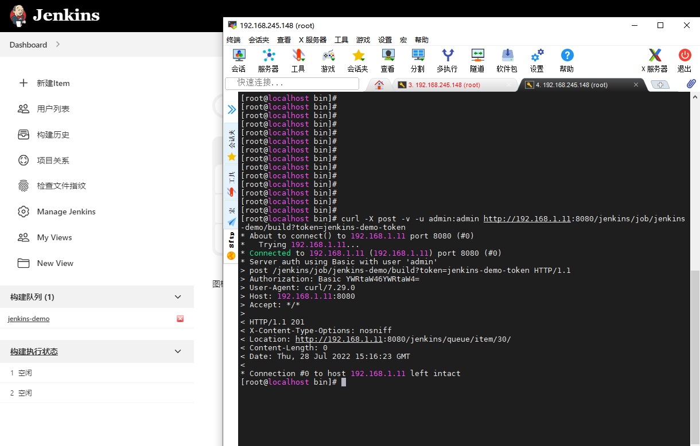

### 将curl命令放到jenkins的钩子程序中
```shell
# 复制备份钩子程序【以下复制的文件不能出现扩展名，否则钩子程序失败】
cp post-commit.tmpl post-commit
# 编辑钩子程序
vim post-commit
# 将编辑好的curl命令放到最后面
```
## 2、插件地址更换
### 1、更换清华园的插件下载地址
配置 <font color='red'>插件管理->高级->更新站点</font>
> https://mirrors.tuna.tsinghua.edu.cn/jenkins/updates/update-center.json

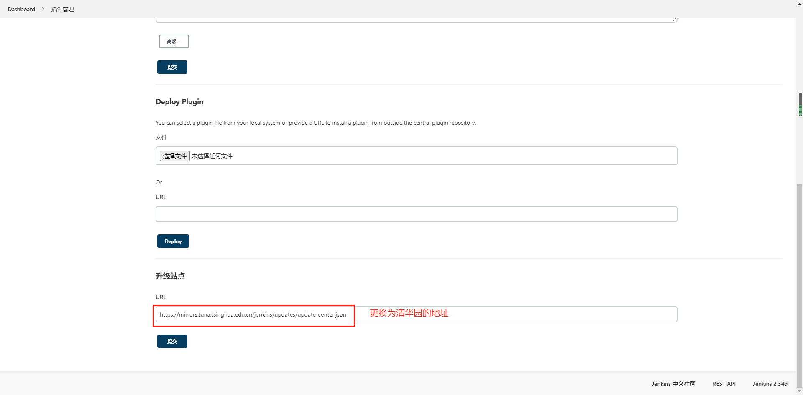
### 2、国内其他的下载地址
```html
清华大学：https://mirrors.tuna.tsinghua.edu.cn/jenkins/updates/
阿里云：https://mirrors.aliyun.com/jenkins/updates/
华为云：https://mirrors.huaweicloud.com/jenkins/updates/
```
相同的方法：进入上面的网址，找到update-center.json对应的文件，然后复制该文件的全路径更换即可
>https://mirrors.aliyun.com/jenkins/updates/update-center.json
>https://mirrors.tuna.tsinghua.edu.cn/jenkins/updates/update-center.json
>https://mirrors.huaweicloud.com/jenkins/updates/update-center.json

然后重启即可
二、直接更换默认的插件下载地址  
<font color='red'>特别提醒，启动war包后，不要访问浏览器，然后启动后会自动生成jenkins的工作目录/root/.jenkins,
然后进入updates目录下，有一个默认的default.json,在当前目录下下载清华园的插件json文件，然后重启war包，访问浏览器继续其他操作</font>
进入
```shell
#进入默认的安装更路径
/root/.jenkins/updates
#备份原始的
\cp -r default.json  default.json.back
#下载清华园的镜像
wget https://mirrors.tuna.tsinghua.edu.cn/jenkins/updates/update-center.json
#更新清华园的为默认的插件下载地址
mv  update-center.json default.json
```
### 3、jenkins离线插件安装位置
>http://updates.jenkins-ci.org/download/plugins/
# 插件安装管理
##  一、Local(汉化插件)
### 1、搜索插件

> Manager Jenkins->插件管理->可选插件->搜索local插件

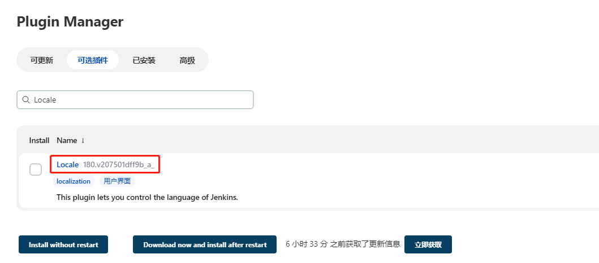
### 2、系统全局设置

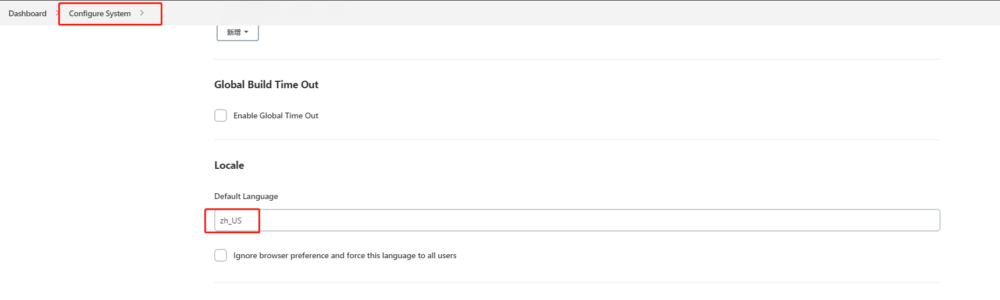
## 二、 Maven Integration(java项目必装)
<font color='red'> 此插件必装，用于java项目的清理、打包、测试等。</font>  
mvn clean install package ......  
### 1、没有该插件的jenkins  

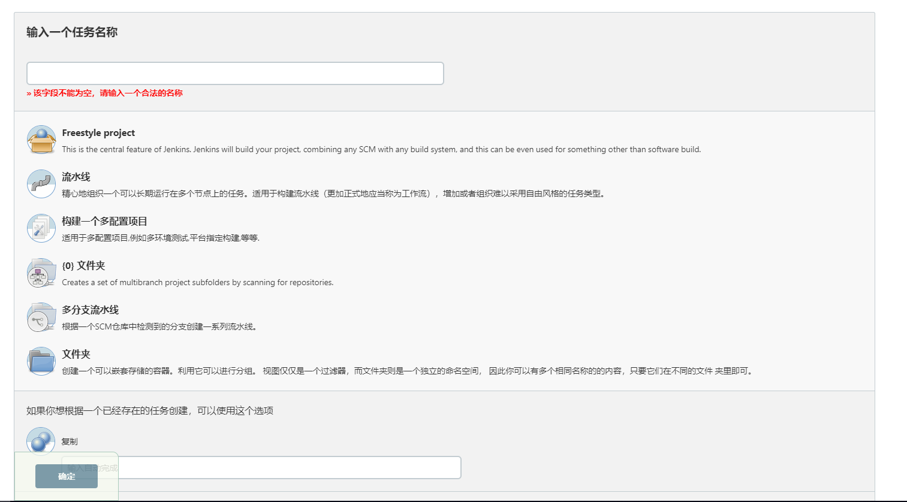
### 2、插件查找该插件安装
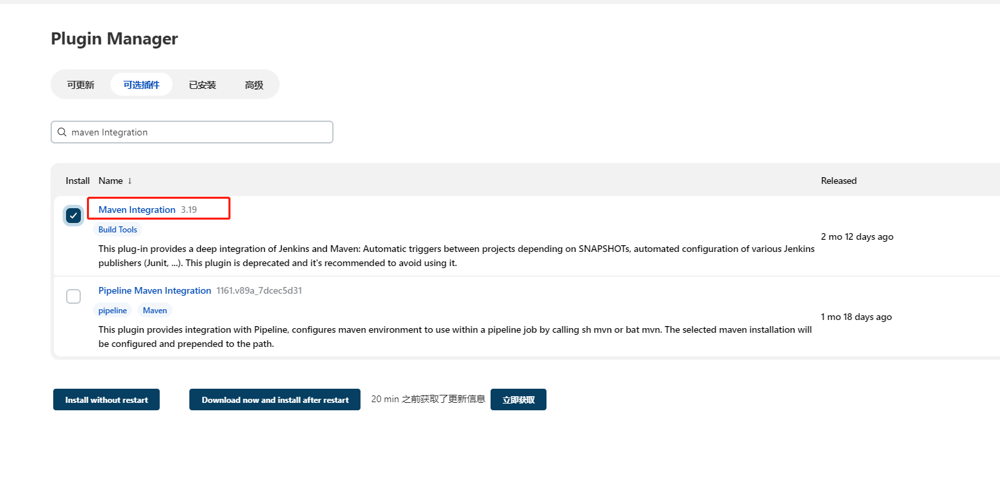
### 3、插件安装好后列表显示
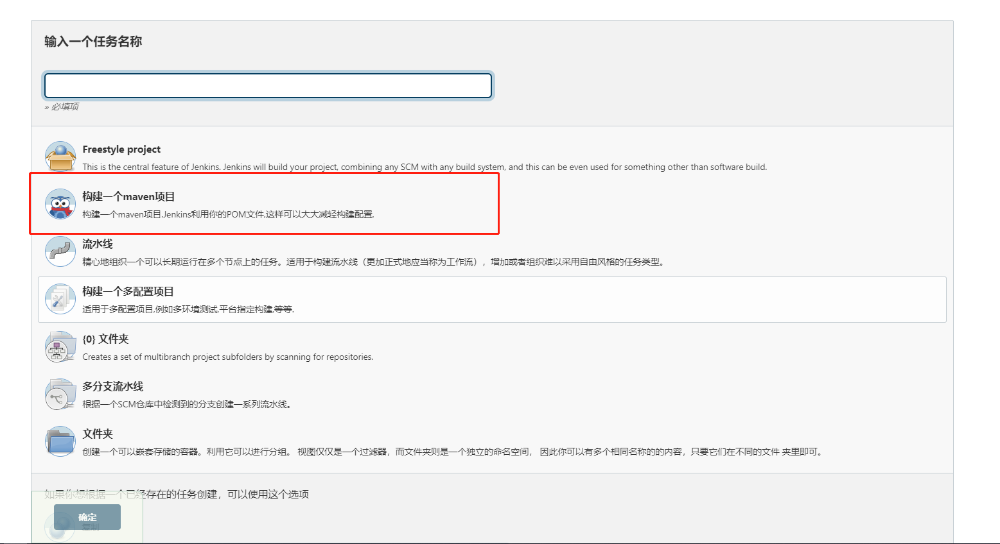
### 4、配置好后项目中的使用
#### 1、配置仓库地址
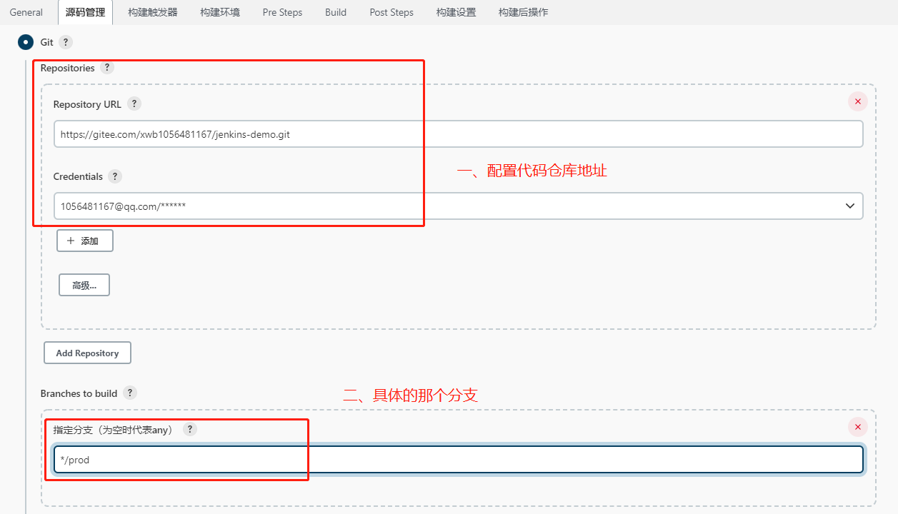
#### 2、构建之前可以做的操作
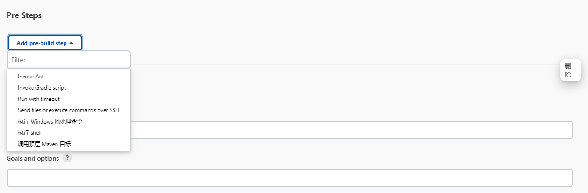
#### 3、构建操作
<font color='red'>指定要构建的pom.xml文件</font>

#### 4、构建之后的操作
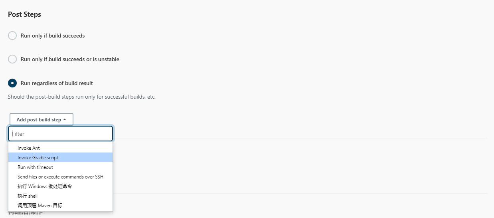

## 三、Publish Over SSH(ssh插件)
### 1、在插件库中查找安装
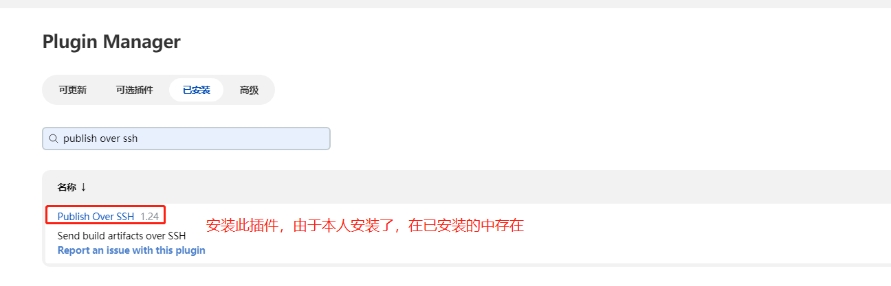
<font color='red'>用于连接ssh服务器，然后再该服务器上做一些操作。
例如连接服务器，部署服务到该服务器上</font>
### 2、 <font color='red'>Manager Jenkins->系统配置->Publish over SSH</font>

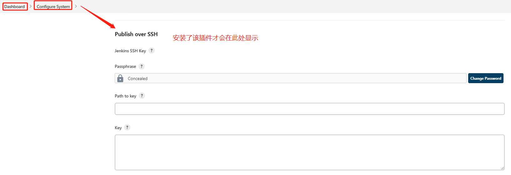
### 3、全局配置
<font color='red'>添加服务器列表</font>

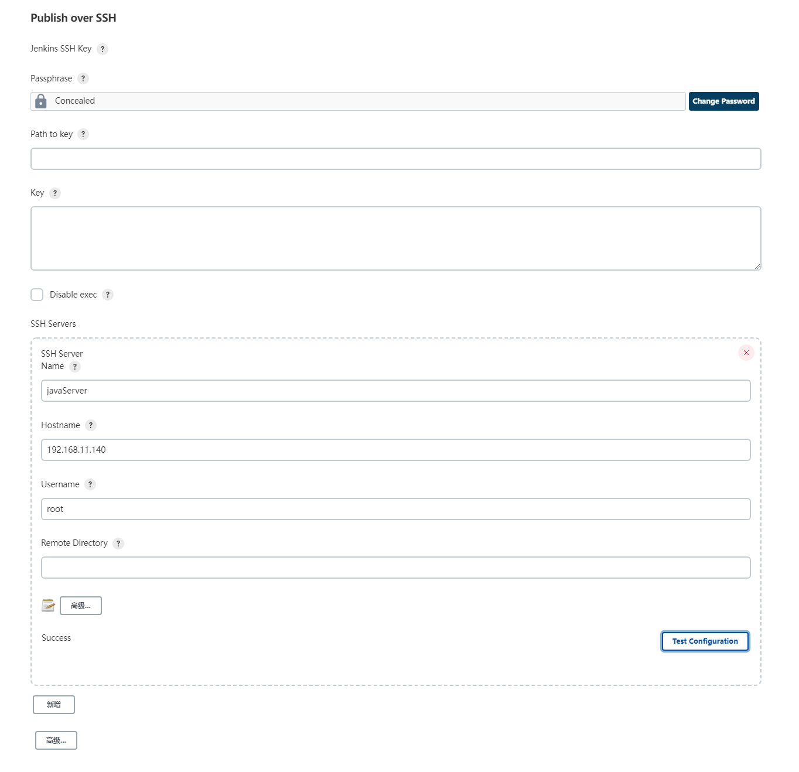
`注意`
> 添加完点击<font color='red'>Test Configuration</font>确保服务器配置能连接成功
### 4、项目中如何使用
> 安装好插件后,上传文件到其他服务器上要选择<font color='red'>Send files or execute commands over SSH</font>

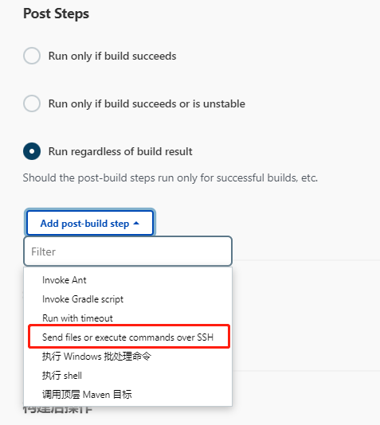

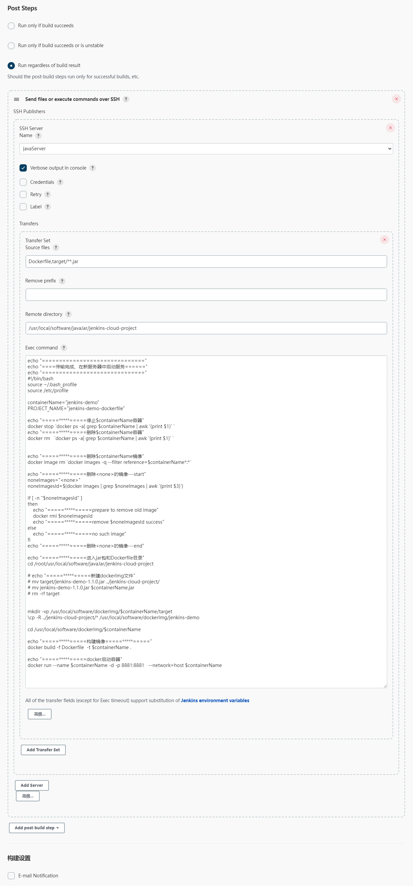

`注意`


#### 4.1、<font color='red'>SSH Server Name</font>
>表示要连接那台服务器上传文件(在全局配置中选择已经添加的服务器列表,此处可以配置多个服务器，集群中常见较多)

#### 4.2、<font color='red'>Source files</font>
> 1、本机要上传的文件(选择要上传的文件，可以通配符，上传符合通配符的所有文件)  
> 2、<font color='red'>可以填写多个</font>,默认用<font color='red'>**,**</font>分隔  
> 3、路径一定要写对,<font color='red'>是相对于你配置的项目路径下，是相对路径(如何确定？看下图)</font>

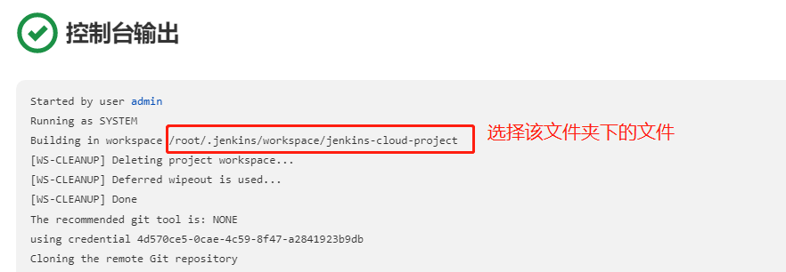


#### 4.3、<font color='red'>Remove prefix</font>
>去除前缀,会删除掉无用的目录，此目录指的是上传到目标服务器的路径

#### 4.4、<font color='red'>Remote directory</font>
>远程目录(就是连接到该服务器、上传jar包以及其他文件到该目录下)

#### 4.5、<font color='red'>Exec command</font>上传完成之后做的操作
此处本人做了上传后，生成docker镜像、在docker中启动容器
```shell
echo "=============================="
echo "====传输完成、在新服务器中启动服务======"
echo "=============================="
#!/bin/bash
source ~/.bash_profile
source /etc/profile

containerName="jenkins-demo"
PROJECT_NAME="jenkins-demo-dockerfile"

echo "=====*****=====停止$containerName容器"
docker stop `docker ps -a| grep $containerName | awk '{print $1}' `
echo "=====*****=====删除$containerName容器"
docker rm   `docker ps -a| grep $containerName | awk '{print $1}' `


echo "=====*****=====删除$containerName镜像"
docker image rm `docker images -q --filter reference=$containerName*:*`

echo "=====*****=====删除<none>的镜像---start"
noneImages="<none>"
noneImagesId=$(docker images | grep $noneImages | awk '{print $3}')

if [ -n "$noneImagesId" ]
then
    echo "=====*****=====prepare to remove old image"
    docker rmi $noneImagesId
    echo "=====*****=====remove $noneImagesId success"
else
    echo "=====*****=====no such image"
fi
echo "=====*****=====删除<none>的镜像---end"

echo "=====*****=====进入jar包和Dockerfile目录"
cd /root/usr/local/software/javaJar/jenkins-cloud-project

# echo "=====*****=====新建dockerImg文件"
# mv target/jenkins-demo-1.1.0.jar ../jenkins-cloud-project/
# mv jenkins-demo-1.1.0.jar $containerName.jar
# rm -rf target


mkdir -vp /usr/local/software/dockerImg/$containerName/target
\cp -R ../jenkins-cloud-project/* /usr/local/software/dockerImg/jenkins-demo

cd /usr/local/software/dockerImg/$containerName

echo "=====*****=====构建镜像=====*****====="
docker build -f Dockerfile  -t $containerName .

echo "=====*****=====docker启动容器"
docker run --name $containerName -d -p 8881:8881   --network=host $containerName

```
#### 数据流重定向
```shell
eg:    nohup java -jar jenkins-demo.jar >mylog.log 2>&1 &  
数据流重定向就是将某个命令执行后应该要出现在屏幕上的数据传输到其他地方

标准输入（stdin）：代码为0，使用<或<<;
标准输出（stdout）：代码为1，使用>或>>;
标准错误输出（stderr）：代码为2，使用2>或2>>

\> 覆盖写
\>> 追加写
```
###  5、启动日志
<font color='red'>开启传输日志的打印</font>

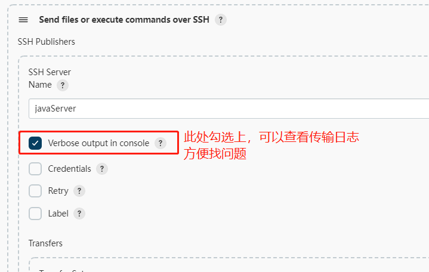

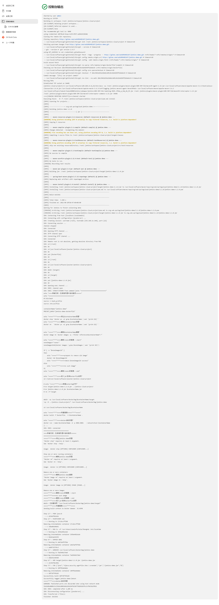

### 6、服务器信息

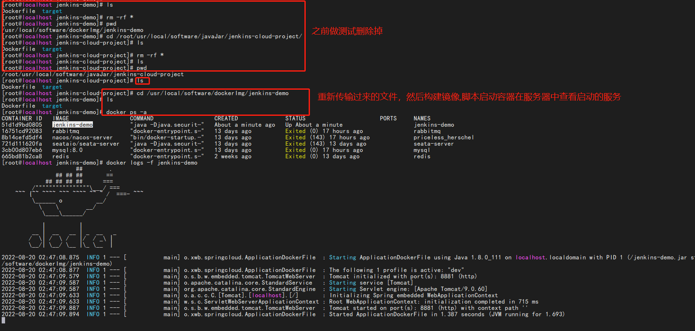
### 7、启动访问后的服务

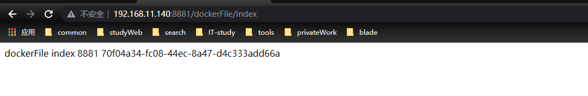

## 四、build authorization token root(触发钩子免登录插件)
+ 说明  
  <font color='red'>正常的触发远程脚本构建,在登录的状态下请求token的url是会触发的，但是如果登录失效，请求则不同，此时就需要该插件</font>
  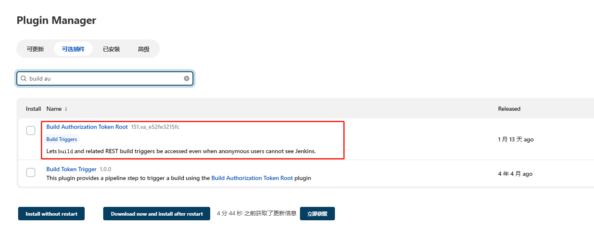

