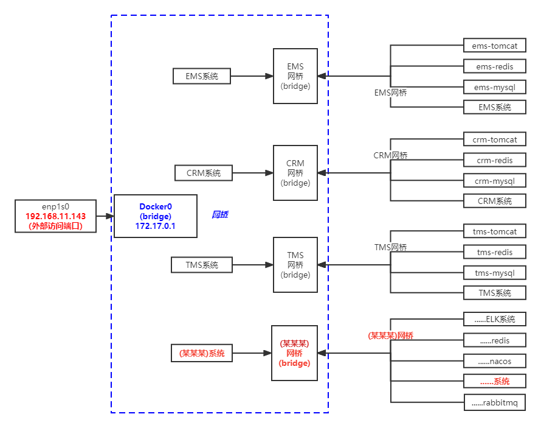

# docker network网桥
<font color='red'>作用：实现主机和容器之间可以通过网桥相互通信。</font>

<font color='red'>定义</font>
+ 正常不指定网络的情况下。所有的应用都跑在一个网桥上,影响其他应用的交互、网络传输。
+ 一般都是一个应用使用一个网桥，容器之间互通，则进行容器间通信的配置，这样解决了他们之间的。

## 一、docker的网络模式

<font color="red">安装docker的时候,自动创建了host、none、bridge三个网络</font>

| **名称** | **指定方式**                       | **说明**                                                                                      |
|:----:|:---------------------------|:----------------------------------------------------------------------------------------|
|   <font color='red'>host</font>    | --net=host                 | 相当于玩虚拟机时，网络为桥接模式，就是和宿主机在一个网络中，没有独立的ip。就是容器和宿主机共享网络命名空间，network namespace，直接使用宿主机的ip和端口。 |
|   <font color='red'>none</font>    | --net=none                 | 容器有独立的network namespace，但没有任何网络设置，比如网桥连接、ip配置等                                          |                                             ||
|  <font color='red'>bridge</font>   | --net=bridge               | 这种也是docker默认的网络模式                                                                       |
| <font color='red'>container</font> | --net=container:NAME_or_ID | 指定新容器和其他已经存在的容器共享一个网络命名空间，不是和宿主机共享。                                                     |
### 1、host
> Host 模式并没有为容器创建一个隔离的网络环境。而之所以称之为host模式，是因为该模式下的 <font color='red'>Docker 容器会和 host 宿主机共享同一个网络</font> namespace，故 Docker Container可以和宿主机一样，
> 使用宿主机的eth0，实现和外界的通信。换言之，Docker Container的 IP 地址即为宿主机 eth0 的 IP 地址

+ 特点
>1、这种模式下的容器没有隔离的 network namespace。  
2、容器的IP地址和Docker host的IP地址一样。  
3、需要注意容器中服务的端口号不能与Docker host 上已经使用的端口号相冲突。  
4、host模式能够和其它模式共存。  

### 2、none
>网络模式为 none，即不为 Docker 容器构造任何网络环境。<font color='red'>一旦Docker 容器采用了none 网络模式，那么容器内部就只能使用loopback网络设备，不会再有其他的网络资源。Docker Container的none网络模式意味着不给该容器创建任何网络环境，容器只能使用127.0.0.1的本机网络</font>
### 3、container
> Container 网络模式是 Docker 中一种较为特别的网络的模式。处于这个模式下的 Docker 容器会共享其他容器的网络环境，因此，至少这两个容器之间不存在网络隔离，而这两个容器又与宿主机以及除此之外其他的容器存在网络隔离。 
### 4、bridge
>1、使用一个 linux bridge，默认为 docker0。<br>
2、使用 veth 对，一头在容器的网络 namespace 中，一头在 docker0 上。<br>
3、该模式下Docker Container不具有一个公有IP，因为宿主机的IP地址与veth pair的 IP地址不在同一个网段内。<br>
4、Docker采用 NAT 方式，将容器内部的服务监听的端口与宿主机的某一个端口port 进行“绑定”，使得宿主机以外的世界可以主动将网络报文发送至容器内部<br>
5、外界访问容器内的服务时，需要访问宿主机的 IP 以及宿主机的端口 port。<br>
6、NAT 模式由于是在三层网络上的实现手段，故肯定会影响网络的传输效率。<br>
7、容器拥有独立、隔离的网络栈；让容器和宿主机以外的世界通过NAT建立通信<br>


## 1、查看网络信息
```shell
docker network ls
```

## 2、创建一个网桥
```shell
docker network create -d bridge 网桥名称
```
## 3、删除一个网桥
```shell
docker network rm 网桥名称
```
## 4、容器之间使用网络通信
### 1、查看当前网络配置
```shell
docker network ls
```
### 2、创建网桥网络
```shell
docker network create -d bridge 网桥名称
```
### 3、<font color='red'>使用网桥</font>
```shell
docker network create -d bridge tomcatBridge
```
docker run -d -p 8082:8080 --name tomcat8082 --network <font color='red'>tomcatBridge</font> tomcat:8.0-jre8 172.17.0.2<==>tomcat8082  
docker run -d -p 8083:8080 --name tomcat8083 --network <font color='red'>tomcatBridge</font> tomcat:8.0-jre8 172.17.0.3<==>tomcat8083

+ 注意：
一旦在启动容器时指定了网桥之后，日后可以在任何这个网桥关联的的容器中使用容器名称来进行与其他容器通信


