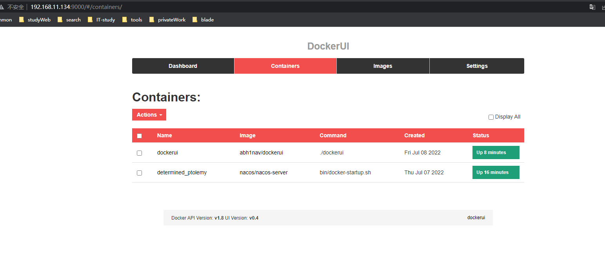
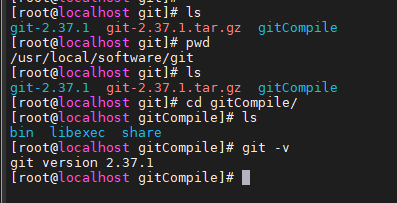

## 一、centos7安装jdk
### 1、创建文件夹
```shell
mkdir -vp /usr/local/software/jdk
cd /usr/local/software/jdk
```
### 2、下载jdk
链接: https://pan.baidu.com/s/135Ton7shobzFDsfcUYwp2A 提取码: jgm6
或者使用wget下载
```shell
wget --no-cookies --no-check-certificate --header "Cookie: gpw_e24=http%3A%2F%2Fwww.oracle.com%2F; oraclelicense=accept-securebackup-cookie" "http://download.oracle.com/otn-pub/java/jdk/8u141-b15/336fa29ff2bb4ef291e347e091f7f4a7/jdk-8u141-linux-x64.tar.gz"
```
### 3、将上传的tar包上传到linux服务器上
执行上传命令
```shell
rz jdk-8u211-linux-x64.tar.gz
#如果不能使用rz命令，则执行以下操作
yum install lrzsz
```
> rz：从本地上传文件至服务器  
> sz filename：从服务器下载文件至本地
### 4、解压下载下来的tar包
```shell
tar -zxvf jdk-8u211-linux-x64.tar.gz
cd /usr/local/software/jdk/jdk1.8.0_211
```
### 5、配置环境变量文件
```shell
#打开环境变量
vim /etc/profile
# java environment
export JAVA_HOME=/usr/local/software/jdk/jdk1.8.0_211
export CLASSPATH=.:$JAVA_HOME/jre/lib/rt.jar:$JAVA_HOME/lib/dt.jar:$JAVA_HOME/lib/tools.jar
export PATH=$PATH:$JAVA_HOME/bin
# 重新加载文件
source /etc/profile
```
### 6、查看是否安装成功
```shell
java -version
```

## 二、【dockerui】dockerUI 可视化界面工具安装
```shell
#拉去镜像
docker pull abh1nav/dockerui
#创建容器数据卷
mkdir -p /usr/local/docker/dockerui/
cd /usr/local/docker/dockerui
# 空文件 :q! 保存即可
vim docker.sock
chmod 777 docker.sock
# 启动容器
docker run -d \
-p 9000:9000 \
--privileged \
-v /usr/local/docker/dockerui/docker.sock:/var/run/docker.sock \
--name dockerui abh1nav/dockerui
```
+ 启动后访问

> http://ip:9000/


## 三、【dockerUI portainer】docker安装portainer(UI管理界面)
```shell
#拉去镜像
docker pull portainer/portainer
#创建容器数据卷
mkdir -p /usr/local/docker/dockerui/
cd /usr/local/docker/dockerui
# 空文件 :q! 保存即可
vim docker.sock
chmod 777 docker.sock
```
启动容器
```shell
docker run -d -p 9000:9000 --restart=always \
-v /var/run/docker.sock:/var/run/docker.sock \
--name portainer portainer/portainer
```
+ 注意
><font color='red'>-v /var/run/docker.sock:/var/run/docker.sock</font>  
<font color='red'>前面宿主机的路径一定要写正确，不然宿主机和容器内部的通信是不能完成的。会一直报错连接不到</font>
+ 访问界面
> http://ip:9000/
  
  
  

## 【seata】docker安装seata
### 一、准备seata的数据库表
```shell
create database seata;
use seata;

CREATE TABLE IF NOT EXISTS `global_table`
(
    `xid`                       VARCHAR(128) NOT NULL,
    `transaction_id`            BIGINT,
    `status`                    TINYINT      NOT NULL,
    `application_id`            VARCHAR(32),
    `transaction_service_group` VARCHAR(32),
    `transaction_name`          VARCHAR(128),
    `timeout`                   INT,
    `begin_time`                BIGINT,
    `application_data`          VARCHAR(2000),
    `gmt_create`                DATETIME,
    `gmt_modified`              DATETIME,
    PRIMARY KEY (`xid`),
    KEY `idx_gmt_modified_status` (`gmt_modified`, `status`),
    KEY `idx_transaction_id` (`transaction_id`)
) ENGINE = InnoDB
  DEFAULT CHARSET = utf8;
 
-- the table to store BranchSession data
CREATE TABLE IF NOT EXISTS `branch_table`
(
    `branch_id`         BIGINT       NOT NULL,
    `xid`               VARCHAR(128) NOT NULL,
    `transaction_id`    BIGINT,
    `resource_group_id` VARCHAR(32),
    `resource_id`       VARCHAR(256),
    `branch_type`       VARCHAR(8),
    `status`            TINYINT,
    `client_id`         VARCHAR(64),
    `application_data`  VARCHAR(2000),
    `gmt_create`        DATETIME(6),
    `gmt_modified`      DATETIME(6),
    PRIMARY KEY (`branch_id`),
    KEY `idx_xid` (`xid`)
) ENGINE = InnoDB
  DEFAULT CHARSET = utf8;
 
-- the table to store lock data
CREATE TABLE IF NOT EXISTS `lock_table`
(
    `row_key`        VARCHAR(128) NOT NULL,
    `xid`            VARCHAR(96),
    `transaction_id` BIGINT,
    `branch_id`      BIGINT       NOT NULL,
    `resource_id`    VARCHAR(256),
    `table_name`     VARCHAR(32),
    `pk`             VARCHAR(36),
    `gmt_create`     DATETIME,
    `gmt_modified`   DATETIME,
    PRIMARY KEY (`row_key`),
    KEY `idx_branch_id` (`branch_id`)
) ENGINE = InnoDB
  DEFAULT CHARSET = utf8;
```
### 二、准备配置文件
```shell
mkdir /usr/local/docker/seata/
cd /usr/local/docker/seata/
vim resigtry.conf (将下面的内容编辑到里面种去)
vim file.conf (将下面的内容编辑到里面种去)
```
#### 1、准备seata的registry.conf文件
```shell
registry {
  # file 、nacos 、eureka、redis、zk、consul、etcd3、sofa
  type = "nacos"

  nacos {
    application = "seata-server"
    serverAddr = "192.168.11.132:8848"
    group = "DEFAULT_GROUP"
    namespace = ""
    cluster = "default"
    username = "nacos"
    password = "nacos"
  }
  eureka {
    serviceUrl = "http://localhost:8761/eureka"
    application = "default"
    weight = "1"
  }
  redis {
    serverAddr = "localhost:6379"
    db = 0
    password = ""
    cluster = "default"
    timeout = 0
  }
  zk {
    cluster = "default"
    serverAddr = "127.0.0.1:2181"
    sessionTimeout = 6000
    connectTimeout = 2000
    username = ""
    password = ""
  }
  consul {
    cluster = "default"
    serverAddr = "127.0.0.1:8500"
    aclToken = ""
  }
  etcd3 {
    cluster = "default"
    serverAddr = "http://localhost:2379"
  }
  sofa {
    serverAddr = "127.0.0.1:9603"
    application = "default"
    region = "DEFAULT_ZONE"
    datacenter = "DefaultDataCenter"
    cluster = "default"
    group = "SEATA_GROUP"
    addressWaitTime = "3000"
  }
  file {
    name = "file.conf"
  }
}

config {
  # file、nacos 、apollo、zk、consul、etcd3
  type = "nacos"

  nacos {
    serverAddr = "192.168.11.132:8848"
    namespace = ""
    group = "DEFAULT_GROUP"
    username = "nacos"
    password = "nacos"
    dataId = "blade-dev.yaml"
  }
  consul {
    serverAddr = "127.0.0.1:8500"
    aclToken = ""
  }
  apollo {
    appId = "seata-server"
    ## apolloConfigService will cover apolloMeta
    apolloMeta = "http://192.168.1.204:8801"
    apolloConfigService = "http://192.168.1.204:8080"
    namespace = "application"
    apolloAccesskeySecret = ""
    cluster = "seata"
  }
  zk {
    serverAddr = "127.0.0.1:2181"
    sessionTimeout = 6000
    connectTimeout = 2000
    username = ""
    password = ""
    nodePath = "/seata/seata.properties"
  }
  etcd3 {
    serverAddr = "http://localhost:2379"
  }
  file {
    name = "file.conf"
  }
}
```
#### 2、准备seata的file.conf文件
```shell
## transaction log store, only used in seata-server
store {
  ## store mode: file、db、redis
  mode = "db"
  ## rsa decryption public key
  publicKey = ""
  ## file store property
  file {
    ## store location dir
    dir = "sessionStore"
    # branch session size , if exceeded first try compress lockkey, still exceeded throws exceptions
    maxBranchSessionSize = 16384
    # globe session size , if exceeded throws exceptions
    maxGlobalSessionSize = 512
    # file buffer size , if exceeded allocate new buffer
    fileWriteBufferCacheSize = 16384
    # when recover batch read size
    sessionReloadReadSize = 100
    # async, sync
    flushDiskMode = async
  }

  ## database store property
  db {
    ## the implement of javax.sql.DataSource, such as DruidDataSource(druid)/BasicDataSource(dbcp)/HikariDataSource(hikari) etc.
    datasource = "druid"
    ## mysql/oracle/postgresql/h2/oceanbase etc.
    dbType = "mysql"
    driverClassName = "com.mysql.jdbc.Driver"
    ## if using mysql to store the data, recommend add rewriteBatchedStatements=true in jdbc connection param
    url = "jdbc:mysql://192.168.11.132:3306/seata?rewriteBatchedStatements=true"
    user = "root"
    password = "123456"
    minConn = 5
    maxConn = 100
    globalTable = "global_table"
    branchTable = "branch_table"
    lockTable = "lock_table"
    queryLimit = 100
    maxWait = 5000
  }

  ## redis store property
  redis {
    ## redis mode: single、sentinel
    mode = "single"
    ## single mode property
    single {
      host = "127.0.0.1"
      port = "6379"
    }
    ## sentinel mode property
    sentinel {
      masterName = ""
      ## such as "10.28.235.65:26379,10.28.235.65:26380,10.28.235.65:26381"
      sentinelHosts = ""
    }
    password = ""
    database = "0"
    minConn = 1
    maxConn = 10
    maxTotal = 100
    queryLimit = 100
  }
}

```
+ 下载docker
```shell
docker pull seataio/seata-server
```
+ 启动docker
```shell
docker run -d --name seata-server \
-p 8091:8091 \
--privileged=true \
-e SEATA_IP=192.168.11.132 \
-e SEATA_CONFIG_NAME=file:/root/seata-config/registry \
-v /usr/local/docker/seata:/root/seata-config \
seataio/seata-server
```
## 【tomcat】安装tomcat

> docker pull tomcat

运行
> docker run -it -d -p 8080:8080 tomcat
-d 后台运行
-it  终端交互方式一直运行

+ 访问后发现找不到
> 进入到里面 docker exec -it tomcat bash
> rm -rf webapps
> mv webapps.dist webapps
重启一下docker restart tomcat
重新访问发现tomcat的首页
## 【rabbitmq】安装rabbitmq
```shell
docker pull rabbitmq
```
<font color='red'>异常启动的命令</font>
```shell
1、方式一启动
docker run -d --hostname rabbit --name rabbit 
-p 15672:15672 \
-p 5672:5672 \
-v /usr/local/docker/rabbitmq/etc:/etc/rabbitmq \
-v /usr/local/docker/rabbitmq/lib:/var/lib/rabbitmq \
-v /usr/local/docker/rabbitmq/log:/var/log/rabbitmq \
--privileged=true \
rabbitmq
2、方式二启动
docker run  -d --hostname rabbitmq \
--restart=always \
--restart=unless-stopped \
--name rabbitmq \
--net host \
-p 15672:15672  \
-p 5672:5672 \
-e RABBITMQ_DEFAULT_USER=admin \
-e RABBITMQ_DEFAULT_PASS=admin \
-e RABBITMQ_ERLANG_COOKIE='rabbit_mq'  rabbitmq
```
<font color='red'>正常启动的命令</font>
```shell
docker run -d --hostname my-rabbit --name rabbit -p 15672:15672 -p 5673:5672 rabbitmq
```
<font color='red'>docker exec -it 容器id /bin/bash</font>
```shell
# 如果不执行该命令，则服务无法连接到rabbitmq
rabbitmq-plugins enable rabbitmq_management
```
相关操作
```shell
# 先进入docker容器
docker exec -it rabbitmq /bin/bash
# 然后清除数据
# 关闭应用的命令为： 
rabbitmqctl stop_app
# 清除的命令为： 
rabbitmqctl reset
# 重新启动命令为 
rabbitmqctl start_app
```

地址栏访问：
> http://ip:15672 [guest/guest]
## 【nacos】安装nacos
### 1、初始化数据库
```sql
1、在数据库中创建数据库
 CREATE DATABASE nacos;
2、执行sql(执行该页的sql)
https://github.com/alibaba/nacos/blob/master/config/src/main/resources/META-INF/nacos-db.sql
```
或者直接执行该sql
```sql
/******************************************/
/*   数据库全名 = nacos_config   */
/*   表名称 = config_info   */
/******************************************/
CREATE TABLE `config_info` (
  `id` bigint(20) NOT NULL AUTO_INCREMENT COMMENT 'id',
  `data_id` varchar(255) NOT NULL COMMENT 'data_id',
  `group_id` varchar(255) DEFAULT NULL,
  `content` longtext NOT NULL COMMENT 'content',
  `md5` varchar(32) DEFAULT NULL COMMENT 'md5',
  `gmt_create` datetime NOT NULL DEFAULT '2010-05-05 00:00:00' COMMENT '创建时间',
  `gmt_modified` datetime NOT NULL DEFAULT '2010-05-05 00:00:00' COMMENT '修改时间',
  `src_user` text COMMENT 'source user',
  `src_ip` varchar(20) DEFAULT NULL COMMENT 'source ip',
  `app_name` varchar(128) DEFAULT NULL,
  `tenant_id` varchar(128) DEFAULT '' COMMENT '租户字段',
  `c_desc` varchar(256) DEFAULT NULL,
  `c_use` varchar(64) DEFAULT NULL,
  `effect` varchar(64) DEFAULT NULL,
  `type` varchar(64) DEFAULT NULL,
  `c_schema` text,
  `encrypted_data_key` text NOT NULL COMMENT '秘钥',
  PRIMARY KEY (`id`),
  UNIQUE KEY `uk_configinfo_datagrouptenant` (`data_id`,`group_id`,`tenant_id`)
) ENGINE=InnoDB DEFAULT CHARSET=utf8 COLLATE=utf8_bin COMMENT='config_info';

/******************************************/
/*   数据库全名 = nacos_config   */
/*   表名称 = config_info_aggr   */
/******************************************/
CREATE TABLE `config_info_aggr` (
  `id` bigint(20) NOT NULL AUTO_INCREMENT COMMENT 'id',
  `data_id` varchar(255) NOT NULL COMMENT 'data_id',
  `group_id` varchar(255) NOT NULL COMMENT 'group_id',
  `datum_id` varchar(255) NOT NULL COMMENT 'datum_id',
  `content` longtext NOT NULL COMMENT '内容',
  `gmt_modified` datetime NOT NULL COMMENT '修改时间',
  `app_name` varchar(128) DEFAULT NULL,
  `tenant_id` varchar(128) DEFAULT '' COMMENT '租户字段',
  PRIMARY KEY (`id`),
  UNIQUE KEY `uk_configinfoaggr_datagrouptenantdatum` (`data_id`,`group_id`,`tenant_id`,`datum_id`)
) ENGINE=InnoDB DEFAULT CHARSET=utf8 COLLATE=utf8_bin COMMENT='增加租户字段';


/******************************************/
/*   数据库全名 = nacos_config   */
/*   表名称 = config_info_beta   */
/******************************************/
CREATE TABLE `config_info_beta` (
  `id` bigint(20) NOT NULL AUTO_INCREMENT COMMENT 'id',
  `data_id` varchar(255) NOT NULL COMMENT 'data_id',
  `group_id` varchar(128) NOT NULL COMMENT 'group_id',
  `app_name` varchar(128) DEFAULT NULL COMMENT 'app_name',
  `content` longtext NOT NULL COMMENT 'content',
  `beta_ips` varchar(1024) DEFAULT NULL COMMENT 'betaIps',
  `md5` varchar(32) DEFAULT NULL COMMENT 'md5',
  `gmt_create` datetime NOT NULL DEFAULT '2010-05-05 00:00:00' COMMENT '创建时间',
  `gmt_modified` datetime NOT NULL DEFAULT '2010-05-05 00:00:00' COMMENT '修改时间',
  `src_user` text COMMENT 'source user',
  `src_ip` varchar(20) DEFAULT NULL COMMENT 'source ip',
  `tenant_id` varchar(128) DEFAULT '' COMMENT '租户字段',
  `encrypted_data_key` text NOT NULL COMMENT '秘钥',
  PRIMARY KEY (`id`),
  UNIQUE KEY `uk_configinfobeta_datagrouptenant` (`data_id`,`group_id`,`tenant_id`)
) ENGINE=InnoDB DEFAULT CHARSET=utf8 COLLATE=utf8_bin COMMENT='config_info_beta';

/******************************************/
/*   数据库全名 = nacos_config   */
/*   表名称 = config_info_tag   */
/******************************************/
CREATE TABLE `config_info_tag` (
  `id` bigint(20) NOT NULL AUTO_INCREMENT COMMENT 'id',
  `data_id` varchar(255) NOT NULL COMMENT 'data_id',
  `group_id` varchar(128) NOT NULL COMMENT 'group_id',
  `tenant_id` varchar(128) DEFAULT '' COMMENT 'tenant_id',
  `tag_id` varchar(128) NOT NULL COMMENT 'tag_id',
  `app_name` varchar(128) DEFAULT NULL COMMENT 'app_name',
  `content` longtext NOT NULL COMMENT 'content',
  `md5` varchar(32) DEFAULT NULL COMMENT 'md5',
  `gmt_create` datetime NOT NULL DEFAULT '2010-05-05 00:00:00' COMMENT '创建时间',
  `gmt_modified` datetime NOT NULL DEFAULT '2010-05-05 00:00:00' COMMENT '修改时间',
  `src_user` text COMMENT 'source user',
  `src_ip` varchar(20) DEFAULT NULL COMMENT 'source ip',
  PRIMARY KEY (`id`),
  UNIQUE KEY `uk_configinfotag_datagrouptenanttag` (`data_id`,`group_id`,`tenant_id`,`tag_id`)
) ENGINE=InnoDB DEFAULT CHARSET=utf8 COLLATE=utf8_bin COMMENT='config_info_tag';

/******************************************/
/*   数据库全名 = nacos_config   */
/*   表名称 = config_tags_relation   */
/******************************************/
CREATE TABLE `config_tags_relation` (
  `id` bigint(20) NOT NULL COMMENT 'id',
  `tag_name` varchar(128) NOT NULL COMMENT 'tag_name',
  `tag_type` varchar(64) DEFAULT NULL COMMENT 'tag_type',
  `data_id` varchar(255) NOT NULL COMMENT 'data_id',
  `group_id` varchar(128) NOT NULL COMMENT 'group_id',
  `tenant_id` varchar(128) DEFAULT '' COMMENT 'tenant_id',
  `nid` bigint(20) NOT NULL AUTO_INCREMENT,
  PRIMARY KEY (`nid`),
  UNIQUE KEY `uk_configtagrelation_configidtag` (`id`,`tag_name`,`tag_type`),
  KEY `idx_tenant_id` (`tenant_id`)
) ENGINE=InnoDB DEFAULT CHARSET=utf8 COLLATE=utf8_bin COMMENT='config_tag_relation';

/******************************************/
/*   数据库全名 = nacos_config   */
/*   表名称 = group_capacity   */
/******************************************/
CREATE TABLE `group_capacity` (
  `id` bigint(20) unsigned NOT NULL AUTO_INCREMENT COMMENT '主键ID',
  `group_id` varchar(128) NOT NULL DEFAULT '' COMMENT 'Group ID，空字符表示整个集群',
  `quota` int(10) unsigned NOT NULL DEFAULT '0' COMMENT '配额，0表示使用默认值',
  `usage` int(10) unsigned NOT NULL DEFAULT '0' COMMENT '使用量',
  `max_size` int(10) unsigned NOT NULL DEFAULT '0' COMMENT '单个配置大小上限，单位为字节，0表示使用默认值',
  `max_aggr_count` int(10) unsigned NOT NULL DEFAULT '0' COMMENT '聚合子配置最大个数，，0表示使用默认值',
  `max_aggr_size` int(10) unsigned NOT NULL DEFAULT '0' COMMENT '单个聚合数据的子配置大小上限，单位为字节，0表示使用默认值',
  `max_history_count` int(10) unsigned NOT NULL DEFAULT '0' COMMENT '最大变更历史数量',
  `gmt_create` datetime NOT NULL DEFAULT '2010-05-05 00:00:00' COMMENT '创建时间',
  `gmt_modified` datetime NOT NULL DEFAULT '2010-05-05 00:00:00' COMMENT '修改时间',
  PRIMARY KEY (`id`),
  UNIQUE KEY `uk_group_id` (`group_id`)
) ENGINE=InnoDB DEFAULT CHARSET=utf8 COLLATE=utf8_bin COMMENT='集群、各Group容量信息表';

/******************************************/
/*   数据库全名 = nacos_config   */
/*   表名称 = his_config_info   */
/******************************************/
CREATE TABLE `his_config_info` (
  `id` bigint(64) unsigned NOT NULL,
  `nid` bigint(20) unsigned NOT NULL AUTO_INCREMENT,
  `data_id` varchar(255) NOT NULL,
  `group_id` varchar(128) NOT NULL,
  `app_name` varchar(128) DEFAULT NULL COMMENT 'app_name',
  `content` longtext NOT NULL,
  `md5` varchar(32) DEFAULT NULL,
  `gmt_create` datetime NOT NULL DEFAULT '2010-05-05 00:00:00',
  `gmt_modified` datetime NOT NULL DEFAULT '2010-05-05 00:00:00',
  `src_user` text,
  `src_ip` varchar(20) DEFAULT NULL,
  `op_type` char(10) DEFAULT NULL,
  `tenant_id` varchar(128) DEFAULT '' COMMENT '租户字段',
  `encrypted_data_key` text NOT NULL COMMENT '秘钥',
  PRIMARY KEY (`nid`),
  KEY `idx_gmt_create` (`gmt_create`),
  KEY `idx_gmt_modified` (`gmt_modified`),
  KEY `idx_did` (`data_id`)
) ENGINE=InnoDB DEFAULT CHARSET=utf8 COLLATE=utf8_bin COMMENT='多租户改造';


/******************************************/
/*   数据库全名 = nacos_config   */
/*   表名称 = tenant_capacity   */
/******************************************/
CREATE TABLE `tenant_capacity` (
  `id` bigint(20) unsigned NOT NULL AUTO_INCREMENT COMMENT '主键ID',
  `tenant_id` varchar(128) NOT NULL DEFAULT '' COMMENT 'Tenant ID',
  `quota` int(10) unsigned NOT NULL DEFAULT '0' COMMENT '配额，0表示使用默认值',
  `usage` int(10) unsigned NOT NULL DEFAULT '0' COMMENT '使用量',
  `max_size` int(10) unsigned NOT NULL DEFAULT '0' COMMENT '单个配置大小上限，单位为字节，0表示使用默认值',
  `max_aggr_count` int(10) unsigned NOT NULL DEFAULT '0' COMMENT '聚合子配置最大个数',
  `max_aggr_size` int(10) unsigned NOT NULL DEFAULT '0' COMMENT '单个聚合数据的子配置大小上限，单位为字节，0表示使用默认值',
  `max_history_count` int(10) unsigned NOT NULL DEFAULT '0' COMMENT '最大变更历史数量',
  `gmt_create` datetime NOT NULL DEFAULT '2010-05-05 00:00:00' COMMENT '创建时间',
  `gmt_modified` datetime NOT NULL DEFAULT '2010-05-05 00:00:00' COMMENT '修改时间',
  PRIMARY KEY (`id`),
  UNIQUE KEY `uk_tenant_id` (`tenant_id`)
) ENGINE=InnoDB DEFAULT CHARSET=utf8 COLLATE=utf8_bin COMMENT='租户容量信息表';


CREATE TABLE `tenant_info` (
  `id` bigint(20) NOT NULL AUTO_INCREMENT COMMENT 'id',
  `kp` varchar(128) NOT NULL COMMENT 'kp',
  `tenant_id` varchar(128) default '' COMMENT 'tenant_id',
  `tenant_name` varchar(128) default '' COMMENT 'tenant_name',
  `tenant_desc` varchar(256) DEFAULT NULL COMMENT 'tenant_desc',
  `create_source` varchar(32) DEFAULT NULL COMMENT 'create_source',
  `gmt_create` bigint(20) NOT NULL COMMENT '创建时间',
  `gmt_modified` bigint(20) NOT NULL COMMENT '修改时间',
  PRIMARY KEY (`id`),
  UNIQUE KEY `uk_tenant_info_kptenantid` (`kp`,`tenant_id`),
  KEY `idx_tenant_id` (`tenant_id`)
) ENGINE=InnoDB DEFAULT CHARSET=utf8 COLLATE=utf8_bin COMMENT='tenant_info';

CREATE TABLE users (
	username varchar(50) NOT NULL PRIMARY KEY,
	password varchar(500) NOT NULL,
	enabled boolean NOT NULL
);

CREATE TABLE roles (
	username varchar(50) NOT NULL,
	role varchar(50) NOT NULL,
	constraint uk_username_role UNIQUE (username,role)
);

CREATE TABLE permissions (
    role varchar(50) NOT NULL,
    resource varchar(512) NOT NULL,
    action varchar(8) NOT NULL,
    constraint uk_role_permission UNIQUE (role,resource,action)
);

INSERT INTO users (username, password, enabled) VALUES ('nacos', '$2a$10$EuWPZHzz32dJN7jexM34MOeYirDdFAZm2kuWj7VEOJhhZkDrxfvUu', TRUE);

INSERT INTO roles (username, role) VALUES ('nacos', 'ROLE_ADMIN');
```
### 2、创建nacos启动的配置文件
```shell
mkdir /usr/local/docker/nacos/logs -p
mkdir /usr/local/docker/nacos/conf -p
vim   /usr/local/docker/nacos/conf/application.properties
```
+ 配置application.properties文件
```properties
/*application.properties 配置文件*/
 
#
# Copyright 1999-2018 Alibaba Group Holding Ltd.
#
# Licensed under the Apache License, Version 2.0 (the "License");
# you may not use this file except in compliance with the License.
# You may obtain a copy of the License at
#
#      http://www.apache.org/licenses/LICENSE-2.0
#
# Unless required by applicable law or agreed to in writing, software
# distributed under the License is distributed on an "AS IS" BASIS,
# WITHOUT WARRANTIES OR CONDITIONS OF ANY KIND, either express or implied.
# See the License for the specific language governing permissions and
# limitations under the License.
#
 
#*************** Spring Boot Related Configurations ***************#
### Default web context path:
server.servlet.contextPath=/nacos
### Default web server port:
server.port=8848
 
#*************** Network Related Configurations ***************#
### If prefer hostname over ip for Nacos server addresses in cluster.conf:
# nacos.inetutils.prefer-hostname-over-ip=false
 
### Specify local server's IP:
# nacos.inetutils.ip-address=
 
 
#*************** Config Module Related Configurations ***************#
### If use MySQL as datasource:
spring.datasource.platform=mysql
 
### Count of DB:
db.num=1
#连接mysql8.0数据库
### Connect URL of DB:
db.url.0=jdbc:mysql://192.168.11.132:3306/nacos?characterEncoding=utf8&connectTimeout=1000&socketTimeout=3000&autoReconnect=true&useUnicode=true&useSSL=false&serverTimezone=UTC&useSSL=false
db.user.0=root
db.password.0=123456

### Connection pool configuration: hikariCP
db.pool.config.connectionTimeout=30000
db.pool.config.validationTimeout=10000
db.pool.config.maximumPoolSize=20
db.pool.config.minimumIdle=2
 
#*************** Naming Module Related Configurations ***************#
### Data dispatch task execution period in milliseconds:
# nacos.naming.distro.taskDispatchPeriod=200
 
### Data count of batch sync task:
# nacos.naming.distro.batchSyncKeyCount=1000
 
### Retry delay in milliseconds if sync task failed:
# nacos.naming.distro.syncRetryDelay=5000
 
### If enable data warmup. If set to false, the server would accept request without local data preparation:
# nacos.naming.data.warmup=true
 
### If enable the instance auto expiration, kind like of health check of instance:
# nacos.naming.expireInstance=true
 
nacos.naming.empty-service.auto-clean=true
nacos.naming.empty-service.clean.initial-delay-ms=50000
nacos.naming.empty-service.clean.period-time-ms=30000
 
 
#*************** CMDB Module Related Configurations ***************#
### The interval to dump external CMDB in seconds:
# nacos.cmdb.dumpTaskInterval=3600
 
### The interval of polling data change event in seconds:
# nacos.cmdb.eventTaskInterval=10
 
### The interval of loading labels in seconds:
# nacos.cmdb.labelTaskInterval=300
 
### If turn on data loading task:
# nacos.cmdb.loadDataAtStart=false
 
 
#*************** Metrics Related Configurations ***************#
### Metrics for prometheus
#management.endpoints.web.exposure.include=*
 
### Metrics for elastic search
management.metrics.export.elastic.enabled=false
#management.metrics.export.elastic.host=http://localhost:9200
 
### Metrics for influx
management.metrics.export.influx.enabled=false
#management.metrics.export.influx.db=springboot
#management.metrics.export.influx.uri=http://localhost:8086
#management.metrics.export.influx.auto-create-db=true
#management.metrics.export.influx.consistency=one
#management.metrics.export.influx.compressed=true
 
 
#*************** Access Log Related Configurations ***************#
### If turn on the access log:
server.tomcat.accesslog.enabled=true
 
### The access log pattern:
server.tomcat.accesslog.pattern=%h %l %u %t "%r" %s %b %D %{User-Agent}i %{Request-Source}i
 
### The directory of access log:
server.tomcat.basedir=
 
 
#*************** Access Control Related Configurations ***************#
### If enable spring security, this option is deprecated in 1.2.0:
#spring.security.enabled=false
 
### The ignore urls of auth, is deprecated in 1.2.0:
nacos.security.ignore.urls=/,/error,/**/*.css,/**/*.js,/**/*.html,/**/*.map,/**/*.svg,/**/*.png,/**/*.ico,/console-ui/public/**,/v1/auth/**,/v1/console/health/**,/actuator/**,/v1/console/server/**
 
### The auth system to use, currently only 'nacos' is supported:
nacos.core.auth.system.type=nacos
 
### If turn on auth system:
nacos.core.auth.enabled=false
 
### The token expiration in seconds:
nacos.core.auth.default.token.expire.seconds=18000
 
### The default token:
nacos.core.auth.default.token.secret.key=SecretKey012345678901234567890123456789012345678901234567890123456789
 
### Turn on/off caching of auth information. By turning on this switch, the update of auth information would have a 15 seconds delay.
nacos.core.auth.caching.enabled=true
 
### Since 1.4.1, Turn on/off white auth for user-agent: nacos-server, only for upgrade from old version.
nacos.core.auth.enable.userAgentAuthWhite=true
 
### Since 1.4.1, worked when nacos.core.auth.enabled=true and nacos.core.auth.enable.userAgentAuthWhite=false.
### The two properties is the white list for auth and used by identity the request from other server.
nacos.core.auth.server.identity.key=
nacos.core.auth.server.identity.value=
 
#*************** Istio Related Configurations ***************#
### If turn on the MCP server:
nacos.istio.mcp.server.enabled=false
 
 
 
###*************** Add from 1.3.0 ***************###
 
 
#*************** Core Related Configurations ***************#
 
### set the WorkerID manually
# nacos.core.snowflake.worker-id=
 
### Member-MetaData
# nacos.core.member.meta.site=
# nacos.core.member.meta.adweight=
# nacos.core.member.meta.weight=
 
### MemberLookup
### Addressing pattern category, If set, the priority is highest
# nacos.core.member.lookup.type=[file,address-server]
## Set the cluster list with a configuration file or command-line argument
# nacos.member.list=192.168.16.101:8847?raft_port=8807,192.168.16.101?raft_port=8808,192.168.16.101:8849?raft_port=8809
## for AddressServerMemberLookup
# Maximum number of retries to query the address server upon initialization
# nacos.core.address-server.retry=5
## Server domain name address of [address-server] mode
# address.server.domain=jmenv.tbsite.net
## Server port of [address-server] mode
# address.server.port=8080
## Request address of [address-server] mode
# address.server.url=/nacos/serverlist
 
#*************** JRaft Related Configurations ***************#
 
### Sets the Raft cluster election timeout, default value is 5 second
# nacos.core.protocol.raft.data.election_timeout_ms=5000
### Sets the amount of time the Raft snapshot will execute periodically, default is 30 minute
# nacos.core.protocol.raft.data.snapshot_interval_secs=30
### raft internal worker threads
# nacos.core.protocol.raft.data.core_thread_num=8
### Number of threads required for raft business request processing
# nacos.core.protocol.raft.data.cli_service_thread_num=4
### raft linear read strategy. Safe linear reads are used by default, that is, the Leader tenure is confirmed by heartbeat
# nacos.core.protocol.raft.data.read_index_type=ReadOnlySafe
### rpc request timeout, default 5 seconds
# nacos.core.protocol.raft.data.rpc_request_timeout_ms=5000
```
### 3、下载nacos
```shell
docker pull nacos/nacos-server
```
### 4、启动nacos
```shell
docker run -p 8848:8848 \
-e MODE=standalone \
-e JVM_XMS=1024m \
-e JVM_XMX=1024m \
-e JVM_XMN=1024m \
-v /usr/local/docker/nacos/logs:/home/nacos/logs \
-v /usr/local/docker/nacos/conf/application.properties:/home/nacos/conf/application.properties \
--network host \
--privileged=true \
--restart=always \
-d nacos/nacos-server
```
然后地址兰访问：

> http://ip:8848/nacos 用户名密码：[nacos/nacos]
## 【mysql】安装mysql
1、下载
```shell
docker pull mysql:8.0
```
2、启动设置挂在目录  
创建需要的配置文件信息
```shell
mkdir -p /url/local/docker/mysql/log
mkdir -p /url/local/docker/mysql/data
mkdir -p /url/local/docker/mysql/conf
mkdir -p /url/local/docker/mysql/mysql-files
```

3、然后进入/url/local/docker/mysql/conf编辑my.conf文件
```shell~~~~
[mysql]
#设置mysql客户端默认字符集
default-character-set=utf8mb4
[mysqld]
#允许最大连接数
max_connections=200
#服务端使用的字符集默认为8比特编码的latin1字符集
character-set-server=utf8mb4
#创建新表时将使用的默认存储引擎
default-storage-engine=INNODB
#sql_mode=STRICT_TRANS_TABLES,NO_ZERO_IN_DATE,NO_ZERO_DATE,ERROR_FOR_DIVISION_BY_ZERO,NO_AUTO_CREATE_USER,NO_ENGINE_SUBSTITUTION
```
4、运行容器
```shell
docker run \
--name mysql \
-d \
-p 3306:3306 \
--restart unless-stopped \
-v /url/local/docker/mysql/log:/var/log/mysql \
-v /url/local/docker/mysql/data:/var/lib/mysql \
-v /url/local/docker/mysql/conf:/etc/mysql \
-v /url/local/docker/mysql/mysql-files:/var/lib/mysql-files \
-e MYSQL_ROOT_PASSWORD=123456 \
--privileged=true \
mysql:8.0
```
+ 重启mysql

> docker restart mysql

[可能存在的问题]
```shell
1、无法连接(不允许远程连接)
docker exec -it mysql /bin/bash
mysql -u root -p
use mysql 
# 更新root - localhost 为 root - %
update user set host = '%' where user = 'root' and host='localhost'; 
# 设置允许远程用户访问
GRANT ALL ON *.* TO 'root'@'%'; 
flush privileges;# 刷新权限
#更新用户加密方式，mysql8默认的加密方式
ALTER USER 'root'@'%' IDENTIFIED WITH mysql_native_password BY '密码';
```
## mysql主从复制配置
1、启动mysql
```shell
docker run \
--name mysql-master \
-d \
-p 3306:3306 \
--restart unless-stopped \
-v /url/local/docker/mysql_master/mysql/log:/var/log/mysql \
-v /url/local/docker/mysql_master/mysql/data:/var/lib/mysql \
-v /url/local/docker/mysql_master/mysql/conf:/etc/mysql \
-v /url/local/docker/mysql_master/mysql/mysql-files:/var/lib/mysql-files \
-e MYSQL_ROOT_PASSWORD=123456 \
--privileged=true \
mysql:8.0
```
2、编辑配置文件
> vim /url/local/docker/mysql_master/mysql/conf/my.conf
```shell
[mysqld]
## 设置server_id，同一局域网中需要唯一
server_id=101 
## 指定不需要同步的数据库名称
binlog-ignore-db=mysql  
## 开启二进制日志功能
log-bin=mall-mysql-bin  
## 设置二进制日志使用内存大小（事务）
binlog_cache_size=1M  
## 设置使用的二进制日志格式（mixed,statement,row）
binlog_format=mixed  
## 二进制日志过期清理时间。默认值为0，表示不自动清理。
expire_logs_days=7  
## 跳过主从复制中遇到的所有错误或指定类型的错误，避免slave端复制中断。
## 如：1062错误是指一些主键重复，1032错误是因为主从数据库数据不一致
slave_skip_errors=1062
```
3、重启mysql
```shell
docker restart mysql-master
```
4、进入容器里面
```shell
docker exec -it mysql-master bash
mysql -uroot -p123456
````
5、master容器实力内创建同步用户
```shell
CREATE USER 'slave'@'%' IDENTIFIED BY '123456';
GRANT REPLICATION SLAVE,REPLICATION CLIENT ON*.* TO 'slave'@'%';
```
6、新建从服务器
+ 新建挂在文件
```shell
mkdir -vp  /url/local/docker/mysql-slave
```
```shell
docker run -p 3308:3306 --name mysql-slave \
-v /url/local/docker/mysql-slave/mysql/log:/var/log/mysql \
-v /url/local/docker/mysql-slave/mysql/data:/var/lib/mysql \
-v /url/local/docker/mysql-slave/mysql/conf:/etc/mysql \
-e MYSQL_ROOT_PASSWORD=123456  \
-d mysql:8.0
```
7、新建从服务的配置文件
> vi /url/local/docker/mysql-slave/mysql/conf/my.conf
```shell
[mysqld]
## 设置server_id，同一局域网中需要唯一
server_id=102
## 指定不需要同步的数据库名称
binlog-ignore-db=mysql  
## 开启二进制日志功能，以备Slave作为其它数据库实例的Master时使用
log-bin=mall-mysql-slave1-bin  
## 设置二进制日志使用内存大小（事务）
binlog_cache_size=1M  
## 设置使用的二进制日志格式（mixed,statement,row）
binlog_format=mixed  
## 二进制日志过期清理时间。默认值为0，表示不自动清理。
expire_logs_days=7  
## 跳过主从复制中遇到的所有错误或指定类型的错误，避免slave端复制中断。
## 如：1062错误是指一些主键重复，1032错误是因为主从数据库数据不一致
slave_skip_errors=1062  
## relay_log配置中继日志
relay_log=mall-mysql-relay-bin  
## log_slave_updates表示slave将复制事件写进自己的二进制日志
log_slave_updates=1  
## slave设置为只读（具有super权限的用户除外）
read_only=1
```
8、重启slave容器
```shell
docker restart mysql-slave
```
9、在主库中查看主从同步状态
```shell
show master
status;  
```
10、进入从服务器的容器内不
```shell
docker exec -it mysql-slave bash
mysql -uroot -p123456  
```
11、在数据库中配置主从复制
```shell
change master to master_host='宿主机ip', master_user='slave', master_password='123456', master_port=3307, master_log_file='mall-mysql-bin.000001', master_log_pos=617, master_connect_retry=30;
```
+ 参数说明
  master_host：主数据库的IP地址；
  master_port：主数据库的运行端口；
  master_user：在主数据库创建的用于同步数据的用户账号；
  master_password：在主数据库创建的用于同步数据的用户密码；
  master_log_file：指定从数据库要复制数据的日志文件，通过查看主数据的状态，获取File参数；
  master_log_pos：指定从数据库从哪个位置开始复制数据，通过查看主数据的状态，获取Position参数；
  master_connect_retry：连接失败重试的时间间隔，单位为秒。

12、从数据库中查看主从同步状态

> show skave status \G;
>
13、在从数据库中开启主从同步<font color='red'>进入从数据库中</font>

> start slave;

14、查看从数据库状态发现已经同步

> Slave_IO_Running: yes
> Slave_SQL_Running: yes
>
15、主从复制测试

eg:主机新建库，使用库-新建表，插入数据  ok
从机使用库-查看记录，ok
## 【git】安装git
安装依赖
```shell
yum install curl-devel expat-devel gettext-devel openssl-devel zlib-devel
yum install gcc-c++ perl-ExtUtils-MakeMaker
```
### centos安装git(yum install)
```shell
yum install git
git --version
# 移除安装的git
yum remove git
```
<font color='red'>git默认安装路径/usr/local/git</font>
### centos 安装git(tar包安装)
#### 1、下载git的tar包
```shell
mkdir -p /usr/local/software/git
cd /usr/local/software/git
# 下载git (其他版本的请看https://mirrors.edge.kernel.org/pub/software/scm/git/)
wget https://www.kernel.org/pub/software/scm/git/git-2.37.1.tar.gz
tar zxvf git-2.37.1.tar.gz
cd git-2.37.1
```
#### 2、安装git(tar包安装)
1、安装依赖 
```shell
yum install curl-devel expat-devel gettext-devel openssl-devel zlib-devel gcc perl-ExtUtils-MakeMaker
```
2、编译
><font color='red'>进入到git-2.37.1目录下执行以下命令,git将编译后的文件放到gitCompile目录中</font>
```shell
cd /usr/local/software/git/git-2.37.1(在该目录下执行以下命令)
make prefix=/usr/local/software/git/gitCompile all
make prefix=/usr/local/software/git/gitCompile install
```
3、配置环境变量(在最后追加git的环境变量)
```shell
vim /etc/profile
# git
export GIT_HOME=/usr/local/software/git/gitCompile
export PATH=$GIT_HOME/bin:$PATH
```
+ 查看是否安装成功
```shell
git -v
```



### docker安装git
## 【maven】安装maven
### 1、centos安装maven
```shell
mkdir -p /usr/local/maven
cd /usr/local/maven
# 其他的下载路径(下载的是x.x.x-bin.tar.gz)
wget https://archive.apache.org/dist/maven/maven-3/3.6.3/binaries/apache-maven-3.6.3-bin.tar.gz
tar -zxvf apache-maven-3.6.3-bin.tar.gz
```
创建maven的jar包下载路径
```shell
mkdir -p /usr/local/maven/data
cd /usr/local/maven/apache-maven-3.6.3/conf
vim settings.xml
```


>maven官网下载路径  
1、https://archive.apache.org/dist/maven/maven-3/  
 eg:https://archive.apache.org/dist/maven/maven-3/3.6.3/binaries/apache-maven-3.6.3-bin.tar.gz

配置环境变量
```shell
# 配置maven的环境变量
vim  /etc/profile
#在最后面添加此配置
export MAVEN_HOME=/usr/local/maven
PATH=$JAVA_HOME/bin:$MAVEN_HOME/bin:$PATH
# 重新加载配置文件
source /etc/profile
```
查看maven是否安装成功
```shell
mvn -v
#或者使用以下命令都可以
mvn -version
```

### docker安装maven
