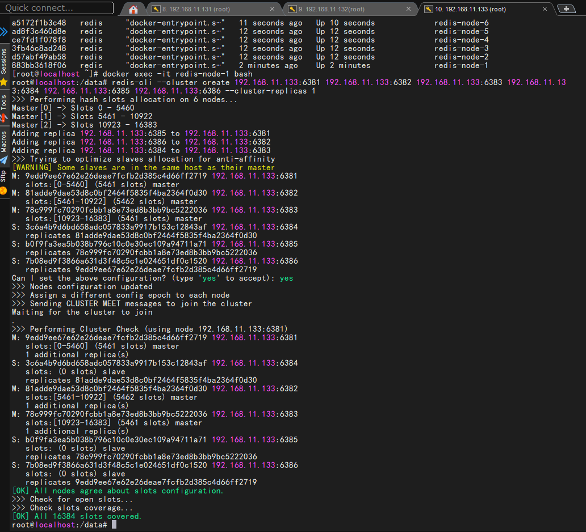
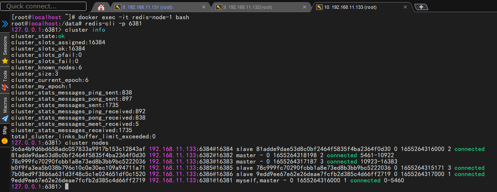
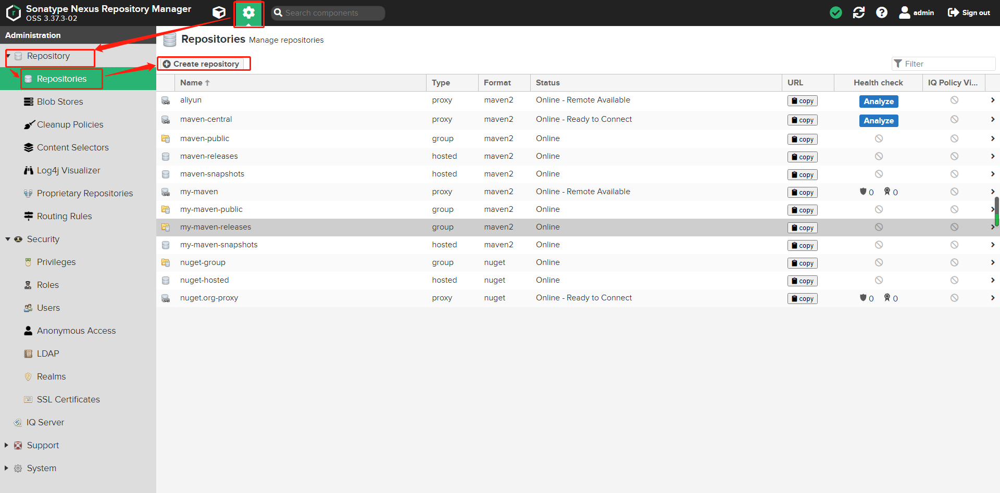
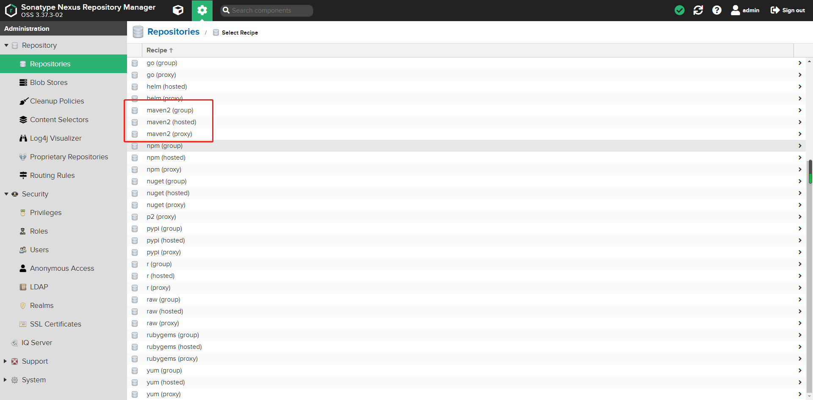
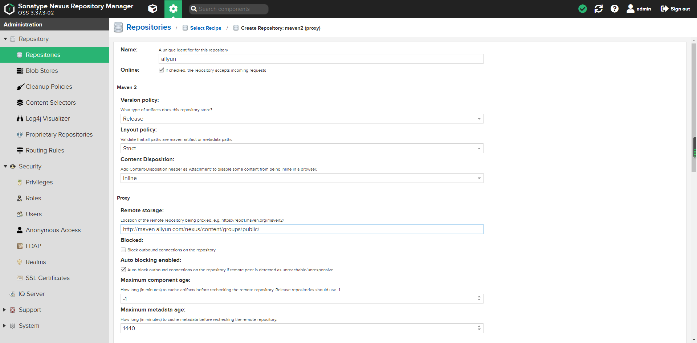
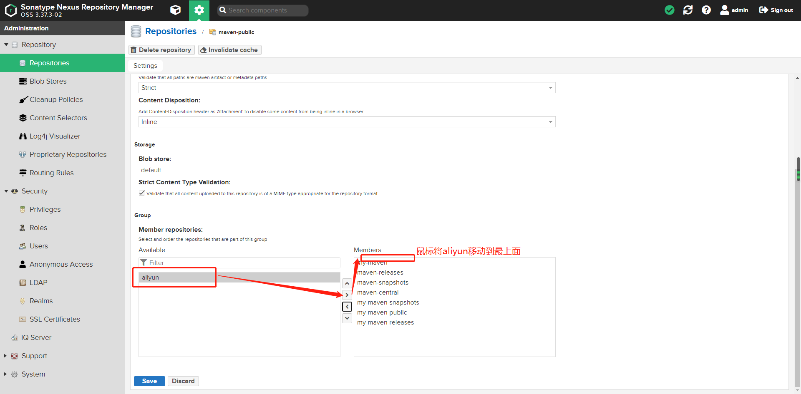

# docker 安装常用软件


## 三、安装redis
```shell
mkdir -p /usr/local/app/redis/data
touch /usr/local/app/redis/redis.conf 
```
1、准备启动的文件redis.conf

<font color='red'>redis.conf文件过长，截取部分展示</font>
```shell
# Redis configuration file example.
#
# Note that in order to read the configuration file, Redis must be
# started with the file path as first argument:
#
# ./redis-server /path/to/redis.conf

# Note on units: when memory size is needed, it is possible to specify
# it in the usual form of 1k 5GB 4M and so forth:
#
# 1k => 1000 bytes
# 1kb => 1024 bytes
# 1m => 1000000 bytes
# 1mb => 1024*1024 bytes
# 1g => 1000000000 bytes
# 1gb => 1024*1024*1024 bytes
#
# units are case insensitive so 1GB 1Gb 1gB are all the same.

################################## INCLUDES ###################################
# include /path/to/local.conf
# include /path/to/other.conf
# include /path/to/fragments/*.conf
#

################################## MODULES #####################################

# Load modules at startup. If the server is not able to load modules
# it will abort. It is possible to use multiple loadmodule directives.
#
# loadmodule /path/to/my_module.so
# loadmodule /path/to/other_module.so

################################## NETWORK #####################################

# bind 192.168.1.100 10.0.0.1     # listens on two specific IPv4 addresses
# bind 127.0.0.1 ::1              # listens on loopback IPv4 and IPv6
# bind * -::*                     # like the default, all available interfaces
#

#
# bind-source-addr 10.0.0.1


# Accept connections on the specified port, default is 6379 (IANA #815344).
# If port 0 is specified Redis will not listen on a TCP socket.
port 6379

# TCP listen() backlog.
#
# In high requests-per-second environments you need a high backlog in order
# to avoid slow clients connection issues. Note that the Linux kernel
# will silently truncate it to the value of /proc/sys/net/core/somaxconn so
# make sure to raise both the value of somaxconn and tcp_max_syn_backlog
# in order to get the desired effect.
tcp-backlog 511

# Unix socket.
#
# Specify the path for the Unix socket that will be used to listen for
# incoming connections. There is no default, so Redis will not listen
# on a unix socket when not specified.
#
# unixsocket /run/redis.sock
# unixsocketperm 700

# Close the connection after a client is idle for N seconds (0 to disable)
timeout 0

tcp-keepalive 300

# Apply OS-specific mechanism to mark the listening socket with the specified
# ID, to support advanced routing and filtering capabilities.
#
# On Linux, the ID represents a connection mark.
# On FreeBSD, the ID represents a socket cookie ID.
# On OpenBSD, the ID represents a route table ID.
#
# The default value is 0, which implies no marking is required.
# socket-mark-id 0

################################# TLS/SSL #####################################

# By default, TLS/SSL is disabled. To enable it, the "tls-port" configuration
# directive can be used to define TLS-listening ports. To enable TLS on the
# default port, use:
#
# port 0
# tls-port 6379


# By default, a Redis replica does not attempt to establish a TLS connection
# with its master.
#
# Use the following directive to enable TLS on replication links.
#
# tls-replication yes

# By default, the Redis Cluster bus uses a plain TCP connection. To enable
# TLS for the bus protocol, use the following directive:
#
# tls-cluster yes

# By default, only TLSv1.2 and TLSv1.3 are enabled and it is highly recommended
# that older formally deprecated versions are kept disabled to reduce the attack surface.
# You can explicitly specify TLS versions to support.
# Allowed values are case insensitive and include "TLSv1", "TLSv1.1", "TLSv1.2",
# "TLSv1.3" (OpenSSL >= 1.1.1) or any combination.
# To enable only TLSv1.2 and TLSv1.3, use:
#
# tls-protocols "TLSv1.2 TLSv1.3"

# Configure allowed ciphers.  See the ciphers(1ssl) manpage for more information
# about the syntax of this string.
#
# Note: this configuration applies only to <= TLSv1.2.
#
# tls-ciphers DEFAULT:!MEDIUM
#
# tls-session-cache-timeout 60

################################# GENERAL #####################################

# By default Redis does not run as a daemon. Use 'yes' if you need it.
# Note that Redis will write a pid file in /var/run/redis.pid when daemonized.
# When Redis is supervised by upstart or systemd, this parameter has no impact.
daemonize no

replica-serve-stale-data yes

# You can configure a replica instance to accept writes or not. Writing against
# a replica instance may be useful to store some ephemeral data (because data
# written on a replica will be easily deleted after resync with the master) but
# may also cause problems if clients are writing to it because of a
# misconfiguration.
#
# Since Redis 2.6 by default replicas are read-only.
#
# Note: read only replicas are not designed to be exposed to untrusted clients
# on the internet. It's just a protection layer against misuse of the instance.
# Still a read only replica exports by default all the administrative commands
# such as CONFIG, DEBUG, and so forth. To a limited extent you can improve
# security of read only replicas using 'rename-command' to shadow all the
# administrative / dangerous commands.
replica-read-only yes

# Replication SYNC strategy: disk or socket.
#
# New replicas and reconnecting replicas that are not able to continue the
# replication process just receiving differences, need to do what is called a
# "full synchronization". An RDB file is transmitted from the master to the
# replicas.
#
################################## SECURITY ###################################

# Warning: since Redis is pretty fast, an outside user can try up to
# 1 million passwords per second against a modern box. This means that you
# should use very strong passwords, otherwise they will be very easy to break.
# Note that because the password is really a shared secret between the client
# and the server, and should not be memorized by any human, the password
# can be easily a long string from /dev/urandom or whatever, so by using a
# long and unguessable password no brute force attack will be possible.

# Redis ACL users are defined in the following format:
#
#   user <username> ... acl rules ...
#
# For example:
#
#   user worker +@list +@connection ~jobs:* on >ffa9203c493aa99
#
# The special username "default" is used for new connections. If this user
# has the "nopass" rule, then new connections will be immediately authenticated
# as the "default" user without the need of any password provided via the
# AUTH command. Otherwise if the "default" user is not flagged with "nopass"
# the connections will start in not authenticated state, and will require
# AUTH (or the HELLO command AUTH option) in order to be authenticated and
# start to work.
#
# ACL LOG
#
# The ACL Log tracks failed commands and authentication events associated
# with ACLs. The ACL Log is useful to troubleshoot failed commands blocked
# by ACLs. The ACL Log is stored in memory. You can reclaim memory with
# ACL LOG RESET. Define the maximum entry length of the ACL Log below.
acllog-max-len 128

# Command renaming (DEPRECATED).
#
# ------------------------------------------------------------------------
# WARNING: avoid using this option if possible. Instead use ACLs to remove
# commands from the default user, and put them only in some admin user you
# create for administrative purposes.
# ------------------------------------------------------------------------
#
# It is possible to change the name of dangerous commands in a shared
# environment. For instance the CONFIG command may be renamed into something
# hard to guess so that it will still be available for internal-use tools
# but not available for general clients.
#
# Example:
#
################################### CLIENTS ####################################

# Set the max number of connected clients at the same time. By default
# this limit is set to 10000 clients, however if the Redis server is not
# able to configure the process file limit to allow for the specified limit
# the max number of allowed clients is set to the current file limit
# minus 32 (as Redis reserves a few file descriptors for internal uses).
#
# Once the limit is reached Redis will close all the new connections sending
# an error 'max number of clients reached'.
#
# IMPORTANT: When Redis Cluster is used, the max number of connections is also
# shared with the cluster bus: every node in the cluster will use two
# connections, one incoming and another outgoing. It is important to size the
# limit accordingly in case of very large clusters.
#
# maxclients 10000

############################## MEMORY MANAGEMENT ################################

############################# LAZY FREEING ####################################

lazyfree-lazy-eviction no
lazyfree-lazy-expire no
lazyfree-lazy-server-del no
replica-lazy-flush no
lazyfree-lazy-user-del no
lazyfree-lazy-user-flush no

################################ THREADED I/O #################################

############################ KERNEL OOM CONTROL ##############################

oom-score-adj no

disable-thp yes

############################## APPEND ONLY MODE ###############################

appendonly no

appendfilename "appendonly.aof"

appenddirname "appendonlydir"

# The fsync() call tells the Operating System to actually write data on disk
# instead of waiting for more data in the output buffer. Some OS will really flush
# data on disk, some other OS will just try to do it ASAP.
#
# appendfsync always
appendfsync everysec
# appendfsync no

auto-aof-rewrite-percentage 100
auto-aof-rewrite-min-size 64mb

aof-load-truncated yes

aof-timestamp-enabled no

################################ SHUTDOWN #####################################


################ NON-DETERMINISTIC LONG BLOCKING COMMANDS #####################

# Maximum time in milliseconds for EVAL scripts, functions and in some cases
# modules' commands before Redis can start processing or rejecting other clients.
#
################################ REDIS CLUSTER  ###############################
#
# Default is 'yes' (allow automatic migrations).
#
# cluster-allow-replica-migration yes


# In order to setup your cluster make sure to read the documentation
# available at https://redis.io web site.

########################## CLUSTER DOCKER/NAT support  ########################

# * cluster-announce-ip
# * cluster-announce-port
# * cluster-announce-tls-port
# * cluster-announce-bus-port

#
# cluster-announce-ip 10.1.1.5
# cluster-announce-tls-port 6379
# cluster-announce-port 0
# cluster-announce-bus-port 6380

################################## SLOW LOG ###################################

slowlog-log-slower-than 10000

# There is no limit to this length. Just be aware that it will consume memory.
# You can reclaim memory used by the slow log with SLOWLOG RESET.
slowlog-max-len 128

################################ LATENCY MONITOR ##############################

#
# By default latency monitoring is disabled since it is mostly not needed
# if you don't have latency issues, and collecting data has a performance
# impact, that while very small, can be measured under big load. Latency
# monitoring can easily be enabled at runtime using the command
# "CONFIG SET latency-monitor-threshold <milliseconds>" if needed.
latency-monitor-threshold 0

################################ LATENCY TRACKING ##############################

############################# EVENT NOTIFICATION ##############################

# Redis can notify Pub/Sub clients about events happening in the key space.
# This feature is documented at https://redis.io/topics/notifications
#
# For instance if keyspace events notification is enabled, and a client
# performs a DEL operation on key "foo" stored in the Database 0, two
# messages will be published via Pub/Sub:
#
#  Example: to enable list and generic events, from the point of view of the
#           event name, use:
#
#  notify-keyspace-events Elg
#
#  Example 2: to get the stream of the expired keys subscribing to channel
#             name __keyevent@0__:expired use:
#
#  notify-keyspace-events Ex
#
#  By default all notifications are disabled because most users don't need
#  this feature and the feature has some overhead. Note that if you don't
#  specify at least one of K or E, no events will be delivered.
notify-keyspace-events ""

############################### ADVANCED CONFIG ###############################

list-max-listpack-size -2

# Lists may also be compressed.
# Compress depth is the number of quicklist ziplist nodes from *each* side of
# the list to *exclude* from compression.  The head and tail of the list
# are always uncompressed for fast push/pop operations.  Settings are:
# 0: disable all list compression
# 1: depth 1 means "don't start compressing until after 1 node into the list,
#    going from either the head or tail"
#    So: [head]->node->node->...->node->[tail]
#    [head], [tail] will always be uncompressed; inner nodes will compress.
# 2: [head]->[next]->node->node->...->node->[prev]->[tail]
#    2 here means: don't compress head or head->next or tail->prev or tail,
#    but compress all nodes between them.
# 3: [head]->[next]->[next]->node->node->...->node->[prev]->[prev]->[tail]
# etc.
list-compress-depth 0

set-max-intset-entries 512

# Similarly to hashes and lists, sorted sets are also specially encoded in
# order to save a lot of space. This encoding is only used when the length and
# elements of a sorted set are below the following limits:
zset-max-listpack-entries 128
zset-max-listpack-value 64

hll-sparse-max-bytes 3000

# Streams macro node max size / items. The stream data structure is a radix
# tree of big nodes that encode multiple items inside. Using this configuration
# it is possible to configure how big a single node can be in bytes, and the
# maximum number of items it may contain before switching to a new node when
# appending new stream entries. If any of the following settings are set to
# zero, the limit is ignored, so for instance it is possible to set just a
# max entries limit by setting max-bytes to 0 and max-entries to the desired
# value.
stream-node-max-bytes 4096
stream-node-max-entries 100

activerehashing yes

# Both the hard or the soft limit can be disabled by setting them to zero.
client-output-buffer-limit normal 0 0 0
client-output-buffer-limit replica 256mb 64mb 60
client-output-buffer-limit pubsub 32mb 8mb 60

# Redis calls an internal function to perform many background tasks, like
# closing connections of clients in timeout, purging expired keys that are
# never requested, and so forth.

hz 10

dynamic-hz yes

aof-rewrite-incremental-fsync yes

rdb-save-incremental-fsync yes

# lfu-log-factor 10
# lfu-decay-time 1

########################### ACTIVE DEFRAGMENTATION #######################
#
# What is active defragmentation?
# -------------------------------

# activedefrag no


# Jemalloc background thread for purging will be enabled by default
jemalloc-bg-thread yes
#
# ignore-warnings ARM64-COW-BUG
```
### redis的启动命令
```shell
docker pull redis
```
```shell
docker run -d -p 6379:6379 \
-v /usr/local/docker/redis/redis.conf:/etc/redis/redis.conf  \
-v /usr/local/docker/redis/data:/data \
--privileged=true \
--name redis redis redis-server /etc/redis/redis.conf
```
## redis的集群安装
|                        命令                         |             说明             |
| :-------------------------------------------------: | :--------------------------: |
|                     docker run                      |    创建并运行docker容器实例    |
|                 --name redis-node-6                 |           容器名字            |
|                    --net   host                     |   使用宿主机的ip和端口，默认   |
|                  --privileged=true                  |     获取宿主机root用户权限     |
| -v /usr/local/docker/redis/share/redis-node-6:/data | 容器卷，宿主机地址:容器内部地址 |
|                      redis:xxx                      |       redis镜像和版本号       |
|                --cluster-enabled yes                |         开启redis集群         |
|                  --appendonly yes                   |          开启持久化           |
|                     --port 6386                     |         redis端口号          |

+ 启动命令
```shell
docker run -d --name redis-node-1 --net host --privileged=true -v /usr/local/docker/redis/share/redis-node-1:/data redis --cluster-enabled yes --appendonly yes --port 6381

docker run -d --name redis-node-2 --net host --privileged=true -v /usr/local/docker/redis/share/redis-node-2:/data redis --cluster-enabled yes --appendonly yes --port 6382

docker run -d --name redis-node-3 --net host --privileged=true -v /usr/local/docker/redis/share/redis-node-3:/data redis --cluster-enabled yes --appendonly yes --port 6383

docker run -d --name redis-node-4 --net host --privileged=true -v /usr/local/docker/redis/share/redis-node-4:/data redis --cluster-enabled yes --appendonly yes --port 6384

docker run -d --name redis-node-5 --net host --privileged=true -v /usr/local/docker/redis/share/redis-node-5:/data redis --cluster-enabled yes --appendonly yes --port 6385

docker run -d --name redis-node-6 --net host --privileged=true -v /usr/local/docker/redis/share/redis-node-6:/data redis --cluster-enabled yes --appendonly yes --port 6386
```
+ 然后构建主从关系
```shell
# 进入redis-node-1构建
docker exec -it redis-node-1 bash
# 注意，进入docker容器后才能执行一下命令，且注意自己的真实IP地址
redis-cli --cluster create 192.168.11.133:6381 192.168.11.133:6382 192.168.11.133:6383 192.168.11.133:6384 192.168.11.133:6385 192.168.11.133:6386 --cluster-replicas 1
# 切记里面设置配置的时候是yes不是y
```
+ 查看集群状态
以6381为切入点，查看集群状态
```shell
#进入界面redis内部查看信息
redis-cli -p 6381
cluster info
cluster nodes
```
如下如：  
  
  
```shell
127.0.0.1:6381> cluster nodes
3c6a4b9d6bd658adc057833a9917b153c12843af 192.168.11.133:6384@16384 slave 81adde9dae53d8c0bf2464f5835f4ba2364f0d30 0 1655264316000 2 connected
81adde9dae53d8c0bf2464f5835f4ba2364f0d30 192.168.11.133:6382@16382 master - 0 1655264318198 2 connected 5461-10922
78c999fc70290fcbb1a8e73ed8b3bb9bc5222036 192.168.11.133:6383@16383 master - 0 1655264317187 3 connected 10923-16383
b0f9fa3ea5b038b796c10c0e30ec109a94711a71 192.168.11.133:6385@16385 slave 78c999fc70290fcbb1a8e73ed8b3bb9bc5222036 0 1655264315171 3 connected
7b08ed9f3866a631d3f48c5c1e024651df0c1520 192.168.11.133:6386@16386 slave 9edd9ee67e62e26deae7fcfb2d385c4d66ff2719 0 1655264317000 1 connected
9edd9ee67e62e26deae7fcfb2d385c4d66ff2719 192.168.11.133:6381@16381 myself,master - 0 1655264316000 1 connected 0-5460
```
<font color='red'>请看以上的6382、6383、6381都是master。然后6384、6385、6386都是slave,是内部随机分配的一主一从。</font>  
```shell
看服务尾号id：  
2719的master下面绑定的是1520的从服务  
2036的master下面绑定的是1a71的从服务  
0d30的master下面绑定的是43af的从服务
```


## 七、安装maven

> docker pull tomcat

## 八、安装nexus
### 安装nexus
+ 1、下载镜像
> docker pull sonatype/nexus3

+ 2、创建挂在目录
> mkdir -vp /usr/local/docker/nexus/nexus-data
+ 3、启动Nexus容器
```shell
    docker run -d  \
   --name nexus3  \
   -p 8081:8081 \
   -v /usr/local/nexus/nexus-data:/var/nexus-data \
   sonatype/nexus3
```
 + 4、开放端口
 > firewall-cmd --permanent --add-port=8081/tcp
 > firewall-cmd --reload

+ 5、安装完后访问地址
> http://IP:8081/
###  如何获取并且修改登录密码
```shell
1、  docker exec -it 容器id bash
2、  cd /opt/sonatype/sonatype-work/nexus3/
3、  cat admin.password
```
<font color='blue'>
此时就可以看到默认的密码32位的uuid复制粘贴到浏览器的admin/密码即可
登录成功后会提示修改新密码123456(修改为自己的)即可
</font>

后续创建仓库，java如何连接请看次博客
> https://blog.csdn.net/qq_40104261/article/details/118607341
### 配置使用
+ 一、新增maven的代理仓库
> 1、<font color='red'>Pepository -> Repositories ->  create repository</font>  
> 2、选择类型为<font color='red'>mavne2(proxy)</font>  
> 3、配置proxy的(remote storage)阿里云私服 http://maven.aliyun.com/nexus/content/groups/public/ 名称为aliyun，保存。  
> 4、编辑<font color='red'>maven-public</font>,group中刚添加的aliyun,添加到右边，然后鼠标移动到最上面(优先级最高)，保存。  
> 5、点击<font color='red'>maven-public</font>条目的 <font color='red'>copy</font>  






### 私服的搭建配置
+ 1、编写settings.xml(idea配置maven的时候直接指定为以下文件即可)
```xml
<?xml version="1.0" encoding="UTF-8"?>
<settings xmlns="http://maven.apache.org/SETTINGS/1.0.0"
          xmlns:xsi="http://www.w3.org/2001/XMLSchema-instance"
          xsi:schemaLocation="http://maven.apache.org/SETTINGS/1.0.0 http://maven.apache.org/xsd/settings-1.0.0.xsd">

  <localRepository>D:\\maven\\repo</localRepository>
  <pluginGroups>
	<pluginGroup>com.spotify</pluginGroup>  
  </pluginGroups>
  <proxies>
  </proxies>
  <servers>
  	<server>  
      <id>maven-public</id>
      <username>admin</username>
      <password>123456</password>
    </server>
    <server>  
      <id>maven-releases</id>
      <username>admin</username>
      <password>123456</password>
    </server>
    <server>  
      <id>maven-snapshots</id>
      <username>admin</username>
      <password>123456</password>
    </server>
  </servers>

  <mirrors>
    <mirror>
        <id>alimaven</id>
        <name>aliyun maven</name>
        <url>http://maven.aliyun.com/nexus/content/repositories/central/</url>
        <mirrorOf>central</mirrorOf>
    </mirror>
     <!-- <mirror>
        <id>self</id>
        <name>self maven</name>
        <url>http://192.168.11.131:8081/repository/maven-public/</url>
        <mirrorOf>central</mirrorOf>
    </mirror> -->
  </mirrors>
  <profiles>
    <profile>  
      <id>dev</id>  
      <repositories>  
        <repository>  
            <id>local-nexus</id>
              <url>http://192.168.11.131:8081/repository/maven-public/</url>  
            <releases>  
              <enabled>true</enabled>
              <updatePolicy>always</updatePolicy>
            </releases>  
            <snapshots>  
              <enabled>true</enabled>  
              <updatePolicy>always</updatePolicy>
            </snapshots>  
        </repository> 
      </repositories>  
      <pluginRepositories>
          <pluginRepository>
              <id>public</id>
              <name>Public Repositories</name>
              <url>http://192.168.11.131:8081/repository/maven-public/</url>
          </pluginRepository>
      </pluginRepositories>
    </profile>  
  </profiles>

  <activeProfiles>  
      <activeProfile>dev</activeProfile>  
  </activeProfiles>
</settings>
```
+ 2、项目中的使用
```xml
<distributionManagement>
        <repository>
            <id>maven-releases</id>
            <name>Releases</name>
            <url>http://192.168.11.131:8081/repository/maven-releases/</url>
        </repository>
        <snapshotRepository>
            <id>maven-snapshots</id>
            <name>Snapshot</name>
            <url>http://192.168.11.131:8081/repository/maven-snapshots/</url>
        </snapshotRepository>
    </distributionManagement>
```


# docker其他命令
### 赋予挂在磁盘的授权命令
> --privileged=true [启动命令追加]
### 查看容器内部细节
> docker <font color='red'>inspect</font> 容器id

```shell
[
    {
        "Id": "be3ce5adf458c11a9a823e2096e49b3354b3a3373a038fda892bbccb3dcd20d1",
        "Created": "2022-06-08T03:26:58.981115344Z",
        "Path": "bin/docker-startup.sh",
        "Args": [],
        ......
    }
]
```
### 进入正在运行的容器
> docker exec -it 容器id [bash]or[/bin/bash]

> 前台启动：<font color='red'>docker run -it redis</font>  
> 后台启动：<font color='red'>docker run -d redis</font>

#### 重新进入

> docker attach 容器id

#### attach和exec区别
> 1、attach直接进入容器启动命令的终端，不会启动新的进程用exit退出，会导致容器的停止。  
> 2、exec实在容器中打开新的终端，并且可以启动新的进程用exit退出，不会导致容器的停止。  

### 拷贝容器文件到主机
> docker cp 容器id:容器类路径 宿主机路径
### 导入导出容器
>导出 docker export 容器id > a.tar
>导入 cat a.tar | docker import - 新名字 
### 其他相关命令
  

| 命令 | 英文介绍 | 中文介绍 |
| :----: | ---- | :----: |
| attach |   Attach to a running container   | 当前 shell 下 attach 连接指定运行镜像 |
| build  |   Build an image from a Dockerfile | 通过 Dockerfile 定制镜像 |
| commit |   Create a new image from a container changes | 提交当前容器为新的镜像 |
| cp     |   Copy files/folders from the containers filesystem to the host path    |  从容器中拷贝指定文件或者目录到宿主机中 |
| create |   Create a new container                         |   创建一个新的容器，同 run，但不启动容器 |
| diff   |   Inspect changes on a container's filesystem    |   查看 docker 容器变化 |
| events |   Get real time events from the server           |   从 docker 服务获取容器实时事件 |
| exec   |   Run a command in an existing container         |   在已存在的容器上运行命令 |
| export |   Stream the contents of a container as a tar archive    |   导出容器的内容流作为一个 tar 归档文件[对应 import ] |
| history |  Show the history of an image                   |   展示一个镜像形成历史 |
| images  |  List images                                    |   列出系统当前镜像 |
| import  |  Create a new filesystem image from the contents of a tarball  |   从tar包中的内容创建一个新的文件系统映像[对应export] |
| info    |  Display system-wide information                |   显示系统相关信息 |
| inspect |  Return low-level information on a container    |   查看容器详细信息 |
| kill    |  Kill a running container                       |   kill 指定 docker 容器 |
| load    |  Load an image from a tar archive               |   从一个 tar 包中加载一个镜像[对应 save] |
| login   |  Register or Login to the docker registry server     |   注册或者登陆一个 docker 源服务器 |
| logout  |  Log out from a Docker registry server           |   从当前 Docker registry 退出 |
| logs    |  Fetch the logs of a container                  |   输出当前容器日志信息 |
| port    |  Lookup the public-facing port which is NAT-ed to PRIVATE_PORT     |   查看映射端口对应的容器内部源端口 |
| pause   |  Pause all processes within a container         |   暂停容器 |
| ps      |  List containers                                |   列出容器列表 |
| pull    |  Pull an image or a repository from the docker registry server    |   从docker镜像源服务器拉取指定镜像或者库镜像 |
| push    |  Push an image or a repository to the docker registry server     |   推送指定镜像或者库镜像至docker源服务器 |
| restart |  Restart a running container                    |   重启运行的容器 |
| rm      |  Remove one or more containers                  |   移除一个或者多个容器 |
| rmi     |  Remove one or more images        |   移除一个或多个镜像[无容器使用该镜像才可删除，否则需删除相关容器才可继续或 -f 强制删除] |
| run     |  Run a command in a new container               |   创建一个新的容器并运行一个命令 |
| save    |  Save an image to a tar archive                 |   保存一个镜像为一个 tar 包[对应 load] |
| search  |  Search for an image on the Docker Hub          |   在 docker hub 中搜索镜像 |
| start   |  Start a stopped containers                     |   启动容器 |
| stop    |  Stop a running containers                      |   停止容器 |
| tag     |  Tag an image into a repository                 |   给源中镜像打标签 |
| top     |  Lookup the running processes of a container    |   查看容器中运行的进程信息 |
| unpause |  Unpause a paused container                     |   取消暂停容器 |
| version |  Show the docker version information            |   查看 docker 版本号 |
| wait    |  Block until a container stops, then print its exit code    |   截取容器停止时的退出状态值 |
 
# Dockerfile
### Dockerfile的相关命令
+ FROM
> 镜像基础，当新建镜像是基于哪个镜像的，指定一个已经存在的进行做为模板，第一条必须是from
+ MAINTAINER
> 镜像维护者的姓名和邮箱地址
+ RUN
`1、容器构建时序言运行的命令
2、两种格式：
| 格式名称    |  作用   |
| :-: | :-: |
|  shell   |  eg: RUN yum -y install   |
|  exec   |  RUN["可执行文件","参数1","参数2"...] eg:RUN["./test.php","dev","offline"]等价于RUN ./test.php dev offline  |
3、exec格式【RUN ''】
RUN是在docker build时运行`

+ EXPOSE
>当前容器暴露在外的端口
+ WORKDIR
>指定在容器创建后，默认终端登录进来的工作目录，一个落脚点
+ USER
> 指定该镜像以什么样的用户去执行，如果都不指定，默认是root
+ ENV
> 用来构建镜像过程中设置环境变量
+ ADD
>将宿主机目录下的文件拷贝进镜像且会自动处理URL和解压tar压缩包
+ COPY
> 宿主机内容拷贝到容器中
+ VOLUME
> 容器数据卷，用于保存数据和持久化工作
+ CMD
> 指定容器启动后端要干什么事情
> dockerfile中可以有多个cmd指令，但是只有最有一个生效，cmd会被docker run之后的参数替代
> CMD是在docker run时运行
> RUN 是在docker build时运行
+ ENTRYPOINT
> ENTRYPOINT 课和cmd一起使用，一般是<font color='red'>变参</font>才会使用cmd，这里的cmd等价于在给ENTRYPOINT传参。
> 定制定了ENTRYPOINT后，CMD的含义就发生了变化，不再是直接运行期命令而是将CMD的内容作为参数传递给ENTRYPOINT指令，他们组合
> 后<ENTRYPOINT><CMD>
案例分析：假设已经通过dockerfile构建了nginx:test镜像

FROM nginx
ENTRYPOINT ['nginx','-c' ] #定参
CMD ['/etc/nginx/nginx.conf'] #变参

|     是否传参     |      按照dockerfile编写执行      |                  传参执行                  |
| :-------------: | :----------------------------: | :---------------------------------------: |
|   Docker命令    |     docker run nginx:test      | docker run nginx:test /etc/nginx/new.conf |
| 衍生出的实际命令 | nginx -c /etc/nginx/nginx.conf |       nginx -c /etc/nginx/new.conf        |
## dockerfile构建java8镜像
```shell
#java官网地址
https://www.oracle.com/java/technologies/javase/jdk-relnotes-index.html 
https://www.oracle.com/java/technologies/downloads/archive/
https://www.oracle.com/java/technologies/javase/javase8u211-later-archive-downloads.html
```
### 1、编写Dockerfile文件

必须大写字母D命名的文件
> vim Dockerfile

```shell
FROM centos
MAINTAINER crown<1056481167@@qq.com>
 
ENV MYPATH /usr/local
WORKDIR $MYPATH
 
#安装vim编辑器
RUN yum -y install vim
#安装ifconfig命令查看网络IP
RUN yum -y install net-tools
#安装java8及lib库
RUN yum -y install glibc.i686
RUN mkdir /usr/local/java
#ADD 是相对路径jar,把jdk-8u171-linux-x64.tar.gz添加到容器中,安装包必须要和Dockerfile文件在同一位置
ADD jdk-8u211-linux-x64.tar.gz /usr/local/java/
#配置java环境变量
ENV JAVA_HOME /usr/local/java/jdk1.8.0_211
ENV JRE_HOME $JAVA_HOME/jre
ENV CLASSPATH $JAVA_HOME/lib/dt.jar:$JAVA_HOME/lib/tools.jar:$JRE_HOME/lib:$CLASSPATH
ENV PATH $JAVA_HOME/bin:$PATH
 
EXPOSE 80
 
CMD echo $MYPATH
CMD echo "success--------------ok"
CMD /bin/bash

```
### 2、构建
```shell
# 注意，1、进入到编写Dockerfile的目录下执行命令
# 2、TAG后面有个空格，有个 <font color='red'>.</font>
docker build -t 新镜像名称:TAG . 
```
### 3、运行
```shell
docker run -it 新镜像名称:TAG
```
### 
