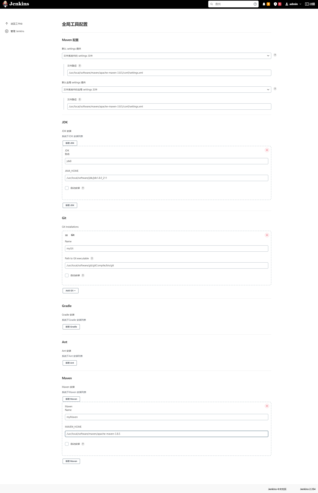
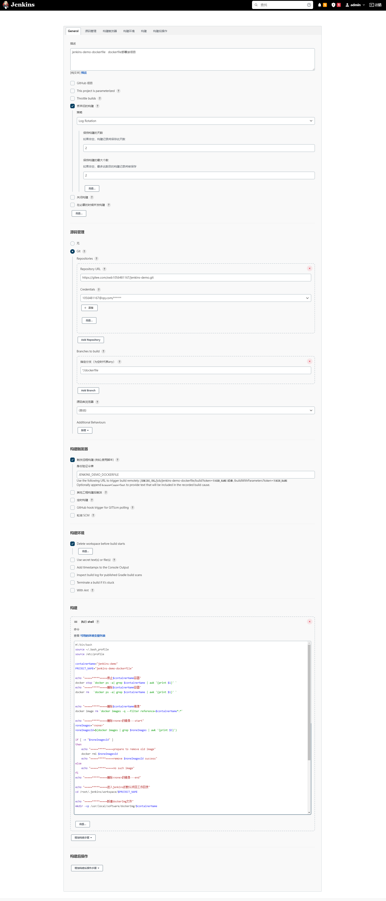
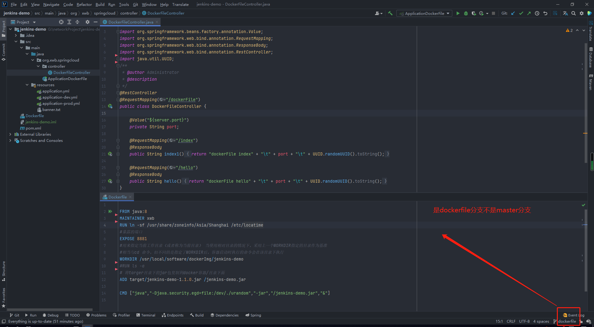
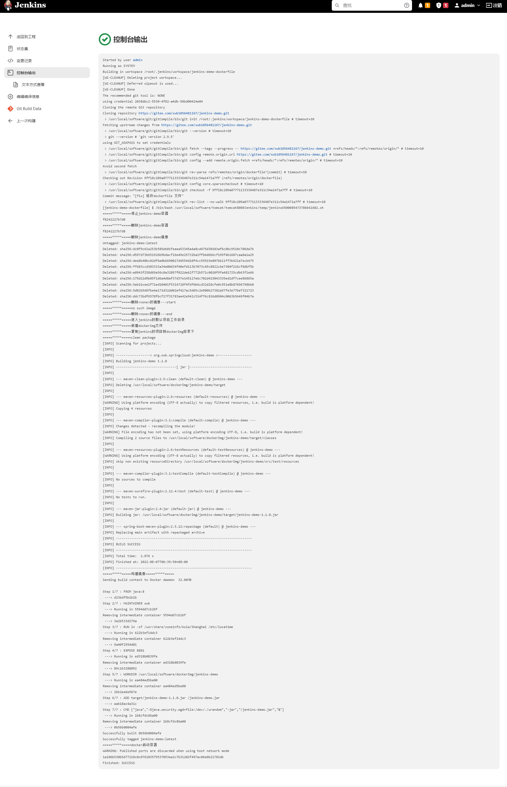
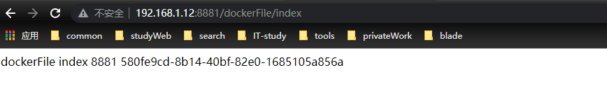
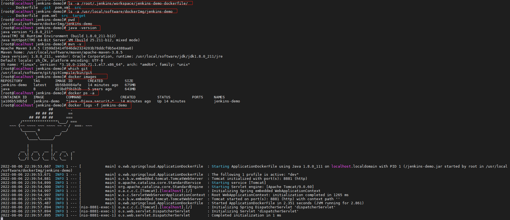

# jenkins部署springboot项目、制作Dockerfile启动在docker容器中
## 1、环境的搭建
+ 以下环境的搭建均为本人实际操作,并记录的日志，若在搭建那过程中有任何疑问,请与作者联系，互相学习
><font color='red'>1、jdk安装</font>  
https://blog.csdn.net/www1056481167/article/details/126028093  
<font color='red'>2、git安装</font>  
https://blog.csdn.net/www1056481167/article/details/126028234  
<font color='red'>3、maven安装</font>  
https://blog.csdn.net/www1056481167/article/details/126027146  
<font color='red'>4、nodeJs的安装</font>  
https://blog.csdn.net/www1056481167/article/details/125997256  
<font color='red'>5、tomcat的搭建</font>  
https://blog.csdn.net/www1056481167/article/details/115396974"  
<font color='red'>6、jenkins的安装</font>  
方式一：(<font color='red'>推荐</font>)  
war包部署在tomcat中方式：https://blog.csdn.net/www1056481167/article/details/126034277  
方式二：  
docker中安装jenkins：https://blog.csdn.net/www1056481167/article/details/125580290  

## 2、jenkins的全局工具配置

## 3、jenkins的项目配置


## 4、脚本编写(<font color='red'>核心</font>)

### <font color='red'>注意</font>
1、jenkins部署的项目情况截图  
  
2、**<font color='red'>该项目的测试分支是dockerfile分支</font>**  
3、项目位置(项目开源、可拉取测试)：https://gitee.com/xwb1056481167/jenkins-demo  
### 1、Dockerfile文件信息
```dockerfile
FROM java:8
MAINTAINER xwb
RUN ln -sf /usr/share/zoneinfo/Asia/Shanghai /etc/locatime
#暴露的端口
EXPOSE 8881
#用来指定当前工作目录（或者称为当前目录） 当使用相对目录的情况下，采用上一个WORKDIR指定的目录作为基准
#相当与cd 命令，但不同的是指定了WORKDIR后，容器启动时执行的命令会在该目录下执行
WORKDIR /usr/local/software/dockerImg/jenkins-demo
#RUN ls -a
# 将targer目录下的jar包复制到docker容器/目录下面
ADD target/jenkins-demo-1.1.0.jar /jenkins-demo.jar
CMD ["java","-Djava.security.egd=file:/dev/./urandom","-jar","/jenkins-demo.jar","&"]
```
### 2、shell信息
```shell
#!/bin/bash
source ~/.bash_profile
source /etc/profile

containerName="jenkins-demo"
PROJECT_NAME="jenkins-demo-dockerfile"

echo "=====*****=====停止$containerName容器"
docker stop `docker ps -a| grep $containerName | awk '{print $1}' `
echo "=====*****=====删除$containerName容器"
docker rm   `docker ps -a| grep $containerName | awk '{print $1}' `


echo "=====*****=====删除$containerName镜像"
docker image rm `docker images -q --filter reference=$containerName*:*`

echo "=====*****=====删除<none>的镜像---start"
noneImages="<none>"
noneImagesId=$(docker images | grep $noneImages | awk '{print $3}')

if [ -n "$noneImagesId" ]
then
    echo "=====*****=====prepare to remove old image"
    docker rmi $noneImagesId
    echo "=====*****=====remove $noneImagesId success"
else
    echo "=====*****=====no such image"
fi
echo "=====*****=====删除<none>的镜像---end"

echo "=====*****=====进入jenkins的默认项目工作目录"
cd /root/.jenkins/workspace/$PROJECT_NAME

echo "=====*****=====新建dockerImg文件"
mkdir -vp /usr/local/software/dockerImg/$containerName


echo "=====*****=====复制jenkins的项目到dockerImg目录下"
cd /usr/local/software/dockerImg/$containerName
\cp -R /root/.jenkins/workspace/$PROJECT_NAME/* /usr/local/software/dockerImg/$containerName

echo "=====*****=====clean package"
mvn clean package

echo "=====*****=====构建镜像=====*****====="
docker build -f Dockerfile  -t $containerName .

echo "=====*****=====docker启动容器"
docker run --name $containerName -d -p 8881:8881   --network=host $containerName

# 钩子触发程序
#http://192.168.1.12:8080/jenkins/job/jenkins-demo-dockerfile/build?token=JENKINS_DEMO_DOCKERFILE
```
## 5、启动日志

## 6、地址栏请求接口
+ 如果访问不通有可能端口没放开
```shell
firewall-cmd --zone=public --add-port=8881/tcp --permanent && firewall-cmd --reload
```
+ 更换为自己的ip、加项目访问路径
```html
http://192.168.1.12:8881/dockerFile/index
```
+ 访问结果


## 7、centos中目录镜像整个过程记录



