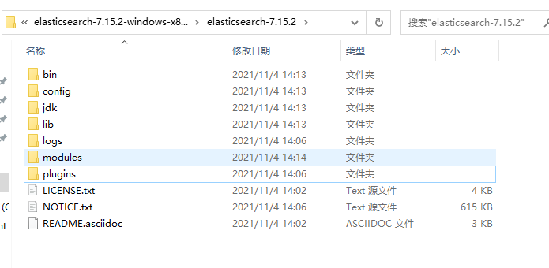

下载地址

| |elasticsearch|kibana|
|:----:|:----:|:----:|
|官网| https://www.elastic.co/cn/webinars/getting-started-elasticsearch?elektra=startpage | https://www.elastic.co/cn/webinars/getting-started-kibana?elektra=startpage |
|列表页| http://dl.elasticsearch.cn/elasticsearch/ | https://www.elastic.co/cn/downloads/past-releases#kibana |
|7.8.0| http://dl.elasticsearch.cn/elasticsearch/elasticsearch-7.8.0-linux-x86_64.tar.gz | https://artifacts.elastic.co/downloads/kibana/kibana-7.8.0-linux-x86_64.tar.gz |

版本对应说明[elasticsearch和Kibana版本对应](https://www.elastic.co/cn/support/matrix#matrix_compatibility)

下载页：https://www.elastic.co/cn/downloads/elasticsearch
# 一、安装
## 1、elasticsearch的安装(linux)
```shell
mkdir /usr/local/software
cd /usr/local/software
#创建es和kibana的文件夹
mkdir elasticsearch kibana
cd elasticsearch
#下载es
wget http://dl.elasticsearch.cn/elasticsearch/elasticsearch-7.8.0-linux-x86_64.tar.gz
#解压
tar -zxvf elasticsearch-7.8.0-linux-x86_64.tar.gz
```
####一、正式安装elasticsearch  
1、修改elasticsearch.yml
```shell
cd /usr/local/software/elasticsearch/elasticsearch-7.8.0/config/
vim elasticsearch.yml 
    cluster.name: es-study　          #为集群提供一个名称
    node.name: study-1                        #此节点名称
    path.data: /usr/local/software/elasticsearch/data         #数据存放的地址
    path.logs: /usr/local/software/elasticsearch/logs         #日志存放地址
    network.host: 0.0.0.0           #网络绑定这样设置就好了
    cluster.initial_master_nodes: ["study-1"]　#将es-node1设置为master节点
```
配置文件详解  
```yml
# ======================== Elasticsearch Configuration =========================
#
# NOTE: Elasticsearch comes with reasonable defaults for most settings.
#       Before you set out to tweak and tune the configuration, make sure you
#       understand what are you trying to accomplish and the consequences.
#
# The primary way of configuring a node is via this file. This template lists
# the most important settings you may want to configure for a production cluster.
#
# Please consult the documentation for further information on configuration options:
# https://www.elastic.co/guide/en/elasticsearch/reference/index.html
# 
# ---------------------------------- Cluster -----------------------------------
# 
# Use a descriptive name for your cluster:
# 集群名称，默认是my-application
#cluster.name: my-application
#
# ------------------------------------ Node ------------------------------------
#
# Use a descriptive name for the node:
# 节点名称
#node.name: node-1
#
# Add custom attributes to the node:
#
#node.attr.rack: r1
#
# ----------------------------------- Paths ------------------------------------
#
# Path to directory where to store the data (separate multiple locations by comma):
#可以指定es的数据存储目录
path.data: E:\tools\elasticsearch\storagePath
#
# Path to log files:
#可以指定es的日志存储目录
path.logs: E:\tools\elasticsearch\logs
#
# ----------------------------------- Memory -----------------------------------
#
# Lock the memory on startup:
#锁定物理内存地址，防止elasticsearch内存被交换出去,也就是避免es使用swap交换分区
#bootstrap.memory_lock: true
#确保ES_HEAP_SIZE参数设置为系统可用内存的一半左右
# Make sure that the heap size is set to about half the memory available
# on the system and that the owner of the process is allowed to use this
# limit.
#当系统进行内存交换的时候，es的性能很差
# Elasticsearch performs poorly when the system is swapping the memory.
#
# ---------------------------------- Network -----------------------------------
#为es设置ip绑定，默认是127.0.0.1，也就是默认只能通过127.0.0.1 或者localhost才能访问
#es1.x版本默认绑定的是0.0.0.0 所以不需要配置，但是es2.x版本默认绑定的是127.0.0.1，需要配置
# By default Elasticsearch is only accessible on localhost. Set a different
# address here to expose this node on the network:
#
network.host: 0.0.0.0
#
# By default Elasticsearch listens for HTTP traffic on the first free port it
# finds starting at 9200. Set a specific HTTP port here:
# 为es设置自定义端口，默认是9200
# 注意：在同一个服务器中启动多个es节点的话，默认监听的端口号会自动加1：例如：9200，9201，9202...
#http.port: 9200
#
# For more information, consult the network module documentation.
#
# --------------------------------- Discovery ----------------------------------
# 当启动新节点时，通过这个ip列表进行节点发现，组建集群
# 默认节点列表：
# 127.0.0.1，表示ipv4的回环地址。
# [::1]，表示ipv6的回环地址
#
# 在es1.x中默认使用的是组播(multicast)协议，默认会自动发现同一网段的es节点组建集群，
# 在es2.x中默认使用的是单播(unicast)协议，想要组建集群的话就需要在这指定要发现的节点信息了。
# 注意：如果是发现其他服务器中的es服务，可以不指定端口[默认9300]，如果是发现同一个服务器中的es服务，就需要指定端口了。
# Pass an initial list of hosts to perform discovery when this node is started:
# The default list of hosts is ["127.0.0.1", "[::1]"]
#
#discovery.seed_hosts: ["host1", "host2"]
#
# Bootstrap the cluster using an initial set of master-eligible nodes:
#
#cluster.initial_master_nodes: ["node-1", "node-2"]
#
# For more information, consult the discovery and cluster formation module documentation.
#
# ---------------------------------- Various -----------------------------------
#在一台服务器上禁止启动多个es服务
# 设置是否可以通过正则或者_all删除或者关闭索引库，默认true表示必须需要显式指定索引库名称
# 生产环境建议设置为true，删除索引库的时候必须显式指定，否则可能会误删索引库中的索引库。
# Require explicit names when deleting indices:
#
#action.destructive_requires_name: true

```
jvm.option

```yml
################################################################
##
## JVM configuration
##
################################################################
##
## WARNING: DO NOT EDIT THIS FILE. If you want to override the
## JVM options in this file, or set any additional options, you
## should create one or more files in the jvm.options.d
## directory containing your adjustments.
##
## See https://www.elastic.co/guide/en/elasticsearch/reference/7.15/jvm-options.html
## for more information.
##
################################################################


################################################################
## IMPORTANT: JVM heap size
################################################################
##
## The heap size is automatically configured by Elasticsearch
## based on the available memory in your system and the roles
## each node is configured to fulfill. If specifying heap is
## required, it should be done through a file in jvm.options.d,
## and the min and max should be set to the same value. For
## example, to set the heap to 4 GB, create a new file in the
## jvm.options.d directory containing these lines:
##
## -Xms4g
## -Xmx4g
##
## See https://www.elastic.co/guide/en/elasticsearch/reference/7.15/heap-size.html
## for more information
##
################################################################


################################################################
## Expert settings
################################################################
##
## All settings below here are considered expert settings. Do
## not adjust them unless you understand what you are doing. Do
## not edit them in this file; instead, create a new file in the
## jvm.options.d directory containing your adjustments.
##
################################################################

## GC configuration
8-13:-XX:+UseConcMarkSweepGC
8-13:-XX:CMSInitiatingOccupancyFraction=75
8-13:-XX:+UseCMSInitiatingOccupancyOnly

## G1GC Configuration
# NOTE: G1 GC is only supported on JDK version 10 or later
# to use G1GC, uncomment the next two lines and update the version on the
# following three lines to your version of the JDK
# 10-13:-XX:-UseConcMarkSweepGC
# 10-13:-XX:-UseCMSInitiatingOccupancyOnly
14-:-XX:+UseG1GC

## JVM temporary directory
-Djava.io.tmpdir=${ES_TMPDIR}

## heap dumps

# generate a heap dump when an allocation from the Java heap fails; heap dumps
# are created in the working directory of the JVM unless an alternative path is
# specified
-XX:+HeapDumpOnOutOfMemoryError

# specify an alternative path for heap dumps; ensure the directory exists and
# has sufficient space
-XX:HeapDumpPath=data

# specify an alternative path for JVM fatal error logs
-XX:ErrorFile=logs/hs_err_pid%p.log

## JDK 8 GC logging
8:-XX:+PrintGCDetails
8:-XX:+PrintGCDateStamps
8:-XX:+PrintTenuringDistribution
8:-XX:+PrintGCApplicationStoppedTime
8:-Xloggc:logs/gc.log
8:-XX:+UseGCLogFileRotation
8:-XX:NumberOfGCLogFiles=32
8:-XX:GCLogFileSize=64m

# JDK 9+ GC logging
9-:-Xlog:gc*,gc+age=trace,safepoint:file=logs/gc.log:utctime,pid,tags:filecount=32,filesize=64m

```


2、修改jvm.options
```shell
cd /usr/local/software/elasticsearch/elasticsearch-7.8.0/config/
#修改jvm.options以下参数
  -XX:+UseConcMarkSweepGC 改为 -XX:+UseG1GC
```
3、分配内存
```shell
vim /etc/security/limits.conf(添加以下信息)
  * soft nofile 65536
  * hard nofile 131072
  esUser hard memlock unllimited
  esUser soft memlock unlimited
  esUser  soft nproc  4096
  esUser  hard nproc  4096
```
4、修改虚拟内存
```shell
vim /etc/sysctl.conf
  vm.max_map_count=655360
#保存退出
sysctl -p
```
####二、创建用户(因为root操作es不被允许，所以创建一个es用户)
```shell
    groupadd esUser
    useradd -g esUser esUser #创建ela用户，并且加入ela组
    passwd esUser #为ela用户设定登录密码
    #赋权给esUser的操作权限
    chmod 777 -R /usr/local/software/elasticsearch
```
####三、最后启动es
```shell
     #保证端口开放，可以被访问，开启端口
    firewall-cmd --add-port=9200/tcp --permanent #开放端口 
    firewall-cmd --reload #重新加载
    cd /usr/local/software/elasticsearch/elasticsearch-7.8.0/bin/
    #切换es用户
    su esUser
    #启动es
    ./elasticsearch -d
```


## 2、elasticsearch的安装(windows)
解压文件elasticsearch-7.15.2-windows-x86_64.zip得到elasticsearch-7.15.2目录  


> 目录介绍  
    1、bin 主目录
    2、config 配置文件目录
    3、jdk jdk环境目录

# kinaba的安装

## kibana的安装
```shell
cd /usr/local/software/kibana
#下载kibana
wget https://artifacts.elastic.co/downloads/kibana/kibana-7.8.0-linux-x86_64.tar.gz
#解压
tar -zxvf kibana-7.8.0-linux-x86_64.tar.gz
```
server.port: 5601
server.host: "0.0.0.0"
#修改为自己es的端口
elasticsearch.url: "http://localhost:9200"
kibana.index: ".kibana"
