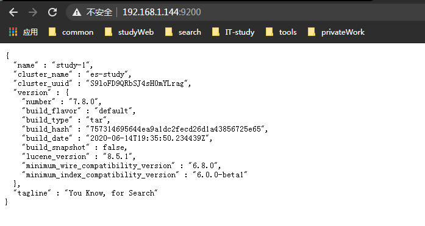

下载地址

| |elasticsearch|kibana|
|:----:|:----:|:----:|
|官网| https://www.elastic.co/cn/webinars/getting-started-elasticsearch?elektra=startpage | https://www.elastic.co/cn/webinars/getting-started-kibana?elektra=startpage |
|列表页| http://dl.elasticsearch.cn/elasticsearch/ | https://www.elastic.co/cn/downloads/past-releases#kibana |
|7.8.0| http://dl.elasticsearch.cn/elasticsearch/elasticsearch-7.8.0-linux-x86_64.tar.gz | https://artifacts.elastic.co/downloads/kibana/kibana-7.8.0-linux-x86_64.tar.gz |

版本对应说明[elasticsearch和Kibana版本对应](https://www.elastic.co/cn/support/matrix#matrix_compatibility)

###elasticsearch的安装
```shell
mkdir /usr/local/software
cd /usr/local/software
#创建es和kibana的文件夹
mkdir elasticsearch kibana
cd elasticsearch
#下载es
wget http://dl.elasticsearch.cn/elasticsearch/elasticsearch-7.8.0-linux-x86_64.tar.gz
#解压
tar -zxvf elasticsearch-7.8.0-linux-x86_64.tar.gz
```
####一、正式安装elasticsearch  
1、修改elasticsearch.yml
```shell
cd /usr/local/software/elasticsearch/elasticsearch-7.8.0/config/
vim elasticsearch.yml 
    cluster.name: es-study　          #为集群提供一个名称
    node.name: study-1                        #此节点名称
    path.data: /usr/local/software/elasticsearch/data         #数据存放的地址
    path.logs: /usr/local/software/elasticsearch/logs         #日志存放地址
    network.host: 0.0.0.0           #网络绑定这样设置就好了
    cluster.initial_master_nodes: ["study-1"]　#将es-node1设置为master节点
```
2、修改jvm.options
```shell
cd /usr/local/software/elasticsearch/elasticsearch-7.8.0/config/
#修改jvm.options以下参数
  -XX:+UseConcMarkSweepGC 改为 -XX:+UseG1GC
```
3、分配内存
```shell
vim /etc/security/limits.conf(添加以下信息)
  * soft nofile 65536
  * hard nofile 131072
  esUser hard memlock unllimited
  esUser soft memlock unlimited
  esUser  soft nproc  4096
  esUser  hard nproc  4096
```
4、修改虚拟内存
```shell
vim /etc/sysctl.conf
  vm.max_map_count=655360
#保存退出
sysctl -p
```
####二、创建用户(因为root操作es不被允许，所以创建一个es用户)
```shell
    groupadd esUser
    useradd -g esUser esUser #创建ela用户，并且加入ela组
    passwd esUser #为ela用户设定登录密码
    #赋权给esUser的操作权限
    chmod 777 -R /usr/local/software/elasticsearch
```
####三、最后启动es
```shell
     #保证端口开放，可以被访问，开启端口
    firewall-cmd --add-port=9200/tcp --permanent #开放端口 
    firewall-cmd --reload #重新加载
    cd /usr/local/software/elasticsearch/elasticsearch-7.8.0/bin/
    #切换es用户
    su esUser
    #启动es
    ./elasticsearch -d
```

###kibana的安装
```shell
cd /usr/local/software/kibana
#下载kibana
wget https://artifacts.elastic.co/downloads/kibana/kibana-7.8.0-linux-x86_64.tar.gz
#解压
tar -zxvf kibana-7.8.0-linux-x86_64.tar.gz
```
server.port: 5601
server.host: "0.0.0.0"
#修改为自己es的端口
elasticsearch.url: "http://localhost:9200"
kibana.index: ".kibana"
