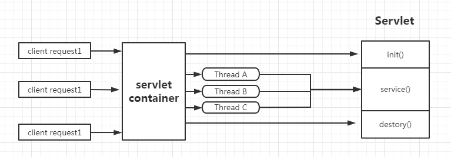

#服务网关
```lua
SpringCloud中集成的Zuul版本，采用的是Tomcat容器，使用传统的Servlet IO处理  
Servlet是由Servlet container进行声明周期管理  
container启动时构建servlet对象并调用servlet init()进行初始化  
container运行时接受请求，并为每一个请求分配一个线程(一般从线程池中获取空闲线程)然后调用service();
congainer关闭时调用servlet destory()销毁servlet;
```

## zuul(netflix公司)
> 2.0版本还没出来(核心人才跳槽，其他人争论目标不统一)
## GateWay(spring公司)
官方文档：https://docs.spring.io/spring-cloud-gateway/docs/2.2.5.RELEASE/reference/html/#gateway-request-predicates-factories  
官方架构图  
   
  
说明:
```lua
客户端向Spring Cloud Gateway发出请求。如果网关处理程序映射确定请求与路由匹配，则将其发送到网关Web处理程序。
该处理程序通过特定于请求的过滤器链运行请求。筛选器由虚线分隔的原因是，筛选器可以在发送代理请求之前和之后运行逻辑。
所有“前置”过滤器逻辑均被执行。然后发出代理请求。发出代理请求后，将运行“后”过滤器逻辑。  
```
<strong>gateway的核心逻辑 路由转发+执行过滤链</strong>

Spring Cloud Gateway具有如下特点  
```lua
    1、基于Spring Framework 5 ,Project Reactor和Spring Boot1.0进行构建  
    2、动态路由：能够匹配任何请求属性  
    3、可以对路由指定Predicate(断言)和Filter(过滤器)  
    4、集成Hystrix的断路器功能  
    5、集成Spring Cloud 服务发现功能
    6、易于编写的Predicate(断言)和Filter(过滤器)
    7、请求限流功能
    8、支持路经重新
```
+ 三大核心概念  
1、Route(路由)  
    路由是由构建万股干的基本模块，他由ID,目标URI,一系列的断言和过滤器组成，如果断言为true则匹配该路由    
2、Predicate(断言)   
    参考的是java8的java.util.function.Predicate开发人员可以匹配HTTP请求中的所有内容(例如请求头和请求参数)，如果请求与断言相匹配则进行路由   
3、Filter(过滤)  
    指的是Spring框架中的GatewayFilter的实例，使用过滤器，可以在请求被路由钱或者而之后对请求进行修改
### 创建路由网关cloud-gateway-gateway9527
1、pom.xml
```xml
<dependencies>
    <!-- gateway路由网关 -->
    <dependency>
        <groupId>org.springframework.cloud</groupId>
        <artifactId>spring-cloud-starter-gateway</artifactId>
    </dependency>
    <!-- eureka 服务发现 -->
    <dependency>
        <groupId>org.springframework.cloud</groupId>
        <artifactId>spring-cloud-starter-netflix-eureka-client</artifactId>
    </dependency>
    <dependency>
        <groupId>org.projectlombok</groupId>
        <artifactId>lombok</artifactId>
        <optional>true</optional>
    </dependency>
    <dependency>
        <groupId>org.springframework.boot</groupId>
        <artifactId>spring-boot-starter-test</artifactId>
        <scope>test</scope>
    </dependency>
</dependencies>
```
2、网关application.yml
```properties
spring:
  application:
    name: cloud-gateway9527 #服务名
  cloud:
    gateway:
      routes:
        - id:  payment_route #payment_route  路由的id，没有固定规则但要求唯一，建议配合服务名
          uri: http://localhost:8001 #匹配后提供服务的路由地址
          predicates:
            - Path=/payment/get/**  #断言，路径相匹配的进行路由

        - id: payment_route2 #payment_route2  路由的id，没有固定规则但要求唯一，建议配合服务名
          uri: http://localhost:8001 #匹配后提供服务的路由地址
          predicates:
            - Path=/payment/lb/**  #断言，路径相匹配的进行路由
```
3、测试
>启动7001，cloud-provider-payment8001(什么都不用变动)，cloud-gateway-gateway9527后访问一下地址

+ http://localhost:8001/payment/get/1后


总结：相当于在访问8001的前面加了一层保护，
#### 两种路由方式
##### configuration
```java
@Configuration
public class GateWayConfig {
    /**
     * 配置了一个Id为route-name的路由规则，方访问地址http://localhost:9527/guonei是会自动转发到地址http://news.baidu.com/guonei
     */
    @Bean
    public RouteLocator customerRouteLocator(RouteLocatorBuilder routeLocatorBuilder) {
        RouteLocatorBuilder.Builder routes = routeLocatorBuilder.routes();
        routes.route("path_route_xwb", r -> r.path("/guonei").uri("http://news.baidu.com/guonei")).build();
        return routes.build();
    }
}
```
<strong>但是以上不推荐使用,配置比较麻烦，推荐使用yml的方式</strong>
### 一、gateWay动态路由配置
```properties
server:
  port: 9527
spring:
  application:
    name: cloud-gateway9527 #服务名
  cloud:
    gateway:
      discovery:
        locator:
          enabled: true #开启从注册中心动态创建路由的功能，利用微服务名进行路由
      routes:
          - id:  payment_route #payment_route  路由的id，没有固定规则但要求唯一，建议配合服务名
            #uri: http://localhost:8001 #匹配后提供服务的路由地址
            #cloud-payment-service为eureka注册的服务名 lb是url的协议，表示启用Gateway的负载均衡功能
            uri: lb://cloud-payment-service #微服务提供服务的路由地址()
            predicates:
              - Path=/payment/get/**  #断言，路径相匹配的进行路由

          - id: payment_route2 #payment_route2  路由的id，没有固定规则但要求唯一，建议配合服务名
            #uri: http://localhost:8001 #匹配后提供服务的路由地址
            uri: lb://cloud-payment-service #匹配后提供服务的路由地址
            predicates:
              - Path=/payment/lb/**  #断言，路径相匹配的进行路由
```
+ 说明：  
1、必须启用一下配置spring.cloud.gateway.discovery.locator.enable=true 开启通过服务名进行路由的开关  
2、uri: lb://cloud-payment-service 通过服务名访问服务，lb是loadBalanceClient 
(https://docs.spring.io/spring-cloud-gateway/docs/2.2.5.RELEASE/reference/html/#the-between-route-predicate-factory)负载均衡功能

实际展示效果：   

#### 二、断言predicates
 https://docs.spring.io/spring-cloud-gateway/docs/2.2.5.RELEASE/reference/html/#gateway-request-predicates-factories  
<strong> 共有：11种配置方式。</storng>  
 1、After Route Predicate Factory  
 ```properties
predicates:
        - After=2017-01-20T17:42:47.789-07:00[America/Denver]
```
 2、Before Route Predicate Factory  
 ```properties
predicates:
        - Before=2017-01-20T17:42:47.789-07:00[America/Denver]
```
 3、Between Route Predicate Factory  
```properties
 predicates:
        - Between=2017-01-20T17:42:47.789-07:00[America/Denver], 2017-01-21T17:42:47.789-07:00[America/Denver]
```
 4、Cookie Route Predicate Factory  
 ```properties
predicates:
        - Cookie=chocolate, ch.p
```
 5、Header Route Predicate Factory  
  ```properties
  predicates:
         - Header=X-Request-Id, \d+
 ```
 6、Host Route Predicate Factory  
  ```properties
 predicates:
         - Host=**.somehost.org,**.anotherhost.org
 ```
 7、Method Route Predicate Factory  
  ```properties
 predicates:
         - Method=GET,POST
 ```
 8、Path Route Predicate Factory  
  ```properties
 predicates:
         - Path=/red/{segment},/blue/{segment}
 ```
 9、The Query Route Predicate Factory  
  ```properties
 predicates:
         - Query=green
 ```
 10、RemoteAddr Route Predicate Factory  
  ```properties
  predicates:
         - RemoteAddr=192.168.1.1/24
 ```
 11、Weight Route Predicate Factory
  ```properties
 predicates:
         - Weight=group1, 2
 ```

+ eg：
```properties
spring:
  application:
    name: cloud-gateway9527 #服务名
  cloud:
    gateway:
      discovery:
        locator:
          enabled: true #开启从注册中心动态创建路由的功能，利用微服务名进行路由
      routes:
          - id:  payment_route #payment_route  路由的id，没有固定规则但要求唯一，建议配合服务名
            #uri: http://localhost:8001 #匹配后提供服务的路由地址
            #cloud-payment-service为eureka注册的服务名 lb是url的协议，表示启用Gateway的负载均衡功能
            uri: lb://cloud-payment-service #微服务提供服务的路由地址()
            predicates:
              - Path=/payment/get/**  #断言，路径相匹配的进行路由
              - After=2020-12-06T16:05:15.580+08:00[Asia/Shanghai] #在当前访问时间之后有效
              - Method=GET

          - id: payment_route2 #payment_route2  路由的id，没有固定规则但要求唯一，建议配合服务名
            #uri: http://localhost:8001 #匹配后提供服务的路由地址
            uri: lb://cloud-payment-service #匹配后提供服务的路由地址
            predicates:
              - Path=/payment/lb/**  #断言，路径相匹配的进行路由
              - Host=**.gateway9527.com #当匹配规则为此路径的时候允许访问
```
curl http://localhost:9527/payment/lb -H "Host:gateway9527.com"  
本人的"Host:gateway9527.com"中的gateway9527.com是host中配置了。  

### 三、Filter(过滤)
##### 自定义过滤器
在9527的项目中添加自定义过滤器  
```java
/**
 * Gateway的Filter过滤连
 * 总的全局过滤器，档在所有微服务前面，进行校验
 */
@Component
@Slf4j
public class MyLogGateWayFilter implements GlobalFilter, Ordered {
    @Override
    public Mono<Void> filter(ServerWebExchange exchange, GatewayFilterChain chain) {
        log.info("*********************** come in MyLogGatewayFilter:" + new Date());
        String uname = exchange.getRequest().getQueryParams().getFirst("uname");
        if (uname == null) {
            log.info("************用户名为null，非法用户,(꒦_꒦) ");
            exchange.getResponse().setStatusCode(HttpStatus.NOT_ACCEPTABLE);
            return exchange.getResponse().setComplete();
        }
        return chain.filter(exchange);
    }

    @Override
    public int getOrder() {
        return 0;
    }
}
```
> 说明：9527挡在所谓有微服务的前面，在请求的时候(7001,8001,8002,9527)的时候，通过访问地址
>http://localhost:9527/payment/lb?uname=234来回刷新，访问正常，如果去掉uname则调用失败
