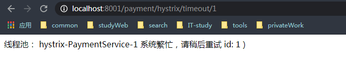
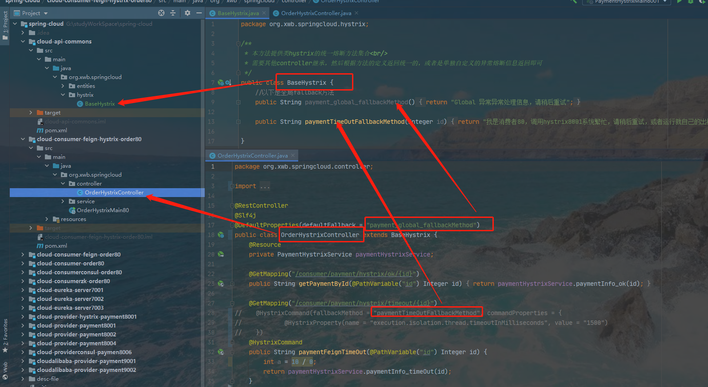
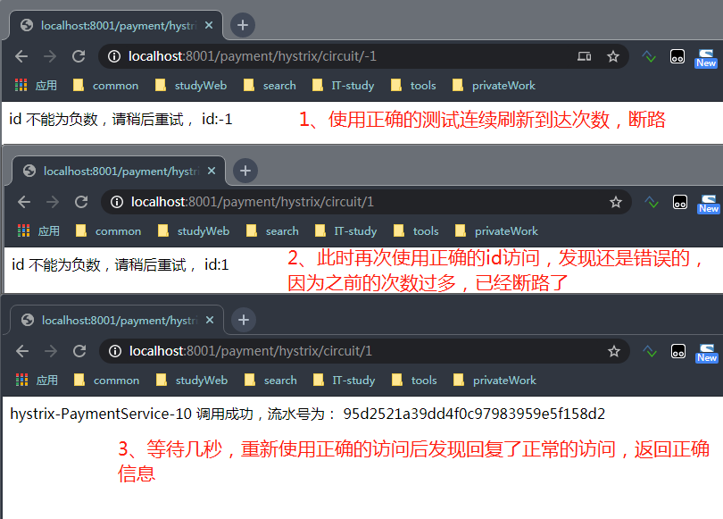
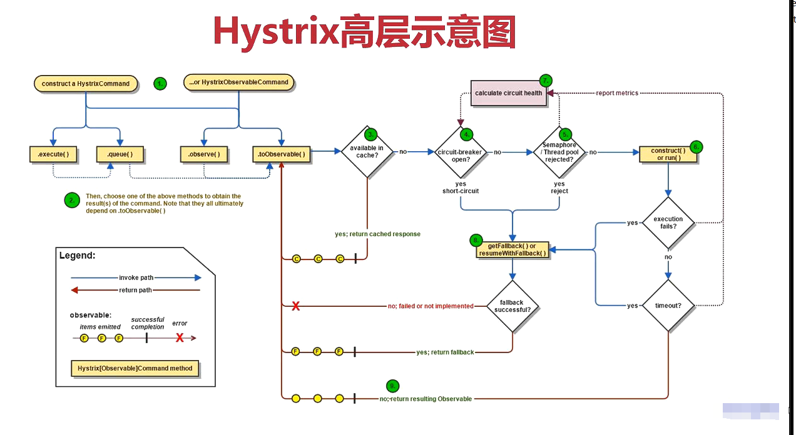

# Hystrix
+ Hystrix是一个用于处理分布式系统的<strong>延迟</strong>和<strong>容错</strong>的开源库,在分布式系统里，
许多依赖不可避免的调用失败,比如超时，异常等等。Hystrix能够保证在一个依赖出问题的情况下，<strong>不会导致整体服务失败，避免级联故障，
以提高分布式系统的弹性</strong>
+ "断路器"本身是一种开关装置，当某个服务单元发生故障之后通过断路器的故障监控(类似熔断保险丝),
<strong>向调用方法返回一个符合预期的，可处理的备选相应(FallBack)，而不是长时间的等待或者抛出调用方法处理的异常，</strong>
这样就保证了服务调用方的线程不会被长时间，不必要的占用，从而避免了故障在分布式系统中的蔓延，乃至雪崩。
## 服务降级
> 分别对服务提供者<strong>cloud-provider-hystrix-payment8001</strong>降级  
      服务消费者<strong>cloud-provider-hystrix-payment80</strong>降级
#### 服务提供者cloud-provider-hystrix-payment8001自身的服务降级
1、pom.xml
```xml
<!-- hystrix -->
<dependency>
    <groupId>org.springframework.cloud</groupId>
    <artifactId>spring-cloud-starter-netflix-hystrix</artifactId>
</dependency>
```
2、主启动类<strong>@EnableCircuitBreaker</strong>
```java
@SpringBootApplication
@EnableDiscoveryClient //服务发现
@EnableCircuitBreaker //开启断路器功能
public class PaymentHystrixMain8001 {
    public static void main(String[] args) {
        SpringApplication.run(PaymentHystrixMain8001.class, args);
    }
}
```
3、<strong>service</strong>的方法进行服务降级
```java
 //执行方法时抛异常 执行fallbackMethod里面的方法，并且由HystrixProperty指定等待时长
 @HystrixCommand(fallbackMethod = "paymentInfo_timeOutHandler", commandProperties = {
            @HystrixProperty(name = "execution.isolation.thread.timeoutInMilliseconds", value = "3000")
    })
    public String paymentInfo_timeOut(Integer id) {
        try {
            //int age = 10 / 0;
            TimeUnit.SECONDS.sleep(5);
        } catch (InterruptedException e) {
            e.printStackTrace();
        }
        return "线程池： " + Thread.currentThread().getName() + "  paymentInfo_TineOut,id: " + id + "\t" + ")(哈哈)";
    }
    public String paymentInfo_timeOutHandler(Integer id) {
        return "线程池： " + Thread.currentThread().getName() + "  系统繁忙，请稍后重试 id: " + id + "\t" + ")";
    }
```
测试结果：只启动7001,8001服务  

#### 服务消费者cloud-provider-hystrix-payment80自身的服务降级
1、 提供降级的hystrix依赖包
```xml
<!-- hystrix -->
<dependency>
    <groupId>org.springframework.cloud</groupId>
    <artifactId>spring-cloud-starter-netflix-hystrix</artifactId>
</dependency>
```
2、yml的服务降级开启
```properties
feign:
  hystrix:
    #开启feign的hystrix支持,默认是false    
    enabled: true
```
3、主启动类添加<strong>@EnableHystrix</strong>
```java
@SpringBootApplication
@EnableDiscoveryClient
@EnableFeignClients //开启负载均衡
@EnableHystrix //开启服务熔断
public class OrderHystrixMain80 {
    public static void main(String[] args) {
        SpringApplication.run(OrderHystrixMain80.class, args);
    }
}
```
4、在需要服务降级的接口上进行降级处理（此处是在controller下的OrderHystrixController类下操作）
```java
@GetMapping("/consumer/payment/hystrix/timeout/{id}")
@HystrixCommand(fallbackMethod = "paymentTimeOutFallbackMethod", commandProperties = {
        @HystrixProperty(name = "execution.isolation.thread.timeoutInMilliseconds", value = "1500")
})
public String paymentFeignTimeOut(@PathVariable("id") Integer id) {
    return paymentHystrixService.paymentInfo_timeOut(id);
}

public String paymentTimeOutFallbackMethod(Integer id) {
    return "我是消费者80，调用hystrix8001系统繁忙，请稍后重试，或者运行就自己的出错检查";
}
```
处理结果(测试结果：只启动7001,8001,80)  

### 如何做全局统一的服务降级 
<strong>DefaultProperties(defaultFallback="")</strong>
N多个方法，除了个别核心业务有专属的，其他都可以使用@DefaultProperties(defaultFallback="")
>上一章节讲到给服务降级，按时每一个方法都配置一个fallBackMethod的话，代码会非常膨胀。
所以我们使用DefaultProperties(defaultFallback="")
+ 提供全局的异常信息汇总类
```java
/**
 * 本方法提供类hystrix的统一熔断方法集合<br/>
 * 需要其他controller继承，然后根据方法的定义返回统一的，或者是单独自定义的异常熔断信息返回即可
 */
public class BaseHystrix {
    //以下是全局fallback方法
    public String payment_global_fallbackMethod() {
        return "Global 异常异常处理信息，请稍后重试";
    }
    public String paymentTimeOutFallbackMethod(Integer id) {
        return "我是消费者80，调用hystrix8001系统繁忙，请稍后重试，或者运行就自己的出错检查";
    }
}
```
1、对controller进行统一服务降级处理
```java
@RestController
@Slf4j
@DefaultProperties(defaultFallback = "payment_global_fallbackMethod")
public class OrderHystrixController extends BaseHystrix {
    @Resource
    private PaymentHystrixService paymentHystrixService;

    @GetMapping("/consumer/payment/hystrix/timeout/{id}")
    @HystrixCommand(fallbackMethod = "paymentTimeOutFallbackMethod", commandProperties = {
            @HystrixProperty(name = "execution.isolation.thread.timeoutInMilliseconds", value = "1500")
    })
    //@HystrixCommand
    public String paymentFeignTimeOut(@PathVariable("id") Integer id) {
        int a=10/0;
        return paymentHystrixService.paymentInfo_timeOut(id);
    }
}
```
> 说明:针对整个controller进行服务降级处理@DefaultProperties(defaultFallback="payment_global_fallbackMethod")
提供统一的降级处理DefaultProperties并且指定方法为payment_global_fallbackMethod。

1、首先在controller上添加注解@DefaultProperties(defaultFallback=""),然后指定全局统一的服务降级的方法为payment_global_fallbackMethod  
2、对方法的服务降级  
   
   2.1、方法上面只添加了添加@HystrixCommand注解，表示此接口如果执行失败，执行全局统一的服务降级。
 ```java
 @GetMapping("/consumer/payment/hystrix/timeout/{id}")
  @HystrixCommand
  public String paymentFeignTimeOut(@PathVariable("id") Integer id) {
      int a=10/0;
  }
 ```
   2.2、如果方法上面添加了@HystrixCommand，并且指定了fallbackMethod，则表明此方法服务降级的时候执行指定的方法
```java
@GetMapping("/consumer/payment/hystrix/timeout/{id}")
@HystrixCommand(fallbackMethod = "paymentTimeOutFallbackMethod", commandProperties = {
        @HystrixProperty(name = "execution.isolation.thread.timeoutInMilliseconds", value = "1500")
})
public String paymentFeignTimeOut(@PathVariable("id") Integer id) {
    int a=10/0;
}
```
   2.3、如果方法上面没有添加@HystrixCommand，则表明该方法不进行服务降级，如果异常发生，会将报错信息直接抛出，到客户端。很不友好。
```java
@GetMapping("/consumer/payment/hystrix/timeout/{id}")
public String paymentFeignTimeOut(@PathVariable("id") Integer id) {
    int a=10/0;
}
```
目录结构

## 服务熔断
 > 熔断机制概念
熔断机制是应对雪崩效应的一种微服务链路保护机制，当删除链路的某个微服务出错不可用或者响应时间太长的时，会进行服务的降级，
进而熔断该节点微服务的调用，快速返回错误的响应信息

<strong>服务的降级->进而熔断->回复调用链路</strong>

<strong>当检测到服务街店微服务调用响应正常后，恢复调用链路</strong>
 
在SpringCloud框架里，熔断机制通过Hystrix实现，Hystrix会监控微服务间调用的状况，当失败的调用到一定阈值，
 缺省是5秒20次调用失败，就会启动熔断机制，熔断机制的注解是@HystrixCommand。
 
 > Command属性主要用来控制HystrixCommand命令的行为，它主要分下面的类别
 更多配置请看类：<strong>com.netflix.hystrix.HystrixCommandProperties</strong> 
 ##### 1 Execution：用来控制HystrixCommand.run()的执行
 ```properties

 execution.isolation.strategy：该属性用来设置HystrixCommand.run()执行的隔离策略。默认为THREAD。
 execution.isolation.thread.timeoutInMilliseconds：该属性用来配置HystrixCommand执行的超时时间，单位为毫秒。
 execution.timeout.enabled：该属性用来配置HystrixCommand.run()的执行是否启用超时时间。默认为true。
 execution.isolation.thread.interruptOnTimeout：该属性用来配置当HystrixCommand.run()执行超时的时候是否要它中断。
 execution.isolation.thread.interruptOnCancel：该属性用来配置当HystrixCommand.run()执行取消时是否要它中断。
 execution.isolation.semaphore.maxConcurrentRequests：当HystrixCommand命令的隔离策略使用信号量时，该属性用来配置信号量的大小。当最大并发请求达到该设置值时，后续的请求将被拒绝。
```
##### 2 Fallback：用来控制HystrixCommand.getFallback()的执行
 ```properties

 fallback.isolation.semaphore.maxConcurrentRequests：该属性用来设置从调用线程中允许HystrixCommand.getFallback()方法执行的最大并发请求数。当达到最大并发请求时，后续的请求将会被拒绝并抛出异常。
 fallback.enabled：该属性用来设置服务降级策略是否启用，默认是true。如果设置为false，当请求失败或者拒绝发生时，将不会调用HystrixCommand.getFallback()来执行服务降级逻辑。
```
##### 3 Circuit Breaker：用来控制HystrixCircuitBreaker的行为。
```properties
 circuitBreaker.enabled：确定当服务请求命令失败时，是否使用断路器来跟踪其健康指标和熔断请求。默认为true。
 circuitBreaker.requestVolumeThreshold：用来设置在滚动时间窗中，断路器熔断的最小请求数。例如，默认该值为20的时候，如果滚动时间窗（默认10秒）内仅收到19个请求，即使这19个请求都失败了，断路器也不会打开。
 circuitBreaker.sleepWindowInMilliseconds：用来设置当断路器打开之后的休眠时间窗。休眠时间窗结束之后，会将断路器设置为“半开”状态，尝试熔断的请求命令，如果依然时候就将断路器继续设置为“打开”状态，如果成功，就设置为“关闭”状态。
 circuitBreaker.errorThresholdPercentage：该属性用来设置断路器打开的错误百分比条件。默认值为50，表示在滚动时间窗中，在请求值超过requestVolumeThreshold阈值的前提下，如果错误请求数百分比超过50，就把断路器设置为“打开”状态，否则就设置为“关闭”状态。
 circuitBreaker.forceOpen：该属性默认为false。如果该属性设置为true，断路器将强制进入“打开”状态，它会拒绝所有请求。该属性优于forceClosed属性。
 circuitBreaker.forceClosed：该属性默认为false。如果该属性设置为true，断路器强制进入“关闭”状态，它会接收所有请求。如果forceOpen属性为true，该属性不生效。
```
##### 4 Metrics：该属性与HystrixCommand和HystrixObservableCommand执行种捕获的指标相关。
 ```properties
 metrics.rollingStats.timeInMilliseconds：该属性用来设置滚动时间窗的长度，单位为毫秒。该时间用于断路器判断健康度时需要收集信息的持续时间。断路器在收集指标信息时会根据设置的时间窗长度拆分成多个桶来累计各度量值，每个桶记录了一段时间的采集指标。例如，当为默认值10000毫秒时，断路器默认将其分成10个桶，每个桶记录1000毫秒内的指标信息。
 metrics.rollingStats.numBuckets：用来设置滚动时间窗统计指标信息时划分“桶”的数量。默认值为10。
 metrics.rollingPercentile.enabled：用来设置对命令执行延迟是否使用百分位数来跟踪和计算。默认为true，如果设置为false，那么所有的概要统计都将返回-1。
 metrics.rollingPercentile.timeInMilliseconds：用来设置百分位统计的滚动窗口的持续时间，单位为毫秒。
 metrics.rollingPercentile.numBuckets：用来设置百分位统计滚动窗口中使用桶的数量。
 metrics.rollingPercentile.bucketSize：用来设置每个“桶”中保留的最大执行数。
 metrics.healthSnapshot.intervalInMilliseconds：用来设置采集影响断路器状态的健康快照的间隔等待时间。
```
#####  5 Request Context：涉及HystrixCommand使用HystrixRequestContext的设置。
 ```properties
 requestCache.enabled：用来配置是否开启请求缓存。
 requestLog.enabled：用来设置HystrixCommand的执行和事件是否打印到日志的HystrixRequestLog中。
```
#### 项目中的使用
 > 修改项目cloud-provider-hystrix-payment8001

1、引入jar
```xml
<!-- hystrix -->
<dependency>
    <groupId>org.springframework.cloud</groupId>
    <artifactId>spring-cloud-starter-netflix-hystrix</artifactId>
</dependency>
```

2、修改service方法
 ```java
@HystrixCommand(fallbackMethod = "paymentCircuitBreaker_fallback", commandProperties = {
        @HystrixProperty(name = "circuitBreaker.enabled", value = "true"), //是否开启断路器
        @HystrixProperty(name = "circuitBreaker.requestVolumeThreshold", value = "10"), //请求次数
        @HystrixProperty(name = "circuitBreaker.sleepWindowInMilliseconds", value = "10000"), //时间窗口期
        @HystrixProperty(name = "circuitBreaker.errorThresholdPercentage", value = "60"), //失败率到达多少后跳闸
})
public String paymentCircuitBreaker(@PathVariable("id") Integer id) {
    if (id > 0) {
        throw new RuntimeException("*************** id 不能为负数");
    }
    String serialNumber = IdUtil.simpleUUID();
    return Thread.currentThread().getName() + "\t" + "调用成功，流水号为： " + serialNumber;
}

public String paymentCircuitBreaker_fallback(@PathVariable("id") Integer id) {
    return "id 不能为负数，请稍后重试， id:" + id;
}
 ```
3、controller调用
```java
@GetMapping(value = "/payment/hystrix/circuit/{id}")
public String paymentCircuitBreaker(@PathVariable("id") Integer id) {
    String result = paymentService.paymentCircuitBreaker(id);
    log.info("******* paymentCircuitBreaker result : " + result);
    return result;
}
```
调用结果：  
  
从上面的1->3可以看出服务熔断的核心思想<strong>服务的降级->进而熔断->回复调用链路</strong> 
```lua
1、再有请求调用的时候，将不会调用主逻辑，而是直接调用服务降级的fallback，通过断路器，实现了自动地发现错误并将降级逻辑切换为主逻辑，较少相应延迟的效果。
2、原来的逻辑如何恢复。  
    对于这一问题，hystrix也为我们实现了自动恢复功能。  
    当断路器打开，对主逻辑进行熔断之后，hystrix会启动一个休眠时间窗，在这个时间窗内，降级逻辑是零食的成为主逻辑，  
    当休眠时间窗到期，断路器将进入半开状态，释放一次请求到原来的主逻辑上，如果此次请求的正常返回，那么断路器将继续闭合，  
    主逻辑恢复，如果这次请求依然有问题，断路器将继续进入打开状态，休眠时间窗重新计时。  
``` 
hystrix官方架构图  

## 服务限流
 使用阿里巴巴的限流Sentinel 
# hystrixDashboard服务监控
### 搭建服务监控平台
1、创建cloud-consumer-hystrix-dashboard9001  
2、pom.xml引入监控的jar
```xml
<!-- hystrixDashboard  -->
<dependency>
    <groupId>org.springframework.cloud</groupId>
    <artifactId>spring-cloud-starter-netflix-hystrix-dashboard</artifactId>
</dependency>
```
3、application.yml配置
```properties
server:
   port: 9001
```
4、主启动类添加注解<strong>@EnableHystrixDashboard</strong>
```java
@SpringBootApplication
@EnableHystrixDashboard
public class HystrixDashBoardMain9001 {
    public static void main(String[] args) {
        SpringApplication.run(HystrixDashBoardMain9001.class, args);
    }
}
```
访问网址 http://localhost:9001/hystrix
### 如何监控微服务
> 以cloud-provider-hystrix-payment8001为例

1、pom.xml添加依赖
```xml
<dependency>
    <groupId>org.springframework.boot</groupId>
    <artifactId>spring-boot-starter-actuator</artifactId>
</dependency>
```
2、主启动类 注入ServletRegistrationBean
```java
@SpringBootApplication
@EnableDiscoveryClient
@EnableCircuitBreaker //开启断路器功能
public class PaymentHystrixMain8001 {
    public static void main(String[] args) {
        SpringApplication.run(PaymentHystrixMain8001.class, args);
    }

    /**
     * 此配置是为了服务监控而配置，与服务容错本身无关，springcloud升级的坑。
     * ServletRegistrationBean因为springboot的默认路径不是"/hystrix.stream"
     * 只要在自己的项目里配置上下面servlet就可以了
     *
     * @return
     */
    @Bean
    public ServletRegistrationBean getServlet() {
        HystrixMetricsStreamServlet streamServlet = new HystrixMetricsStreamServlet();
        ServletRegistrationBean registrationBean = new ServletRegistrationBean(streamServlet);
        registrationBean.setLoadOnStartup(1);
        registrationBean.addUrlMappings("/hystrix.stream");
        registrationBean.setName("HystrixMetricsStreamServlet");
        return registrationBean;
    }
}
```
3、启动8001后地址栏查看以下地址  
在：http://localhost:9001/hystrix下输入http://localhost:8001/hystrix.stream的地址信息查看运行状况