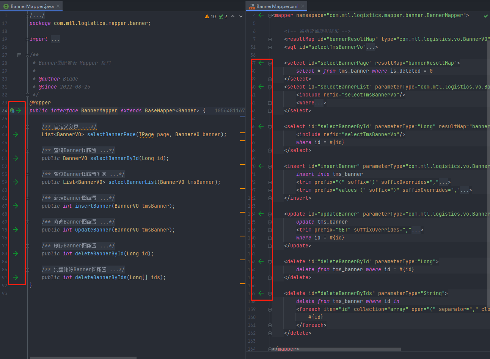
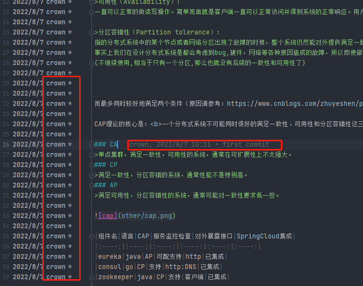
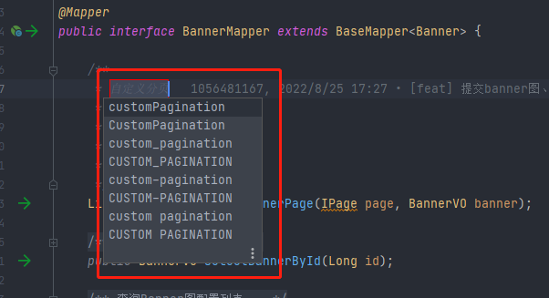
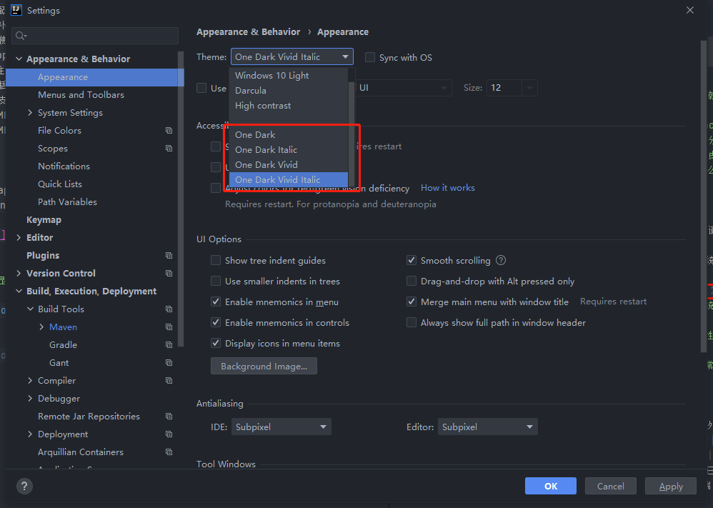

# idea必装插件
### 1、Free MyBatis Tool
```text
1. 提供Mapper接口与配置文件中对应SQL的导航
2. 编辑XML文件时自动补全
3. 根据Mapper接口, 使用快捷键生成xml文件及SQL标签
4. ResultMap中的property支持自动补全，支持级联(属性A.属性B.属性C)
5. 快捷键生成@Param注解
6. XML中编辑SQL时, 括号自动补全
7. XML中编辑SQL时, 支持参数自动补全(基于@Param注解识别参数)
8. 自动检查Mapper XML文件中ID冲突
9. 自动检查Mapper XML文件中错误的属性值
10. 支持Find Usage
11. 支持重构从命名
12. 支持别名
13. 自动生成ResultMap属性
14. 快捷键:   Option + Enter(Mac) | Alt + Enter(Windows)
```

### 2、GitToolBox
```text
光标点击的代码行之后显示 git 用户名，commit 等一些信息。
```

### 3、Translation
```text
取名不用百度翻译,直接用该插件翻译
```


### 4、One Dark theme
```text
idea的黑色主体
```

### 5、 Alibaba Java Coding Guidelines plugin support
```text
阿里巴巴的代码规范化插件
```
### 6、CamelCase
```shell
字符串转驼峰 Shift+alt+U
```
### 7. CSDN Tool
```text
CSDN出品的插件
```
### 8. Extra Icons
```text
图标美化插件
```
### 9. Generate Document
```text
Java文档生成工具，无代码入侵，支持REST、Dubbo等接口定义，用户可以自定义文档模板
```
### 10、<font color='red'>Maven Helper</font>
```text
查看maven的依赖树 及解jar包冲突问题安装后 打开pom文件即可使用
```
### 11、MyBatisCodeHelper-Pro
```text
可能是最好的Mybatis代码提示，完整支持Mybatis动态sql代码提示，代码检测，写sql几乎所有地方都有代码提示
```
### 12、Restfultoolkit
```text
 一套 RESTful 服务开发辅助工具集，完美代替postman。
```
### 13、GsonFormat
```text
Json转Java类，该插件可以加快开发进度，使用非常方便，效率高。
```
### 14、中文插件(Chinese ​(Simplified)​ Language Pack / 中文语言包)

