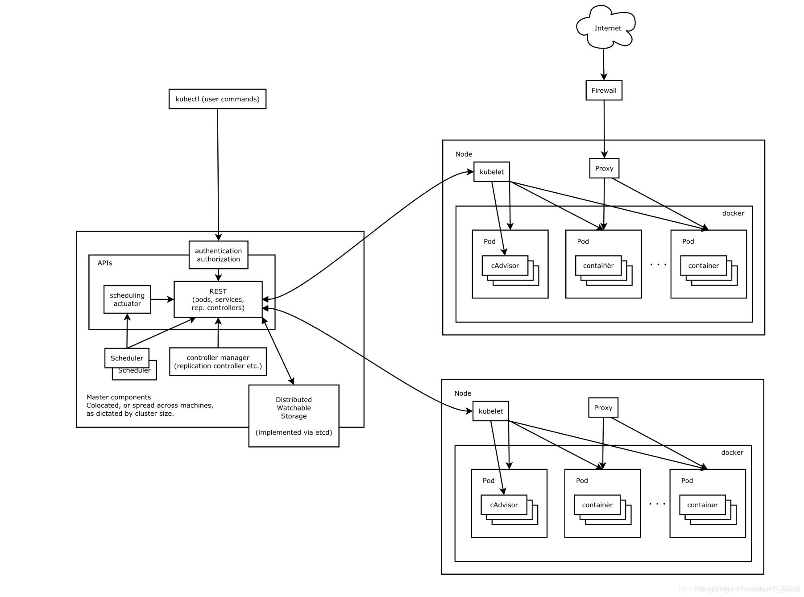

#kubernetes

* k8s是谷歌在2014年开业的容器化集群管理系统
* 使用k8s进行容器化应用部署
* 使用k8s利于应用扩展
* k8s目标实施让部署容器化引用更加简洁和高效

## k8s集群架构组件

**Master(主控节点)和node(工作节点)**




### 1、master组件
|组件|功能|
| ---- | ---- |
| apiserver | 集群统一入口，一restful方式，交给etcd存储 |
| scheduler | 节点调度,选择节点应用部署 |
| controller-manager | 处理集群中常规后台任务，一个资源对应一个控制器 |
| etcd | 存储系统，用于保存集群相关数据 |

### 2、node组件
|组件|功能|
| ---- | ---- |
| kubelet | master排到node节点代表，管理本机容器 |
| kube-proxy | 提供网络代理，负载均衡等操作 |
## k8s核心概念
1、pod  
*  最小部署单元
*  一组容器的集合
* 共享网络

2、controller
* 确保预期的皮带、副本数量
* 无状态引用部署
* 有状态引用部署

确保所有的node运行同一个pod
一次任务和定时任务

3、service
* 定义一组pod的访问规则
## k8s集群化环境搭建
> 单集群


> 多集群


### 搭建方式
>1、kubeadm方式  
2、
#### kubeadm
```shell
  # 1、关闭防火墙
  systemctl stop firewalld
  systemctl disable firewalld
  # 2、关闭selinux
  sed -i 's/enforcing/disabled' /etc/selinux/config #永久
  setenforce 0 #临时
  # 3、关闭swap
  swapoff -a #临时
  sed -ri 's/.*swap.*/#&/' /etc/fstab #永久
  # 4、根据规划设置主机名
  hostnamectl set-hostname <hostname>
  # 5、在master添加hosts
  cat >> /etc/hosts << EOF
  192.168.11.131 master
  192.168.11.132 node1
  192.168.11.134 node2
  EOF
  # 6、将连接的ipv4流量传递到iptables的链
  cat > /etc/sysctl.d/k8s.conf << EOF
  net.bridge.bridge-nf-call-ip6tables =1
  net.bridge.bridge-nf-call-iptables =1
  EOF
  sysctl --system #生效
```
