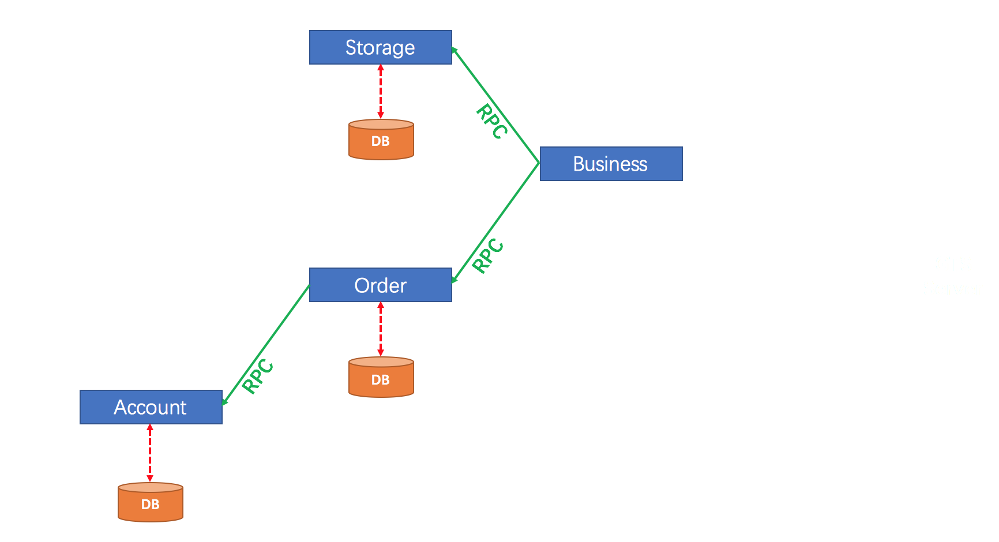

# seata分布式事务解决方案
seata官网：https://seata.io/zh-cn  
##### 分布式事务的处理过程为 
**一ID+三组件模型**  
+ **一ID**  
      全局事务的id
+ **三组件概念**
    + 1、TC(Transaction Coordinator)-事务协调者  
    维护全局和分支事务的状态，驱动全局事务提交或回滚  
    + 2、TM(Transaction Manager)-事务管理者  
    定义全局事务的范围：开始全局事务、提交或回滚全局事务  
    + 3、RM(Resource Manager)-资源管理器  
     管理分支事物处理的资源，与TC交谈以注册分支事务和报告分支事务的状态，并驱动分支事务提交或回滚  
     

  
  
##### 处理流程图  
   
 说明：  
 1、TM向TC申请开启一个全局事务，全局事务创建成功并生成一个全局唯一的XID   
 2、XID在微服务传播链路上下文中传播  
 3、RM向TC注册分支事务，将其纳入XID对应全局事务的管辖    
 4、TM向TC发起针对XID的全局提交或回滚决议  
 5、TC调度XID下管辖的全部分支事务完成提交或或回滚请求  
## seata的下载安装
下载地址：https://github.com/seata/seata/releases       
版本 0.9  
windows: https://github.com/seata/seata/releases/download/v0.9.0/seata-server-0.9.0.zip
#### 修改配置文件  
##### 1、修改file.conf自定义事务组名称+事务日志模式为db+数据库连接
1、service的vgroup_mapping.my_test_tx_group属性
```properties
service {
  #vgroup->rgroup
  vgroup_mapping.my_test_tx_group = "fsp_tx_group"
  #only support single node
  default.grouplist = "127.0.0.1:8091"
  #degrade current not support
  enableDegrade = false
  #disable
  disable = false
  #unit ms,s,m,h,d represents milliseconds, seconds, minutes, hours, days, default permanent
  max.commit.retry.timeout = "-1"
  max.rollback.retry.timeout = "-1"
}
```  
2、数据库
```properties
store {
  ## store mode: file、db
  mode = "db"
...
## database store
  db {
    ## the implement of javax.sql.DataSource, such as DruidDataSource(druid)/BasicDataSource(dbcp) etc.
    datasource = "dbcp"
    ## mysql/oracle/h2/oceanbase etc.
    db-type = "mysql"
    driver-class-name = "com.mysql.jdbc.Driver"
    url = "jdbc:mysql://127.0.0.1:3306/seata"
    user = "root"
    password = "123456"
    min-conn = 1
    max-conn = 3
    global.table = "global_table"
    branch.table = "branch_table"
    lock-table = "lock_table"
    query-limit = 100
  }
}
```
3、创建数据库seata,并且创建表  
```sql
create DATABASE seata;
-- the table to store GlobalSession data
drop table if exists `global_table`;
create table `global_table` (
  `xid` varchar(128)  not null,
  `transaction_id` bigint,
  `status` tinyint not null,
  `application_id` varchar(32),
  `transaction_service_group` varchar(32),
  `transaction_name` varchar(128),
  `timeout` int,
  `begin_time` bigint,
  `application_data` varchar(2000),
  `gmt_create` datetime,
  `gmt_modified` datetime,
  primary key (`xid`),
  key `idx_gmt_modified_status` (`gmt_modified`, `status`),
  key `idx_transaction_id` (`transaction_id`)
);

-- the table to store BranchSession data
drop table if exists `branch_table`;
create table `branch_table` (
  `branch_id` bigint not null,
  `xid` varchar(128) not null,
  `transaction_id` bigint ,
  `resource_group_id` varchar(32),
  `resource_id` varchar(256) ,
  `lock_key` varchar(128) ,
  `branch_type` varchar(8) ,
  `status` tinyint,
  `client_id` varchar(64),
  `application_data` varchar(2000),
  `gmt_create` datetime,
  `gmt_modified` datetime,
  primary key (`branch_id`),
  key `idx_xid` (`xid`)
);

-- the table to store lock data
drop table if exists `lock_table`;
create table `lock_table` (
  `row_key` varchar(128) not null,
  `xid` varchar(96),
  `transaction_id` long ,
  `branch_id` long,
  `resource_id` varchar(256) ,
  `table_name` varchar(32) ,
  `pk` varchar(36) ,
  `gmt_create` datetime ,
  `gmt_modified` datetime,
  primary key(`row_key`)
);
```
##### 2、修改registry.conf注册信息
修改注册类型为nacos，并且指定nacos的注册地址为localhost:8848(根据自己的nacos配置)  
```properties
registry {
  # file 、nacos 、eureka、redis、zk、consul、etcd3、sofa
  type = "nacos"

  nacos {
    serverAddr = "localhost:8848"
    namespace = ""
    cluster = "default"
  }
  ...
```
##### 启动验证是否成功配置
1、启动nacos  
2、启动senta(双击seata-server.bat)  
  
### 准备业务表结构
```sql
DROP TABLE IF EXISTS `t_account`;
CREATE TABLE `t_account`  (
  `id` bigint(11) NOT NULL AUTO_INCREMENT,
  `user_id` bigint(11) NULL DEFAULT NULL COMMENT '用户id',
  `total` decimal(10, 0) NULL DEFAULT NULL COMMENT '总额度',
  `used` decimal(10, 0) NULL DEFAULT NULL COMMENT '已用额度',
  `residue` decimal(10, 0) NULL DEFAULT NULL COMMENT '剩余可用额度',
  PRIMARY KEY (`id`) USING BTREE
) ENGINE = InnoDB AUTO_INCREMENT = 2 CHARACTER SET = utf8mb4;

DROP TABLE IF EXISTS `seata_storage`;
CREATE TABLE `t_storage`  (
  `id` bigint(11) NOT NULL AUTO_INCREMENT,
  `product_id` bigint(11) NULL DEFAULT NULL COMMENT '产品id',
  `total` int(11) NULL DEFAULT NULL COMMENT '库存',
  `used` int(11) NULL DEFAULT NULL COMMENT '已用库存',
  `residue` int(11) NULL DEFAULT NULL COMMENT '剩余库存',
  PRIMARY KEY (`id`) USING BTREE
) ENGINE = InnoDB AUTO_INCREMENT = 2 CHARACTER SET = utf8mb4 ;

DROP TABLE IF EXISTS `t_order`;
CREATE TABLE `t_order`  (
  `id` bigint(11) NOT NULL AUTO_INCREMENT,
  `user_id` bigint(11) NULL DEFAULT NULL COMMENT '用户id',
  `product_id` bigint(11) NULL DEFAULT NULL COMMENT '产品id',
  `count` int(11) NULL DEFAULT NULL COMMENT '数量',
  `money` decimal(11, 0) NULL DEFAULT NULL COMMENT '金额',
  `status` int(1) NULL DEFAULT NULL COMMENT '订单状态：0：创建中；1：已完结',
  PRIMARY KEY (`id`) USING BTREE
) ENGINE = InnoDB AUTO_INCREMENT = 7 CHARACTER SET = utf8mb4;

CREATE TABLE `undo_log` (
  `id` bigint(20) NOT NULL AUTO_INCREMENT,
  `branch_id` bigint(20) NOT NULL,
  `xid` varchar(100) NOT NULL,
  `context` varchar(128) NOT NULL,
  `rollback_info` longblob NOT NULL,
  `log_status` int(11) NOT NULL,
  `log_created` datetime NOT NULL,
  `log_modified` datetime NOT NULL,
  `ext` varchar(100) DEFAULT NULL,
  PRIMARY KEY (`id`),
  UNIQUE KEY `ux_undo_log` (`xid`,`branch_id`)
) ENGINE=InnoDB AUTO_INCREMENT=1 DEFAULT CHARSET=utf8;
```
最终表结构  
  
### 新建模块
下订单->减库存->扣余额->该(订单)状态  
#### 新建订单模块seata-order-service2001
1、pom.xml(部分省略)  
```xml
<!--  SpringCloud alibaba nacos    -->
<dependency>
    <groupId>com.alibaba.cloud</groupId>
    <artifactId>spring-cloud-starter-alibaba-nacos-discovery</artifactId>
</dependency>
<dependency>
    <groupId>com.alibaba.cloud</groupId>
    <artifactId>spring-cloud-starter-alibaba-seata</artifactId>
    <exclusions>
        <!-- 排除自身附带的jar包 -->
        <exclusion>
            <artifactId>seata-all</artifactId>
            <groupId>io.seata</groupId>
        </exclusion>
    </exclusions>
</dependency>
<!-- 引入和服务端相匹配的jar包 -->
<dependency>
    <groupId>io.seata</groupId>
    <artifactId>seata-all</artifactId>
    <version>0.9.0</version>
</dependency>
<!--   openfeign     -->
<dependency>
    <groupId>org.springframework.cloud</groupId>
    <artifactId>spring-cloud-starter-openfeign</artifactId>
</dependency>
```
2、application.yml  
```properties
server:
  port: 2001
spring:
  application:
    name: seata-order-service
  cloud:
    nacos:
      discovery: #Nacos注册中心地址
        server-addr: localhost:8848
    alibaba:
      seata:
        tx-service-group: fsp_tx_group
  datasource:
    driver-class-name: com.mysql.jdbc.Driver
    url: jdbc:mysql://localhost:3306/seata_order?useUnicode=true&characterEncoding=UTF-8&useSSL=false
    username: root
    password: 123456
#    type: com.alibaba.druid.pool.DruidDataSource
feign:
  hystrix:
    enabled: true

logging:
  level:
    io:
      seata: info
mybatis:
  mapper-locations: classpath:mapper/*.xml
```
3、备份seata的配置文件  
**file.conf** **registry.conf**      
4、提供dao,domain,mapper*.xml,controller。    
具体代码请看完整项目代码  
5、service
特别注意的是调用的其他微服务的方法，需要@FeignClient(value="xx")标明调用的方法接口  
本身的service提供的方法，不用该注解   
6、config的配置
```java
//1、mybatis扫描的包
@Configuration
@MapperScan("org.xwb.springcloud.dao.*")
public class MyBatisConfig {
}
//2、druid数据源  
@Configuration
public class DataSourceProxyConfig {
    @Value("${mybatis.mapper-locations}")
    private String mapperLocations;
    @Bean
    @ConfigurationProperties(prefix = "spring.datasource")
    public DataSource druidDataSource() {
        return new DruidDataSource();
    }
    @Primary
    @Bean("dataSource")
    public DataSourceProxy dataSourceProxy(DataSource druidDataSource) {
        return new DataSourceProxy(druidDataSource);
    }
    @Bean(name = "sqlSessionFactory")
    public SqlSessionFactory sqlSessionFactoryBean(DataSourceProxy dataSourceProxy) throws Exception {
        SqlSessionFactoryBean bean = new SqlSessionFactoryBean();
        bean.setDataSource(dataSourceProxy);
        ResourcePatternResolver resolver = new PathMatchingResourcePatternResolver();
        bean.setMapperLocations(resolver.getResources(mapperLocations));
        SqlSessionFactory factory;
        try {
            factory = bean.getObject();
        } catch (Exception e) {
            throw new RuntimeException(e);
        }
        return factory;
    }
}
```
7、主启动类
```java
@SpringBootApplication(exclude = DataSourceAutoConfiguration.class)
@EnableDiscoveryClient
@EnableFeignClients
public class SeataOrderMainApp2001 {
    public static void main(String[] args) {
        SpringApplication.run(SeataOrderMainApp2001.class, args);
    }
}
```
特别注意的是 **@SpringBootApplication(exclude = DataSourceAutoConfiguration.class)**  
排除自身的数据源，使用自己定义的数据源  
#### 新建库存模块seata-storage-service2002
同以上2001相同，以下只说明不同之处  
1、application.xml
```properties
server:
  port: 2002
spring:
  application:
    name: seata-storage-service
  cloud:
    nacos:
      discovery: #Nacos注册中心地址
        server-addr: localhost:8848
    alibaba:
      seata:
        tx-service-group: fsp_tx_group
  datasource:
    driver-class-name: com.mysql.jdbc.Driver
    url: jdbc:mysql://localhost:3306/seata_storage?useUnicode=true&characterEncoding=UTF-8&useSSL=false
    username: root
    password: 123456
#    type: com.alibaba.druid.pool.DruidDataSource
feign:
  hystrix:
    enabled: true

logging:
  level:
    io:
      seata: info
mybatis:
  mapper-locations: classpath:mapper/*.xml
```
其他业务可直接查看项目  
#### 新建账户模块seata-account-service2003
同2003相同 ，以下只列出不同之处  
```properties
server:
  port: 2003

spring:
  application:
    name: seata-account-service
  cloud:
    alibaba:
      seata:
        tx-service-group: fsp_tx_group
    nacos:
      discovery:
        server-addr: localhost:8848
  datasource:
#    type: com.alibaba.druid.pool.DruidDataSource
    driver-class-name: com.mysql.jdbc.Driver
    url: jdbc:mysql://localhost:3306/seata_account?useUnicode=true&characterEncoding=UTF-8&useSSL=false
    username: root
    password: 123456
feign:
  hystrix:
    enabled: true
logging:
  level:
    io:
      seata: info
mybatis:
  mapper-locations: classpath*:mapper/*.xml
```
其他业务参照代码  
#### 测试
#####不加@GlobalTransactional测试
1、启动nacos、seata、2001、2002、2003
1、浏览器输入 http://localhost2001/order/create?userId=1&productId=1&count=1&money=100    
查看库存是否都正确  
2、此时需要将对seata-account-service2003账户付款进行改动(修改为超时，账户扣款失败)    
```java
@Service
@Slf4j
public class AccountServiceImpl implements AccountService {
    @Resource
    private AccountDao accountDao;
    @Override
    public void decrease(Long userId, BigDecimal money) {
        log.info("********->account-service中扣减账户余额开始");
        //此处故意超时
        try {
            TimeUnit.SECONDS.sleep(20);
        } catch (InterruptedException e) {
            e.printStackTrace();
        }
        accountDao.decrease(userId, money);
        log.info("********->account-service中扣减账户余额结束");
    }
}
```
测试结果会发现,成功创建了订单，但是订单的状态却不对。  
3、添加注解@GlobalTransactional(name = "fsp-create-order", rollbackFor = Exception.class)  
```java
@Override
@GlobalTransactional(name = "fsp-create-order", rollbackFor = Exception.class)
public void create(Order order) {
    log.info("--------->开始新建订单");
    //1 新建订单
    orderDao.create(order);
    //2 扣减库存
    log.info("------------->订单微服务开始调用库存,做扣减Count");
    storageService.decrease(order.getProductId(), order.getCount());
    log.info("------------->订单微服务开始调用库存,做扣减end");
    //3 扣减账户
    log.info("------------->订单微服务开始调用账户,做扣减Money");
    accountService.decrease(order.getUserId(), order.getMoney());
    log.info("------------->订单微服务开始调用账户,做扣减end");
    //4 修改订单状态
    log.info("------------->修改订单状态开始");
    orderDao.update(order.getUserId(), 0);
    log.info("------------->修改订单状态结束");
    log.info("------------->下订单结束了");
}
```
重启应用，再次请求订单，会发现订单整个订单都添加不进来,全不回滚    

  
原理解析  
**TM开启分布式事务(TM向TC注册全局事务记录)  
按照业务场景，编排数据库、服务器等事务内资源(RM向TC汇报资源准备状态  
TM结束分布式事务，事务一阶段准备结束(TM通知TC提交、回滚分布式事务)  
TC汇报事务信息，决定分布式事务是提交还是回滚  
TC通知所有RM提交回滚资源，事务二阶段结束**  

+ 一阶段加载  

**在一阶段，Seata会拦截"业务SQL",
1、解析sql语义，找到"业务SQL"要更新的业务数据，在业务数据被更新前，将其保存到"before image",  
2、执行"业务SQL"更新业务数据，在业务数据更新之后。  
3、将其保存城"after image",最后生成行锁。  
以上操作全部在一个数据库事务内完成，这样保证了一阶段操作的原子性。**   
    
+ 二阶段  
二阶段如果顺利提交的话。  
因为"业务SQL"在一阶段已经提交至数据库，所以Seata框架只需将**一阶段保存的快照数据和行级锁，完成数据清理即可。**
  
    + 二阶段失败  
   二阶段回滚：  
   二阶段如果是回滚的话，Seata就需要回滚一阶段已经执行的"业务SQL"还原业务数据  
   回滚方式便是用"before image" 还原业务数据；但在还原前要首先要校验脏写，对比"数据库当前业务数据"和"after image",
   如果两份数据完全一致就说明没有脏毒，可以还原业务数据，如果不一致就说明有脏写，出现脏写需要转人工处理。  

