## Sentinel实现熔断合限流
**丰富的应用场景：** Sentinel 承接了阿里巴巴近 10 年的双十一大促流量的核心场景，例如秒杀（即突发流量控制在系统容量可以承受的范围）、消息削峰填谷、集群流量控制、实时熔断下游不可用应用等。  
**完备的实时监控：** Sentinel 同时提供实时的监控功能。您可以在控制台中看到接入应用的单台机器秒级数据，甚至 500 台以下规模的集群的汇总运行情况。  
**广泛的开源生态：** Sentinel 提供开箱即用的与其它开源框架/库的整合模块，例如与 Spring Cloud、Dubbo、gRPC 的整合。您只需要引入相应的依赖并进行简单的配置即可快速地接入 Sentinel。  
**完善的 SPI 扩展点：** Sentinel 提供简单易用、完善的 SPI 扩展接口。您可以通过实现扩展接口来快速地定制逻辑。例如定制规则管理、适配动态数据源等。  
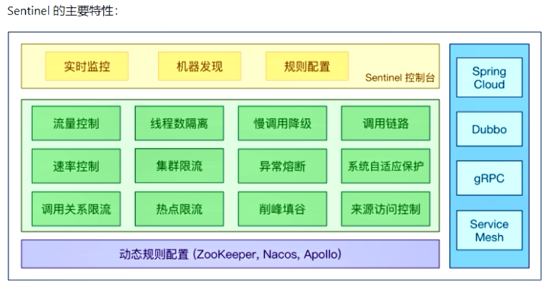  
#### sentinel的下载和安装
+ sentinel下载地址  
https://github.com/alibaba/Sentinel/releases   
1.7.1下载地址： https://github.com/alibaba/Sentinel/releases/download/1.7.1/sentinel-dashboard-1.7.1.jar  

启动Sentinel
> java -jar sentinel-dashboard-1.7.1.jar

访问地址：
> http://localhost:8080  //用户名和密码sentinel/sentinel
    
访问成功的页面
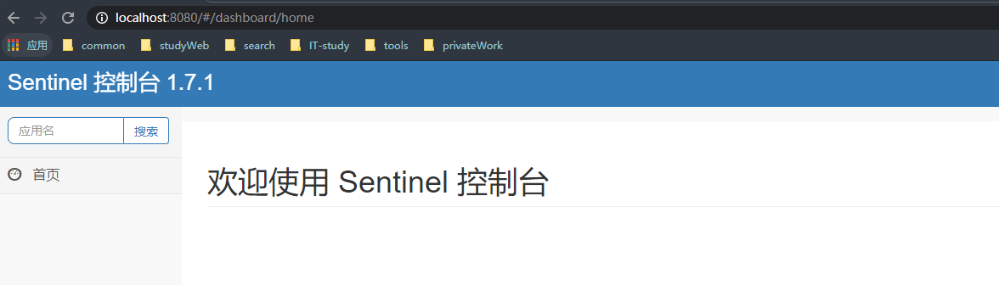
### 微服务cloudalibaba-sentinel-service8401
1、pom.xml
```xml
<!-- alibaba sentinel -->
<dependency>
    <groupId>com.alibaba.csp</groupId>
    <artifactId>sentinel-datasource-nacos</artifactId>
</dependency>
<!-- alibaba nacos -->
<dependency>
    <groupId>com.alibaba.cloud</groupId>
    <artifactId>spring-cloud-starter-alibaba-nacos-discovery</artifactId>
</dependency>
<!-- alibaba nacos sentinel -->
<dependency>
    <groupId>com.alibaba.cloud</groupId>
    <artifactId>spring-cloud-starter-alibaba-sentinel</artifactId>
</dependency>
```
2、yml
```properties
server:
  port: 8401
spring:
  application:
    name: cloudalibaba-centinel-service
  cloud:
    nacos:
      discovery:
        #nacos服务注册中心地址
        server-addr: localhost:8848
    sentinel:
      transport:
        #默认8719端口，加入端口被占用了会自动从8719开始一次+1扫描，知道扫描到未被占用的端口
        port: 8719
        #配置sentinel dashboard地址
        dashboard: localhost:8080
management:
  endpoints:
    web:
      exposure:
        include:  '*'
```
3、主启动类
```java
@SpringBootApplication
@EnableDiscoveryClient
public class SentinelMainApp8401 {
    public static void main(String[] args) {
        SpringApplication.run(SentinelMainApp8401.class, args);
    }
}
```
4、测试controller
```java
@RestController
public class FlowLimitController {
    @GetMapping("/testA")
    public String testA() {
        return "-----------testA";
    }
    @GetMapping("/testB")
    public String testB() {
        return "-----------testB";
    }
}
```
启动测试：8848nacos服务端,8080Sentinel服务端。cloudalibaba-sentinel-service8401client端,  
> 需要访问一次8401的接口才会被sentinel监控，不然刷新监控是没有任何信息的

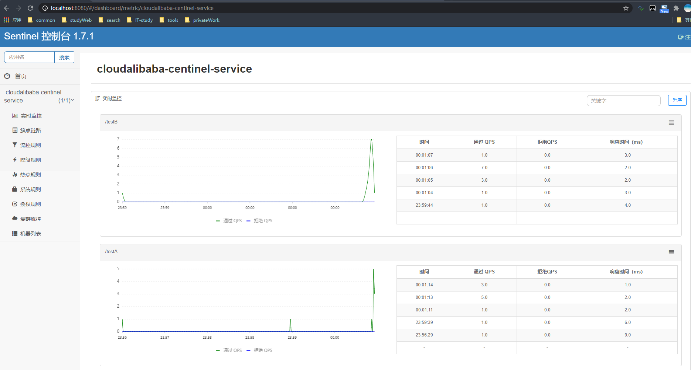  
### 流控规则
+ **资源名：** 唯一名称，默认请求路径
+ **针对来源：** Sentinel可以战队调用者进行限流，填写服务名。默认为default(不区分来源)
+ **阈值类型/单击阈值**
    +   **QPS(每秒中的请求数量):** 当调用该api的QPS达到阈值的时候，进行限流
    +   **线程数：** 当调用该api的线程数达到阈值的时候，进行限流
+ **是否集群：** 不需要集群
+ **流控模式：**
    + **直连：** api达到限流条件时，直接限流
    + **关联：** 当关联的资源达到阈值的时候，就限流自己
    + **链路：** 指记录指定链路上的流量(指定资源从入口资源进来的流量，如果达到阈值，如果达到阈值，就进行限流)【api级别的针对来源】
+ **流控效果：**
    +   **快速失败：**　直接失败，抛异常
    ＋   **Warm Up:** 根据codeFactor(冷加载因子，默认为3)的值，从阈值/codeFactor，经过预热时长，才打到设置的QPS的阈值。
    +   **匀速排队：** 匀速排队，让请求以匀速的速度通过，阈值类型必须设置为QPS，否则无效。
    
 配置：  
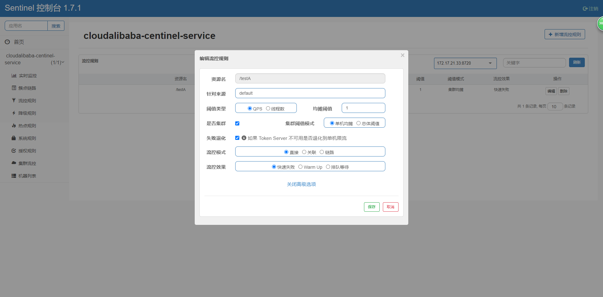  
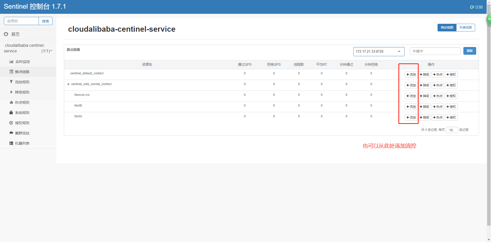  
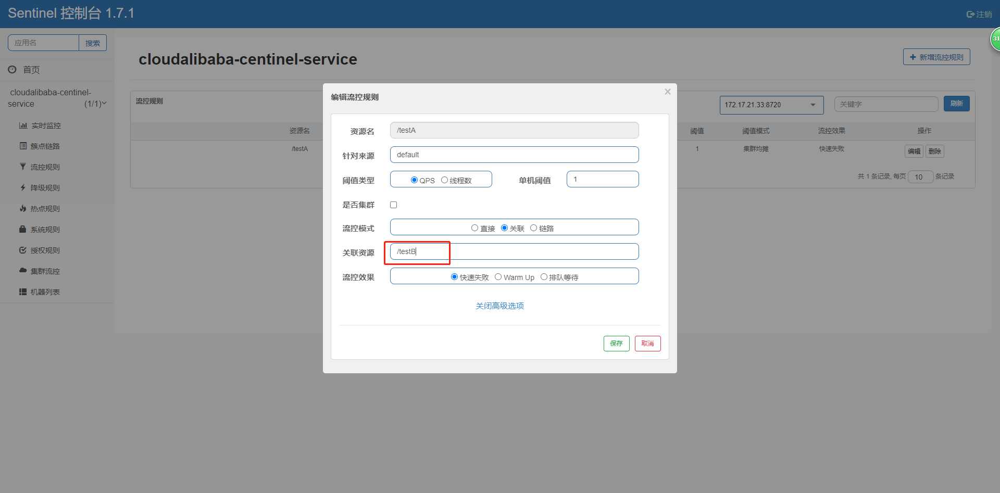  
#### 1、QPS
每秒中的请求次数超过设定的阈值的时候，进行限流  
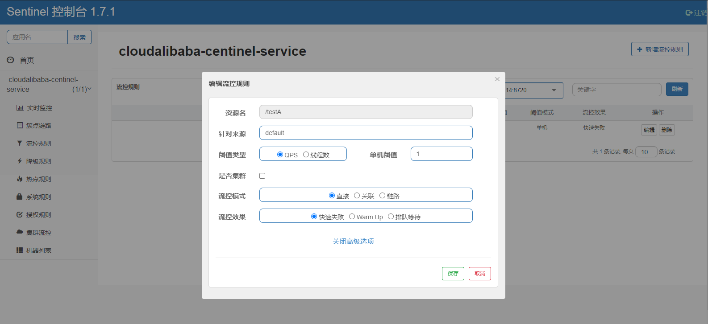    
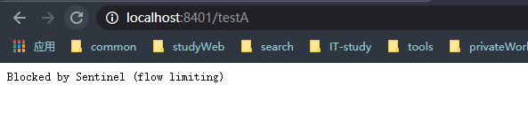  
#### 2、线程数
原理：  当调用该api的线程数达到设定的阈值，限流  
 **类似于在银行办业务，同一个窗口同一时间只有一个客户在办理，其他客户必须等该客户办理完之后才可以办理**  
如何演示：  
1、设置testB的方法执行时间超过1秒，如下
```java
@GetMapping("/testB")
public String testB() {
    try {
        Thread.sleep(2000);
    } catch (InterruptedException e) {
        e.printStackTrace();
    }
    return "-----------testB";
}
```
2、设置线程数请求阈值  
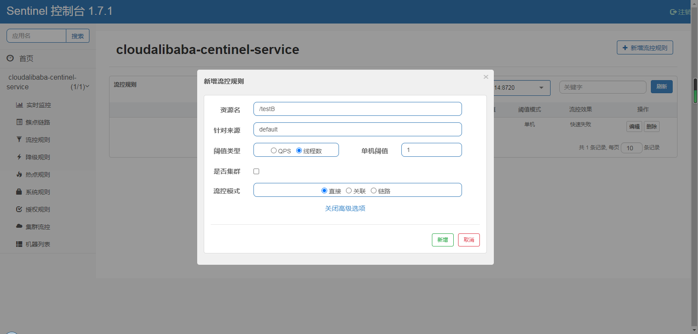  
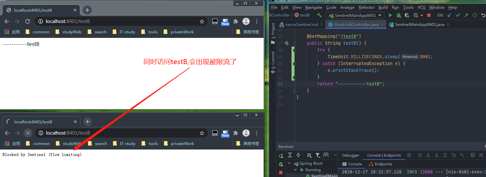  
**调用该api的方法/testB只支持一个线程，但是连续访问刷新线程数超过1个就报异常**
#### 3、关联
当关联的资源达到阈值的时候，就限流自己  
eg:当与A关联的资源B达到阈值后，就限流A自己  
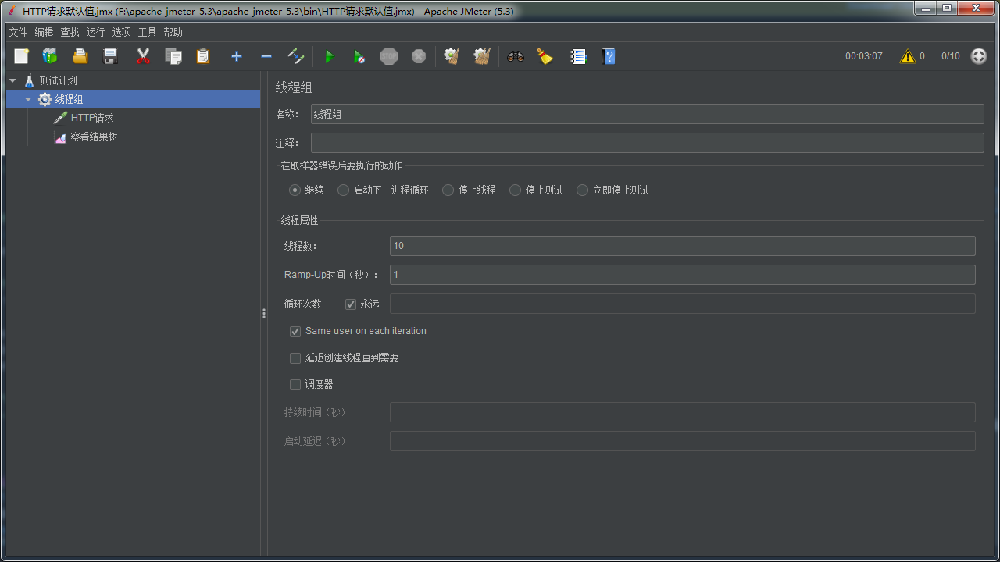  
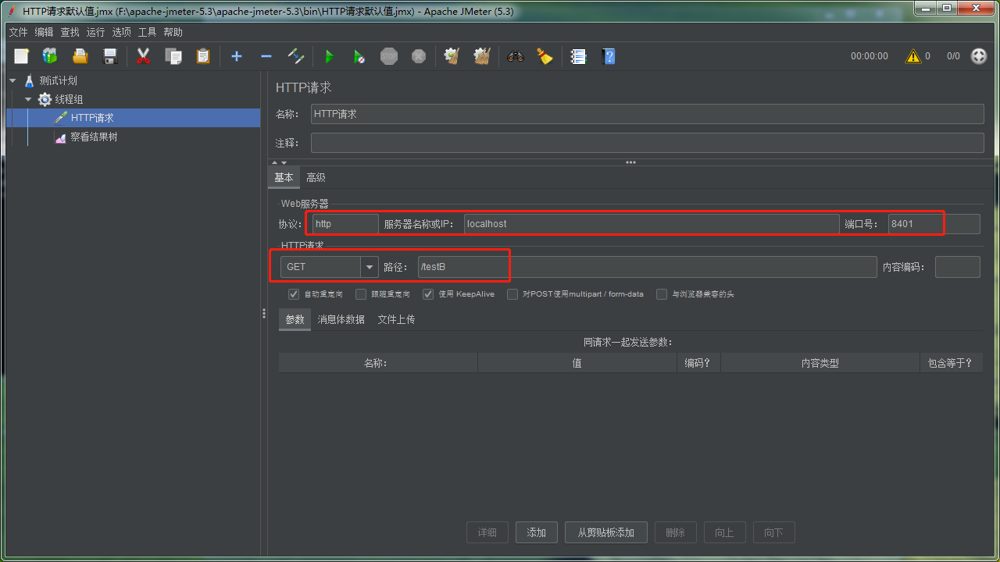  
访问：ApacheJMeter.jar测试testB接口，然后此时访问testB接口出现一下结果  

#### 4、预热
根据codeFactor(冷加载因子，默认为3)的值，从阈值/codeFactor，经过预热时长，才打到设置的QPS的阈值。  
如：秒杀系统开启的瞬间，会有很多流量上来，很有可能会把系统打死，预热方式就是为了把系统保护起来，
可慢慢的吧流量放进来，慢慢的把阈值增加到设定的值  
>默认的codeFactor为3,即请求QPS从(threshold/3)开始，经过多少预热后才逐渐升至设定的QPS的阈值
>案例：阈值10+预热时常设置5秒
>系统初始化的阈值为10/3约等于3，即阈值刚开始为3，经过了5秒后阈值才慢慢升高到10

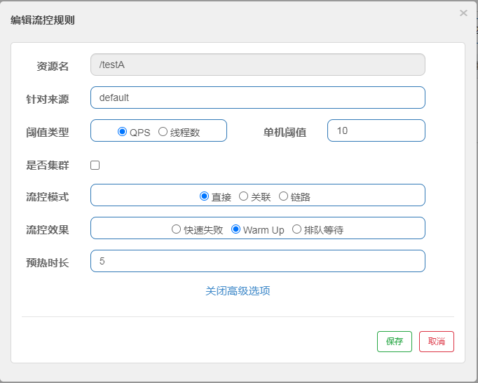  
如何测试结果:  
**刚开始狂点testA,会发现报错Blocked by Sentinel (flow limiting),然后5秒后，阈值从3->10后，会发现狂点刷新浏览器不会出现限流**
#### 5、排队等待
**让请求以均匀的请求速度通过，阈值类型必须为QPS，否则无效**  
设定含义/testA每秒1次请求，请超时的话需要排队等待，等待的超时时间为2000毫秒(即2秒)  
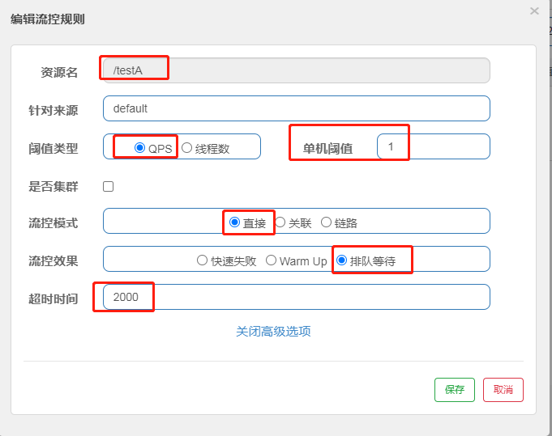  
浏览器一直刷新请求testB  
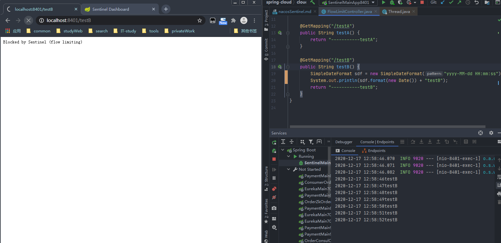  
###　sentinel熔断降级
jmeter下载地址https://archive.apache.org/dist/jmeter/source/#sig

+ RT(平均响应时间) 
> 选择以慢调用比例作为阈值，需要设置允许的慢调用 RT（即最大的响应时间），请求的响应时间大于该值则统计为慢调用。当单位统计时长（statIntervalMs）
内请求数目大于设置的最小请求数目，并且慢调用的比例大于阈值，则接下来的熔断时长内请求会自动被熔断。经过熔断时长后熔断器会进入探测恢复状态（HALF-OPEN 状态）
若接下来的一个请求响应时间小于设置的慢调用 RT 则结束熔断，若大于设置的慢调用 RT 则会再次被熔断。

+ 异常比例 
> 当单位统计时长（statIntervalMs）内请求数目大于设置的最小请求数目，并且异常的比例大于阈值，则接下来的熔断时长内请求会自动被熔断。经过熔断时长后熔断器会
进入探测恢复状态（HALF-OPEN 状态），若接下来的一个请求成功完成（没有错误）则结束熔断，否则会再次被熔断。异常比率的阈值范围是 [0.0, 1.0]，代表 0% - 100%。

+ 异常数
> 当单位统计时长内的异常数目超过阈值之后会自动进行熔断。经过熔断时长后熔断器会进入探测恢复状态（HALF-OPEN 状态），若接下来的一个请求成功完成（没有错误）则结束熔断，否则会再次被熔断。
#### 慢调用比例 (SLOW_REQUEST_RATIO)
平均响应时间 ,<strong>超出阈值</strong> 且 <strong>在时间窗口内</strong>通过的请求数>=5，两个条件同时满足触发降级  
```java
@GetMapping("/testD")
public String testD() {
    try {
        TimeUnit.SECONDS.sleep(1);
    } catch (InterruptedException e) {
        e.printStackTrace();
    }
    log.info("testD 测试RT");
    return "-----------testD";
}
```
2、RT配置   
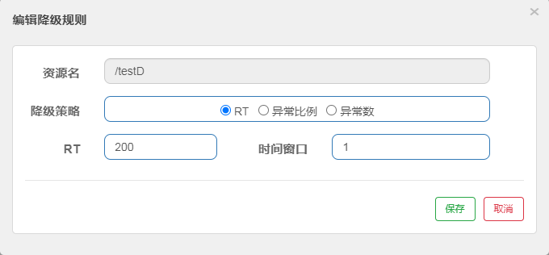  
  
**永远一秒钟执行10个线程数(大于5个)，希望200毫秒执行完，如果超过200毫秒，断路器打开(保险丝跳闸)服务不可用，保险丝跳闸断电了**  
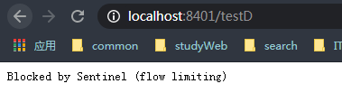
#### 异常比例 (ERROR_RATIO)
QPS>=5,且异常比例(秒级统计)超过阈值时，触发降级，时间窗口结束后，关闭降级
1、新增测试类
```java
@GetMapping("/testC")
public String testC() {
    int a = 10 / 0;
    return "-----------testC";
}
```
2、设置异常比例  
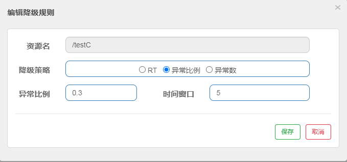  
设置含义：一秒访问量10次(符合官网规定的一秒访问量超过5),然后这些访问失败的比例如果超过30%，则服务降级。
进入testC方法后，全部都是失败的，接下来的5秒内访问进行服务都是熔断的，5秒过后回复正常访问。就这样一直重复。  
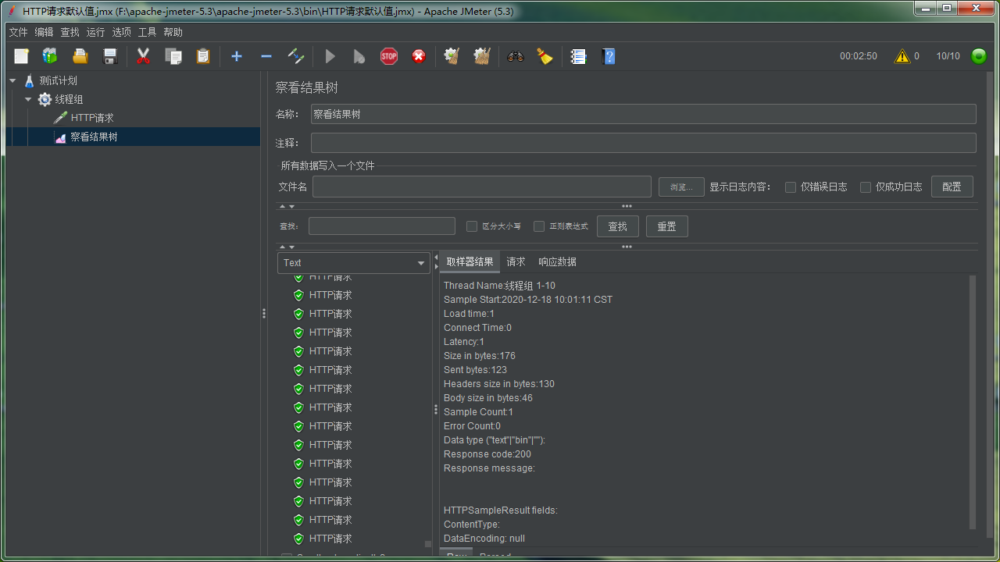
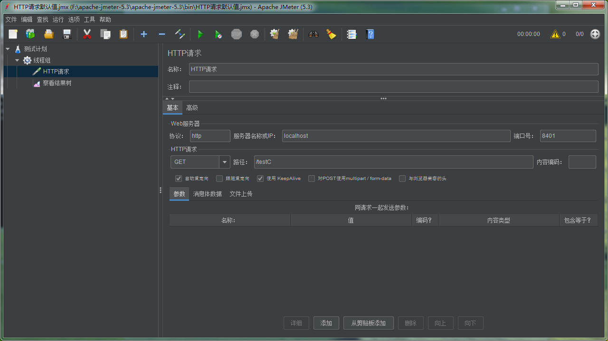
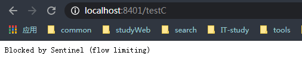  
如果关闭jmeter，则关闭了测试，刷新浏览器，此时不会走设定的异常比例(因为QPS的访问量不够5)则会系统的异常。走runtimeException  
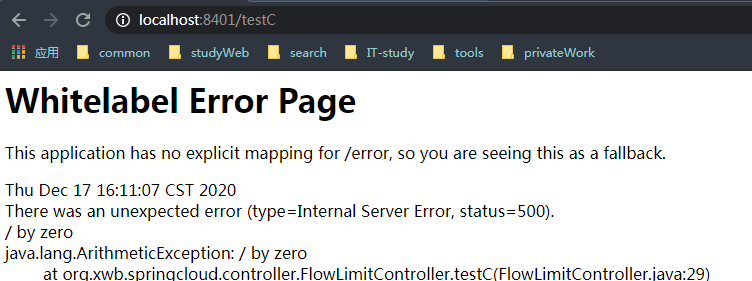
#### 异常数 (ERROR_COUNT)
SentinelResource和Hystrix的HystrixCommand注解是一样的效果，是有alibaba的增强版。  
异常数(分钟统计)超过阈值，触发降级，时间窗口结束后，关闭降级
1、测试类
```java
@GetMapping("/testE")
public String testE() {
    log.info("testD 测试异常数");
    int age = 10 / 0;
    return "-----------testE";
}
```
2、sentinel配置  
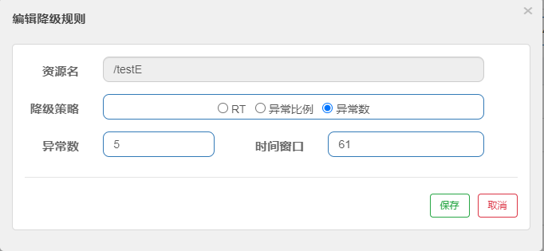  
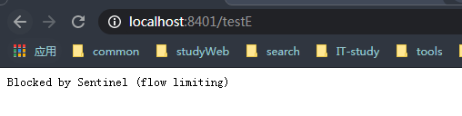    
说明：一分钟之内,访问testE接口，刚开始的时候报错，连续访问5次后，跳闸，服务被熔断，紧接着被降级不能访问
### 热点key限流
热点即经常访问的数据。很多时候我们希望统计某个热点数据中访问频次最高的 Top K 数据，并对其访问进行限制。  
比如：  
商品 ID 为参数，统计一段时间内最常购买的商品 ID 并进行限制  
用户 ID 为参数，针对一段时间内频繁访问的用户 ID 进行限制  
热点参数限流会统计传入参数中的热点参数，并根据配置的限流阈值与模式，对包含热点参数的资源调用进行限流。热点参数限流可以看做是一种特殊的流量控制，仅对包含热点参数的资源调用生效。  

1、测试类 **@SentinelResource**
```java
@GetMapping("/testHotKey")
@SentinelResource(value = "testHotKey", blockHandler = "deal_testHotKey")
public String testHotKey(@RequestParam(value = "p1", required = false) String p1,
                         @RequestParam(value = "p2", required = false) String p2) {
    return "------------------testHotKey";
}
public String deal_testHotKey(String p1, String p2, BlockException blockException) {
    //sentinel 系统默认的提示，Blocked by sentinel (flow limiting)
    return "------deal_testHotKey  ☹- _ -☹";
}
```
2、配置热点key接口 **资源名必须和@SentinelResource的value相同**  
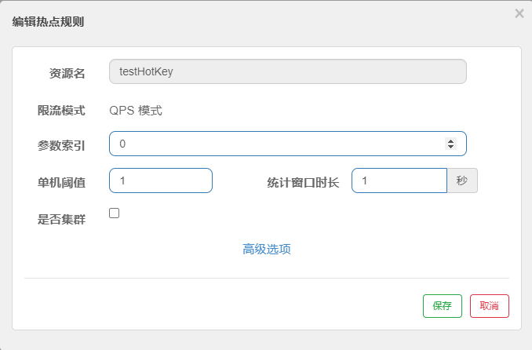  
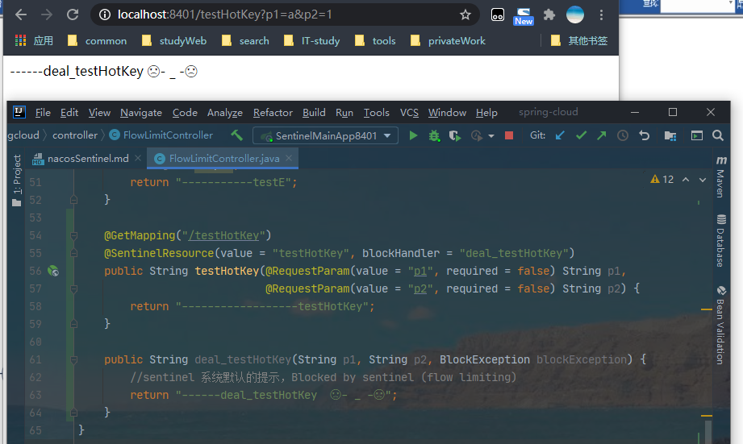  
**特别注意的是，如果设置了热点限流，后端的controller的方法必须有一个blockHandler方法，如果没有，则直接返回错误页面，
原理分析：网页端设置了testHotKey方法的热点限流，然后对应方法也进行了@SentinelResource注解，但是没有指定具体的blockHandler方法，所以当p1传递了参数，
并且在浏览器端的刷新次数达到了一秒钟2次的话，达到了针对testHotKey的热点限流，此时要执行该热点限流指定的额blockHandler，
但是却发现没有，此时就会报错误页面的错**
#### 参数例外项
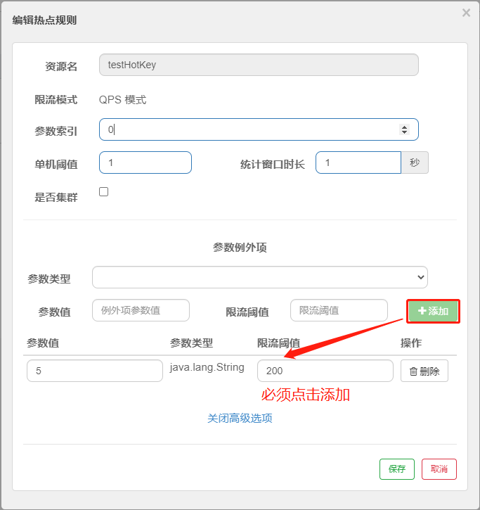  
参数下标为第0个的参数(后台接收的时候知道是String,需要选择对应的数据类型)，正常情况下QPS阈值为1，超过马上被限流，但是如果p1的参数值是5(p1=5)的时候，他的QPS阈值为200。   
注意：**@SentinelResource**处理的是Sentinel控制台配置的违规情况，有blockHandler方法配置的兜底处理。  
**RuntimeException** int a=10/0，这个处理的是java运行时候的异常，走的是RuntimeException,所以此时@SentinelResource不管  
@SentinelResource只管配置出错，运行出错走的是异常  
### 系统规则
系统保护规则是从应用级别的入口流量进行控制，从单台机器的 load、CPU 使用率、平均 RT、入口 QPS 和并发线程数等几个维度监控应用指标，让系统尽可能跑在最大吞吐量的同时保证系统整体的稳定性。  
系统保护规则是应用整体维度的，而不是资源维度的，并且仅对入口流量生效。入口流量指的是进入应用的流量（EntryType.IN），比如 Web 服务或 Dubbo 服务端接收的请求，都属于入口流量。  
系统规则支持以下的模式：  
**Load 自适应（仅对 Linux/Unix-like 机器生效）：** 系统的 load1 作为启发指标，进行自适应系统保护。当系统 load1 超过设定的启发值，且系统当前的并发线程数超过估算的系统容量时才会触发系统保护（BBR 阶段）。系统容量由系统的 maxQps * minRt 估算得出。设定参考值一般是 CPU cores * 2.5。  
**CPU usage（1.5.0+ 版本）：** 当系统 CPU 使用率超过阈值即触发系统保护（取值范围 0.0-1.0），比较灵敏。  
**平均 RT：** 当单台机器上所有入口流量的平均 RT 达到阈值即触发系统保护，单位是毫秒。  
**并发线程数：** 当单台机器上所有入口流量的并发线程数达到阈值即触发系统保护。  
**入口 QPS：** 当单台机器上所有入口流量的 QPS 达到阈值即触发系统保护。  
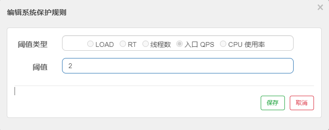  
设置了QPS的阈值为2，不管访问那个接口，1秒内的访问次数达到2次的话就被限流
### 按资源名称限流
上面讲解了按照服务名限流，以下针对接口进行限流  
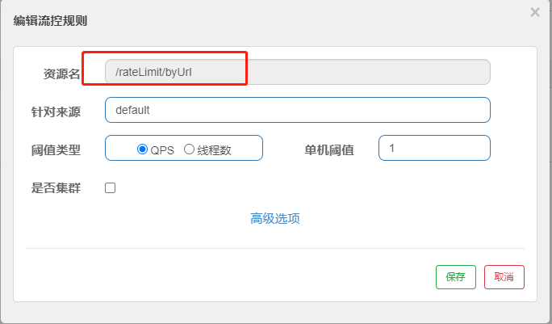  
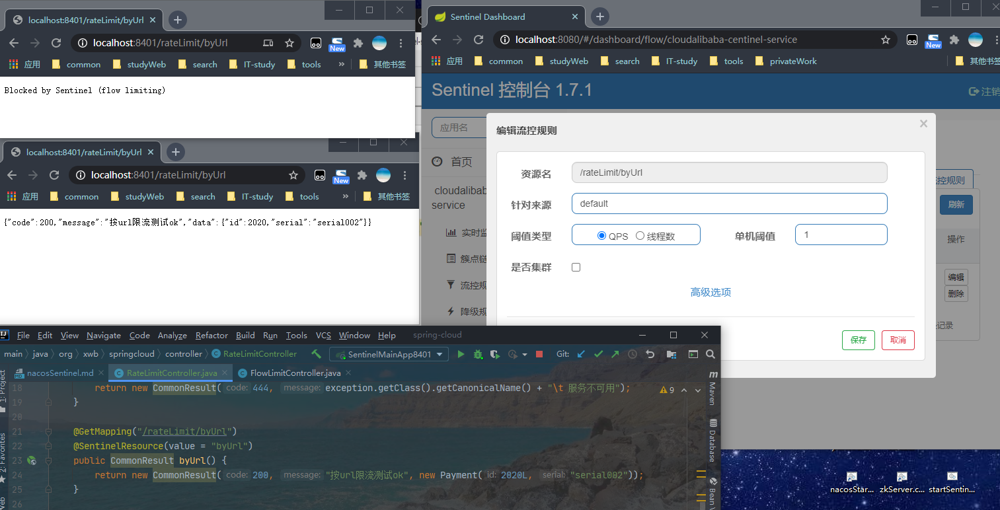  
以上会出现代码冗余，需要进行客户自定义的处理限流逻辑  
#### 用户自定义
1、提供统一的异常处理类  
```java
package org.xwb.springcloud.myhandler;
import com.alibaba.csp.sentinel.slots.block.BlockException;
import org.xwb.springcloud.entities.CommonResult;
public class CustomerHandler {
    public static CommonResult handlerException1(BlockException blockException) {
        return new CommonResult(4444, "按照客户自定义， global handlerException-------------1");
    }
    public static CommonResult handlerException2(BlockException blockException) {
        return new CommonResult(4444, "按照客户自定义， global handlerException-------------2");
    }
}
```
2、在调用的服务名进行@SentinelResource指定限流的**类**和**方法**  
```java
@GetMapping("/rateLimit/customerBlockHandler")
@SentinelResource(value = "customerBlockHandler", blockHandlerClass = CustomerHandler.class, blockHandler = "handlerException2")
public CommonResult customerBlockHandler() {
    return new CommonResult(200, "按客户自定义限流测试ok", new Payment(2020L, "serial002"));
}
```
注： **blockHandlerClass指定的是class类，blockHandler指定的是类里面具体的方法**  
3、配置限流服务名  
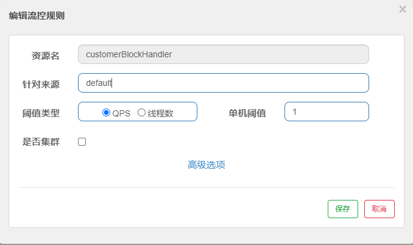  
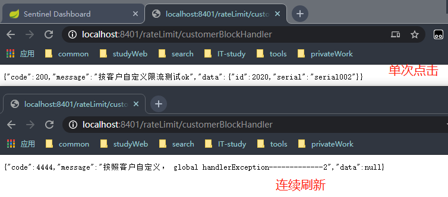  
### 熔断
#### ribbon系列
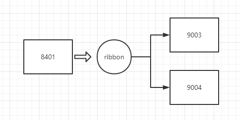  
##### 服务提供者9003,9004
1、新建cloudalibaba-provider-payment9003(9004下同)   
```java
<!-- alibaba nacos 服务端 -->
<dependency>
    <groupId>com.alibaba.cloud</groupId>
    <artifactId>spring-cloud-starter-alibaba-nacos-discovery</artifactId>
</dependency>
<!-- 引入api 公共包 -->
<dependency>
    <groupId>org.xwb.springcloud</groupId>
    <artifactId>cloud-api-commons</artifactId>
    <version>1.0-SNAPSHOT</version>
</dependency>
<dependency>
    <groupId>org.springframework.boot</groupId>
    <artifactId>spring-boot-starter-web</artifactId>
</dependency>
<dependency>
    <groupId>org.springframework.boot</groupId>
    <artifactId>spring-boot-starter-actuator</artifactId>
</dependency>
```
2、yml配置  
```properties
server:
  port: 9002
spring:
  application:
    name: nacos-payment-provider
  cloud:
    nacos:
      discovery:
        server-addr: localhost:8848 #配置Nacos地址
management:
  endpoints:
    web:
      exposure:
        include:  '*'
```
3、主启动类  
```java
@SpringBootApplication
@EnableDiscoveryClient
public class PaymentMain9003 {
    public static void main(String[] args) {
        SpringApplication.run(PaymentMain9002.class, args);
    }
}
```
4、controller  
```java
@RestController
public class PaymentController {
    @Value("${server.port}")
    private String serverPort;
    public static HashMap<Long, Payment> hashMap = new HashMap<>();
    static {
        hashMap.put(1l, new Payment(1L, "210374208734KJEWFKW0U20sklfw0uor023u4"));
        hashMap.put(2l, new Payment(2L, "3498hofwsefhls93984rfhseohf2890343rwe"));
        hashMap.put(3l, new Payment(3L, "09snkjdfhjoiwhefdsnfjkhweo5235wefhwee"));
    }
    @GetMapping("/paymentSQL/{id}")
    public CommonResult paymentSQL(@PathVariable("id") Long id) {
        Payment payment = hashMap.get(id);
        CommonResult<Payment> result = new CommonResult<>(200, "from mysql,serverPort" + serverPort, payment);
        return result;
    }
}
```
##### 服务消费者cloudalibaba-consumer-nacos-order84
1、pom.xml
```xml
<!-- alibaba sentinel -->
<dependency>
    <groupId>com.alibaba.csp</groupId>
    <artifactId>sentinel-datasource-nacos</artifactId>
</dependency>
<!-- alibaba nacos -->
<dependency>
    <groupId>com.alibaba.cloud</groupId>
    <artifactId>spring-cloud-starter-alibaba-nacos-discovery</artifactId>
</dependency>
<!-- alibaba nacos sentinel -->
<dependency>
    <groupId>com.alibaba.cloud</groupId>
    <artifactId>spring-cloud-starter-alibaba-sentinel</artifactId>
</dependency>
```
2、yml
```properties
server:
  port: 84
spring:
  application:
    name: nacos-order-consumer
  cloud:
    nacos:
      discovery:
        server-addr: localhost:8848
    sentinel:
      transport:
        dashboard: localhost:8080
        # 默认8719端口，假如被占用会自动从8719开始一次+1稻苗，知道找到违背占用的端口
        port: 8719
# 消费者将要去访问的服务名称(注册进nacos的服务提供者名称)
service-url:
  nacos-user-service: http://nacos-payment-provider
```
3、主启动类
```java
@SpringBootApplication
@EnableDiscoveryClient
public class OrderNacosMain84 {
    public static void main(String[] args) {
        SpringApplication.run(OrderNacosMain84.class, args);
    }
}
```
4、负载均衡
```java
@Configuration
public class ApplicationContextConfig {
    @Bean
    @LoadBalanced
    public RestTemplate getLoadBalanced() {
        return new RestTemplate();
    }
}
```
5、controller
```java
@Slf4j
@RestController
public class CirleBreakerController {
    public static final String SERVICE_URL = "http://nacos-payment-provider";
    @Resource
    private RestTemplate restTemplate;

    @RequestMapping("/consumer/fallback/{id}")
    @SentinelResource(value = "fallback")
    public CommonResult<Payment> fallback(@PathVariable Long id) {
        CommonResult<Payment> result = restTemplate.getForObject(SERVICE_URL + "/paymentSQL/" + id, CommonResult.class);
        if (id == 4) {
            throw new IllegalArgumentException("IllegalArgumentException,非法参数异常");
        } else if (result.getData() == null) {
            throw new NullPointerException("NullPointerException,该id没有对应的记录，空指针异常");
        }
        return result;
    }
    public CommonResult<Payment> fallback(BlockException blockException) {
        return new CommonResult<Payment>(444, "", null);
    }
}
```
+ **测试**

启动顺序nacos，sentinel,9003,9004,最后启动调用方84  
1、@SentinelResource(value = "fallback", fallback = "handlerFallback") **fallback**  
```java
@RequestMapping("/consumer/fallback/{id}")
@SentinelResource(value = "fallback", fallback = "handlerFallback")//只负责业务异常
public CommonResult<Payment> fallback(@PathVariable Long id) {
    CommonResult<Payment> result = restTemplate.getForObject(SERVICE_URL + "/paymentSQL/" + id, CommonResult.class);
    if (id == 4) {
        throw new IllegalArgumentException("IllegalArgumentException,非法参数异常");
    } else if (result.getData() == null) {
        throw new NullPointerException("NullPointerException,该id没有对应的记录，空指针异常");
    }
    return result;
}
public CommonResult handlerFallback(@PathVariable("id") Long id, Throwable e) {
    Payment payment = new Payment(id, null);
    return new CommonResult(444, "兜底异常handlerFallback，exception内容" + e.getMessage(), payment);
}
```
测试结果  
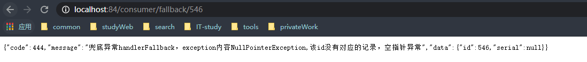  
2、测试@SentinelResource(value = "fallback", blockHandler = "handlerFallback")**blockHandler**  
**blockHandler只负责sentinel控制台的配置**  
```java
@RequestMapping("/consumer/fallback/{id}")
@SentinelResource(value = "fallback", blockHandler = "blockHandler")//blockHandler只负责sentinel控制台的配置
public CommonResult<Payment> fallback(@PathVariable Long id) {
    CommonResult<Payment> result = restTemplate.getForObject(SERVICE_URL + "/paymentSQL/" + id, CommonResult.class);
    if (id == 4) {
        throw new IllegalArgumentException("IllegalArgumentException,非法参数异常");
    } else if (result.getData() == null) {
        throw new NullPointerException("NullPointerException,该id没有对应的记录，空指针异常");
    }
    return result;
}
public CommonResult blockHandler(@PathVariable("id")Long id, BlockException blockException){
    Payment payment=new Payment(id,null);
    return new CommonResult(445,"blockHandler-sentinel限流，无此流水，blockException:"+blockException.getMessage(),payment);
}
```
结果(第一次异常页面，连续一秒内刷新超过2次，出现sentinel的限流规则)  
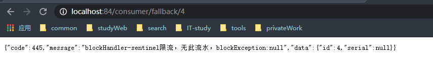  
3、如果fallback和blockHandler都配置了，该怎么执行
```java
@RequestMapping("/consumer/fallback/{id}")
@SentinelResource(value = "fallback",fallback = "handlerFallback", blockHandler = "blockHandler")
public CommonResult<Payment> fallback(@PathVariable Long id) {
    CommonResult<Payment> result = restTemplate.getForObject(SERVICE_URL + "/paymentSQL/" + id, CommonResult.class);
    if (id == 4) {
        throw new IllegalArgumentException("IllegalArgumentException,非法参数异常");
    } else if (result.getData() == null) {
        throw new NullPointerException("NullPointerException,该id没有对应的记录，空指针异常");
    }
    return result;
}
public CommonResult blockHandler(@PathVariable("id")Long id, BlockException blockException){
    Payment payment=new Payment(id,null);
    return new CommonResult(445,"blockHandler-sentinel限流，无此流水，blockException:"+blockException.getMessage(),payment);
}
public CommonResult handlerFallback(@PathVariable("id") Long id, Throwable e) {
    Payment payment = new Payment(id, null);
    return new CommonResult(444, "兜底异常handlerFallback，exception内容" + e.getMessage(), payment);
}
```
结果(刷新浏览器1秒超过2次)  
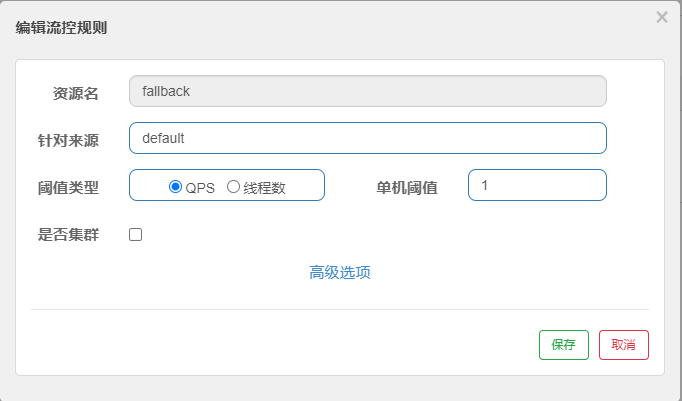  
**若blockHandler和fallback都配置了，则被限流降级而抛出BlockException时只会进入blockHandler处理逻辑**
##### exceptionsToIgnore
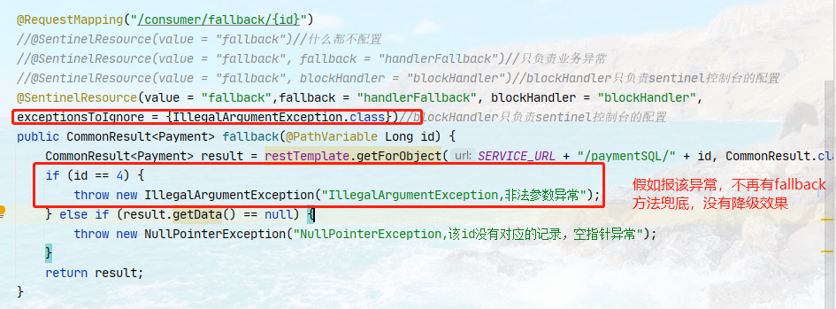
#### feign系列
修改cloudalibaba-consumer-nacos-order84使用feign调用  
1、pom.xml
```xml
<!-- openfeign -->
<dependency>
    <groupId>org.springframework.cloud</groupId>
    <artifactId>spring-cloud-starter-openfeign</artifactId>
</dependency>
```
2、aplication.yml
```properties
# 激活sentinel对feign的支持
feign:
  sentinel:
    enabled: true
```
3、开启对feign的支持
```java
@SpringBootApplication
@EnableDiscoveryClient
@EnableFeignClients
public class OrderNacosMain84 {
    public static void main(String[] args) {
        SpringApplication.run(OrderNacosMain84.class, args);
    }
}
```
4、openFeign提供接口调用OpenClient  
```java

@FeignClient(value = "nacos-payment-provider", fallback = PaymentFallbackService.class)
public interface PaymentService {
    @GetMapping("/paymentSQL/{id}")
    public CommonResult paymentSQL(@PathVariable("id") Long id);
}


@Component
public class PaymentFallbackService implements PaymentService {
    @Override
    public CommonResult paymentSQL(Long id) {
        return new CommonResult<Payment>(4444,"",new Payment(id,"errorSerial"));
    }
}
```
测试，启动nacos,sentinel,9003,9004,84，访问一下地址 http://localhost:84/consumer/paymentSQL/1(正常访问)  
此时关闭9003，或者9004，再次刷新访问  
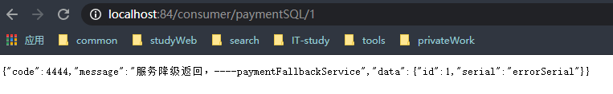  
会发现调用失败，服务自动降级
### 持久化
**修改cloudalibaba-sentinel-service8401项目**  
1、jar包
```xml
<!-- alibaba sentinel -->
<dependency>
    <groupId>com.alibaba.csp</groupId>
    <artifactId>sentinel-datasource-nacos</artifactId>
</dependency>
<!-- alibaba nacos -->
<dependency>
    <groupId>com.alibaba.cloud</groupId>
    <artifactId>spring-cloud-starter-alibaba-nacos-discovery</artifactId>
</dependency>
<!-- alibaba nacos sentinel -->
<dependency>
    <groupId>com.alibaba.cloud</groupId>
    <artifactId>spring-cloud-starter-alibaba-sentinel</artifactId>
</dependency>
```
2、application.yml
```properties
spring:
  cloud:
    sentinel:
      # 将sentinel的配置数据保存到nacos中
      datasource:
        ds1: #数据源1
          nacos:
            server-addr: localhost:8848
            dataId: cloudalibaba-sentinel-service
            groupId: DEFAULT_GROUP
            data-type: json
            rule-type: flow
```
3、在nacos控制台添加一下文件
```properties
[
    {
        "resource":"/rateLimit/byUrl",
        "limitApp":"default",
        "grade":1,
        "count":1,
        "strategy":0,
        "controlBehavior":0,
        "clusterMode":false
    }
]
```
说明：  
resource:资源名称  
limitApp: 来源应用  
grade: 阈值类型0、线程数1、QPS  
count： 单机阈值  
strategy： 流控模式，0表示直连1表示关联2表示链路  
controlBehavior: 流控效果，0快速失败1、表示Warm Up,2、表示排队等待  
clusterMode: 是否集群true集群false不集群  
****
**nacos配置的是服务名cloudalibaba-sentinel-service**   
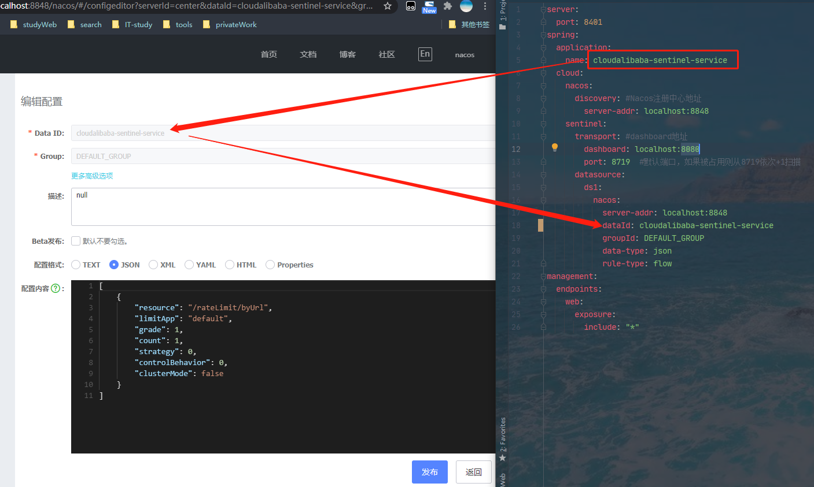