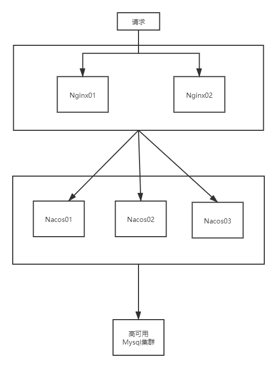
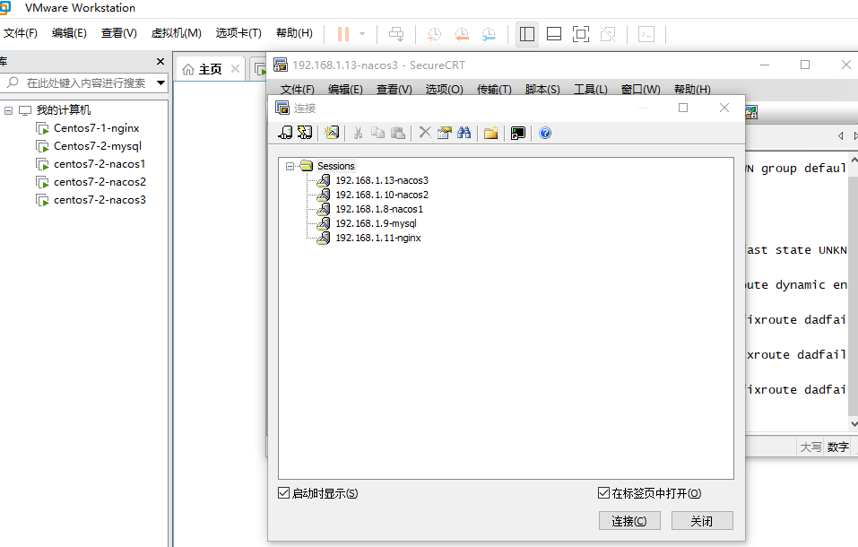

# nacos集群
Nacos集群


本人虚拟机中的三个地址分别为  
```
192.168.1.8 nacos1  
192.168.1.9 mysql  
192.168.1.10 nacos2  
192.168.1.11 nginx  
192.168.1.13 nacos3  
```

然后以下三个操作在每个服务器上的操作都是相同的。只举一个例子
## mysql的安装
1、创建数据库nacos_config  
2、导入nacos-sql
##  nacos的安装和配置
https://github.com/alibaba/nacos/releases/download/1.1.4/nacos-server-1.1.4.tar.gz  
### nacos数据源连接
1、以1.11为例进行nacos的安装目录
```xml

    mkdir /mynacos/
    cd /mynacos/
    将上传的tar包解压
    tar -zxvf nacos-server-1.1.4.tar.gz
    cd nacos/bin/
    \cp startup.sh startup.sh.bk(防止出错找原文件)
```
2、修改mysql的连接信息
```xml
    cd  /mynacos/nacos/conf
    cp application.properties application.properties.bk;[备份]
    vim application.properties
```
结尾添加以下信息
```properties
###########################################################
spring.datasource.platform=mysql
db.num=1
db.url.0=jdbc:mysql://192.168.1.9:3306/nacos_config?characterEncoding=utf8&connectTimeout=1000&socketTimeout=3000&autoReconnect=true
db.user=root
db.password=123456
```
### nacos集群文件的配置
### 创建集群文件配置
4、配置集群文件cluster.conf
```xml
cd  /mynacos/nacos/conf
cp cluster.conf.example  cluster.conf
vim cluster.conf
```
编辑输入以下内容
```xml
192.168.1.8:3333
192.168.1.10:4444
192.168.1.13:5555
```
5、修改startup.sh脚本
> /mynacos/nacos/bin 目录下有startup.sh
> 集群启动,传递不同的端口号启动不同的实例，命令： ./startup.sh -p 3333 表示启动端口号为3333的nacos的服务器实例
> 和上一步的cluster.conf的配置基本一致

```xml
cd /mynacos/nacos/bin
cp startup.sh startup.sh.bk
vim startup.sh
```
#### 修改启动脚本  
1、原始的:p部分
```shell
while getopts ":m:f:s:" opt
do
    case $opt in
        m)
            MODE=$OPTARG;;
        f)
            FUNCTION_MODE=$OPTARG;;
        s)
            SERVER=$OPTARG;;
        ?)
        echo "Unknown parameter"
        exit 1;;
    esac
done
```
修改后
```shell
while getopts ":m:f:s:p:" opt
do
    case $opt in
        m)
            MODE=$OPTARG;;
        f)
            FUNCTION_MODE=$OPTARG;;
        s)
            SERVER=$OPTARG;;
        p)
            PORT=$OPTARG;;
        ?)
        echo "Unknown parameter"
        exit 1;;
    esac
done
```
2、指定启动的是哪一个集群节点

```shell
nohup $JAVA ${JAVA_OPT} nacos.nacos >> ${BASE_DIR}/logs/start.out 2>&1 &
```
改之后
```shell
nohup $JAVA -Dserver.port=${PORT} ${JAVA_OPT} nacos.nacos >> ${BASE_DIR}/logs/start.out 2>&1 &
```
执行方式
```shell
./startup.sh -p 3333
./startup.sh -p 4444
./startup.sh -p 5555
```
## nginx的配置
配置三个地方

```shell
    cd   /root/nginx-1.9.9
    # 1、配置集群
     upstream cluster{
        server 127.0.0.1:3333;
        server 127.0.0.1:4444;
        server 127.0.0.1:5555;
    }
    server {
        # 修改端口号
        listen       1111;
        server_name  localhost;

        #charset koi8-r;

        #access_log  logs/host.access.log  main;
        # 根目录进行截取
        location / {
            #root   html;
            #index  index.html index.htm;
            # 请求走cluster代理，意思就是走upstream cluster
            proxy_pass http://cluster;
        }
    }
```
## 启动验证
1、启动nacos
```shell
    cd /mynacos/nacos/bin
    ./startup.sh -p 3333
    ./startup.sh -p 4444
    ./startup.sh -p 5555
    ps -ef | grep nacos |grep -v grep |wc -l
```
2、启动nginx
```shell
    cd /usr/local/nginx/sbin
    ./nginx -c /usr/local/nginx/conf/nginx.conf
    ps -ef | grep nginx
```
3、访问浏览器[实际访问的是nginx]
    http://192.168.1.11:1111/nacos
## 项目中集成
以cloudalibaba-provider-payment9002为例，集成nacos集群
```properties
server:
  port: 9002
spring:
  application:
    name: nacos-payment-provider
  cloud:
    nacos:
      discovery:
        # 换成nginx的1111的端口，做集群
        server-addr: 192.168.1.9:1111
        #单台nginx的连接
        #server-addr: localhost:8848 #配置Nacos地址
```