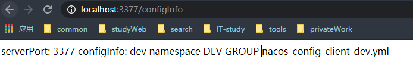
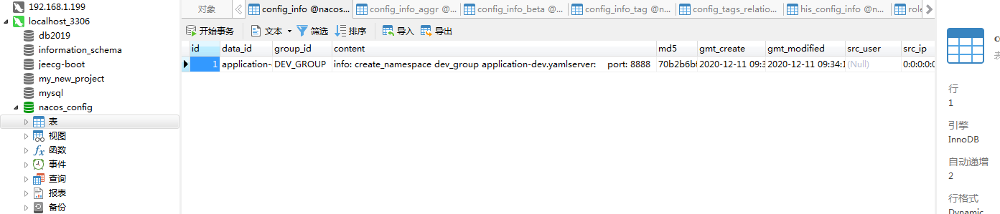

Nacos(Dynamic Naming and Config Service)  
+ 中文帮助文档 https://github.com/alibaba/spring-cloud-alibaba/blob/master/README-zh.md
+ https://nacos.io/zh-cn/index.html
+ 主要功能：
  + <strong>服务限流降级</strong>：默认支持 WebServlet、WebFlux, OpenFeign、RestTemplate、Spring Cloud Gateway, Zuul, Dubbo 和 RocketMQ 限流降级功能的接入，可以在运行时通过控制台实时修改限流降级规则，还支持查看限流降级 Metrics 监控。
  + <strong>服务注册与发现</strong>：适配 Spring Cloud 服务注册与发现标准，默认集成了 Ribbon 的支持。
  + <strong>分布式配置管理</strong>：支持分布式系统中的外部化配置，配置更改时自动刷新。
  + <strong>消息驱动能力</strong>：基于 Spring Cloud Stream 为微服务应用构建消息驱动能力。
  + <strong>分布式事务</strong>：使用 @GlobalTransactional 注解， 高效并且对业务零侵入地解决分布式事务问题。。
  + <strong>阿里云对象存储</strong>：阿里云提供的海量、安全、低成本、高可靠的云存储服务。支持在任何应用、任何时间、任何地点存储和访问任意类型的数据。
  + <strong>分布式任务调度</strong>：提供秒级、精准、高可靠、高可用的定时（基于 Cron 表达式）任务调度服务。同时提供分布式的任务执行模型，如网格任务。网格任务支持海量子任务均匀分配到所有 Worker（schedulerx-client）上执行。
  + <strong>阿里云短信服务</strong>：覆盖全球的短信服务，友好、高效、智能的互联化通讯能力，帮助企业迅速搭建客户触达通道。
  
> Nacos=Eureka+Config+Bus 

### nacos的安装
下载地址： https://github.com/alibaba/nacos/releases  
1.1.4的下载地址  
 https://github.com/alibaba/nacos/releases/download/1.1.4/nacos-server-1.1.4.zip  
 https://github.com/alibaba/nacos/releases/download/1.1.4/nacos-server-1.1.4.tar.gz  
```html
http://localhost:8848/nacos //用户名密码nacos/nacos
```

## 项目集成Nacos
新建cloudalibaba-provider-payment9001，cloudalibaba-provider-payment9002,以下创建9001,9002和9001下同。  
### 首先在总项目中集成jar
```xml
<!-- SpringCloud alibaba -->
<dependencyManagement>
    <dependency>
        <groupId>com.alibaba.cloud</groupId>
        <artifactId>spring-cloud-alibaba-dependencies</artifactId>
        <version>2.1.0.RELEASE</version>
        <type>pom</type>
        <scope>import</scope>
    </dependency>
</dependencyManagement>
```
#### 一、新建服务提供者cloudalibaba-provider-payment9001,9002
1、pom.xml
```xml
<!-- alibaba nacos 服务端 -->
<dependency>
    <groupId>com.alibaba.cloud</groupId>
    <artifactId>spring-cloud-starter-alibaba-nacos-discovery</artifactId>
</dependency>
```
2、yml配置
```properties
server:
  port: 9001
spring:
  application:
    name: nacos-payment-provider
  cloud:
    nacos:
      discovery:
        server-addr: localhost:8848 #配置Nacos地址
management:
  endpoints:
    web:
      exposure:
        include:  '*'
```
3、主启动类
```java
@SpringBootApplication
@EnableDiscoveryClient
public class PaymentMain9001 {
    public static void main(String[] args) {
        SpringApplication.run(PaymentMain9001.class, args);
    }
}
```
4、controller
```java
@RestController
public class PaymentController {
    @Value("${server.port}")
    private String serverPort;
    @GetMapping(value = "/payment/nacos/{id}")
    public String getPaymentById(@PathVariable("id") Long id) {
        return "nacos registry ,serverPort: +" + serverPort + "\t id " + id;
    }
}
```
完成9001的搭建，9002上同(此处省略)。

#### 二、新建服务消费者cloudalibaba-consumer-nacos-order83
1、pom.xml
```xml
<!-- alibaba nacos 服务端 -->
<dependency>
    <groupId>com.alibaba.cloud</groupId>
    <artifactId>spring-cloud-starter-alibaba-nacos-discovery</artifactId>
</dependency>
```
2、yml
```properties
server:
  port: 83
spring:
  application:
    name: nacos-payment-comsumer
  cloud:
    nacos:
      discovery:
        server-addr: localhost:8848 #配置Nacos地址
management:
  endpoints:
    web:
      exposure:
        include:  '*'
#消费者将要去访问的微服务名称，(注册成功进nacos的微服务提供者)
service-url:
  nacos-user-service: http://nacos-payment-provider
```
3、主启动类
```java
@SpringBootApplication
@EnableDiscoveryClient
public class NacosConsumerMain83 {
    public static void main(String[] args) {
        SpringApplication.run(NacosConsumerMain83.class, args);
    }
}
```
4、restTemplate和Controller
```java
//restTemplate类
@Configuration
public class ApplicationContextConfig {
    @Bean
    @LoadBalanced
    public RestTemplate getRestTemplate() {
        return new RestTemplate();
    }
}
//controller
@RestController
@Slf4j
public class OrderNacosController {
    @Resource
    private RestTemplate restTemplate;
    @Value("${service-url.nacos-user-service}")
    private String nacosUserService;

    @GetMapping("/consumer/payment/nacos/{id}")
    public String paymentInfo(@PathVariable("id") Long id) {
        return restTemplate.getForObject(nacosUserService + "/payment/nacos/" + id, String.class);
    }
}
```
测试结果（刷新，9001,9002轮询访问）  

#### 注册中心对比
  
<strong>nacos支持AP和Cp</strong>  
如何切换  
> curl -X PUT '$NACOS_SERVER:8848/nacos/v1/ns/operator/switches?entry=serverMode&value=CP'
## Nacos做配置中心
> nacos替代了springCloud的config,在项目初始化时，要保证先从配置中心进行配置拉取，拉取配置之后，才能保证项目的正常启动。
springboot中配置稳健的加载优先顺序为，bootstrap优先级高于application。  
以前是通过config去github上拉去配置，现在nacos自己封装了一套，直接去nacos里面读取配置信息即可

#### 配置中心3377
1、pom.xml
```xml
<!-- alibaba nacos config -->
<dependency>
    <groupId>com.alibaba.cloud</groupId>
    <artifactId>spring-cloud-starter-alibaba-nacos-config</artifactId>
</dependency>
<!-- alibaba nacos 服务端 -->
<dependency>
    <groupId>com.alibaba.cloud</groupId>
    <artifactId>spring-cloud-starter-alibaba-nacos-discovery</artifactId>
</dependency>
```
2、配置规则  
配置规则官网说明: https://nacos.io/zh-cn/docs/quick-start-spring-cloud.html  
  
 表达式规则:   
   ${spring.application.name}-${spring.profile.active}.${spring.nacos.config.file-extension}  

2.1、 bootstrap.yml
```properties
    server:
      port: 3377
    spring:
      application:
        name: nacos-config-client
      cloud:
        nacos:
          discovery:
            server-addr: localhost:8848 #nacos服务注册中心地址
          config:
            server-addr: localhost:8848 #nacos作为配置中心地址
            file-extension: yaml #指定yaml格式的配置
```
2.2、 application.yml
```properties
    spring:
      profiles:
        active: dev
```
3、主启动类
```java
@SpringBootApplication
@EnableDiscoveryClient
public class NacosConfigClientMain3377 {
    public static void main(String[] args) {
        SpringApplication.run(NacosConfigClientMain3377.class, args);
    }
}
```
4、controller  
```java
@RestController
@Slf4j
@RefreshScope //支持nacos的动态刷新功能
public class ConfigClientController {
    @Value("${config.info}")
    private String configInfo;
    @Value("${server.port}")
    private String serverPort;

    @GetMapping("configInfo")
    public String getConfigInfo() {
        return "serverPort: " + serverPort + "\t\n\n configInfo: " + configInfo;
    }
}
```
> @RefreshScope  该注解谨记一听要添加，动态刷新nacos配置被修改的最新配置信息
+ 访问   
1、在nacos中创建上面配置的<strong>nacos-config-client-dev.yaml</strong>文件

1、访问 http://localhost:3377/configInfo  
2、效果图  
  
修改nacos的配置文件，实时刷新后会自动刷新到最新的配置信息
### Nacos分类管理
  
namespace(命令空间)、group(分组)、dataid  
<strong>１、dataid</strong>　　
> Nacos 中的某个配置集的 ID。配置集 ID 是组织划分配置的维度之一。Data ID 通常用于组织划分系统的配置集。
一个系统或者应用可以包含多个配置集，每个配置集都可以被一个有意义的名称标识。Data ID 通常采用类 Java 包
（如 com.taobao.tc.refund.log.level）的命名规则保证全局唯一性。此命名规则非强制。这个概念来自于官方文档，
 说人话就是配置文件的名字，相当于主键的作用

<strong>２、group(分组)</strong>　　 
> Nacos 中的一组配置集，是组织配置的维度之一。通过一个有意义的字符串（如 Buy 或 Trade ）对配置集进行分组，
 从而区分 Data ID 相同的配置集。当您在 Nacos 上创建一个配置时，如果未填写配置分组的名称，则配置分组的名称默认采用 DEFAULT_GROUP 。
 配置分组的常见场景：不同的应用或组件使用了相同的配置类型，如 database_url 配置和 MQ_topic 配置。说人话，就是可以分组，
 不同的系统或微服务的配置文件可以放在一个组里。比如用户系统和订单系统的配置文件都可以放在同个组中。

<strong>３、命名空间(namespace)</strong>　　 
> 用于进行租户粒度的配置隔离。不同的命名空间下，可以存在相同的 Group 或 Data ID 的配置。Namespace 的常用场景之一是
    不同环境的配置的区分隔离，例如开发测试环境和生产环境的资源（如配置、服务）隔离等


DataId方案  
    1、指定spring.profile.active和配置稳健的DataID来使不同环境下读取不同的配置    
    2、默认空间+默认分组+<strong>新建dev和test两个DataID(新建dev配置DataID、新建test配置DataID)</strong>  
    3、通过spring.profile.active属性就能进行多环境下配置文件的读取  
    
#### group
1、在nacos中新增加两个组TEST_GROUP,DEV_GROUP的相同文件nacos-config-client-info.yaml  
  
  
 
2、修改bootstrap新增加<strong>group:DEV_GROUP</strong>
```properties
server:
  port: 3377
spring:
  application:
    name: nacos-config-client
  cloud:
    nacos:
      discovery:
        server-addr: localhost:8848 #nacos服务注册中心地址
      config:
        server-addr: localhost:8848 #nacos作为配置中心地址
        file-extension: yaml #指定yaml格式的配置
        group: DEV_GROUP #nacos中配置的分组
```
3、然后application.yml中指定要访问的文件
```properties
spring:
  profiles:
    active: info
```
启动cloudalibaba-config-nacos-client3377  

#### 命名空间(namespace)
##### <strong>命名空间相当于一级目录，group相当于二级目录，dataId相当于三级目录</strong>
1、yml配置<strong>namespace</strong>
```properties
1、bootstrap.yml
server:
  port: 3377
spring:
  application:
    name: nacos-config-client
  cloud:
    nacos:
      discovery:
        server-addr: localhost:8848 #nacos服务注册中心地址
      config:
        server-addr: localhost:8848 #nacos作为配置中心地址
        file-extension: yaml #指定yaml格式的配置
        group: DEV_GROUP #nacos中配置的分组
        namespace: 92f42772-0f13-435a-8b19-ee5ce2caeedd #nacos的dev的id
1、application.yml
spring:
  profiles:
    active: dev #namespace下group下dev的文件
```
2、nacos创建命名空间以及组合文件   
  
   

## nacos的集群数据持久化
### 一、持久化
#### windows下的持久化
1、更换数据库derby为mysql
将下载的zip包下的sql文件生成到数据库中数据库名必须为<strong>nacos_config</strong> ../nacos/conf/nacos-mysql.sql  
2、新增配置到..\nacos\conf\application.properties  
```properties
spring.datasource.platform=mysql
db.num=1
db.url.0=jdbc:mysql://localhost:3306/nacos_config?characterEncoding=utf8&connectTimeout=1000&socketTimeout=3000&autoReconnect=true
db.user=root
db.password=123456
```
3、重启后什么都没有，创建配置文件看数据库
  
  
查看数据库的信息  
  
### 二、集群