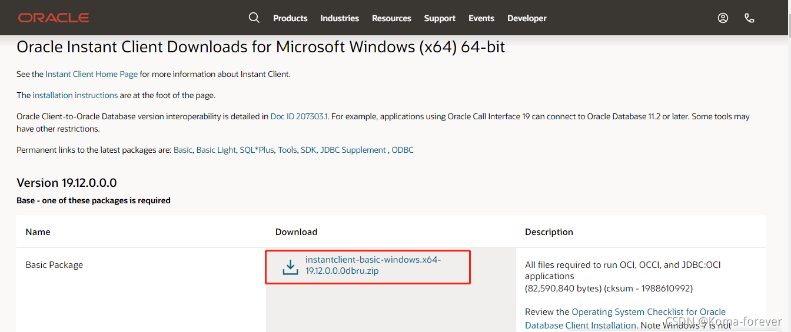
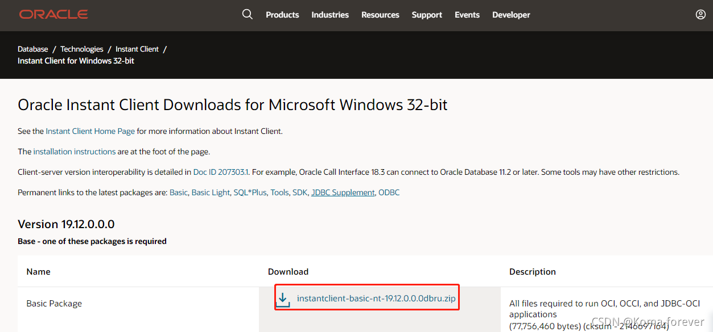
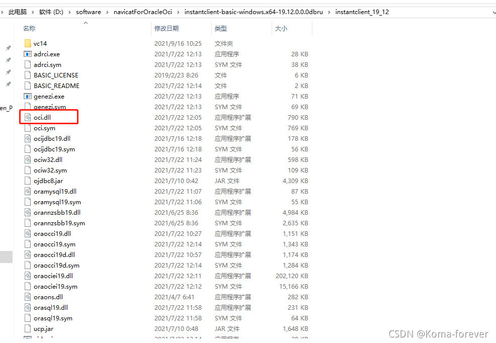
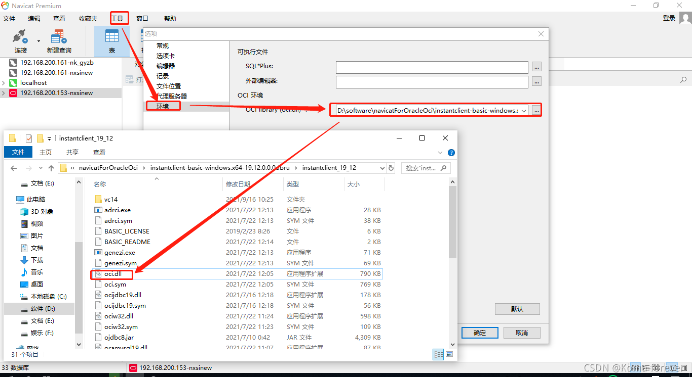
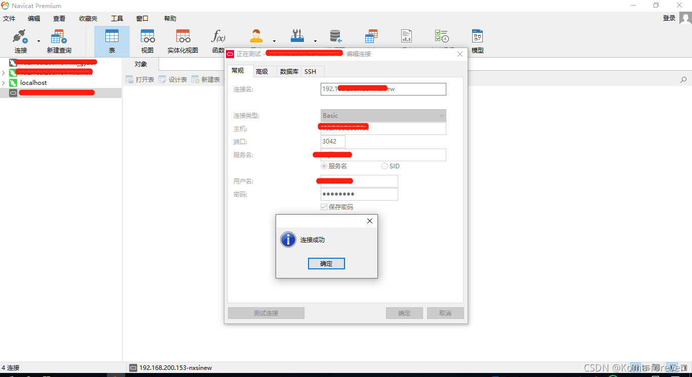

## 一、下载 OCI文件下载
> Oracle Instant Client Downloads for Microsoft Windows下载
### 1、oracle官网下载oci

+ 64位下载
> https://www.oracle.com/database/technologies/instant-client/winx64-64-downloads.html

+ 32位下载
> https://www.oracle.com/database/technologies/instant-client/microsoft-windows-32-downloads.html

### 2、百度网盘下载

+ 本人已下载到本地，上传至百度地图，可直接下载配置即可
> 链接: https://pan.baidu.com/s/1yEQt6PMml6UxyKbKt0xWPg  
> 提取码: jnak
## 二、配置
### 1、解压到本地

### 2、然后navicat for premium 配置oci

### 3、填写oracle的连接信息

