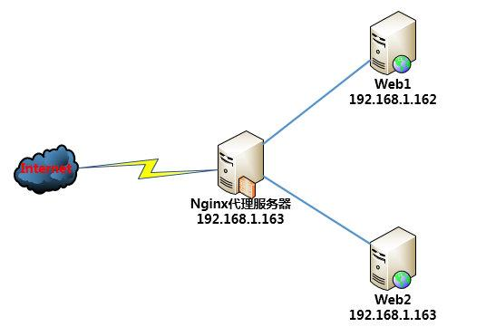
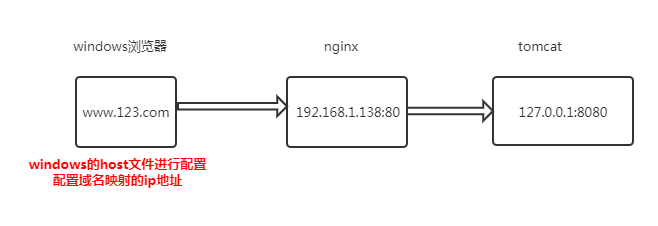
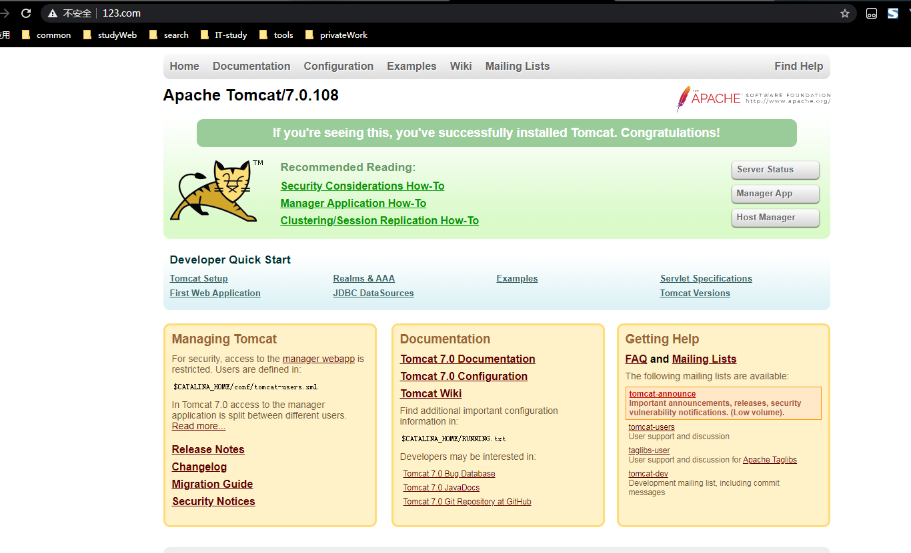
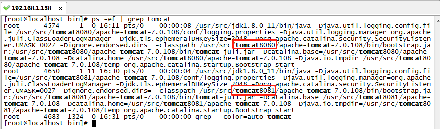
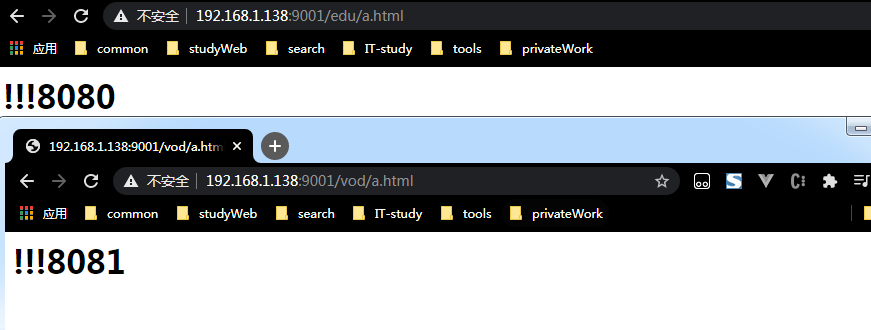
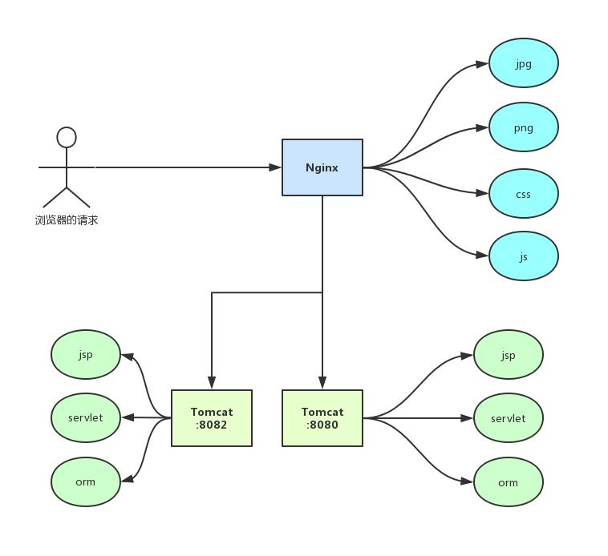
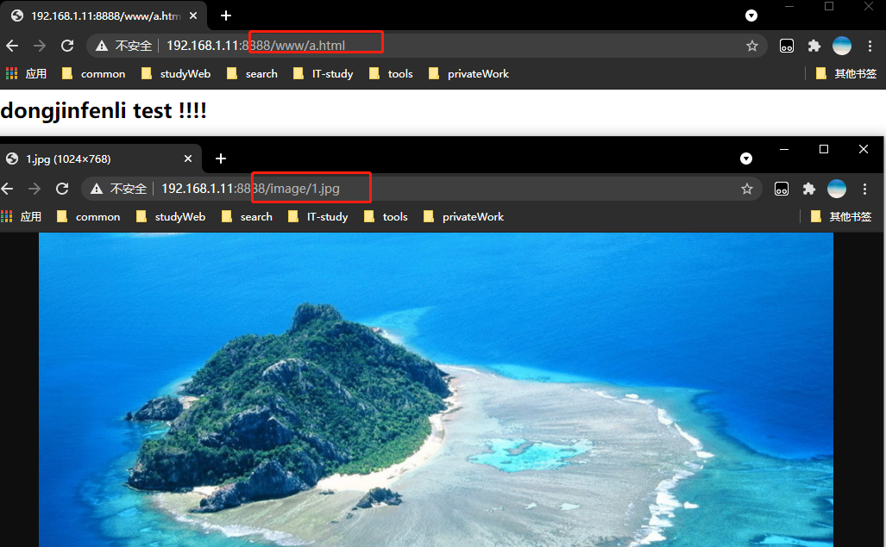
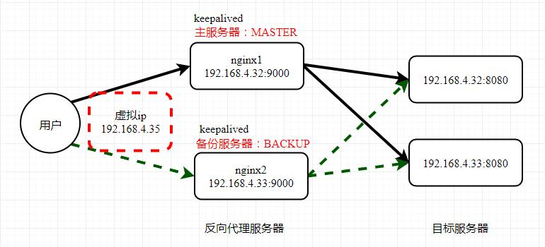
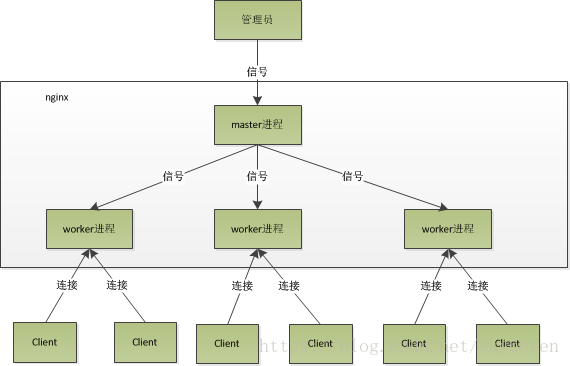
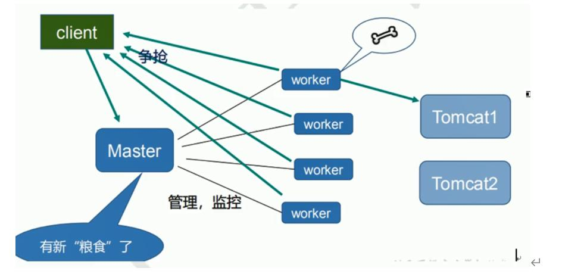

# nginx
> Nginx是一款轻量级的Web 服务器/反向代理服务器及电子邮件（IMAP/POP3）代理服务器，在BSD-like 协议下发行。其特点是占有内存少，并发能力强，事实上nginx的并发能力在同类型的网页服务器中表现较好，中国大陆使用nginx网站用户有：百度、京东、新浪、网易、腾讯、淘宝等

官网：http://nginx.org/en/download.html
## 动静分离
**动静分离**就是要将动态资源和静态资源分开，将静态资源部署在Nginx上，当一个请求来的时候，如果是静态资源的请求，就直接到nginx配置的静态资源目录下面获取资源，如果是动态资源的请求，nginx利用反向代理的原理，把请求转发给后台应用去处理，从而实现动静分离。  

## 反向代理
### 正向代理
**正向代理** 是一个位于客户端和原始服务器之间的服务器，为了从原始服务器取得内容，客户端向代理发送一个请求并指定目标(原始服务器)，然后代理向原始服务器转交请求并将获得的内容返回给客户端。  

### 反向代理
**反向代理** 实际运行方式是代理服务器接受网络上的连接请求。它将请求转发给内部网络上的服务器，并将从服务器上得到的结果返回给网络上请求连接的客户端，此时代理服务器对外就表现为一个服务器。此时反向代理服务器和目标服务器对外就是一个服务器，暴露的是代理服务器地址，影藏了正式服务器IP地址。  

## 负载均衡
**负载均衡**单个服务器解决不了，我们增加服务器的数量，然后将请求分发到各个服务器上，将原先请求集中到单个服务器上的情况改为将请求分发到多个服务器上，将负载分发到多个服务器上，将服务器分发到不同的服务器上，也就是我们所说的负载均衡。  

# centos安装nginx
### 安装相关依赖
```shell
	yum -y install gcc  
	#pcre是一个perl库，包括perl兼容的正则表达式库，nginx的http模块使用pcre来解析正则表达式，所以需要安装pcre库  
	yum install -y pcre pcre-devel
	#zlib库提供了很多种压缩和解压缩方式nginx使用zlib对http包的内容进行gzip，所以需要安装  
	yum install -y zlib zlib-devel
	#openssl是web安全通信的基石，没有openssl，可以说我们的信息都是在裸奔
	yum install -y openssl openssl-devel
	#注意如果直接下载的是tar.gz包,则需要执行
	#make$$make install
```
或者使用以下的命令去安装依赖
```shell
    yum -y install make zlib zlib-devel gcc gcc-c++ libtool openssl openssl-devel
```
### 安装nginx
```shell
  cd /usr/src
  wget http://nginx.org/download/nginx-1.12.2.tar.gz
  tar -zxvf nginx-1.12.2.tar.gz
  cd nginx-1.12.2
  # ./configure是检查文件的命令，检查是否正确
  ./configure
  #执行安装操作
  make && make install
```
> **通过以上make && make install操作后，会在usr目录下多出来一个local/nginx文件夹,在nginx有sbin有启动脚本**  

进入启动脚本目录
 ```shell
  cd /usr/local/nginx/sbin
  #启动nginx
  ./nginx
  #查看进程
   ps -ef | grep nginx   
```
然后访问nginx是否可以访问到首页,ip是查询自己本机的ip地址，80是nginx默认访问首页的端口
http://ip:80/
如果发现访问不同，需要做一下操作
```shell
   #查看开放了哪些端口
   firewall-cmd --list-all
   #如果没有显示80，则需要开放80端口
   firewall-cmd --add-port=80/tcp --permanent #开放端口 
   firewall-cmd --reload #重新加载
```
### nginx的常用命令
    使用这些命令的时候有一个前提条件就是进入到以下目录
    cd /usr/local/nginx/sbin
    1、查看版本号
    ./nginx -v
    2、启动nginx
    ./nginx
    3、停止nginx
    ./nginx -s stop
    4、重新加载(意思就是重新加载nginx.conf，而不用重启nginx服务)
    ./nginx -s reload
### nginx的配置文件
配置文件所在目录 

> cd /usr/local/nginx/conf/nginx.conf

nginx的配置文件是由三部分组成  
```shell
worker_processes  1;
events {
    worker_connections  1024;
}
http {
    include       mime.types;
    default_type  application/octet-stream;
    sendfile        on;
    keepalive_timeout  65;
    #gzip  on;
    server {
        listen       80;
        server_name  localhost;
        location / {
            root   html;
            index  index.html index.htm;
        }
        error_page   500 502 503 504  /50x.html;
        location = /50x.html {
            root   html;
        }
    }
}
```
#### 1、全局块
> 从配置文件开始到events块之间的额内容，主要会设置一些影响nginx服务器整体运行的配置指令，
> 主要包括配置nginx服务器的用户(组)，允许生成的worker process数，呼不出个改变PID存放路径，
> 日志存放路径和类型以及配置文件的引用等

|参数|说明|
|:----:|:----:|
| user | 配置用户或者组，默认为nobody nobody |
| worker_processes| 允许生成的进程数，默认为1 |
| pid | 指定nginx进程运行文件存放地址 |
| worker_rlimit_nofile | 更改worker进程的最大打开文件数限制。如果没设置的话，这个值为操作系统的限制。设置后你的操作系统和Nginx可以处理比“ulimit -a”更多的文件 |
| error_log | 制定日志路径，级别。这个设置可以放入全局块，http块，server块，级别以此为：debug|info|notice|warn|error|crit|alert|emerg|
#### 2、events块
    配置影响nginx服务器或与用户的网络连接。有每个进程的最大连接数，选取哪种事件驱动模型处理连接请求，是否允许同时接受多个网路连接，开启多个网络连接序列化等。
|参数|说明|
|:----:|:----:|
| worker_connections | 工作进程的最大连接数量，理论上每台nginx服务器的最大连接数为worker_processes*worker_connections worker_processes为我们再main中开启的进程数 |
| keepalive_timeout| 超时时间，这里指的是http层面的keep-alive并非tcp的keepalive |
| client_header_buffer_size | 客户端请求头部的缓冲区大小，这个可以根据你的系统分页大小来设置，一般一个请求头的大小不会超过1k，不过由于一般系统分页都要大于1k，所以这里设置为系统分页大小。查看系统分页可以使用 getconf PAGESIZE命令 |
| open_file_cache_valid | 这里指多长时间检查一次缓存的有效信息，如果有一个文件在inactive时间内一次没被用过，他将被移除 |
| open_file_cache_min_uses | open_file_cache指令中的inactive参数时间内文件的最少使用次数，如果超过了这个数字，文件描述一直是在缓存中打开的，如果有一个文件在inactive时间内一次没被使用过，他将被移除 |
| open_file_cache max=2000 inactive=60s | 为打开文件指定缓存，默认是没有启用的，max指定缓存最大数量，建议和打开文件数一致，inactive是指经过多长时间文件没被请求后删除呼延村，打开文件最大数量为我们在main配置的worker_rlimit_nofile参数 |

#### 3、http块  
    可以嵌套多个server，配置代理，缓存，日志定义等绝大多数功能和第三方模块的配置。如文件引入，mime-type定义，日志自定义，是否使用sendfile传输文件，连接超时时间，单连接请求数等
**socket**


https://blog.csdn.net/weixin_34337381/article/details/87994818


| 名称 | 默认配置  | 说明 |
|:----:|:----:|:----:|
| sendfile | sendfile off |	设置为on可以启用Linux上的sendfile系统调用来发送文件，它减少了内核态与用户态之间的两次内存复制，这样就会从磁盘中读取文件后直接在内核态发送到网卡设备，提高了发送文件的效率 |
| tcp_nodelay | tcp_nodelay on | 对keepalive连接是否使用TCP_NODELAY选项，true的话，会禁用Nagle算法，尽快发送数据，而不论包的大小 |
| tcp_nopush | tcp_nopush off | 在打开sendfile选项时，确定是否开启FreeBSD系统上的TCP_NOPUSH或Linux系统上的TCP_CORK功能。开启此选项允许在Linux和FreeBSD 4.x上将响应头和正文的开始部分一起发送；一次性发送整个文件 |

**client buffer**

| 名称 | 默认配置  | 说明 |
|:----:|:----:|:----:|
| keepalive_timeout | keepalive_timeout 75s |  |
| client_header_timeout | client_header_timeout 60s |  |
| client_body_timeout | client_body_timeout 60s |  |
| send_timeout | send_timeout 60s |  |
| client_header_buffer_size | client_header_buffer_size 1k |  |
| large_client_header_buffers | large_client_header_buffers 4 8k |  |
| client_max_body_size | client_max_body_size 1m |  |
| client_body_temp_path | client_body_temp_path client_body_temp |  |
| client_body_buffer_size | client_body_buffer_size 8k或16k |  |
|  |  |  |


| 参数 | 说明 |
|:----:|:----:|
| server_names_hash_bucket_size 128 | sdf |
| client_header_buffer_size 32k | sdf |
| large_client_header_buffers 4 32k | sdf |
| client_max_body_size 8m | sdf |
| sendfile on | sdf |
| tcp_nopush on | 在打开sendfile选项时，确定是否开启FreeBSD系统上的TCP_NOPUSH或Linux系统上的TCP_CORK功能。开启此选项允许在Linux和FreeBSD 4.x上将响应头和正文的开始部分一起发送；一次性发送整个文件 |
| keepalive_timeout 60 | 一个keepalive连接在闲置超过一定时间后（默认的是75秒），服务器和浏览器都会去关闭这个连接。0表示禁用客户端的keep-alive连接 |
| tcp_nodelay on | 对keepalive连接是否使用TCP_NODELAY选项，true的话，会禁用Nagle算法，尽快发送数据，而不论包的大小 |
| fastcgi_connect_timeout 300 | sdf |
| fastcgi_send_timeout 300 | sdf |
| fastcgi_read_timeout 300 | sdf |
| fastcgi_buffer_size 64k | sdf |
| fastcgi_buffers 4 64k | sdf |
| fastcgi_busy_buffers_size 128k | sdf |
| fastcgi_temp_file_write_size 128k | sdf |
| gzip on; | sdf |
| gzip_min_length 1k | sdf |
| gzip_buffers 4 16k | sdf |
| gzip_http_version 1.0 | sdf |
| gzip_comp_level 2 | sdf |
| gzip_types text/plain application/x-javascript text/css application/xml | sdf |
| gzip_vary on | sdf |
##### 3.1、server块
    配置虚拟主机的相关参数，一个http中可以有多个server。
##### 3.2、location块
    配置请求的路由，以及各种页面的处理情况。
## 反向代理
### 反向代理实例一
实现效果：打开浏览器访问地址栏www.123.com跳转到linux系统tomcat主页

**jdk的安装**
```shell
首先创建文件夹
mkdir /usr/java
下载文件(方法一)
wget --no-cookies --no-check-certificate --header "Cookie: gpw_e24=http%3A%2F%2Fwww.oracle.com%2F; oraclelicense=accept-securebackup-cookie" "http://download.oracle.com/otn-pub/java/jdk/8u141-b15/336fa29ff2bb4ef291e347e091f7f4a7/jdk-8u141-linux-x64.tar.gz"
方法二(或者去此网盘中下载)
https://pan.baidu.com/s/1piply8oOjVv_La3z17Hcwg
#解压下载
tar -zxvf jdk-8u141-linux-x64.tar.gz or tar -zxvf jdk-8u11-linux-x64.tar.gz
#配置到环境变量中
vi /etc/profile
#java 
export JAVA_HOME=/usr/src/jdk1.8.0_11
export PATH=$JAVA_HOME/bin:$PATH
export CLASSPATH=.:$JAVA_HOME/lib/dt.jar:$JAVA_HOME/lib
#重新加载配置文件
source /etc/profile
#验证
java -version

```
**tomcat**
```shell
#创建tomcat目录
mkdir /usr/src/tomcat
#进入到tomcat目录
cd /usr/src/tomcat
#下载tomcat官网(https://tomcat.apache.org/)
#使用wget下载tomcat7
wget https://mirrors.bfsu.edu.cn/apache/tomcat/tomcat-7/v7.0.108/bin/apache-tomcat-7.0.108.tar.gz
#解压tomcat
tar -zxvf apache-tomcat-7.0.108.tar.gz
#进入到启动目录下
cd apache-apache-tomcat-7.0.108/bin/
#开放端口
firewall-cmd --add-port=8080/tcp --permanent #开放端口 
#重新加载配置文件
firewall-cmd --reload #重新加载
#启动脚本
./startup.sh
```
访问过程分析



配置：
C:\Windows\System32\drivers\etc
添加host文件以下内容
```shell
192.168.1.138 www.123.com
```
然后修改nginx.conf配置文件(反向代理配置)
```shell
cd /usr/local/nginx/conf/
vim nginx.conf
server {
    listen       80;
    # 服务名称是本机ip地址
    server_name  192.168.1.138;
        location / {
            # 代理到本机的127.0.0.1:8080(相当于是重定向到该地址上)
            proxy_pass http://127.0.0.1:8080;
            root   html;
            index  index.html index.htm;
        }
        ...
    }
```
访问后的效果图

### 反向代理实例二
> 实现效果：使用nginx做反向代理，根据访问的路径不同跳转到不同的服务器中，nginx监听端口为9001  
> 访问 http://127.0.0.1:9001/edu/ 直接跳转到127.0.0.1:8080  
> 访问 http://127.0.0.1:9001/vod/ 直接跳转到127.0.0.1:8081  

准备工作：(8080,8081)
```shell
cd /usr/src
mkdir tomcat8080
mkdir tomcat8081
#将apache-tomcat-7.0.108.tar.gz分别复制到tomcat8080和tomcat8081下
cp  apache-tomcat-7.0.108.tar.gz tomcat8080/
cp  apache-tomcat-7.0.108.tar.gz tomcat8081/
#需要注意的是修改8081下的访问端口
cd /usr/src/tomcat8081/apache-tomcat-7.0.108/conf
vim server.xml
#因为同一台机器安装2台以上tomcat需要修改三个地方
以下需要修改tomcat8081的三个地方
#1、修改Shutdown端口（默认为8005端口）
<Server port="8006" shutdown="SHUTDOWN">
#2、 修改http访问端口（默认为8080端口）
<Connector port="8081" protocol="HTTP/1.1" connectionTimeout="20000" redirectPort="8443" />
#3、 修改JVM启动端口（默认为8009端口）
<Connector port="8009" protocol="AJP/1.3" address="::1" redirectPort="8443" />
```
然后启动得到以下状态
  
浏览器分别访问http://192.168.1.138:8080 http://192.168.1.138:8081 都可以访问
然后进行以下操作：
在tomcat8080目录的添加文件
```shell
cd /usr/src/tomcat8080/apache-tomcat-7.0.108/webapps
mkdir edu
cd edu/
vim a.html
<h1>!!!8080</h1>

cd /usr/src/tomcat8081/apache-tomcat-7.0.108/webapps
mkdir vod
cd vod/
vim a.html
<h1>!!!8081</h1>
```
修改反向代理的配置
```shell
cd /usr/local/nginx/conf/
vim nginx.conf
server {
    listen       9001;
    server_name  192.168.1.138;
    location ~ /edu/ {
        proxy_pass http://127.0.0.1:8080;
    }
    location ~ /vod/ {
        proxy_pass http://127.0.0.1:8081;
    }
}
```
**location ~ /vod/ 意思是地址中包含vod就跳转到改规则下**

## 负载均衡
实现效果：浏览器地址栏输入 http://192.168.1.138/edu/a.html 负载均衡效果，平均分配到8080和8081的端口中。  
准备工作：  
 1、准备两台tomcat服务器，8080、8081服务器  
 2、在两台tomcat里面webapps目录中，都创建edu文件夹，在edu文件夹下创建a.html
然后配置nginx
```shell
cd /usr/local/nginx/conf/
http{
    ......
    #1、添加负载均衡服务器的列表
    upstream myserver{
      ip_hash; #默认轮训，ip_hash是
      server 192.168.1.17:8080 weight=1;
      server 192.168.1.17:8081 weight=1;
    }
    ......
    server{
        listen       80;
        #2、服务名称为本机的ip地址
        server_name  192.168.1.17;
        location / {
            ......
            #3、代理地址为负载均配置的服务列表
            proxy_pass http://myserver;
            proxy_connect_timeout 10;
        }
    }
}
```
nginx的分配策略  
1、默认为轮询  
2、weight 代表的是权重，默认为1，去找你冲越高被分配到额客户端越多,写法是更在服务器server的后面
```shell
upstream myserver{
  server 192.168.1.17:8080 weight=10;
  server 192.168.1.17:8081 weight=1;
}
```
3、ip_hash 每个请求按照访问的ip的hash结果分配，这样每个访问固定访问一个后端服务器，可以解决session的问题
```shell
upstream myserver{
  ip_hash;
  server 192.168.1.17:8080;
  server 192.168.1.17:8081;
}
```
4、fair(第三方)  
按照后端服务器的响应时间来分配请求，响应时间段的优先分配
```shell
upstream myserver{
  server 192.168.1.17:8080;
  server 192.168.1.17:8081;
  fair;
}
```
测试：http://192.168.1.17:80/edu/a.html (刷新会发现根据配置默认的规则来回切换)
## 动静分离
  
> 通过location指定不同的后缀名实现不同的请求转发，通过expires参数设置，可以使浏览器缓存过期时间，
> 较少与服务器之前的请求和流量，具体exprires定义，是给一个资源设定一个过期时间，也就是说无需去服务器验证
> 直接通过浏览器吱声确认是否过期即可，所以不会产生额外的流量，此种方法非常适合不进场变动的资源
> (如果进场更新的文件，不建议使用expires来缓存)，3d，表示在这3天之内访问这个url，发送一个请求，对比改服务器文件最后的更新时间变化
> ，则不会从服务器中抓取，返回代码状态码304，如果有修改，则直接从服务器重新下载，返回状态码200

准备工作
1、在linux系统中，用于进行访问
```shell
mkdir data
cd data
mkdir image
mkdir www
#分别在images里面放几张图片,在www里面放a.html网页
```
2、添加nginx配置
```shell
server {
    listen       8888;
    server_name  192.168.1.11;
    location /www/ {
        root /data/;
        index index.html index.htm;
    }
    location /image/ {
        root /data/;
        autoindex on;#列出访问目录
    }
    ......
}
```
3、测试 
 http://192.168.1.11:8888/image/1.jpg  
 http://192.168.1.11:8888/www/a.html  

## nginx的高可用集群
  
准备工作：
 1、准备2台服务器192.168.1.138,192.168.1.141  
 2、在两台服务器上都需要安装nginx和keepalived  
  安装keepalived  
 ```shell
  yum install keepalived -y
  #验证keepalived的版本
  rpm -q -v keepalived
  #keepalive安装后的文件配置路径在 /etc/keepalived/keepalived.conf
```
 3、完成高可用的配置(高可用主备模式)
  源文件内容  
```shell
! Configuration File for keepalived
global_defs {
   notification_email {
     acassen@firewall.loc
     failover@firewall.loc
     sysadmin@firewall.loc
   }
   notification_email_from Alexandre.Cassen@firewall.loc
   smtp_server 192.168.200.1
   smtp_connect_timeout 30
   router_id LVS_DEVEL
   vrrp_skip_check_adv_addr
   vrrp_strict
   vrrp_garp_interval 0
   vrrp_gna_interval 0
}
vrrp_instance VI_1 {
    state MASTER
    interface eth0
    virtual_router_id 51
    priority 100
    advert_int 1
    authentication {
        auth_type PASS
        auth_pass 1111
    }
    virtual_ipaddress {
        192.168.200.16
        192.168.200.17
        192.168.200.18
    }
}

virtual_server 192.168.200.100 443 {
    delay_loop 6
    lb_algo rr
    lb_kind NAT
    persistence_timeout 50
    protocol TCP

    real_server 192.168.201.100 443 {
        weight 1
        SSL_GET {
            url {
              path /
              digest ff20ad2481f97b1754ef3e12ecd3a9cc
            }
            url {
              path /mrtg/
              digest 9b3a0c85a887a256d6939da88aabd8cd
            }
            connect_timeout 3
            nb_get_retry 3
            delay_before_retry 3
        }
    }
}

virtual_server 10.10.10.2 1358 {
    delay_loop 6
    lb_algo rr 
    lb_kind NAT
    persistence_timeout 50
    protocol TCP

    sorry_server 192.168.200.200 1358

    real_server 192.168.200.2 1358 {
        weight 1
        HTTP_GET {
            url { 
              path /testurl/test.jsp
              digest 640205b7b0fc66c1ea91c463fac6334d
            }
            url { 
              path /testurl2/test.jsp
              digest 640205b7b0fc66c1ea91c463fac6334d
            }
            url { 
              path /testurl3/test.jsp
              digest 640205b7b0fc66c1ea91c463fac6334d
            }
            connect_timeout 3
            nb_get_retry 3
            delay_before_retry 3
        }
    }

    real_server 192.168.200.3 1358 {
        weight 1
        HTTP_GET {
            url { 
              path /testurl/test.jsp
              digest 640205b7b0fc66c1ea91c463fac6334c
            }
            url { 
              path /testurl2/test.jsp
              digest 640205b7b0fc66c1ea91c463fac6334c
            }
            connect_timeout 3
            nb_get_retry 3
            delay_before_retry 3
        }
    }
}

virtual_server 10.10.10.3 1358 {
    delay_loop 3
    lb_algo rr 
    lb_kind NAT
    persistence_timeout 50
    protocol TCP

    real_server 192.168.200.4 1358 {
        weight 1
        HTTP_GET {
            url { 
              path /testurl/test.jsp
              digest 640205b7b0fc66c1ea91c463fac6334d
            }
            url { 
              path /testurl2/test.jsp
              digest 640205b7b0fc66c1ea91c463fac6334d
            }
            url { 
              path /testurl3/test.jsp
              digest 640205b7b0fc66c1ea91c463fac6334d
            }
            connect_timeout 3
            nb_get_retry 3
            delay_before_retry 3
        }
    }

    real_server 192.168.200.5 1358 {
        weight 1
        HTTP_GET {
            url { 
              path /testurl/test.jsp
              digest 640205b7b0fc66c1ea91c463fac6334d
            }
            url { 
              path /testurl2/test.jsp
              digest 640205b7b0fc66c1ea91c463fac6334d
            }
            url { 
              path /testurl3/test.jsp
              digest 640205b7b0fc66c1ea91c463fac6334d
            }
            connect_timeout 3
            nb_get_retry 3
            delay_before_retry 3
        }
    }
}
```
修改为以下内容
```shell
#全局配置
global_defs{
  notification_email {
    acassen@firewall.loc
    failover@firewall.loc
    sysadmin@firewall.loc
  }
  notification_email_from Alexandre.Cassen@firewall.loc
  smtp_server 192.168.1.138
  #smtp_server 192.168.17.129
  smtp_connect_timeout 30
  router_id LVS_DEVELBACK #访问到主机 
}
vrrp_script chk_http_port{
  script "/usr/local/src/nginx_check.sh"
  interval 2 #(检测脚本执行的间隔)
  weight 2 #设置当前服务器的权重
}
#虚拟ip配置
vrrp_instance VI_1 {
  state MASTER #备份服务器上将MASTER改为BACKUP
  interface ens33 #网卡 ip addr查询可得知
  virtual_router_id 51 #主、备机的virtual_router_id必须相同
  priority 100 #主、备机去不同的优先级，朱机制较大，备激情值较小
  advert_int 1
  #校验权限的方式
  authentication {
    auth_type PASS
    auth_pass 1111
  }
  #绑定的虚拟ip
  virtual_ipaddress {
    192.168.1.50 # VRRP 虚拟地址
    #192.168.17.50
  }
}
```

router_id LVS_DEVELBACK如何理解，在1.138的vim /etc/hosts
```shell
127.0.0.1   localhost localhost.localdomain localhost4 localhost4.localdomain4
::1         localhost localhost.localdomain localhost6 localhost6.localdomain6
127.0.0.1 LVS_DEVEL
```
nginx_check.sh内容
上传的位置：/usr/local/src/下即可
```shell
# !/bin/bash
A=`ps -C nginx -no-header |wc -1`
if [ $A -eq 0 ];then
  /usr/local/nginx/sbin/nginx
  sleep 2
  if [ `ps -C nginx --no-header |wc -1` -eq 0 ];then
      killall keepalived
  fi 
fi
```
### nginx的原理
  
2、worker如何工作的
  
3、一个master和多个worker有什么好处  
 3.1、可以使用nginx -s reload 热部署，利用nginx进行热部署操作  
 3.2、每个worker是独立的进程，如果有期中的一个worker出现问题，其他worker独立的，继续进行争抢，实现请求过程，不会造成服务器中断。
4、设置多少个worker合适  
 worker数和服务器的cpu数相同最为适宜  
5、连接数worker_connection  
 第一个：请求发送，占用了worker的几个连接数  
 2个或者4个  
 第二个：nginx有一个master，有四个worker，每个worker支持最大的连接数1024  
支持的最大并发数为多少？  
 普通的静态访问最大并发数是：worker_connections*worker_process/2。  
 而如果是HTTP作为反向代理来说，最大并发数应该是worker_connections*worker_process/4。  
