#redis6
下载地址：https://github.com/redis/redis/tags  
6.2.1： https://github.com/redis/redis/archive/refs/tags/6.2.1.tar.gz
## redis的安装
### 1、准备工作
```shell
#安装c语言编译环境
yum install centos-release-scl scl-utils-build
yum install -y devtoolset-8-toolchain
scl enable devtoolset-8 bash
#测试gcc版本
yum install gcc
gcc --version
```
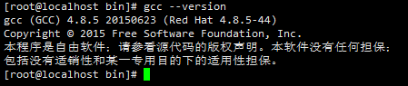
### 2、正式安装
```shell
cd /usr/src/local
mkdir software
cd software
wget https://github.com/redis/redis/archive/refs/tags/6.2.1.tar.gz
tar -zxvf 6.2.1.tar.gz
cd redis-6.2.1/
#编译
make
#安装
make  install
#安装后会在usr/local/bin目录下出现redis的安装文件
cd usr/local/bin
```
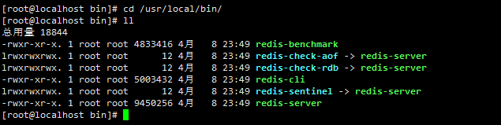  
文件说明  

|文件名|说明|
|:----:|:----:|
| redis-benchmark | 性能测试工具，可以在自己的本子上运行，看看自己本子的性能如何 |
| redis-check-aof | 修复有问题的AOF文件 |
| redis-check-dump | 修复有问题的dump.rdb文件 |
| redis-sentinel | redis集群使用 |
| redis-server | redis服务器启动命令|
| redis-cli | redis客户端，操作入口 |
### 前台启动(不推荐)
```shell
redis-server
```
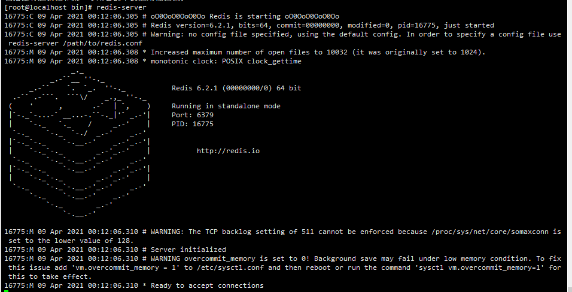
### 后台启动(推荐使用)
```shell
cd /usr/local/software/redis-6.2.1/
cp redis.conf redis.bk.conf
修改如下内容
vim redis.conf
daemonize no修改为yes(后台启动为不支持修改为支持)
cd /usr/local/bin/
# redis 后台启动命令
redis-server  /usr/src/local/software/redis-6.2.1/redis.conf
#查看进程
ps -ef | grep redis
```
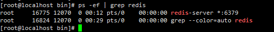

## redis相关简介
>redis是单线程+多路IO复用技术

默认是有16个数据库，类似数组下表从0开始，默认使用的是0号库   
如何切换数据库 select <dbid>来切换数据库  eg:select 8      
dbsize查看当前数据库的key的数量  
flushdb清空当前库  
flushall通杀全部库  
### 5种基本数据类型
#### String
>String是redis最基本的类型，你可以理解为memcached一模一样的类型，一个key对应一个value  
> String 类型是二进制安全的，意味着Redis的string可以包含任何数据，比如jpg图片或者序列化的对象  
> String 类型的Redis最基本的基本类型，一个Redis中字符串value最多可以是512M

```shell
1、set <key> <value>添加键值对
2、get <key> 获取对应的键值
3、append <key><value>将给定的<value>追加到原值的末尾
4、strlen <key>获得值的长度
5、setnx <key><value>只有在key不存在是，设置key的值
6、incr <key>
    将key中存储的数字增加1
    只能对数字值操作，如果为空，新增值为1
7、decr <key>
    将key中存储的数字值减1
    只能对数字值操作，如果为空，新增值为-1
8、incrby / decrby <key> <步长> 将key中存储数字值新增，自定义步长。
```
#### List
> 单键多值  
> Redis列表时简单的字符串列表，按照插入顺序，你可以添加一个元素到列表的头部(左边)或者尾部(右边)  
> 它的底层是*双向链表*，对两端的操作性能很高，通过索引下标的操作中间的节点性能会很差   
  

```shell
lpush/rpush  <key><value1><value2><value3> .... 从左边/右边插入一个或多个值。
lpop/rpop  <key>从左边/右边吐出一个值。值在键在，值亡键亡。
rpoplpush  <key1><key2>从<key1>列表右边吐出一个值，插到<key2>列表左边。
lrange <key><start><stop>
按照索引下标获得元素(从左到右)
lrange mylist 0 -1   0左边第一个，-1右边第一个，（0-1表示获取所有）
lindex <key><index>按照索引下标获得元素(从左到右)
llen <key>获得列表长度 
linsert <key>  before <value><newvalue>在<value>的后面插入<newvalue>插入值
lrem <key><n><value>从左边删除n个value(从左到右)
lset<key><index><value>将列表key下标为index的值替换成value
```
#### Hash
>Redis hash 是一个键值对集合。  
Redis hash是一个string类型的*field*和*value*的映射表，hash特别适合用于存储对象。类似Java里面的Map<String,Object>    
用户ID为查找的key，存储的value用户对象包含姓名，年龄，生日等信息，如果用普通的key/value结构来存储  
主要有以下3种存储方式：
第一种：  
    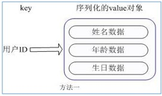  
    每次修改用户的某个属性需要，先反序列化改好后再序列化回去。开销较大。  
第二种：  
    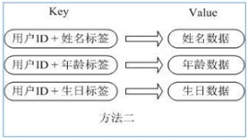  
    用户id数据冗余 
第三种：hash  
    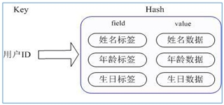     
    通过 key(用户ID) + field(属性标签) 就可以操作对应属性数据了，既不需要重复存储数据，也不会带来序列化和并发修改控制的问题  
```shell
hset <key><field><value>给<key>集合中的  <field>键赋值<value>
hget <key1><field>从<key1>集合<field>取出 value 
hmset <key1><field1><value1><field2><value2>... 批量设置hash的值
hexists<key1><field>查看哈希表 key 中，给定域 field 是否存在。 
hkeys <key>列出该hash集合的所有field
hvals <key>列出该hash集合的所有value
hincrby <key><field><increment>为哈希表 key 中的域 field 的值加上增量 1   -1
hsetnx <key><field><value>将哈希表 key 中的域 field 的值设置为 value ，当且仅当域 field 不存在
```
#### Set
> Redis set对外提供的功能list类似，是一个列表的功能，特殊之处在于set是可以*自动排重*的，当你需要存储一个列表数据，
> 又不希望出现重复数据时，set是一个很好的选择，并且set提供了判断某个成员是否在一个set集合内的重要接口，这个也是list所不能提供的。    
> 一个算法，随着数据的增加，执行时间的长短，如果是o(1),数据增加，查找数据的时间不变。

```shell
sadd <key><value1><value2> ..... 
将一个或多个 member 元素加入到集合 key 中，已经存在的 member 元素将被忽略
smembers <key>取出该集合的所有值。
sismember <key><value>判断集合<key>是否为含有该<value>值，有1，没有0
scard<key>返回该集合的元素个数。
srem <key><value1><value2> .... 删除集合中的某个元素。
spop <key>随机从该集合中吐出一个值。
srandmember <key><n>随机从该集合中取出n个值。不会从集合中删除 。
smove <source><destination>value把集合中一个值从一个集合移动到另一个集合
sinter <key1><key2>返回两个集合的*交集*元素。
sunion <key1><key2>返回两个集合的并集元素。
sdiff <key1><key2>返回两个集合的差集元素(key1中的，不包含key2中的)
```
#### Sorted Set
>Redis有序集合zset与普通集合set非常相似，是一个没有重复元素的字符串集合。  
不同之处是有序集合的每个成员都关联了一个评分（score）,这个评分（score）被用来按照从最低分到最高分的方式排序集合中的成员。集合的成员是唯一的，但是评分可以是重复了 。  
因为元素是有序的, 所以你也可以很快的根据评分（score）或者次序（position）来获取一个范围的元素。  
访问有序集合的中间元素也是非常快的,因此你能够使用有序集合作为一个没有重复成员的智能列表。

```shell
zadd  <key><score1><value1><score2><value2>…
将一个或多个 member 元素及其 score 值加入到有序集 key 当中。
zrange <key><start><stop>  [WITHSCORES]   
返回有序集 key 中，下标在<start><stop>之间的元素
带WITHSCORES，可以让分数一起和值返回到结果集。
zrangebyscore key minmax [withscores] [limit offset count]
返回有序集 key 中，所有 score 值介于 min 和 max 之间(包括等于 min 或 max )的成员。有序集成员按 score 值递增(从小到大)次序排列。 
zrevrangebyscore key maxmin [withscores] [limit offset count]               
同上，改为从大到小排列。 
zincrby <key><increment><value>      为元素的score加上增量
zrem  <key><value>删除该集合下，指定值的元素 
zcount <key><min><max>统计该集合，分数区间内的元素个数 
zrank <key><value>返回该值在集合中的排名，从0开始。
```
## Redis配置文件
### units单位
配置大小单位,开头定义了一些基本的度量单位，只支持bytes，不支持bit，大小写不敏感  
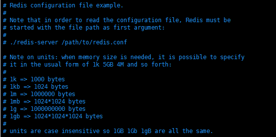
#### includes包含
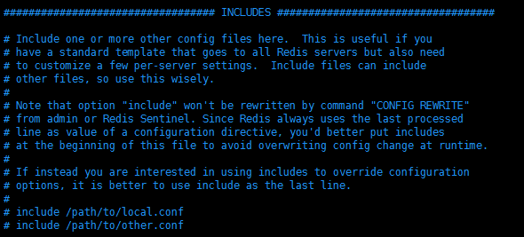  
类似jsp中的include，多实例的情况可以把公用的配置文件提取出来
### 网络相关配置
 **1、bind 127.0.0.1 -::1**  
    只能接受本机的访问请求,不写的情况下，不限制接受任何ip地址的访问    
 **2、protected-mode**    
    将本机访问保护模式设置no  
    如果开启了protected-mode，那么在没有设定bind ip且没有设密码的情况下，Redis只允许接受本机的响应    
 **3、tcp-backlog**  
    设置tcp的backlog，backlog其实是一个连接队列，backlog队列总和=未完成三次握手队列 + 已经完成三次握手队列。  
    在高并发环境下你需要一个高backlog值来避免慢客户端连接问题。  
    注意Linux内核会将这个值减小到/proc/sys/net/core/somaxconn的值（128），所以需要确认增大/proc/sys/net/core/somaxconn和/proc/sys/net/ipv4/tcp_max_syn_backlog（128）两个值来达到想要的效果  
 **4、port**    
    默认端口6379  
 **5、timeout**    
    一个空闲的客户端位置多少秒回关闭，0表示关闭该功能，即永不关闭。  
 **6、tcp-keepalive**    
    对方问客户端的一种心跳检测，每个n秒检测一次    
    单位为秒，如果设置为0，则不会进行keepalive检测，建议设置成60  
### general 通用
 **1、daemonize**    
    是否为后台进程，设置为yes,守护进程，后台启动   
 **2、pidfile**   
    存放pid文件的位置，每个实例会产生一个不同的pid文件   
 **3、loglevel**   
    指定日志记录级别，Redis总共支持四种级别，debug,verbose,notice,warning默认是notice    
    四个级别根据使用阶段来选择，身长环境选择notice或者warning  
 **4、logfile**   
    日志文件名称  
    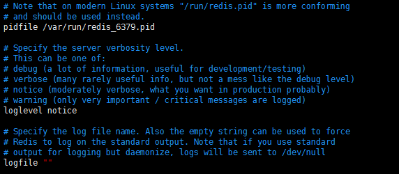    
 **5、databases**   
    设定库的数量，默认16，默认数据库位0，可以使用SELECT <dbid>命令在连接上指定数据库id   
### security 安全
>访问密码的查看、设置和取消  
> 在命令中设置密码，只是零食的，重启redis服务器，密码就还原了。
> 永久设置，需要在配置文件中进行设置。

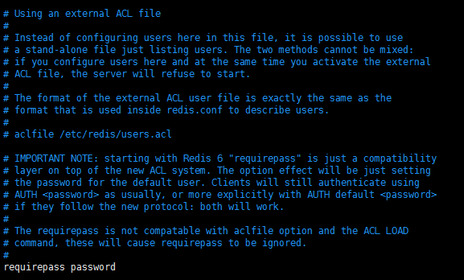  
### limits限制
**1、maxclients**    
    设置redis同时可以与多少个客户端连接，默认情况下是10000个客户端，
    如果到达了此限制，则redis会拒绝新的连接请求，并且向这些请请求放发出“max number of clients reached”已做回应。  
**2、maxmemory**   
    建议***必须设置***，否则内存沾满，造成服务器宕机。  
    设置redis可以使用的内存量，一旦达到内存使用上限，redis将会视图移除内部数据，移除规则可以通过maxmemory-policy来指定。    
    如果redis无法根据移除规则来移除内存中的数据，或者设置了“不允许移除”，那么redis则会针对那些需要申请内存的指令返回错误信息，比如SET、LPUSH等。  
    但是对于无内存申请的指令，仍然会正常响应，比如GET等。如果你的redis是主redis（说明你的redis有从redis），那么在设置内存使用上限时，需要在系统中留出一些内存空间给同步队列缓存，只有在你设置的是“不移除”的情况下，才不用考虑这个因素。  
**3、maxmemory-policy**   
    volatile-lru：使用LRU算法移除key，只对设置了过期时间的键；（最近最少使用）  
    allkeys-lru：在所有集合key中，使用LRU算法移除key  
    volatile-random：在过期集合中移除随机的key，只对设置了过期时间的键  
    allkeys-random：在所有集合key中，移除随机的key  
    volatile-ttl：移除那些TTL值最小的key，即那些最近要过期的key  
    noeviction：不进行移除。针对写操作，只是返回错误信息  
**4、maxmemory-samples**  
    设置样本数量，LRU算法和最小TTL算法都并非是精确的算法，而是估算值，所以你可以设置样本的大小，redis默认会检查这么多个key并选择其中LRU的那个。  
    一般设置3到7的数字，数值越小样本越不准确，但性能消耗越小。
## redis订阅发布
1、客户端可以订阅频道如下  
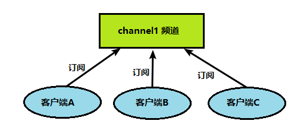  
2、当给这个频道发布消息后，消息就会发送给订阅的客户端  
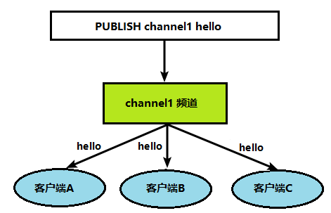
+ 订阅消息信息  
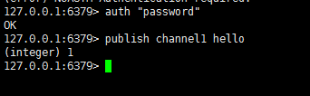  
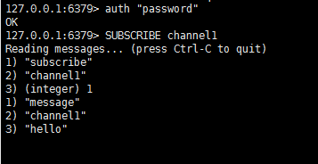
## 持久化RDB、AOF
### RDB
> 在指定的**时间间隔**内将内存中的数据集**快照**写入磁盘， 也就是行话讲的Snapshot快照，它恢复时是将快照文件直接读到内存里

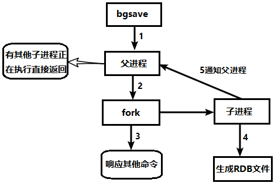

+ 指定存储路径
dump.rdb文件  
在redis.conf中配置文件名称，默认为dump.rdb  
**rdb文件的保存路径，也可以修改，默认是redis启动时命令所在的目录下**  
 
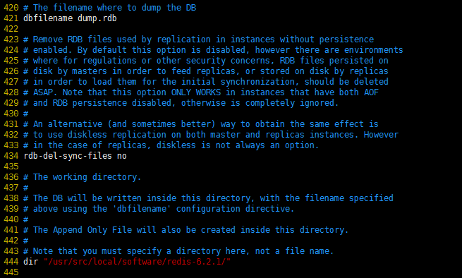

+ 如何触发快照

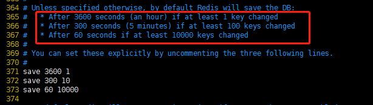  

+ save VS bgsave

save:save时直观保存，其他不管，全部阻塞，手动保存，不建议。  
bgsave:Redis会在后台一步进行快照操作，快照同时还可以响应客户端请求。  
可以通过lastsave命令获取最后一次成功执行快照的时间

++ save  
**格式： save 秒数 写操作次数**  
RDB是整个内存的压缩过的Snapshot,RDB的数据结构，可以配置符合的快照触发条件。  
默认是1分钟内改1万次，活5分钟内改10次，或者15分钟内修改了1次。
++ 如何禁用
不设置save指令，或者给save传入空字符串。
### AOF
