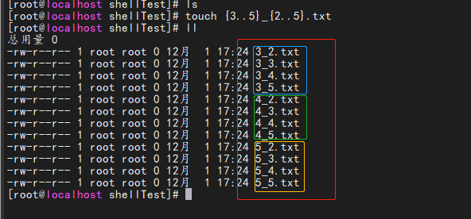
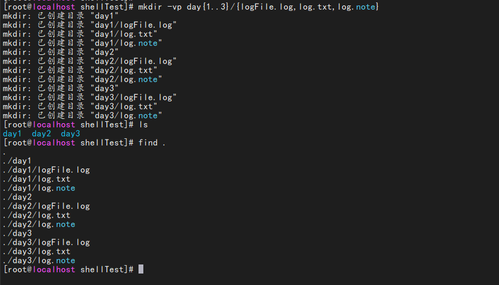
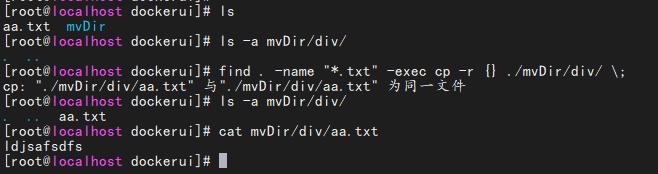
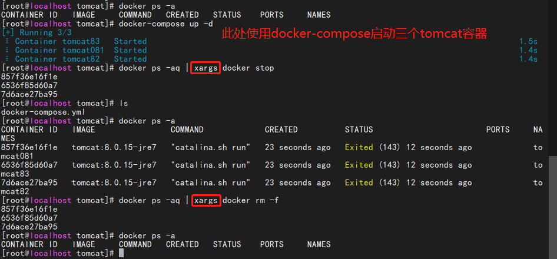
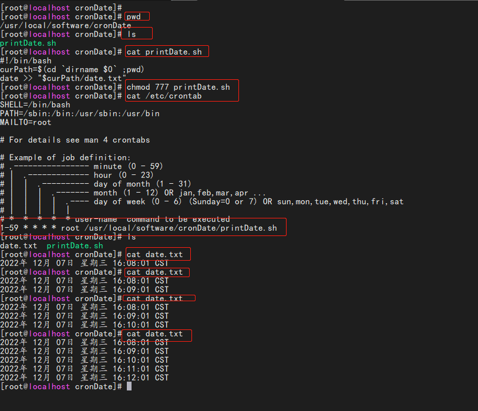

# 一、

+ 放到第一行、标识使用那个解释器

```shell
#!/usr/sh --使用shell解释器
#!/usr/bash --使用shell解释器
#!/usr/local/python --使用python解释器
```

+ shell脚本执行

```html
1、直接./sh
    启动一个子进程
    使用解释器解析脚本中的没一句命令
    使用那个解释器，在脚本的第一句指定
2、/bin/sh 脚本地址
    也是启动以给子进程来执行，跟第一种方法作用类似
    在这种方法不需要脚本有可执行权限，需要可读权限
    有一些没办法调整脚本权限的情况可以使用
    弊端：
        要调用者关注当前脚本使用什么解释器
3、(cd ..;ls -l)
    也是启动一个子进程来执行
4、source 脚本地址
    这种方式执行脚本不会产生一个子进程
    而是将脚本的额命令都加载进来，执行

    常能够用于加载配置文件
    source /etc/profile
```

# 二、基本语法

## 1、变量的使用

```shell
#!/usr/sh
#1、声明即赋值 注意:等号两边不能留空格，留了空格就编程一个命令+两个参数
varName=name
#2、使用变量
$varName
${varName}
```

## 2、变量的分类

```vue
shell 内变量
    在shell的解析环境中存在的变量
    全局范围的变量(全局变量)
        shell中*不使用任何修饰符修饰的变量*都是全局变量
        不管实在函数内还是在函数外都一样
        从申明语句调用开始一直到脚本结束，都是其声明周期
     局部变量
        用loca修饰
        只能生命在函数内
        从声明语句调用开始一直到函数结束
环境变量
      操作系统自带的，每个进程都会有(env查看)
      当启动一个子进程的时候，环境变量是从父进程拷贝到子进程的。
      子进程做任何环境变量的修改，不会影响父进程
      环境变量是单向传递的
    export varName=value
    或者
        varName=value
        export varName
删除变量
    不管是环境变量还是普通的shell内变量
    都可以使用unset    变量名 删除进程
```

+ 具体的使用

```shell
#!/usr/bash
#全局变量
globalVar="hello"

function test(){
    globalVar2="hello2" #不使用任何修饰符修饰的都是全局变量
    local localVar="world"
    echo $localVar #输出world
}
#调用函数
test
echo $globalVar $globalVar2
#输出 hello hello2
```

### 调用子进程

```shell
#!/bin/bash
echo 下面调用子脚本
#该子脚本相对路径。绝对路径都可以
source ./subShell.sh
```

## 3、文件名替换和参数拓展

```shell
touch 1.txt 2.txt 3.txt 4.txt
touch {1,2,3,4}.txt
#eg1
touch {3..5}_{2..5}.txt
#eg2
mkdir -vp day{1..3}/{logFile.log,log.txt,log.note}
#查看当前文件夹内容
find .
```

+ eg
  
+ 创建文件夹以及文件
  

## 4、命令代换

> 由"`"反引号括起来的也是一条命令，shell先执行该命令，然后将输出结果立刻代换到当前命令行中。例如定义一个变量存放date命令的输出

```shell
DATE=`date`
echo "DATE=" $DATE
#命令代换也可以用$()表示
DATE=$(date)
echo  $DATE
```

## 5、算术代换

> 使用$(())做算术计算，(())中的shell变量取值将转换成整数，同样含义的$[]等价

```shell
var=45
#执行下面命令，输出结果48
echo $((var+3))
echo $[var+3]或者$[$var+3]
#进制转换(将10以8进制来解析，得到的是10进制的8,加上11等于19)
echo $[8#10+11]
```

## 5、转义字符

> 用于去除单个字符的特殊意义(回车除外),换句话说。紧随其后的单个字符取字面值

```shell
#创建一个文件夹名为"$ $"的文件($间含有空格)可以这样
touch \$ $
\r \n
\$SHELL
```

## 6、单引号

> shell脚本汇总的单引号双引号都是字符串的界定符，<font color='red'>单引号用于保持括号内所有字符的字面值</font>。即使引号内的\和回车也不例外。但是字符串中不能出现单引号

```shell
#输出结果$hello world
echo '$hello world'
```

## 7、双引号

> 被双引号括住的内容，将被视为单一字符、他防止通配符扩展，这点与单引号的处理方式不同

```shell
#输出结果是/bin/bash
echo "$SHELL"
param="i'm param"
echo "$param"
```

## 8、条件判断[判断真假]

### <font color='green'>判断的两种方式</font>

1、方式一

```shell
test   参数    测试内容
```

2、方式二[注意<font color='red'>[]左右的空格</font>]

```shell
[ 参数  测试内容 ]
```

### 查看所有的test命令

```shell
man test
```

> 直接使用某条命令的返回状态来表示真假
> main 函数的返回值
> main 函数<font color='red'>返回 0 表示真</font>
> main 函数<font color='red'>返回非0 表示假</font>
> 通过<font color='red'>$?</font>来获取上一条命令返回状态

### 1、字符串判断


|                      命令                       | 说明                        |
| :--------------------------------------------: | :-------------------------- |
|     <font color='red'>[ -z  字符串 ]</font>     | 判断字符串是否为空           |
|     <font color='red'>[ -n  字符串 ]</font>     | 判断字符串不是空串           |
|     <font color='red'>[ -o 字符串 ]</font>      | 逻辑或                      |
|     <font color='red'>[ -a 字符串 ]</font>      | 逻辑与                      |
| <font color='red'>[ 字符串1 == 字符串2]</font>  | 判断字符串1是否等于字符串2   |
| <font color='red'>[ 字符串1 ！= 字符串2]</font> | 判断字符串1是否不等于字符串2 |

```shell
[root@localhost /] [ -z a ] #返回1 或者 test -z a 返回1
[root@localhost /] [ a == b ] #返回1
[root@localhost /] [ a != b ] #返回0
[root@localhost /] test -n ''  #返回1
[root@localhost /] test -n '234234234'  #返回0
```

### 2、整数、数组比较

|             命令             | 说明                      |
| :--------------------------: | :------------------------ |
|  <font color='red'>=</font>  | 字符串比较                |
| <font color='red'>-lt</font> | 小于（less than）         |
| <font color='red'>-le</font> | 小于等于（less equal）    |
| <font color='red'>-eq</font> | 等于（equal）             |
| <font color='red'>-ne</font> | 不等于（not equal）       |
| <font color='red'>-gt</font> | 大于（greater than）      |
| <font color='red'>-ge</font> | 大于等于（greater equal） |

```shell
[root@localhost /] [ 2 = 3 ]
[root@localhost /] echo $? #输出1
[root@localhost /] [ 2 -lt 3 ]
[root@localhost /] echo $? #输出0
[root@localhost /] [ 2 -le 3 ]
[root@localhost /] echo $? #输出0
[root@localhost /] [ 2 -eq 3 ]
[root@localhost /] echo $? #输出1
[root@localhost /] [ 2 -ne 3 ]
[root@localhost /] echo $? #输出0
[root@localhost /] [ 2 -gt 3 ]
[root@localhost /] echo $? #输出1
[root@localhost /] [ 2 -ge 3 ]
[root@localhost /] echo $? #输出1
```

### 3、文件权限比较

|             命令             | 说明                           |
| :-------------------------: | :----------------------------- |
| <font color='red'>-r</font> | 有读权限                        |
| <font color='red'>-w</font> | 有写权限                        |
| <font color='red'>-x</font> | 有执行权限                      |
| <font color='red'>-s</font> | 判断文件是否为非空白，有内容为真 |

```shell
[root@localhost /]  [ -r test.sh ]
[root@localhost /] echo $? 
[root@localhost /]  [ -w test.sh ]
[root@localhost /] echo $? 
[root@localhost /]  [ -x test.sh ]
[root@localhost /] echo $? 
```

### 4、文件类型判断

|             命令              | 说明                               |
| :--------------------------: | :--------------------------------- |
| <font color='red'>-f</font>  | 文件存在并且是一个常规文件（file）   |
| <font color='red'>-e</font>  | 文件存在（existence）              |
| <font color='red'>-d</font>  | 文件存在并且是一个目录（directory） |
| <font color='red'>-c</font>  | 判断是否为字符设备文件              |
| <font color='red'>-b</font>  | 判断是否为块设备文件                |
| <font color='red'>-nt</font> | file1是否比file2更新               |
| <font color='red'>-ot</font> | file1是否比file2旧                 |
| <font color='red'>-et</font> | fie1与file2是否是链接文件           |
```shell
[root@localhost /]  [ -f test.sh ]
[root@localhost /] echo $? 
[root@localhost /]  [ -e test.sh ]
[root@localhost /] echo $? 
[root@localhost /]  [ -d test.sh ]
[root@localhost /] echo $? 
[root@localhost /]  [ test1.sh -ot test.sh ]
```

## 9、分支结构<font color='red'>if/then/elif/fi</font>

```shell
if 命令|条件测试
then 
    xxxxxx
elif 命令2|条件测试2 ； then ； #then和if是同一行，必须加;  
    xxxxxx
else #不用加then
    xxxxxx
fi  #结束标识 将if倒着写
```

### 1、<font color='red'>ifelse</font>和<font color='red'>read</font>混合使用

```shell
#!/bin/bash
echo "用户输入的数字"
read number
if [ $number -lt 10 ]
then
    echo "当前数字小于10"
elif [ $number -gt 11 ] && [ $number -lt 100 ] # | 与 &&
then
    echo "当前数字大于10 并且小于100"
elif [ $number -gt 101 ] && [ $number -lt 1000 ]
then
    echo "当前数字大于100 并且小于1000"
else
    echo "当前数字大于1000"
fi
```

### 2、逻辑<font color='red'>||</font>或者<font color='red'>&&</font>与


| 符号                                               | 说明                                                                                              |
| :------------------------------------------------- | :------------------------------------------------------------------------------------------------ |
| cmd1<font color='red'>&&</font> cmd2               | 1、若cmd1执行完毕后且正确执行为0则开始执行cmd2<br> 2、若cmd1执行完毕且为错误不等于0则不执行cmd2   |
| cmd1<font color='red'>&#x007c;&#x007c;</font> cmd2 | 1、若cmd1执行完毕后切正确执行为0则不执行cmd2<br>   2、若cmd1执行完毕且为错误不等于0则开始执行cmd2 |

```shell
#两个都返回真，才算执行成功0，有任何一个返回假，则返回假
[root@localhost /] [ 5 -gt 6 ] && [ 2 -lt 1 ]  #执行$?输出为1(第一个命令执行即返回失败)
[root@localhost /] [ 5 -gt 1 ] && [ 2 -lt 9 ]  #执行$?输出为0(两个都判断成功，返回0)
#两者符合一个都返回真
[root@localhost /] [ 5 -gt 6 ] || [ 2 -lt 1 ]  #执行 $?输出为1（两个条件都不满足都返回1）
[root@localhost /] [ 5 -gt 1 ] || [ 2 -lt 9 ] #执行 $?输出为0(两个条件有一个满足即返回0)
```

## 10、case和esac

### 1、语法规则

```shell
case expression in
    pattern1)
        statement1
        ;;
    pattern2)
        statement2
        ;;
    pattern3)
        statement3
        ;;
    ……
    *)
        statementn
esac
```

### 2、举例

```shell
#!/bin/bash
echo "输入yes或者no"
read YES_OR_NO
case "$YES_OR_NO" in
    yes|y|YES|Y)
        echo "输入的是：yes|y|YES|Y" ;;
    no|n|NO|N)
        echo "输入的是：no|n|NO|N" ;;
    *)
        echo "输入的其他字符" ;;
esac
```

## 11、for和while循环

### 1、for/do/done

> <font color='red'>如果do和for是一行，则do的前面需要加;</font>

for i in {1..100}
do
...
done
#遍历目录 `ls`

```shell
#!/bin/bash
for fruit in apple banana pear
do #如果do和for是一行，则do的前面需要加;
    echo "当前水果为：$fruit"
done   

#计算0-100之间的和
number=0
for num in {1..100}
do
    number=$[$num+$number]
done
echo "最终的值：$number"
```

### 2、while/do/done

> while 命令|条件测试
> do
> xxx
> done

```shell
#!/bin/bash
sum=0
while [ i -le 100 ]; do
  i=$(($i + 1))
  sum=$(($sum + $i))
done
echo "使用while计算的和是：$num"
```

## 12、输出

```shell
echo -n 表示不换行
echo -e 解析转义字符
#eg
echo -e "123\t234"
printf "%d\t%s\n" 123 "hello" #输出123     hello
```

## 13、<font color='red'>**|**</font>  管道命令

> 使用| 将多个命令拼接在一起<br>
> 原理：就是将前一个命令的标准输出作为后一个命令的标准输入来重定向

|                命令                | 说明                                                                                                               |
| :--------------------------------: | :----------------------------------------------------------------------------------------------------------------- |
| <font color='red'>more 命令</font> | 将标准输入的内容进行缓慢向下查看，要人工操作向下<br>只支持详细爱看，不支持往回走<br>  eg: cat aa.html                   |
| <font color='red'>less 命令</font> | 比more更加完善，支持往回查看，也支持vim操作                                                                          |
| <font color='red'>tee 命令</font>  | 将标准输出重新输出，同时存一份到文件<br> 常用的场景 开一个服务，服务一直在刷log，需要实时看log，但是又想将log存成一个文件 |
```shell
#管道命令-more
cat aa.html | more 
#管道命令-less
cat aa.html | less
#tree将输出的内容输入到指定文件中
cat aa.html | tee -a append.html
```

### 14、文件重定向

> 2>&1 文件描述符2 也重定向到文件描述符1的位置
> 标准错误输出也重定向到标准输出的位置

```shell
cmd > file             把标准输出重定向到新文件中
cmd >> file            追加
cmd > file 2>&1        标准出错也重定向到1所指定的file里
cmd >> file 2>&1  
cmd < file1 > file2    输入输出都定向到文件里
cmd < &fd              把文件描述符fd作为标准输入 
cmd > &fd              把文件描述符fd作为标准输出
cmd < &-               关闭标准输出
```

```shell
echo '内容111' >> aa.txt 2>&1 &  
```

### 15、函数

+ function关键字可以省略，小括号也可以省略，但是两个必须保留一个，不然解析器不知道要定义的是一个函数

> function 函数名()
> {
> }

调用函数的方法，就跟普通命令一样
<font color='red'>函数名 arg1 arg2 ...</font>
函数执行状态看return语句，如果没有return语句，就以函数里面最右一条直行的指令的返回值状态作为整个函数的退出状态

```shell
#!/bin/bash
function readFold
{
    local dir="$1"
    for f in `ls $dir`
    do
        if [ -f "$dir/$f" ]
            then
            echo "$dir/$f 是文件"
        elif [ -d "$dir/$f" ]
            then
            echo "$dir/$f 是文件夹"
            readFold "$dir/$f"
        else
            echo "$dir/$f 无法识别"
        fi
     done
}
#调用 函数名 第一个参数 第二个参数 ...第n个参数
readFold /usr/local/software
#echo "函数输出结果为：$result"
```
+ 函数的传参
> 也是使用了 $1 $2 ... 来获取函数内的参数
```shell
#!/bin/bash
function readFold
{
    dir1="$1"
    dir2="$2"
    echo "参数1: $dir1"
    echo "参数2: $dir2"
 }
#调用 函数名 第一个参数 第二个参数 ...第n个参数
readFold . /usr/local/software
```
## 15、shell脚本执行方法

|             命令             | 说明                                                                                |
| :-------------------------: | :---------------------------------------------------------------------------------- |
| <font color='red'>-n</font> | <font color='red'>遍历脚本，检查语法(不真正执行脚本)</font>                           |
| <font color='red'>-v</font> | 一边执行脚本一边将解析到的脚本输出                                                     |
| <font color='red'>-x</font> | 执行脚本的同事打印每一句命令，把变量的值都打印出来，(<font color='red'>调试常用</font>) |
```shell
#1、执行以下命令，不报错证明脚本正确
bash -n aa.sh
sh -n aa.sh
#2、执行以下命令，打印标准输出
bash -v aa.sh
sh -v aa.sh
#3、执行以下命令，打开调试
bash -x aa.sh
sh -x aa.sh
#!/bin/bash -x #在脚本开头添加-x
set -x #打开、脚本中显示的使用
set +x #关闭、脚本中显示的使用
```
<font color='red'>#!/bin/bash -x[在脚本的第一行天添加-x参数]</font>
##  16、sort排序
> 命令从高标准输入中读取数据然后按照字符串内容进行排序

|             命令             | 说明                           |
| :-------------------------: | :---------------------------- |
| <font color='red'>-f</font> | 忽略字符大小写                 |
| <font color='red'>-n</font> | 比较数值大小                   |
| <font color='red'>-t</font> | 指定分隔符、默认是空格或者是tab |
| <font color='red'>-k</font> | 指定分隔符后进行比较字段        |
| <font color='red'>-u</font> | 重复的行只显示一次              |
| <font color='red'>-r</font> | 反向排序                       |
| <font color='red'>-R</font> | 打乱顺序(同样的2行洗不乱)       |
+ 准备使用的数据
>vim aa.txt
pig 90 weight 100
cat 9 weight 10
cock 8 weight 4
bear 80 weight 900
donkey 26 weight 40
bull 26 weight 40

+ 命令的使用
```shell
#指定第2列排序
cat aa.txt | sort -k2 -n
#指定第二列，去除重复的值
cat aa.txt | sort -k2 -n -u
#第四列排序，去除重复的，并且反向排序
cat aa.txt | sort -k4 -n -u -r
#进行打乱洗牌(每次顺序都不一样)
cat aa.txt | sort -R
#eg:对linux的系统用户进行排序
sort -t: -k3 -n < /etc/passwd
```
## 17、uniq(去除重复的行)
> 去除重复的行,前提是重复的行连续

|             命令             |       说明        |
| :-------------------------: | :---------------: |
| <font color='red'>-c</font> | 显示每行重复的次数 |
| <font color='red'>-d</font> |  仅显示重复过的行  |
| <font color='red'>-u</font> | 仅显示不曾重复的行 |
```shell
cat aa.txt | sort | uniq -d
```
## 18、wc(word count统计数量)
|             命令             |    说明    |
| :-------------------------: | :--------: |
| <font color='red'>-l</font> |  统计行数  |
| <font color='red'>-c</font> | 统计字节数 |
| <font color='red'>-w</font> | 统计单词数 |
```shell
cat aa.txt | wc -l
cat aa.txt | wc -c
cat aa.txt | wc -w
```
## 19、grep(文本检索匹配输出)

>默认适用的是正则表达式
<font color='red'>
egrep  = grep -E
fgrep  = grep -F
rgrep  = grep -r</font>

|             命令             | 说明                                                     |
| :-------------------------: | :------------------------------------------------------- |
| <font color='red'>-c</font> | 只输出匹配行的计数                                        |
| <font color='red'>-i</font> | 不区分大小写                                              |
| <font color='red'>-H</font> | 文件名显示                                                |
| <font color='red'>-r</font> | 递归遍历目录                                              |
| <font color='red'>-n</font> | 显示行号                                                  |
| <font color='red'>-s</font> | 不显示不存在或无匹配文本的错误信息                          |
| <font color='red'>-v</font> | 显示不包含匹配文本的所有行，这个参数经常用于过滤不想显示的行 |
| <font color='red'>-E</font> | 使用扩展的正则表达                                        |
| <font color='red'>-P</font> | 使用perl的正则表达式                                      |
| <font color='red'>-F</font> | 匹配固定的字符串，而非正则表达式                           |

```shell
#显示aa.sh文件出现echo的信息
grep "echo" aa.sh
#统计400出现的次数
grep -c 400 error.log #输出具体统计的次数
#查询aaa.sh文件中包含echo字符的所有内容并且显示行号
grep -i -n  "echo" aaa.sh
grep -i -n -H  -R -r "echo" aaa.sh
```

## 20、find(文件查找)
+ 格式
> find pathname -options [-print -exec -ok ...]

|                      命令                      | 说明                                                                                                                                                                                                                                                                                                                                 | 举例                        |
| :-------------------------------------------: | :----------------------------------------------------------------------------------------------------------------------------------------------------------------------------------------------------------------------------------------------------------------------------------------------------------------------------------- | :-------------------------- |
|        <font color='red'>-name</font>         | 按照文件名查找文件。                                                                                                                                                                                                                                                                                                                   | 		find . -name "1.txt" |
|        <font color='red'>-perm</font>         | 按照文件权限来查找文件。                                                                                                                                                                                                                                                                                                               | 	find . -perm 660         |
|        <font color='red'>-user</font>         | 按照文件属主来查找文件。                                                                                                                                                                                                                                                                                                               |                             |
|        <font color='red'>-group</font>        | 按照文件所属的组来查找文件。                                                                                                                                                                                                                                                                                                           |                             |
|     <font color='red'>-mtime -n +n</font>     | 按照文件的更改时间来查找文件，<br>-n表示文件更改时间距现在n天以内，<br>+n表示文件更改时间距现在n天以前。<br>find命令还有-atime和-ctime 选项，但它们都和-m time选项。                                                                                                                                                                          |                             |
|        <font color='red'>-atime</font>        | 访问时间                                                                                                                                                                                                                                                                                                                              |                             |
|        <font color='red'>-ctime</font>        | 创建时间                                                                                                                                                                                                                                                                                                                              |                             |
|       <font color='red'>-nogroup</font>       | 查找无有效所属组的文件，即该文件所属的组在/etc/groups中不存在。                                                                                                                                                                                                                                                                          |                             |
|       <font color='red'>-nouser</font>        | 查找无有效属主的文件，即该文件的属主在/etc/passwd中不存在。                                                                                                                                                                                                                                                                              |                             |
| <font color='red'>-newer file1 ! file2</font> | 查找更改时间比文件file1新但比文件file2旧的文件。                                                                                                                                                                                                                                                                                        |                             |
|        <font color='red'>-type</font>         | 查找某一类型的文件<br> <font color='red'>b</font> - 块设备文件。<br><font color='red'>d</font> - 目录。<br><font color='red'>c</font> - 字符设备文件。<br><font color='red'>p</font> - 管道文件。<br><font color='red'>l</font> - 符号链接文件。<br><font color='red'>f</font> - 普通文件。<br><font color='red'>s</font> - socket文件<br> |                             |
|        <font color='red'>-size</font>         | 查找文件大小                                                                                                                                                                                                                                                                                                                          |                             |
|        <font color='red'>-exec</font>         |                                                                                                                                                                                                                                                                                                                                      |                             |


```shell
#查找当前目录下名称为aa.sh的文件路径
find . -name "aa.sh"
find . -name "*.txt*"
#查找当前目录下3天之内被更改的文件
find . -mtime +3
find . -mtime -3
find . -atime -3
#当前目录下5天之内创建的文件
find . -ctime 5
#查找普通文件
find . -type f
#查找有哪些目录
find . -type d
find . -type p
find . -type l
#查找文件大小为7个字节的文件
find . -size 7c
```
### 1、exec
+ 举例1
```shell
find . -name "*.txt" -exec gzip {} \;
```
说明：查找当前目录下的txt文件，并且将他打包成gzip文件
    每找到一个文件，就会执行exec后面的命令
    <font color='red'>{}</font>的作用是：将*.txt会替换到{}的位置
    <font color='red'>**\\;**</font>：标识当前语句的结束
+ 举例2
> find . -name "*.txt" -exec cp -r {} ./mvDir/div/ \;
<font color='red'>查找当前文件下的txt文档，并且复制到指定的目录下</font>

### 2、ok(确认是否操作)
```shell
find . -name "*.txt" -ok rm {} \;
```
说明：查找当前目录下的txt文件，确认是否删除，确认的话输入y否则删除n
<font color='red'>跟-exec用法一样，但是每找到一个符合的文件执行前需要用户是否确认</font>
## 21、xargs(将标准输入的参数整齐的拼凑在一行)

<font color='red'>将标准输入的参数整齐的拼凑在一行
单独使用该命令没什么用，要配合其他命令来使用
</font>
```shell
docker ps -aq | xargs docker stop
docker ps -aq | xargs docker rm -f 
```
+ <font color='red'>说明：
1、将docker启动的所有容器id拼接起来，然后执行docker stop命令
2、然后再将所有的容器id拼接起来，执行docker rm -f的删除容器操作</font>


### eg:移动文件目录
```shell
find . -name "*.sh" | xargs cp -r /shFold/
find . -name "*.sh" | xargs \cp -r /shFold \;
#将当前目录的所有sh文件，复制到shFold目录下
# 1、-I{}表示替换用的字符串
# 2、{}表示将查询到的sh文件放到{}里面 然后将{}里面的文件移动到shFold文件夹下
find . -name "*.sh" | xargs -I{} mv  {} shFold/
# 将当前目录查询到的sh文件复制到上层目录
find . -name "*.sh" | xargs -I{} \cp -r {} ../
```
<font color='red'>-I{}</font> 指定一个替换字符串作为参数替换
## 22、sed(处理文本)
文本1 ->  sed + 脚本 -> 文本2 

>编辑器的演变历史<font color='red'>ed 编辑器   ->  sed   -> vim </font>

sed option 'script' file1 file2 ...             sed 参数  ‘脚本(/pattern/action)’ 待处理文件
sed option -f scriptfile file1 file2 ...        sed 参数 –f ‘脚本文件’ 待处理文件

| 命令                                     | 说明 |
| :-------------------------------------- | :--- |
| <font color='red'>p</font>:print        | 打印 |
| <font color='red'>a</font>:append       | 追加 |
| <font color='red'>i</font>:insert       | 插入 |
| <font color='red'>d</font>:delete       | 删除 |
| <font color='red'>s</font>:substitution | 替换 |

```shell
#将 "在第二行之后插入内容"字符插入到第二行
sed '2i 在第二行之后插入内容' sed.txt
#将sources.list文件里面所有mirrors.ustc.edu.cn的代码替换成mirrors.aliyun.com 's 开始 /g结束 正则表达式
sed 's/mirrors\.ustc\.edu\.cn/mirrors\.aliyun\.com/g' /etc/apt/sources.list
#替换文本里面的html标签
sed 's/<.*>//g' sed.txt
sed 's/<[^>]*>//g' sed.txt
```
## 23、awk(文本处理)
<font color='red'>awk '条件1 {动作 1} 条件 2 {动作 2} …' 文件名</font>

<table>
	<caption>awk支持的主要条件类型</caption>
	<tbody>
		<tr>
			<th>条件类型</th>
			<th>条&nbsp;件</th>
			<th>说&nbsp;明</th>
		</tr>
		<tr>
			<td>awk保留字</td>
			<td><font color='red'>BEGIN</font></td>
			<td>在 awk 程序一开始，尚未读取任何数据之前执行。BEGIN 后的动作只在程序开始时执行一次</td>
		</tr>
		<tr>
			<td>awk保留字</td>
			<td><font color='red'>END</font></td>
			<td>在 awk 程序处理完所有数据，即将结束时执行?END 后的动作只在程序结束时执行一次</td>
		</tr>
		<tr>
			<td rowspan="8">关系运算符</td>
			<td><font color='red'>&gt;</font></td>
			<td>大于</td>
		</tr>
		<tr>
			<td><font color='red'>&lt;</font></td>
			<td>小于</td>
		</tr>
		<tr>
			<td><font color='red'>&gt;=</font></td>
			<td>大于等于</td>
		</tr>
		<tr>
			<td><font color='red'>&lt;=</font></td>
			<td>小于等于</td>
		</tr>
		<tr>
			<td><font color='red'>==</font></td>
			<td>等于。用于判断两个值是否相等。如果是给变童赋值，则使用"=”</td>
		</tr>
		<tr>
			<td><font color='red'>!=</font></td>
			<td>不等于</td>
		</tr>
		<tr>
			<td><font color='red'>A~B</font></td>
			<td>判断字符串 A 中是否包含能匹配 B 表达式的子字符串</td>
		</tr>
		<tr>
			<td><font color='red'>A!~B</font></td>
			<td>判断字符串 A 中是否不包含能匹配 B 表达式的子字符串</td>
		</tr>
		<tr>
			<td>正则表达式</td>
			<td><font color='red'>/正则/</font></td>
			<td>如果在“//”中可以写入字符，则也可以支持正则表达式</td>
		</tr>
	</tbody>
</table>

| 命令                           | 说明                                                         |
| :---------------------------- | :----------------------------------------------------------- |
| <font color='red'>NF </font>  | 字段个数，（读取的列数）                                       |
| <font color='red'>NR </font>  | 记录数（行号），从1开始，新的文件延续上面的计数，新文件不从1开始 |
| <font color='red'>FNR </font> | 读取文件的记录数（行号），从1开始，新的文件重新从1开始计数       |
| <font color='red'>FS </font>  | 输入字段分隔符，默认是空格                                     |
| <font color='red'>OFS </font> | 输出字段分隔符 </font>                                        |
| <font color='red'>RS </font>  | 输入行分隔符，默认为换行符                                     |
| <font color='red'>ORS </font> | 输出行分隔符，默认为换行符                                     |


### 1、准备数据
```shell
vim awk.txt
张三  100-kg 20-age 176-height
李四  98-kg 23-age 178-height
王五  70-kg 43-age 157-height
赵六  80-kg 63-age 130-height
王二  90-kg 12-age 140-height
谢哥  140-kg 65-age 180-height
```
```shell
#最常见的过滤那一列
xxx | awk '{print $2}'
#打印第一列的信息 $1表示第一列 $2标识第二列
awk '{print $1}' awk.txt
#匹配 将第二列带有-kg的打印出来
awk '{print $2}-kg' awk.txt
awk '/王/{print $1}' awk.txt
awk '/^王/{print $1}' awk.txt
#打印第二列和第四列
awk '{printf $2 "\t" $4 "\n"}' awk.txt
#查看磁盘占用情况(总共容量大小 可用大小 使用百分比)
df -h | awk '{print $2 "\t" $4 "\t"  $5}'
#
top | awk '{print "\t PID=" $1 "\t cpu=" $8 "\t mem=" $9}'
```
### 2、docker中实际用例
> springboot项目构建docker镜像需要
> 1、先停止之前启动的镜像，然后删除容器，
> 2、再删除镜像。
> 3、重新构建镜像
```shell
#查找前缀名称为tomcat的所有启动着的容器,返回第一列(即id的那一列)
containerTomcat=$(docker ps | grep "tomcat*" | awk '{print $1}')
#如果不为空
if [ -n "$containerTomcat" ]
then
    docker stop $cid #停止该容器
    docker rm -f $cid #删除该容器
else
	echo "no such container"
fi
#查找前缀名称为tomcat的所有的容器,返回第一列(即id的那一列)
docker ps -a | grep "tomcat*" | awk '{print $1}'
#查找前缀为tomcat的镜像名称,并打印出镜像id
containerImage=$(docker images | grep "tomcat*" | awk '{print $3}')
if [ -n "$containerImage"]
  then docker rmi $containerImage #删除容器
else 
  then "no such images"
fi  
```
### 3、筛选磁盘使用率超过指定数值
```shell
#$1,$2表示输出的第几列
df -hT | awk -v I=${1} '{if(NR!=1) {split($6,a,"%");if(a[1]>10){print $1 "\t"$6,$7}}}'
#cpu使用前10的进程信息
ps -eo user,pid,pcpu,pmem,args --sort=-pcpu  |head -n 10
#内存占用前10排序
ps -eo user,pid,pcpu,pmem,args --sort=-pmem  |head -n 10
#删除掉java的相关进程
ps -ef | grep java | awk '{print $3}' |  xargs kill -9
```


## 24、crontab(系统定时器)
系统定时器位置：
> /etc/crontab
+ 表达式：<font color='red'>m h dom mon dow user  command                                                                            </font>

| 命令                              | 参数说明      | 参数范围                                   |
| :------------------------------- | :----------- | :---------------------------------------- |
| <font color='red'>m</font>       | minute       | 0-59分钟                                   |
| <font color='red'>h</font>       | hour         | 0-23小时                                   |
| <font color='red'>dom</font>     | day or month | 1-31(日)                                  |
| <font color='red'>mon</font>     | month        | 1-12(月)                                  |
| <font color='red'>dow</font>     | day or week  | 0-7(0、7都表示周日)                        |
| <font color='red'>user</font>    | 用户          | 那个用户去执行localuser、root、......       |
| <font color='red'>command</font> | 要执行的命令  | 可以是系统命令，也可以是自己编写的脚本文件。 |

说明：

+ 17 *    * * *   root    cd / && run-parts --report /etc/cron.hourly    
表示每个小时的17分钟      root用户 去执行后面的指令                              
+ 25 6    * * *   root    test -x /usr/sbin/anacron || ( cd / && run-parts --report /etc/cron.daily )        
每天的6点25分 去执行操作
+ 47 6    * * 7   root    test -x /usr/sbin/anacron || ( cd / && run-parts --report /etc/cron.weekly )       
每周星期日的6点47分 去执行
+ 52 6    1 * *   root    test -x /usr/sbin/anacron || ( cd / && run-parts --report /etc/cron.monthly )    
每个月的1号的6点52分去执行

| 命令                                   | 参数说明 |
| :------------------------------------ | :------- |
| <font color='red'>cron.hourly </font> | 每小时   |
| <font color='red'>cron.daily</font>   | 每天     |
| <font color='red'>cron.weekly</font>  | 每周     |
| <font color='red'>cron.monthly</font> | 每月     |


### 举例
```shell
vim printDate.sh
#!/bin/bash
curPath=$(cd `dirname $0` ;pwd)
date >> "$curPath/date.txt"
```
+ 添加到定时任务中
```shell
chmod 777 /usr/local/software/cronDate/printDate.sh
vim /etc/crontab
#每分钟执行一次该文件
1-59 * * * * localuser /usr/local/software/cronDate/printDate.sh
```

# 三、正则表达式
##  1、以S开头的字符串      
```shell
^S
```
## 2、以数字结尾的字符串
```shell
[0123456789]   匹配任意数字
[0-9]
\d
$               匹配字符串结尾
[0-9]$
```
## 3、匹配空字符串(没有任何字符)
```shell
^$
```        
## 4、字符串只包含三个数字
```shell
^\d\d\d$
^\d{3}$
{n} 花括号括起来一个数字，表示前面的单元重复n次
``` 
## 5、字符串只有3到5个字母
 ```shell        
控制最少重复次数和最大的重复次数
{m,n} m表示前面单元最小重复次数，n表示最大重复次数
[a-zA-Z]   表示大小写字母  如果中括号中有多个区间，区间之间不要留空格或其他分隔符
^[a-zA-Z]{3,5}$
```
6、匹配不是a-z的任意字符
```shell
[^a-z]    中括号中第一个字符如果是^，表示区间取反
^[^a-z]$
```        
## 7、字符串有0到1个数字或者字母或者下划线
```shell
 {0,1} 表示重复0-1次
?     也可以表示0-1次重复
^[0-9a-zA-Z_]?$
^\w?$
```       
## 8、字符串有1个或多个空白符号(\t\n\r等)
```shell
\s  表示空白字符 包括 \t\n\r ....
{1,}   表示重复1-n  跟+号一样
^\s+$
```        
## 9、字符串有0个或者若干个任意字符(除了\n)
```shell
.  代表任意字符，除了\n
^.{,}$   花括号中两个参数置空表示重复次数任意 0-n
^.*$     *表示前面的单元重复0-n次

? 0-1
+ 1-n
* 0-n
```        
## 10、匹配0或任意多组ABC，比如ABC，ABCABCABC
```shell
使用小括号来讲多个单元重新组合成为一个单元
^(ABC)*$
```        
## 11、字符串要么是ABC，要么是123
```shell
| 表示选择，选择两边的正则匹配一个
^ABC$|^123$
^(ABC|123)$     小括号也可以将选择范围控制在括号内
```        
## 12、字符串只有一个点号  
```shell
做转义 还是使用\
^\.$
```        
## 13、匹配十进制3位整数             
```shell
100 - 999
^[1-9][0-9]{2}$

匹配十进制 0-999 的数字
    分段
        一位数
            [0-9]
        两位数
            10-99
            [1-9][0-9]
        三位数
            [1-9][0-9]{2}

    ^([0-9]|[1-9][0-9]{1,2})$
```
## 14、匹配0-255的整数
```shell
匹配 ip 
分段
    一位数
        [0-9]
    两位数
        10-99
        [1-9][0-9]

    三位数
        100-199
            1[0-9]{2}

        200-249
            2[0-4][0-9]

        250-255
            25[0-5]
```
## 15、匹配端口号
```shell
0-65535
```
## 16、email
```shell
[\w!#$%&'*+/=?^_`{|}~-]+(?:\.[\w!#$%&'*+/=?^_`{|}~-]+)*@(?:[\w](?:[\w-]*[\w])?\.)+[\w](?:[\w-]*[\w])?
基础的正则
    +?* 是普通字符
扩展的正则
    +?* 是特殊字符

perl的正则
    最常用

    perl正则在扩展正则之上添加了一些特殊符号
        \d \w \s ....
```
# 四、

# 五、
