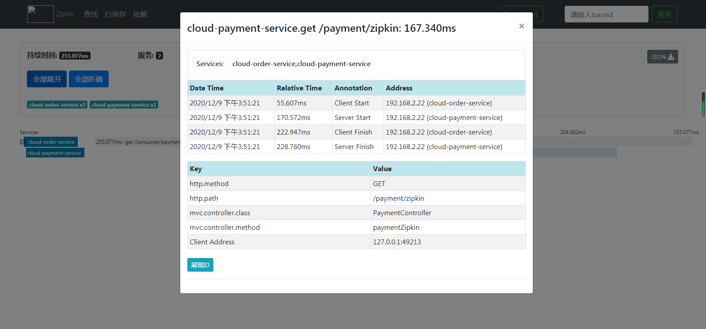

zipkin-server下载  
> https://dl.bintray.com/openzipkin/maven/io/zipkin/java/zipkin-server/

下载好后需要在所在目录下执行 
> java -jar zipkin-server-2.12.9-exec.jar  

  
进入浏览器输入： http://localhost:9411/

官方工作原理图：  
  
上图的抽象原理  
  
  
## 链路监控
### 服务提供者
操作项目cloud-provider-payment8001
1、pom.xml新增加zipkin
```xml
<!-- 引入sleuth+zipkin -->
<dependency>
    <groupId>org.springframework.cloud</groupId>
    <artifactId>spring-cloud-starter-zipkin</artifactId>
</dependency>
```
依赖关系  
  
2、yml添加zipkin配置
```properties
spring:
  zipkin:
    base-url: http://localhost:9411 #监控的数据放到改地址下供监控使用
  sleuth:
    sampler:
      #采样率 值介于0到1之间，1表示全部采样
      probability: 1
```
3、controller添加提供放的调用链路
```java
@GetMapping("/payment/zipkin")
public String paymentZipkin() {
    return "hi,i'am paymentZipkin server fall back, welcome to";
}
```
### 服务消费者(调用方)
cloud-consumer-order80  
1、pom.xml
```xml
<!-- 引入sleuth+zipkin -->
<dependency>
    <groupId>org.springframework.cloud</groupId>
    <artifactId>spring-cloud-starter-zipkin</artifactId>
</dependency>
```
2、yml
```properties
spring:
  zipkin:
    base-url: http://localhost:9411 #监控的数据放到改地址下供监控使用
  sleuth:
    sampler:
      #采样率 值介于0到1之间，1表示全部采样
      probability: 1
```
3、controller
```java
@GetMapping("/consumer/payment/zipkin")
public String getPayment2() {
    String result = restTemplate.getForObject("http://localhost:8001/payment/zipkin", String.class);
    return result;
}
```
启动7001,8001,80发送 http://localhost/consumer/payment/zipkin请求查看  
  
  
  
  
  