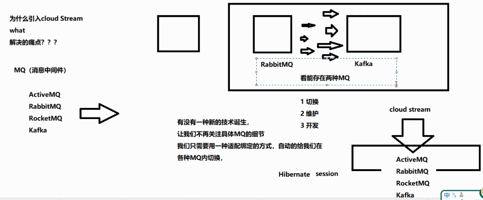
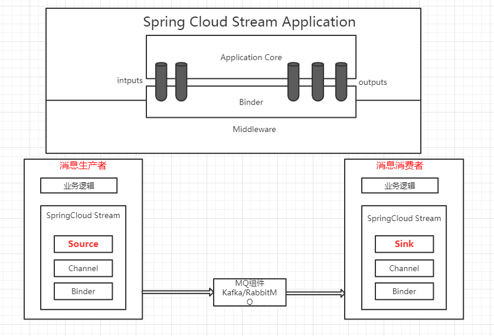
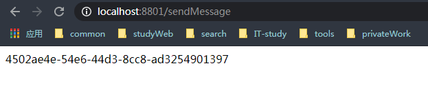
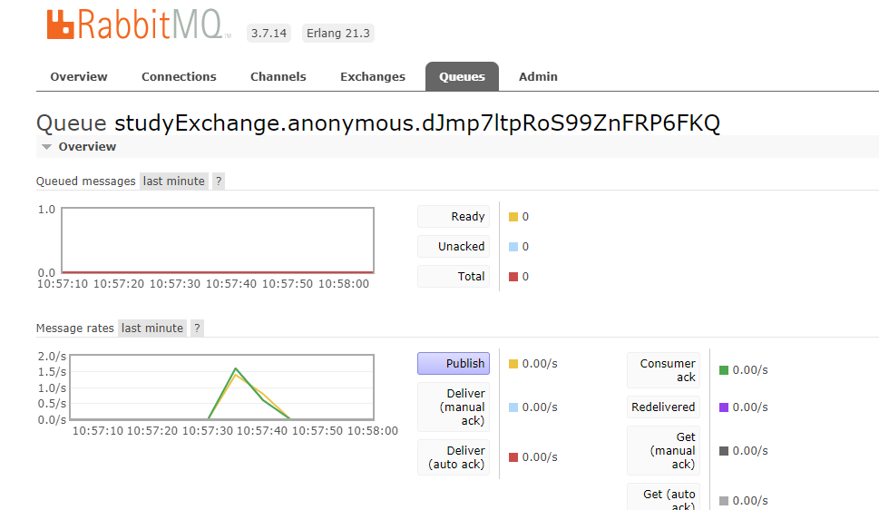
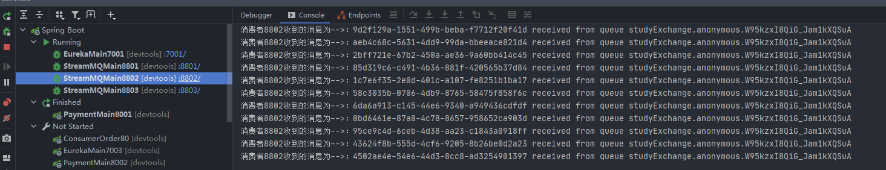
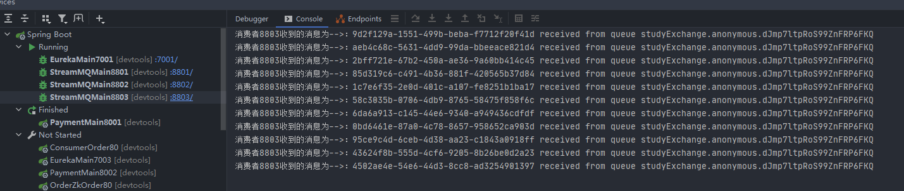
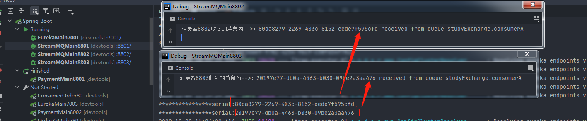

+ 什么是SpringCloudStream  
    
> 官网定义Spring cloud Stream是一个构建消息驱动微服务的框架
  应用程序通过inputs和outputs来与SpringCloud Stream中binder对象交互
  通过我们配置来binding(绑定)而SpringCloudStream的binder对象 负责与消息中间件交互。
  所以，我们只需要搞清楚如何与SpringCloudStream交互就可以方便的使用消息驱动的方式。

通过使用Spring Integration来连接消息代理中间件以实现消息驱动事件驱动，
Spring Cloud Stream为一些供应商的消息中间件产品提供了个性化的自动化配置实现，
应用了发布-订阅、消费组、分区的三个核心概念。
仅支持RabbitMQ、Kafka
中文帮助手册
> https://m.wang1314.com/doc/webapp/topic/20971999.html

springCloudStream标准流程  
  

| 组件 | 说明 |
|:----:|:----:|
| Middleware | 中间件,目前只支持RabbitMQ、Kafka |
| Binder | Binder是应用于消息中间件之间的封装,目前实行了kafka和RabbitMQ的Binder,通过Binder可以很方便的链接中间件，可以动态的改变消息类型(对应kafka的topic和RabbitMQ的exchange)，这些都可以通过配置文件来实现  |
| @Input | 注解表示输入通道，通过该输入通道接受到的消息进入应用程序 |
| @Output | 表示注解输出通道，发布的消息将通过该通道离开应用程序 |
| @StreamListener | 监听队列,用于消费者的队列的消息接收 |
| @EnableBinding | 指信道channel和exchange绑定在一起 |
## 消费者、提供者的集成
### 消息提供者8801
cloud-stream-rabbitmq-provider8801  
1、pom.xml
```xml
<!-- stream rabbitmq -->
<dependency>
    <groupId>org.springframework.cloud</groupId>
    <artifactId>spring-cloud-starter-stream-rabbit</artifactId>
</dependency>
<!-- 添加rabbitmq的支持 -->
<dependency>
    <groupId>org.springframework.cloud</groupId>
    <artifactId>spring-cloud-starter-bus-amqp</artifactId>
</dependency>
```
2、yml的核心配置
```properties
spring:
  cloud:
    stream:
      binders: #在此处配合要绑定的rabbitmq的服务信息
        defaultRabbit: #表示定义的名称，用于binding整合
          type: rabbit #消息组件类型
          environment: #设置rabbitmq的相关环境配置
            spring:
              rabbitmq:
                host: localhost
                port: 5672
                username: guest
                password: guest
      bindings: #服务的整合处理
        output: #这个名字是一个通道的名字
          destination: studyExchange #表示要使用的Exchange你名称定义
          content-type: application/json #设置消息类型，本次为json，文本则为"text/plain"
          binder: defaultRabbit #设置要绑定的额消息服务的具体设置
```
3、主启动类
```java
@SpringBootApplication
@EnableDiscoveryClient
public class StreamMQMain8801 {
    public static void main(String[] args) {
        SpringApplication.run(StreamMQMain8801.class,args);
    }
}
```
4、核心配置发送者
```java
// 1、接口
public interface IMessageProvider {
    public String send();
}
//2、接口实现类
import org.springframework.cloud.stream.annotation.EnableBinding;
import org.springframework.cloud.stream.messaging.Source;
import org.springframework.messaging.MessageChannel;
import org.springframework.messaging.support.MessageBuilder;
import org.xwb.springcloud.service.IMessageProvider;
import javax.annotation.Resource;
import java.util.UUID;
/**
 * 定义消息的推送管道
 * 里面注入的内容都是message的，谨记不是注入dao、或其他什么，
 */
@EnableBinding(Source.class)
public class IMessageProviderImpl implements IMessageProvider {
    @Resource
    private MessageChannel output;
    @Override
    public String send() {
        String serial = UUID.randomUUID().toString();
        output.send(MessageBuilder.withPayload(serial).build());
        System.out.println("****************serial:"+serial);
        return serial;

    }
}
//3、controller发送
@RestController
public class SendMessageController {
    @Resource
    private IMessageProvider messageProvider;
    @GetMapping("/sendMessage")
    public String sendMessage() {
        return messageProvider.send();
    }
}
```
注意：<strong>@EnableBinding</strong>和<strong>MessageChannel</strong>的jar包引入，都是cloud.stream.*的依赖
### 消息消费者8802,8803
8002和8003的配置一样，只有端口号不一样，此处指配置8002.8003下同  
新建模块cloud-stream-rabbitmq-consumer8802
1、pom.xml
```xml
 <!-- stream rabbitmq -->
<dependency>
    <groupId>org.springframework.cloud</groupId>
    <artifactId>spring-cloud-starter-stream-rabbit</artifactId>
</dependency>
<!-- 添加rabbitmq的支持 -->
<dependency>
    <groupId>org.springframework.cloud</groupId>
    <artifactId>spring-cloud-starter-bus-amqp</artifactId>
</dependency>
```
2、yml配置
```properties
spring:
  cloud:
    stream:
      binders: #在此处配合要绑定的rabbitmq的服务信息
        defaultRabbit: #表示定义的名称，用于binding整合
          type: rabbit #消息组件类型
          environment: #设置rabbitmq的相关环境配置
            spring:
              rabbitmq:
                host: localhost
                port: 5672
                username: guest
                password: guest
      bindings: #服务的整合处理
        input: #这个名字是一个通道的名字
          destination: studyExchange #表示要使用的Exchange你名称定义
          content-type: application/json #设置消息类型，本次为json，文本则为"text/plain"
          binder: defaultRabbit #设置要绑定的额消息服务的具体设置
```
注意：bindings.input。此处是消费者需要从通道拿到消息，输入到sink中读取。  
3、主启动类
```java
@SpringBootApplication
@EnableDiscoveryClient
public class StreamMQMain8802 {
    public static void main(String[] args) {
        SpringApplication.run(StreamMQMain8802.class, args);
    }
}
```
4、消息的接收消费
```java
@Component
@EnableBinding(Sink.class)
public class ReceiveMessageListenerController {
    @Value("${server.port}")
    private String serverPort;
    @StreamListener(Sink.INPUT)
    public void receiveMessage(@Payload String in, @Header(AmqpHeaders.CONSUMER_QUEUE) String queue) {
        System.out.println("消费者"+serverPort+"收到的消息为-->："+in + " received from queue " + queue);
    }
}
```
注意：<strong>@EnableBinding</strong>和<strong>MessageChannel</strong>的jar包引入，都是cloud.stream.*的依赖  
依照8002创建8003项目。
#### 测试
启动7001,8801生产者，8002、8003消费者，地址栏输入get请求发送消息  
http://localhost:8801/sendMessage  
  
rabbitmq的峰值变化  
  
8802和8803的接收消息结果  
  
  
### 分组消费与持久化
问题：8801发送的消息，8802,8803都会去消费，如何去解决  
原理：微服务应用放置于同一个group中，就能够保证消息只会被其中一个应用消费一次，  
<strong>不同的组是可以次奥非得，同一个组会发生竞争关系，只有其中一个可以消费。</strong>  
##### 分组
1、所以解决办法是将他们分到同一个组中即可
```properties
spring:
  application:
    name: cloud-stream-customer #服务名
  cloud:
    stream:
      binders: #在此处配合要绑定的rabbitmq的服务信息
        defaultRabbit: #表示定义的名称，用于binding整合
          type: rabbit #消息组件类型
          environment: #设置rabbitmq的相关环境配置
            spring:
              rabbitmq:
                host: localhost
                port: 5672
                username: guest
                password: guest
      bindings: #服务的整合处理
        input: #这个名字是一个通道的名字
          destination: studyExchange #表示要使用的Exchange你名称定义
          content-type: application/json #设置消息类型，本次为json，文本则为"text/plain"
          binder: defaultRabbit #设置要绑定的额消息服务的具体设置
          group: consumerA
```
加入到同一个组中：group: consumerA即可避免重复消费  

#### 持久化
如果8802,8803有一个配置了分组，另外一个取消了,配置了分组的那个消费者在消费者重启后会自动去消费8801发送者发送的消息。使消息持久化。  
证明： 一定要配置group